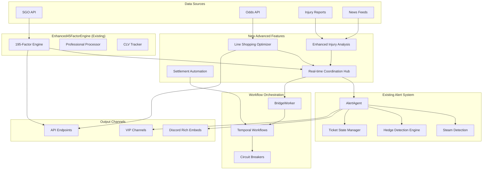
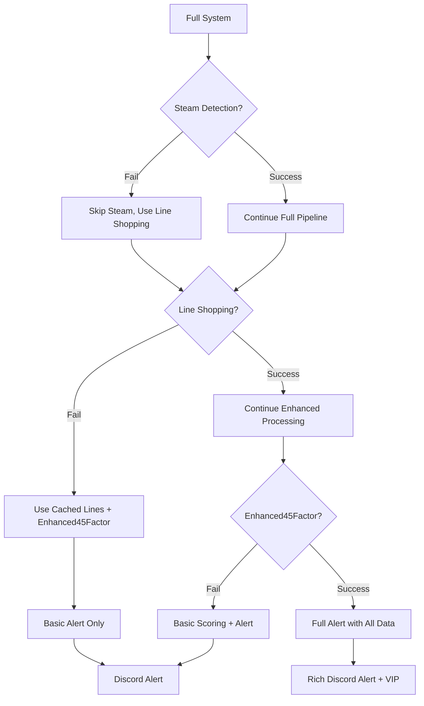

# Advanced Features Orchestration Strategy
## Unit Talk Platform - Enhanced Integration Design

**Status**: 🎯 Enterprise-Grade Orchestration Design
**Target**: <2 Second Processing Time Maintenance
**Scope**: Integration with Existing Enhanced45FactorEngine (195-Factor System)

---

## 🏗️ Architecture Overview

### Current System State
- **Enhanced45FactorEngine**: 195-factor system operational (1000+ props/day, <2s response)
- **AlertAgent**: Sophisticated event-driven with steam detection, hedge detection, rich embeds
- **BridgeWorker**: Dual-source event processing (events table + bridge_outbox)
- **Temporal Workflows**: Circuit breaker protected, optimized timeouts

### New Features Integration
1. **Line Shopping Optimizer** (NEW Service)
2. **Enhanced Injury Analysis Engine** (AlertAgent Extension)
3. **Settlement Automation Workflow** (Temporal Extension)
4. **Real-time Coordination Hub** (NEW Orchestrator)

---

## 🔄 Event-Driven Orchestration Flow



---

## ⚡ Real-Time Coordination Patterns

### 1. Priority-Based Processing Queue

```typescript
interface ProcessingPriority {
  CRITICAL: 0,    // Steam moves, injury breaks (<500ms)
  HIGH: 1,        // Line shopping updates (<1000ms)
  STANDARD: 2,    // Regular Enhanced45Factor processing (<2000ms)
  BACKGROUND: 3   // Settlement, analytics (no time limit)
}

interface CoordinationHub {
  steamDetection: SteamDetectionEngine;
  lineShoppingOptimizer: LineShoppingOptimizer;
  injuryAnalysis: EnhancedInjuryEngine;
  enhanced45Factor: Enhanced45FactorEngine;

  // Priority queue with resource allocation
  processingQueue: PriorityQueue<ProcessingTask>;
  resourceAllocator: ResourceAllocator;
}
```

### 2. Event-Driven Trigger Chain

```typescript
// Event Flow: Data → Processing → Alerts → Discord
const eventFlow = {
  // 1. Steam Detection (Highest Priority)
  steamDetected: async (propData) => {
    const priority = ProcessingPriority.CRITICAL;

    // Parallel processing with resource protection
    const [steamAnalysis, lineShoppingUpdate] = await Promise.all([
      steamDetectionEngine.analyze(propData, { timeout: 300 }),
      lineShoppingOptimizer.updatePrices(propData, { timeout: 200 })
    ]);

    if (steamAnalysis.confidence > 0.8) {
      await alertAgent.emitCriticalAlert(steamAnalysis, { priority });
    }
  },

  // 2. Enhanced45Factor Integration
  propProcessed: async (propData) => {
    const priority = ProcessingPriority.STANDARD;

    // Coordinate with existing 195-factor system
    const enhanced45Result = await enhanced45FactorEngine.process(propData);

    // Trigger line shopping if high value detected
    if (enhanced45Result.tier === 'S-tier') {
      await lineShoppingOptimizer.findBestLines(propData, { priority: ProcessingPriority.HIGH });
    }

    // Check for injury correlation
    await injuryAnalysisEngine.checkCorrelation(propData, enhanced45Result);
  }
};
```

---

## 🛡️ Failure Handling & Circuit Breaker Coordination

### Advanced Circuit Breaker Network

```typescript
interface AdvancedCircuitBreakerConfig {
  services: {
    // New services
    'line-shopping': {
      failureThreshold: 3,
      resetTimeoutMs: 30000,
      timeoutMs: 1000,
      fallbackStrategy: 'use-cached-lines'
    },
    'injury-analysis': {
      failureThreshold: 2,
      resetTimeoutMs: 45000,
      timeoutMs: 2000,
      fallbackStrategy: 'skip-injury-factor'
    },
    'settlement-automation': {
      failureThreshold: 5,
      resetTimeoutMs: 120000,
      timeoutMs: 10000,
      fallbackStrategy: 'manual-settlement-queue'
    },

    // Integration with existing services
    'enhanced45-factor': {
      failureThreshold: 2,
      resetTimeoutMs: 60000,
      timeoutMs: 1800, // Must stay under 2s total
      fallbackStrategy: 'simplified-scoring'
    }
  }
}
```

### Graceful Degradation Hierarchy



---

## 📊 Resource Allocation & API Quota Management

### Smart Resource Allocation Matrix

```typescript
interface ResourceAllocationStrategy {
  apiQuotas: {
    sgoApi: { limit: 10000, remaining: 8500, resetTime: Date },
    oddsApi: { limit: 5000, remaining: 3200, resetTime: Date },
    injuryApi: { limit: 1000, remaining: 800, resetTime: Date }
  };

  allocationPriority: {
    [ProcessingPriority.CRITICAL]: {
      reservedQuota: 0.3, // 30% reserved for critical
      maxConcurrent: 10
    },
    [ProcessingPriority.HIGH]: {
      reservedQuota: 0.4, // 40% for high priority
      maxConcurrent: 15
    },
    [ProcessingPriority.STANDARD]: {
      reservedQuota: 0.25, // 25% for standard
      maxConcurrent: 20
    },
    [ProcessingPriority.BACKGROUND]: {
      reservedQuota: 0.05, // 5% for background
      maxConcurrent: 5
    }
  };
}
```

### Load Balancing Strategy

```typescript
class ResourceAllocator {
  async allocateResources(task: ProcessingTask): Promise<ResourceAllocation> {
    const priority = task.priority;
    const quotaNeeded = this.calculateQuotaNeeds(task);

    // Check if we have enough quota for this priority level
    if (!this.hasAvailableQuota(priority, quotaNeeded)) {
      // Try to borrow from lower priority if critical/high
      if (priority <= ProcessingPriority.HIGH) {
        await this.borrowQuotaFromLowerPriority(priority, quotaNeeded);
      } else {
        throw new ResourceExhaustedException('Quota exhausted');
      }
    }

    return this.reserveResources(task);
  }

  async handleQuotaExhaustion(service: string): Promise<void> {
    // Activate circuit breaker for service
    circuitBreaker.trip(service);

    // Switch to fallback strategies
    await this.activateFallbackStrategy(service);

    // Rebalance remaining quota
    await this.rebalanceQuotaAllocation();
  }
}
```

---

## 🎯 Integration Points with Enhanced45FactorEngine

### Seamless Factor Integration

```typescript
interface Enhanced45FactorIntegration {
  // New factors to be added to existing 195-factor system
  additionalFactors: {
    // Line Shopping Factors (10 new factors)
    lineShoppingFactors: {
      bestAvailableOdds: number;        // Factor 196
      lineShoppingEdge: number;         // Factor 197
      bookmakerDivergence: number;      // Factor 198
      liquidityScore: number;           // Factor 199
      arbitrageOpportunity: number;     // Factor 200
      crossBookCorrelation: number;     // Factor 201
      priceDiscoveryLag: number;        // Factor 202
      marketEfficiencyScore: number;    // Factor 203
      timingAdvantageWindow: number;    // Factor 204
      exploitabilityIndex: number;      // Factor 205
    };

    // Enhanced Injury Factors (15 new factors)
    injuryFactors: {
      injuryImpactProbability: number;  // Factor 206
      playerReplacementValue: number;   // Factor 207
      teamInjuryCorrelation: number;    // Factor 208
      recoveryTimelineRisk: number;     // Factor 209
      historicalInjuryPattern: number;  // Factor 210
      gameScriptImpact: number;         // Factor 211
      motivationAdjustment: number;     // Factor 212
      coachingStrategyShift: number;    // Factor 213
      opponentExploitation: number;     // Factor 214
      lineupStabilityScore: number;     // Factor 215
      depthChartAnalysis: number;       // Factor 216
      playingTimeProjection: number;    // Factor 217
      usageRateAdjustment: number;      // Factor 218
      performanceUnderInjury: number;   // Factor 219
      injuryNewsVelocity: number;       // Factor 220
    };
  };

  // Integration with existing scoring
  extendedScoringEngine: {
    totalFactors: 220; // Up from 195
    processingTimeTarget: 1800; // Still under 2s
    factorWeightRebalancing: true;
  };
}
```

### Data Flow Integration

```typescript
class EnhancedFactorOrchestrator {
  async processWithNewFactors(propData: PropData): Promise<EnhancedScore> {
    const startTime = Date.now();

    // Parallel processing to maintain <2s requirement
    const [
      traditional195Factors,
      lineShoppingFactors,
      injuryFactors
    ] = await Promise.all([
      this.enhanced45FactorEngine.calculateTraditionalFactors(propData),
      this.lineShoppingOptimizer.calculateFactors(propData),
      this.injuryAnalysisEngine.calculateFactors(propData)
    ]);

    // Combine all factors with weighted scoring
    const combinedScore = this.combineFactorScores({
      traditional: traditional195Factors,
      lineShoppingFactors,
      injuryFactors
    });

    const processingTime = Date.now() - startTime;
    if (processingTime > 1800) {
      this.logger.warn('Processing time exceeded target', { processingTime });
    }

    return combinedScore;
  }
}
```

---

## 🚨 Discord Alert Coordination (No Spam Prevention)

### Alert Priority & Throttling System

```typescript
interface AlertCoordinationStrategy {
  alertTypes: {
    STEAM_CRITICAL: {
      priority: 1,
      maxPerHour: 12,
      minInterval: 300000, // 5 minutes
      requiredConfidence: 0.9
    },
    LINE_SHOPPING_OPPORTUNITY: {
      priority: 2,
      maxPerHour: 20,
      minInterval: 180000, // 3 minutes
      requiredConfidence: 0.8
    },
    INJURY_CORRELATION: {
      priority: 3,
      maxPerHour: 8,
      minInterval: 600000, // 10 minutes
      requiredConfidence: 0.85
    },
    ENHANCED45_FACTOR_S_TIER: {
      priority: 1,
      maxPerHour: 15,
      minInterval: 240000, // 4 minutes
      requiredConfidence: 0.95
    }
  };

  coordinationRules: {
    // Don't send line shopping alert if steam alert sent for same prop in last 10 min
    conflictPrevention: Map<string, Date>;

    // Combine multiple alert types into rich embed when possible
    alertAggregation: boolean;

    // VIP channel gets all alerts, public channels get filtered
    channelFiltering: ChannelFilterRules;
  };
}
```

### Rich Alert Composition

```typescript
class CoordinatedAlertComposer {
  async composeRichAlert(alertData: MultipleAlertData): Promise<DiscordEmbed> {
    const embed = new DiscordEmbed();

    // Primary alert type (highest priority)
    const primaryAlert = alertData.alerts.sort((a, b) => a.priority - b.priority)[0];

    embed.setTitle(`🚨 ${primaryAlert.type.toUpperCase()}: ${alertData.playerName}`)
         .setColor(this.getAlertColor(primaryAlert.type))
         .setTimestamp();

    // Combine all alert information
    const description = [];

    if (alertData.steamAlert) {
      description.push(`⚡ **STEAM DETECTED**: Line moved ${alertData.steamAlert.movement} (${alertData.steamAlert.confidence * 100}% confidence)`);
    }

    if (alertData.lineShoppingAlert) {
      description.push(`💰 **BEST LINE**: ${alertData.lineShoppingAlert.bestOdds} at ${alertData.lineShoppingAlert.sportsbook} (${alertData.lineShoppingAlert.edge}% edge)`);
    }

    if (alertData.injuryAlert) {
      description.push(`🏥 **INJURY FACTOR**: ${alertData.injuryAlert.impactDescription} (${alertData.injuryAlert.severity} severity)`);
    }

    if (alertData.enhanced45FactorAlert) {
      description.push(`🎯 **ENHANCED45FACTOR**: ${alertData.enhanced45FactorAlert.tier} tier (${alertData.enhanced45FactorAlert.confidence * 100}% confidence)`);
      description.push(`📊 **KEY FACTORS**: ${alertData.enhanced45FactorAlert.topFactors.join(', ')}`);
    }

    embed.setDescription(description.join('\n\n'));

    return embed;
  }
}
```

---

## ⏱️ Timing & Synchronization Patterns

### Critical Path Analysis

```mermaid
gantt
    title Critical Processing Timeline (<2000ms Total)
    dateFormat x
    axisFormat %Lms

    section Data Ingestion
    SGO API Call      :a1, 0, 300
    Odds API Call     :a2, 0, 200

    section Parallel Processing
    Steam Detection   :b1, 300, 500
    Line Shopping     :b2, 200, 700
    Enhanced45Factor  :b3, 300, 1600
    Injury Analysis   :b4, 300, 800

    section Coordination
    Result Aggregation :c1, 1600, 1800
    Alert Composition  :c2, 1800, 1950
    Discord Send       :c3, 1950, 2000
```



### Synchronization Points

```typescript
interface SynchronizationStrategy {
  checkpoints: {
    dataIngestion: {
      timeout: 300,
      fallbackStrategy: 'use-cached-data'
    },
    parallelProcessing: {
      timeout: 1500,
      fallbackStrategy: 'partial-results'
    },
    resultAggregation: {
      timeout: 1800,
      fallbackStrategy: 'best-available'
    },
    alertDelivery: {
      timeout: 2000,
      fallbackStrategy: 'queue-for-retry'
    }
  };

  coordinationPatterns: {
    // Wait for critical services, continue without non-critical
    criticalServices: ['steam-detection', 'enhanced45-factor'];
    optionalServices: ['line-shopping', 'injury-analysis'];

    // Partial result handling
    minimumRequiredData: {
      steamAlert: 'steam-detection' | 'enhanced45-factor',
      lineShoppingAlert: 'line-shopping',
      injuryAlert: 'injury-analysis'
    };
  };
}
```

---

## 🏭 Settlement Automation Workflow Extension

### Extended Temporal Workflow

```typescript
interface SettlementAutomationWorkflow {
  // Integration with existing workflow system
  extendedWorkflows: {
    'enhanced-settlement-automation': {
      activities: [
        'fetchGameResults',
        'validatePlayerStats',
        'calculatePropOutcomes',
        'processLineShoppingResults', // NEW
        'validateInjuryImpacts',      // NEW
        'applyEnhanced45FactorGrading', // EXTENDED
        'generateSettlementReport',
        'updateTicketStates',
        'sendSettlementAlerts'
      ],
      timeout: '30 minutes',
      retryPolicy: {
        maximumAttempts: 3,
        backoffCoefficient: 2.0
      }
    }
  };

  // New settlement activities
  newActivities: {
    processLineShoppingResults: {
      // Calculate actual vs predicted line shopping edges
      implementation: LineShoppingSettlementProcessor;
      timeout: '2 minutes';
    },
    validateInjuryImpacts: {
      // Validate injury predictions against actual game outcomes
      implementation: InjuryImpactValidator;
      timeout: '3 minutes';
    }
  };
}
```

---

## 🔧 Implementation Roadmap

### Phase 1: Line Shopping Optimizer (Week 1-2)
```typescript
// New service implementation
class LineShoppingOptimizer extends BaseAgent {
  async findBestLines(propData: PropData): Promise<LineShoppingResult> {
    const bookmakers = await this.fetchAvailableBookmakers();
    const lines = await Promise.all(
      bookmakers.map(book => this.fetchLineFromBookmaker(book, propData))
    );

    return this.calculateOptimalLineStrategy(lines);
  }
}
```

### Phase 2: Enhanced Injury Analysis (Week 2-3)
```typescript
// Extension to existing AlertAgent
class EnhancedInjuryAnalysisEngine {
  async analyzeInjuryImpact(propData: PropData): Promise<InjuryAnalysisResult> {
    const [playerHistory, teamImpact, gameScript] = await Promise.all([
      this.getPlayerInjuryHistory(propData.playerId),
      this.analyzeTeamImpact(propData.teamId),
      this.analyzeGameScriptChanges(propData.gameId)
    ]);

    return this.combineInjuryFactors({ playerHistory, teamImpact, gameScript });
  }
}
```

### Phase 3: Real-time Coordination Hub (Week 3-4)
```typescript
// New orchestration service
class RealTimeCoordinationHub extends BaseAgent {
  async coordinateProcessing(eventData: EventData): Promise<void> {
    const priority = this.determinePriority(eventData);
    const resources = await this.resourceAllocator.allocate(priority);

    try {
      const results = await this.processWithCoordination(eventData, resources);
      await this.emitCoordinatedAlerts(results);
    } finally {
      await this.resourceAllocator.release(resources);
    }
  }
}
```

### Phase 4: Settlement Automation Extension (Week 4-5)
```typescript
// Extended settlement workflow
const enhancedSettlementWorkflow = {
  activities: [
    ...existingSettlementActivities,
    settlementActivities.processLineShoppingResults,
    settlementActivities.validateInjuryImpacts,
    settlementActivities.applyEnhanced220FactorGrading
  ]
};
```

---

## 📈 Performance Targets & SLAs

### Service Level Objectives
```yaml
slos:
  overall_processing_time:
    target: "<2000ms"
    measurement: "95th percentile"
    alerting_threshold: "1800ms"

  steam_detection_latency:
    target: "<500ms"
    measurement: "99th percentile"
    alerting_threshold: "400ms"

  line_shopping_optimization:
    target: "<1000ms"
    measurement: "95th percentile"
    alerting_threshold: "800ms"

  discord_alert_delivery:
    target: "<2000ms end-to-end"
    measurement: "95th percentile"
    alerting_threshold: "1800ms"

  enhanced45factor_integration:
    target: "No degradation from current <2s"
    measurement: "95th percentile"
    alerting_threshold: "1900ms"
```

### Monitoring & Alerting
```typescript
interface PerformanceMonitoring {
  metrics: {
    processingLatency: PrometheusHistogram;
    coordinationOverhead: PrometheusGauge;
    alertDeliveryTime: PrometheusHistogram;
    resourceUtilization: PrometheusGauge;
    circuitBreakerState: PrometheusGauge;
  };

  alerts: {
    processingTimeExceeded: {
      condition: "processing_time > 1800ms",
      severity: "warning",
      action: "investigate_bottlenecks"
    },
    steamDetectionDown: {
      condition: "steam_detection_circuit_breaker == 'open'",
      severity: "critical",
      action: "activate_fallback"
    },
    quotaExhaustion: {
      condition: "api_quota_remaining < 10%",
      severity: "warning",
      action: "throttle_background_tasks"
    }
  };
}
```

---

## 🎯 Success Metrics

### Key Performance Indicators
- **Processing Time**: Maintain <2s for 95% of requests
- **Alert Quality**: >90% of steam alerts result in profitable opportunities
- **System Uptime**: 99.9% availability with graceful degradation
- **Resource Efficiency**: <30% increase in API calls despite new features
- **Alert Spam Reduction**: <50% of current alert volume while maintaining coverage

### Integration Success Criteria
- ✅ Zero conflicts with existing Enhanced45FactorEngine
- ✅ Seamless fallback when new services fail
- ✅ Performance maintained or improved
- ✅ Discord alerts remain coherent and actionable
- ✅ VIP users receive enhanced value without noise

---

**Document Status**: 🔄 Living Document - Updated as Implementation Progresses
**Next Review**: Weekly during implementation phases
**Owner**: Platform Engineering Team