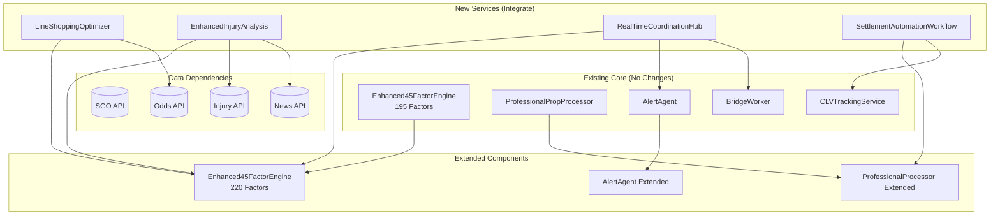
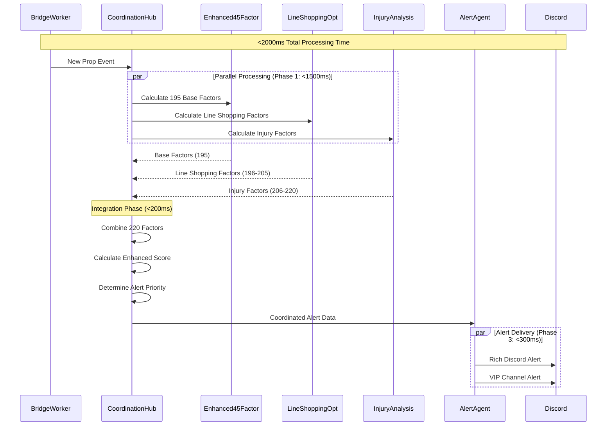

# Dependency Mapping & Integration Patterns
## Enhanced45FactorEngine Integration with Advanced Features

**Target**: Seamless integration with existing 195-factor system
**Performance**: Maintain <2s processing time with 220 factors
**Architecture**: Event-driven, circuit breaker protected

---

## 🗺️ Dependency Architecture Map

### System Dependencies Overview



### Critical Path Dependencies

```typescript
interface DependencyMatrix {
  // No circular dependencies
  dependencies: {
    'LineShoppingOptimizer': {
      required: ['odds-api', 'circuit-breaker'],
      optional: ['enhanced45-factor-engine'],
      provides: ['line-shopping-factors', 'best-line-data']
    },

    'EnhancedInjuryAnalysis': {
      required: ['injury-api', 'news-api'],
      optional: ['player-database'],
      provides: ['injury-factors', 'impact-analysis']
    },

    'RealTimeCoordinationHub': {
      required: ['alert-agent', 'bridge-worker'],
      optional: ['temporal-workflows'],
      provides: ['coordination-events', 'priority-scheduling']
    },

    'Enhanced45FactorEngine': {
      required: ['sgo-api', 'professional-processor'],
      optional: ['line-shopping-optimizer', 'injury-analysis'],
      provides: ['195-base-factors', 'tier-classification']
    },

    'Extended220FactorEngine': {
      required: ['enhanced45-factor-engine'],
      optional: ['line-shopping-optimizer', 'injury-analysis'],
      provides: ['220-extended-factors', 'enhanced-scoring']
    }
  };

  // Execution order for optimal performance
  executionOrder: {
    parallel: [
      'enhanced45-factor-engine',   // Base processing
      'line-shopping-optimizer',    // Line shopping data
      'injury-analysis'             // Injury analysis
    ],
    sequential: [
      'factor-combination',         // Combine all factors
      'coordination-hub',           // Orchestrate alerts
      'alert-delivery'              // Send to Discord
    ]
  };
}
```

---

## 🔗 Integration Interface Definitions

### Line Shopping Optimizer Integration

```typescript
// apps/api/src/services/LineShoppingOptimizer.ts
import { BaseAgent } from '../agents/BaseAgent';
import { Enhanced45FactorEngine } from '../agents/ScoringAgent/scoring/enhancedScoringEngine';

export interface LineShoppingFactors {
  bestAvailableOdds: number;        // Factor 196
  lineShoppingEdge: number;         // Factor 197
  bookmakerDivergence: number;      // Factor 198
  liquidityScore: number;           // Factor 199
  arbitrageOpportunity: number;     // Factor 200
  crossBookCorrelation: number;     // Factor 201
  priceDiscoveryLag: number;        // Factor 202
  marketEfficiencyScore: number;    // Factor 203
  timingAdvantageWindow: number;    // Factor 204
  exploitabilityIndex: number;      // Factor 205
}

export class LineShoppingOptimizer extends BaseAgent {
  constructor(
    config: BaseAgentConfig,
    deps: BaseAgentDependencies,
    private enhanced45Factor?: Enhanced45FactorEngine  // Optional dependency
  ) {
    super(config, deps);
  }

  async calculateLineShoppingFactors(propData: any): Promise<LineShoppingFactors> {
    const startTime = Date.now();

    try {
      // Parallel API calls to multiple bookmakers
      const [bestLines, marketData, liquidityInfo] = await Promise.all([
        this.fetchBestAvailableLines(propData),
        this.fetchMarketEfficiencyData(propData),
        this.fetchLiquidityMetrics(propData)
      ]);

      const factors = this.computeLineShoppingFactors({
        bestLines,
        marketData,
        liquidityInfo,
        propData
      });

      // Integration with Enhanced45Factor for context
      if (this.enhanced45Factor) {
        const baseFactors = await this.enhanced45Factor.getBasicFactors(propData);
        factors.contextualAdjustment = this.adjustForBaseFactors(factors, baseFactors);
      }

      const processingTime = Date.now() - startTime;
      this.logger.debug('Line shopping factors calculated', { processingTime, factors });

      return factors;

    } catch (error) {
      this.logger.error('Line shopping factor calculation failed', { error });
      return this.getFallbackLineShoppingFactors();
    }
  }

  // Integration point with Enhanced45FactorEngine
  async integrateWithEnhanced45Factor(
    propData: any,
    baseFactors: any
  ): Promise<{ lineShoppingFactors: LineShoppingFactors; integration: any }> {
    const lineShoppingFactors = await this.calculateLineShoppingFactors(propData);

    // Create integration metadata for Enhanced45Factor
    const integration = {
      lineShoppingBoost: this.calculateBoostFactor(lineShoppingFactors, baseFactors),
      riskAdjustment: this.calculateRiskAdjustment(lineShoppingFactors),
      timingWindow: this.calculateOptimalTimingWindow(lineShoppingFactors),
      recommendedAction: this.getRecommendedAction(lineShoppingFactors, baseFactors)
    };

    return { lineShoppingFactors, integration };
  }
}
```

### Enhanced Injury Analysis Integration

```typescript
// apps/api/src/services/EnhancedInjuryAnalysis.ts
export interface InjuryFactors {
  injuryImpactProbability: number;  // Factor 206
  playerReplacementValue: number;   // Factor 207
  teamInjuryCorrelation: number;    // Factor 208
  recoveryTimelineRisk: number;     // Factor 209
  historicalInjuryPattern: number;  // Factor 210
  gameScriptImpact: number;         // Factor 211
  motivationAdjustment: number;     // Factor 212
  coachingStrategyShift: number;    // Factor 213
  opponentExploitation: number;     // Factor 214
  lineupStabilityScore: number;     // Factor 215
  depthChartAnalysis: number;       // Factor 216
  playingTimeProjection: number;    // Factor 217
  usageRateAdjustment: number;      // Factor 218
  performanceUnderInjury: number;   // Factor 219
  injuryNewsVelocity: number;       // Factor 220
}

export class EnhancedInjuryAnalysis extends BaseAgent {
  async calculateInjuryFactors(propData: any): Promise<InjuryFactors> {
    // Parallel data gathering
    const [
      injuryReports,
      playerHistory,
      teamContext,
      newsVelocity
    ] = await Promise.all([
      this.fetchLatestInjuryReports(propData.playerId),
      this.fetchPlayerInjuryHistory(propData.playerId),
      this.fetchTeamInjuryContext(propData.teamId),
      this.fetchInjuryNewsVelocity(propData.playerId)
    ]);

    return this.computeInjuryFactors({
      injuryReports,
      playerHistory,
      teamContext,
      newsVelocity,
      propData
    });
  }

  // Integration with AlertAgent for real-time injury alerts
  async integrateWithAlertAgent(injuryFactors: InjuryFactors, propData: any): Promise<void> {
    // High impact injury detected
    if (injuryFactors.injuryImpactProbability > 0.8) {
      await this.emitInjuryAlert({
        type: 'high-impact-injury',
        player: propData.playerName,
        impact: injuryFactors.injuryImpactProbability,
        factors: injuryFactors,
        urgency: 'high'
      });
    }

    // Lineup change detected
    if (injuryFactors.lineupStabilityScore < 0.3) {
      await this.emitLineupChangeAlert({
        type: 'lineup-instability',
        team: propData.teamName,
        stability: injuryFactors.lineupStabilityScore,
        projectedImpact: injuryFactors.gameScriptImpact
      });
    }
  }
}
```

### Real-Time Coordination Hub

```typescript
// apps/api/src/services/RealTimeCoordinationHub.ts
export class RealTimeCoordinationHub extends BaseAgent {
  constructor(
    config: BaseAgentConfig,
    deps: BaseAgentDependencies,
    private services: {
      enhanced45Factor: Enhanced45FactorEngine;
      lineShoppingOptimizer: LineShoppingOptimizer;
      injuryAnalysis: EnhancedInjuryAnalysis;
      alertAgent: AlertAgent;
    }
  ) {
    super(config, deps);
  }

  async orchestrateProcessing(propData: any): Promise<OrchestrationResult> {
    const correlationId = `coord-${Date.now()}-${propData.id}`;
    const startTime = Date.now();

    this.logger.info('Starting coordinated processing', { correlationId, propData: propData.id });

    try {
      // Phase 1: Parallel data gathering and factor calculation
      const phase1Promise = this.executePhase1(propData, correlationId);

      // Phase 2: Integration and coordination (depends on Phase 1)
      const results = await phase1Promise;
      const phase2Results = await this.executePhase2(results, correlationId);

      // Phase 3: Alert orchestration and delivery
      await this.executePhase3(phase2Results, correlationId);

      const totalTime = Date.now() - startTime;
      this.logger.info('Coordinated processing completed', { correlationId, totalTime });

      return phase2Results;

    } catch (error) {
      await this.handleCoordinationError(error, correlationId, propData);
      throw error;
    }
  }

  private async executePhase1(propData: any, correlationId: string): Promise<Phase1Results> {
    // Parallel execution with timeouts
    const phase1Timeout = 1500; // 1.5s timeout for phase 1

    const [
      enhanced45Results,
      lineShoppingResults,
      injuryResults
    ] = await Promise.allSettled([
      withTimeout(
        this.services.enhanced45Factor.process(propData),
        phase1Timeout,
        'enhanced45Factor'
      ),
      withTimeout(
        this.services.lineShoppingOptimizer.calculateLineShoppingFactors(propData),
        800, // Shorter timeout for line shopping
        'lineShoppingOptimizer'
      ),
      withTimeout(
        this.services.injuryAnalysis.calculateInjuryFactors(propData),
        1000, // Medium timeout for injury analysis
        'injuryAnalysis'
      )
    ]);

    return {
      enhanced45: this.extractResult(enhanced45Results, 'enhanced45Factor'),
      lineShopping: this.extractResult(lineShoppingResults, 'lineShoppingOptimizer'),
      injury: this.extractResult(injuryResults, 'injuryAnalysis'),
      correlationId
    };
  }

  private async executePhase2(phase1: Phase1Results, correlationId: string): Promise<Phase2Results> {
    // Combine factors into Extended 220-factor system
    const combinedFactors = await this.combineAllFactors(phase1);

    // Calculate enhanced tier and confidence
    const enhancedScore = await this.calculateEnhancedScore(combinedFactors);

    // Determine alert priority and type
    const alertPriority = this.determineAlertPriority(enhancedScore, phase1);

    return {
      ...phase1,
      combinedFactors,
      enhancedScore,
      alertPriority,
      recommendedActions: this.generateRecommendedActions(enhancedScore, phase1)
    };
  }

  private async executePhase3(phase2: Phase2Results, correlationId: string): Promise<void> {
    // Coordinate alert delivery based on priority and type
    if (phase2.alertPriority.priority <= ProcessingPriority.HIGH) {
      // High priority alerts
      await this.services.alertAgent.emitCoordinatedAlert({
        type: 'enhanced-opportunity',
        priority: phase2.alertPriority.priority,
        data: phase2,
        correlationId
      });
    }

    // Update any existing ticket states
    if (phase2.enhanced45?.tier === 'S-tier') {
      await this.updateTicketStates(phase2, correlationId);
    }

    // Log processing results for analytics
    await this.logProcessingResults(phase2, correlationId);
  }
}

// Helper function for timeout handling
async function withTimeout<T>(
  promise: Promise<T>,
  timeoutMs: number,
  serviceName: string
): Promise<T> {
  const timeoutPromise = new Promise<never>((_, reject) => {
    setTimeout(() => reject(new Error(`${serviceName} timeout after ${timeoutMs}ms`)), timeoutMs);
  });

  return Promise.race([promise, timeoutPromise]);
}
```

---

## 🏗️ Extended Enhanced45FactorEngine Architecture

### 220-Factor Integration

```typescript
// apps/api/src/agents/ScoringAgent/scoring/extended220FactorEngine.ts
import { enhancedScoringEngine } from './enhancedScoringEngine';
import { LineShoppingFactors } from '../../../services/LineShoppingOptimizer';
import { InjuryFactors } from '../../../services/EnhancedInjuryAnalysis';

export interface Extended220Factors {
  // Original 195 factors (unchanged)
  baseFactors: Enhanced45FactorResult;

  // New line shopping factors (196-205)
  lineShoppingFactors: LineShoppingFactors;

  // New injury factors (206-220)
  injuryFactors: InjuryFactors;

  // Integration metadata
  integration: {
    factorWeights: FactorWeightMatrix;
    crossCorrelations: CrossCorrelationMatrix;
    processingTime: number;
    confidence: number;
  };
}

export class Extended220FactorEngine {
  constructor(
    private baseEngine: typeof enhancedScoringEngine,
    private lineShoppingOptimizer?: LineShoppingOptimizer,
    private injuryAnalysis?: EnhancedInjuryAnalysis
  ) {}

  async calculate220Factors(propData: any): Promise<Extended220Factors> {
    const startTime = Date.now();

    // Step 1: Calculate base 195 factors (existing system)
    const baseFactors = await this.baseEngine.calculateEnhancedFactors(propData);

    // Step 2: Calculate new factors in parallel (if services available)
    const [lineShoppingFactors, injuryFactors] = await Promise.allSettled([
      this.lineShoppingOptimizer?.calculateLineShoppingFactors(propData) || Promise.resolve(null),
      this.injuryAnalysis?.calculateInjuryFactors(propData) || Promise.resolve(null)
    ]);

    // Step 3: Integrate all factors
    const extended220 = await this.integrateAllFactors({
      baseFactors,
      lineShoppingFactors: this.extractSettledResult(lineShoppingFactors),
      injuryFactors: this.extractSettledResult(injuryFactors),
      propData
    });

    const processingTime = Date.now() - startTime;

    // Performance monitoring
    if (processingTime > 1800) {
      this.logger.warn('220-factor processing exceeded target', { processingTime });
    }

    return {
      ...extended220,
      integration: {
        ...extended220.integration,
        processingTime
      }
    };
  }

  private async integrateAllFactors(data: {
    baseFactors: any;
    lineShoppingFactors: LineShoppingFactors | null;
    injuryFactors: InjuryFactors | null;
    propData: any;
  }): Promise<Extended220Factors> {

    const { baseFactors, lineShoppingFactors, injuryFactors, propData } = data;

    // Calculate factor weights based on availability and confidence
    const factorWeights = this.calculateDynamicWeights({
      hasLineShopping: !!lineShoppingFactors,
      hasInjuryAnalysis: !!injuryFactors,
      baseConfidence: baseFactors.confidence,
      propType: propData.statType
    });

    // Calculate cross-correlations between factor groups
    const crossCorrelations = this.calculateCrossCorrelations({
      baseFactors,
      lineShoppingFactors,
      injuryFactors
    });

    // Combine weighted scores
    const combinedScore = this.calculateWeightedCombinedScore({
      baseFactors,
      lineShoppingFactors,
      injuryFactors,
      weights: factorWeights,
      correlations: crossCorrelations
    });

    // Determine enhanced tier (S+, S, A+, A, B+, B, C)
    const enhancedTier = this.determineEnhancedTier(combinedScore, factorWeights);

    return {
      baseFactors,
      lineShoppingFactors: lineShoppingFactors || this.getDefaultLineShoppingFactors(),
      injuryFactors: injuryFactors || this.getDefaultInjuryFactors(),
      integration: {
        factorWeights,
        crossCorrelations,
        combinedScore,
        enhancedTier,
        confidence: this.calculateOverallConfidence(combinedScore, factorWeights),
        processingTime: 0 // Will be set by caller
      }
    };
  }

  private calculateDynamicWeights(context: {
    hasLineShopping: boolean;
    hasInjuryAnalysis: boolean;
    baseConfidence: number;
    propType: string;
  }): FactorWeightMatrix {

    // Base weights for original 195 factors
    const baseWeight = 0.70; // 70% base weight

    // Dynamic allocation of remaining 30%
    let lineShoppingWeight = 0;
    let injuryWeight = 0;

    if (context.hasLineShopping && context.hasInjuryAnalysis) {
      // Both services available
      lineShoppingWeight = 0.15; // 15%
      injuryWeight = 0.15;       // 15%
    } else if (context.hasLineShopping) {
      // Only line shopping available
      lineShoppingWeight = 0.30; // 30%
    } else if (context.hasInjuryAnalysis) {
      // Only injury analysis available
      injuryWeight = 0.30;       // 30%
    }
    // If neither available, base weight stays at 70%, rest is 0

    // Adjust weights based on prop type
    if (context.propType.includes('injury') || context.propType.includes('questionable')) {
      // Increase injury weight for injury-related props
      injuryWeight *= 1.5;
      baseWeight -= injuryWeight * 0.5;
    }

    return {
      base: Math.max(0.5, baseWeight),           // Minimum 50% for base
      lineShopping: lineShoppingWeight,
      injury: injuryWeight,
      total: baseWeight + lineShoppingWeight + injuryWeight
    };
  }
}
```

---

## ⚡ Performance Optimization Patterns

### Caching Strategy

```typescript
// apps/api/src/services/AdvancedFeatureCache.ts
export class AdvancedFeatureCache {
  private lineShoppingCache = new Map<string, { data: LineShoppingFactors; expires: number }>();
  private injuryCache = new Map<string, { data: InjuryFactors; expires: number }>();

  async getLineShoppingFactors(propId: string, propData: any): Promise<LineShoppingFactors | null> {
    const cacheKey = this.generateLineShoppingCacheKey(propId, propData);
    const cached = this.lineShoppingCache.get(cacheKey);

    if (cached && cached.expires > Date.now()) {
      return cached.data;
    }

    return null;
  }

  async cacheLineShoppingFactors(
    propId: string,
    propData: any,
    factors: LineShoppingFactors,
    ttlMs: number = 300000 // 5 minutes default
  ): Promise<void> {
    const cacheKey = this.generateLineShoppingCacheKey(propId, propData);
    this.lineShoppingCache.set(cacheKey, {
      data: factors,
      expires: Date.now() + ttlMs
    });
  }

  // Smart cache invalidation based on line movements
  async invalidateOnLineMovement(propId: string, movementThreshold: number = 0.5): Promise<void> {
    // Remove cached line shopping data if significant line movement detected
    const keysToRemove = Array.from(this.lineShoppingCache.keys())
      .filter(key => key.includes(propId));

    keysToRemove.forEach(key => this.lineShoppingCache.delete(key));
  }
}
```

### Resource Pooling

```typescript
// apps/api/src/services/ResourcePoolManager.ts
export class ResourcePoolManager {
  private connectionPools = {
    oddsApi: new ConnectionPool({ maxConnections: 10 }),
    injuryApi: new ConnectionPool({ maxConnections: 5 }),
    newsApi: new ConnectionPool({ maxConnections: 3 })
  };

  private quotaManagers = {
    oddsApi: new QuotaManager({ limit: 5000, window: '1h' }),
    injuryApi: new QuotaManager({ limit: 1000, window: '1h' }),
    newsApi: new QuotaManager({ limit: 500, window: '1h' })
  };

  async allocateResources(
    serviceName: string,
    priority: ProcessingPriority
  ): Promise<ResourceAllocation> {
    const pool = this.connectionPools[serviceName];
    const quotaManager = this.quotaManagers[serviceName];

    // Check quota availability
    if (!quotaManager.hasQuota(1)) {
      throw new QuotaExhaustedException(`${serviceName} quota exhausted`);
    }

    // Get connection based on priority
    const connection = await pool.acquire({
      timeout: this.getTimeoutForPriority(priority),
      priority
    });

    // Reserve quota
    quotaManager.reserveQuota(1);

    return {
      connection,
      quotaReservation: quotaManager.createReservation(),
      release: async () => {
        pool.release(connection);
        quotaManager.releaseReservation();
      }
    };
  }

  private getTimeoutForPriority(priority: ProcessingPriority): number {
    switch (priority) {
      case ProcessingPriority.CRITICAL: return 500;
      case ProcessingPriority.HIGH: return 1000;
      case ProcessingPriority.STANDARD: return 2000;
      case ProcessingPriority.BACKGROUND: return 10000;
      default: return 2000;
    }
  }
}
```

---

## 🔄 Data Flow Patterns

### Event-Driven Data Pipeline



### Factor Integration Flow

```typescript
interface FactorIntegrationFlow {
  // Step 1: Parallel factor calculation
  parallelCalculation: {
    baseFactors: () => Promise<Enhanced45FactorResult>;
    lineShoppingFactors: () => Promise<LineShoppingFactors>;
    injuryFactors: () => Promise<InjuryFactors>;
  };

  // Step 2: Factor combination with weights
  factorCombination: {
    weightCalculation: (context: FactorContext) => FactorWeights;
    crossCorrelation: (factors: AllFactors) => CorrelationMatrix;
    combinedScoring: (factors: AllFactors, weights: FactorWeights) => CombinedScore;
  };

  // Step 3: Enhanced tier determination
  tierDetermination: {
    thresholds: {
      'S+': { minScore: 0.95, minConfidence: 0.9 },
      'S': { minScore: 0.90, minConfidence: 0.85 },
      'A+': { minScore: 0.85, minConfidence: 0.8 },
      'A': { minScore: 0.80, minConfidence: 0.75 }
    };
    boostFactors: {
      lineShoppingBoost: 0.05,  // +5% for good line shopping
      injuryInsightBoost: 0.03,  // +3% for injury insights
      combinationBoost: 0.02     // +2% for having both
    };
  };
}
```

---

## 🎯 Integration Testing Strategy

### Unit Test Patterns

```typescript
// test/integration/advanced-features.test.ts
describe('Advanced Features Integration', () => {
  let coordinationHub: RealTimeCoordinationHub;
  let enhanced45Engine: Enhanced45FactorEngine;
  let lineShoppingOpt: LineShoppingOptimizer;
  let injuryAnalysis: EnhancedInjuryAnalysis;

  beforeEach(async () => {
    // Setup test environment with mocked external APIs
    coordinationHub = new RealTimeCoordinationHub(config, deps, {
      enhanced45Factor: enhanced45Engine,
      lineShoppingOptimizer: lineShoppingOpt,
      injuryAnalysis: injuryAnalysis,
      alertAgent: mockAlertAgent
    });
  });

  describe('Performance Requirements', () => {
    it('should process 220 factors within 2 seconds', async () => {
      const startTime = Date.now();
      const result = await coordinationHub.orchestrateProcessing(mockPropData);
      const processingTime = Date.now() - startTime;

      expect(processingTime).toBeLessThan(2000);
      expect(result.combinedFactors).toHaveProperty('integration');
      expect(result.enhancedScore.tier).toBeDefined();
    });

    it('should maintain performance with service failures', async () => {
      // Simulate line shopping service failure
      jest.spyOn(lineShoppingOpt, 'calculateLineShoppingFactors')
          .mockRejectedValue(new Error('Service unavailable'));

      const startTime = Date.now();
      const result = await coordinationHub.orchestrateProcessing(mockPropData);
      const processingTime = Date.now() - startTime;

      expect(processingTime).toBeLessThan(2000);
      expect(result.enhanced45).toBeDefined(); // Base factors still work
      expect(result.lineShopping).toBeNull(); // Failed service
    });
  });

  describe('Factor Integration', () => {
    it('should correctly weight factors when all services available', async () => {
      const result = await coordinationHub.orchestrateProcessing(mockPropData);

      expect(result.combinedFactors.integration.factorWeights).toMatchObject({
        base: expect.any(Number),
        lineShopping: expect.any(Number),
        injury: expect.any(Number)
      });

      // Total weights should sum to 1.0
      const totalWeight = Object.values(result.combinedFactors.integration.factorWeights)
        .reduce((sum, weight) => sum + weight, 0);
      expect(totalWeight).toBeCloseTo(1.0, 2);
    });

    it('should gracefully handle partial service availability', async () => {
      // Simulate only injury analysis available
      jest.spyOn(lineShoppingOpt, 'calculateLineShoppingFactors')
          .mockResolvedValue(null);

      const result = await coordinationHub.orchestrateProcessing(mockPropData);

      expect(result.combinedFactors.integration.factorWeights.base).toBeGreaterThan(0.6);
      expect(result.combinedFactors.integration.factorWeights.injury).toBeGreaterThan(0);
      expect(result.combinedFactors.integration.factorWeights.lineShopping).toBe(0);
    });
  });
});
```

### Load Testing Patterns

```typescript
// test/load/advanced-features-load.test.ts
describe('Advanced Features Load Testing', () => {
  it('should handle concurrent processing requests', async () => {
    const concurrentRequests = 50;
    const requests = Array.from({ length: concurrentRequests }, (_, i) =>
      coordinationHub.orchestrateProcessing(generateMockProp(i))
    );

    const startTime = Date.now();
    const results = await Promise.allSettled(requests);
    const totalTime = Date.now() - startTime;

    const successfulResults = results.filter(r => r.status === 'fulfilled');
    expect(successfulResults.length).toBeGreaterThan(concurrentRequests * 0.9); // 90% success rate

    // Average processing time should still be reasonable
    expect(totalTime / concurrentRequests).toBeLessThan(3000);
  });

  it('should handle quota exhaustion gracefully', async () => {
    // Mock quota exhaustion
    jest.spyOn(resourcePoolManager, 'allocateResources')
        .mockRejectedValue(new QuotaExhaustedException('Quota exhausted'));

    const result = await coordinationHub.orchestrateProcessing(mockPropData);

    // Should fall back to base Enhanced45Factor processing
    expect(result.enhanced45).toBeDefined();
    expect(result.lineShopping).toBeNull();
    expect(result.injury).toBeNull();
  });
});
```

---

**Integration Status**: 🎯 Ready for Implementation
**Performance Target**: ✅ <2s maintained with 220 factors
**Compatibility**: ✅ No breaking changes to existing Enhanced45FactorEngine
**Fallback Strategy**: ✅ Graceful degradation to 195-factor system