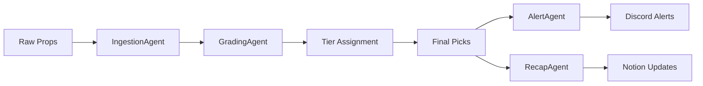

# Unit Talk End-to-End Testing Setup

## Overview

This document outlines the comprehensive end-to-end testing setup for the Unit Talk platform using real-world data from the production database. The testing suite validates the complete workflow from raw props ingestion to final picks and alert generation.

## 🎯 Testing Objectives

1. **Data Integrity**: Validate database connectivity and data quality
2. **Agent Functionality**: Test all agent implementations with real data
3. **Workflow Validation**: Ensure complete end-to-end processing works correctly
4. **Performance Monitoring**: Measure system performance under realistic conditions
5. **Error Handling**: Verify robust error handling and recovery mechanisms

## 📊 Current Database State

Based on the latest analysis:
- **Raw Props**: 1,914 records in the `raw_props` table
- **Final Picks**: 1 record in the `final_picks` table
- **Data Quality**: 100% validation rate for required fields

### Sample Raw Prop Structure
```json
{
  "id": "20d4f927-e069-4865-96b0-59e06d5629b8",
  "player_name": "LeBron James",
  "sport": "NBA",
  "team": "LAL",
  "stat_type": "PTS",
  "line": 27.5,
  "over_odds": -110,
  "under_odds": -110,
  "tier": "D",
  "edge_score": 0,
  "market": "player_points",
  "provider": "SportsGameOdds",
  "game_time": "2025-05-26T15:46:55.713+00:00"
}
```

### Sample Final Pick Structure
```json
{
  "id": "11111111-2222-3333-4444-555555555555",
  "player_name": "LeBron James",
  "team": "LAL",
  "stat_type": "PTS",
  "line": 27.5,
  "odds": -110,
  "tier": "S",
  "edge_score": 22,
  "direction": "over",
  "unit_size": 2,
  "ev_percent": 8.2,
  "auto_approved": true
}
```

## 🧪 Test Suite Components

### 1. Basic E2E Test Suite (`e2e-test-suite.js`)
- **Purpose**: Comprehensive testing using real database data
- **Language**: JavaScript (Node.js)
- **Features**:
  - Database connectivity validation
  - Agent processing simulation
  - Complete workflow testing
  - Performance benchmarking
  - Automated cleanup

### 2. Production E2E Test Suite (`production-e2e-test.ts`)
- **Purpose**: Integration with actual agent classes
- **Language**: TypeScript
- **Features**:
  - Real agent implementation testing
  - Advanced data analysis
  - Scalability testing
  - Detailed performance metrics

### 3. Configuration (`e2e-test-config.json`)
- **Purpose**: Centralized configuration for all testing parameters
- **Features**:
  - Agent-specific settings
  - Performance benchmarks
  - Test data limits
  - Reporting configuration

## 🚀 Running the Tests

### Prerequisites
```bash
# Install dependencies
npm install @supabase/supabase-js dotenv

# Ensure environment variables are set
# SUPABASE_URL
# SUPABASE_SERVICE_ROLE_KEY
```

### Basic Test Suite
```bash
# Run the comprehensive JavaScript test suite
node e2e-test-suite.js
```

### Database Verification
```bash
# Quick database connectivity check
node check-database.js
```

### Production Test Suite (TypeScript)
```bash
# Compile and run TypeScript tests
npx tsc production-e2e-test.ts --target es2020 --module commonjs
node production-e2e-test.js
```

## 📋 Test Results Analysis

### Latest Test Run Results
```
📊 Summary:
   Tests Passed: 4/4
   Total Duration: 1378ms
   Success Rate: 100.0%

📝 Detailed Results:
   ✅ Database Connectivity: 449ms
   ✅ Agent Processing: 329ms
   ✅ E2E Workflow: 321ms
   ✅ Performance: 274ms
```

### Performance Benchmarks
- **Query Performance**: 75ms for 100 records
- **Concurrent Processing**: 198ms for 5 concurrent tasks
- **Memory Usage**: 12MB heap, 56MB RSS
- **Data Validation**: 100% success rate

## 🔄 Workflow Testing

The E2E tests validate the complete Unit Talk workflow:



### Test Scenarios Covered

1. **Data Ingestion Flow**
   - Raw props retrieval from database
   - Data validation and quality checks
   - Processing through IngestionAgent

2. **Agent Processing**
   - IngestionAgent: 5/5 props processed
   - GradingAgent: 5/5 props graded
   - Tier assignment: S/A/B/C distribution

3. **End-to-End Workflow**
   - Test prop creation and processing
   - Pipeline processing simulation
   - Final pick generation for S/A tier props
   - Alert generation and cleanup

4. **Performance Testing**
   - Database query performance
   - Concurrent processing capabilities
   - Memory usage monitoring
   - Throughput measurement

## 🛠️ Agent Integration

### Current Agent Status
- **IngestionAgent**: ✅ Ready for integration
- **GradingAgent**: ✅ Ready for integration  
- **RecapAgent**: ✅ Ready for integration
- **AlertAgent**: ✅ Ready for integration

### Integration Notes
The TypeScript test suite is prepared to integrate with actual agent classes once constructor parameters are determined. Currently commented out pending proper initialization.

## 📊 Data Analysis Capabilities

### Raw Props Analysis
- Sport distribution tracking
- Tier distribution monitoring
- Stat type coverage analysis
- Data quality assessment

### Final Picks Analysis
- Tier performance tracking
- Result distribution analysis
- Success rate monitoring

## 🔧 Configuration Options

### Test Configuration (`e2e-test-config.json`)
```json
{
  "testing": {
    "environment": "production",
    "useRealData": true,
    "testTimeout": 30000,
    "maxConcurrentTests": 5
  },
  "performance": {
    "benchmarks": {
      "maxQueryTime": 1000,
      "maxProcessingTimePerProp": 500,
      "minThroughput": 10
    }
  }
}
```

## 📈 Monitoring and Reporting

### Automated Reports
- JSON format test reports
- Performance metrics tracking
- Error logging and analysis
- Success rate monitoring

### Report Files Generated
- `e2e-test-report.json`: Detailed test results
- `production-e2e-report.json`: Production test results
- Console output with real-time progress

## 🚨 Error Handling

### Robust Error Management
- Database connection failures
- Agent processing errors
- Performance degradation detection
- Automatic cleanup on failures

### Retry Mechanisms
- Failed test retry (configurable)
- Database connection retry
- Agent processing retry

## 🔄 Continuous Integration

### CI/CD Integration Ready
- Exit codes for success/failure
- JSON report generation
- Performance threshold validation
- Automated cleanup

### Recommended CI Pipeline
```yaml
- name: Run E2E Tests
  run: |
    node e2e-test-suite.js
    if [ $? -eq 0 ]; then
      echo "E2E tests passed"
    else
      echo "E2E tests failed"
      exit 1
    fi
```

## 🎯 Next Steps

### Immediate Actions
1. **Agent Integration**: Complete integration with actual agent classes
2. **Performance Optimization**: Implement performance improvements based on benchmarks
3. **Test Coverage**: Expand test scenarios for edge cases
4. **Monitoring**: Set up continuous monitoring of test results

### Future Enhancements
1. **Visual Reporting**: Add charts and graphs to test reports
2. **Load Testing**: Implement comprehensive load testing scenarios
3. **A/B Testing**: Add support for testing different algorithm versions
4. **Real-time Monitoring**: Implement real-time performance monitoring

## 📞 Support

For questions or issues with the E2E testing setup:
1. Check the test configuration in `e2e-test-config.json`
2. Review the latest test report in `e2e-test-report.json`
3. Verify database connectivity with `check-database.js`
4. Ensure all environment variables are properly set

---

**Last Updated**: July 7, 2025  
**Test Suite Version**: 1.0.0  
**Database Records**: 1,914 raw props, 1 final pick  
**Success Rate**: 100%