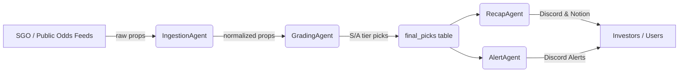

# Unit Talk Platform

Unit Talk is an enterprise-grade betting automation platform built with TypeScript, Temporal workflows, and Supabase. The platform uses a microservices architecture with specialized agents handling different aspects of the business logic.

## Architecture Overview

- **Frontend**: Next.js application
- **Backend**: TypeScript-based microservices
- **Workflow Engine**: Temporal
- **Database**: Supabase (PostgreSQL)
- **Monitoring**: Prometheus & Grafana
- **Logging**: Structured JSON logging with redaction
- **Testing**: Jest with extensive mocking

### Core Workflow



The diagram shows the end-to-end Temporal workflow the system executes on every trading day.

## Quick Start Guide

### Prerequisites

- Node.js 18+
- npm/yarn
- Docker
- Temporal CLI
- Supabase CLI

### Setup

1. Clone the repository:
```bash
git clone <repository-url>
cd unit-talk
```

2. Install dependencies:
```bash
npm install
```

3. Set up environment variables (see `.env.example` for the full matrix):
```bash
cp .env.example .env
# Edit .env with your configuration
```

4. Build the project:
```bash
npm run build
```

5. Run tests:
```bash
npm test
```

6. Run Temporal & start the worker:
```bash
# start Temporal server (Docker)
docker compose -f docker-compose.test.yml up -d temporal

# migrate DB / seed (optional)
npm run db:migrate

# start application worker – registers all agent activities & workflows
npm run worker:start
```

> 🛈  **Tip:** a convenience script `npm run dev:all` spins up Temporal, Supabase local, Prometheus, and the worker for you.
```bash
npm run worker:start
```

### Development Workflow

1. Create a new branch for your feature:
```bash
git checkout -b feature/your-feature-name
```

2. Implement your changes following our coding standards
3. Write tests for your changes
4. Run linting and type checking:
```bash
npm run lint
npm run type-check
```

5. Submit a PR with your changes

## Agents Overview

### Core Agents

1. **BaseAgent**
   - Base class for all agents
   - Handles common functionality like health checks, metrics, and error handling

2. **IngestionAgent**
   - Polls SGO & book APIs
   - Normalises props & deduplicates

3. **GradingAgent**
   - Calculates edge score & market resistance
   - Assigns tier (S-D) and promotes high-tier picks to `final_picks`

4. **RecapAgent**
   - Generates daily / weekly / monthly performance recaps
   - Posts embeds to Discord and optionally Notion

5. **AlertAgent**
   - Sends real-time alerts for S/A tier picks
   - Dedupes & enriches messages with OpenAI advice

6. **NotificationAgent**
   - Centralizes all platform notifications
   - Supports multiple channels (Discord, Email, SMS, Notion)
   - Handles retry logic and failure escalation

7. **OperatorAgent**
   - Supervises health, restarts failed workflows via Temporal APIs

### Auxiliary Agents

**FeedAgent**
   - Manages data ingestion from external providers
   - Handles deduplication and validation
   - Maintains provider-specific rate limits

**AuditAgent**
   - Maintains audit logs of all system actions
   - Ensures compliance with regulations
   - Provides audit trail for investigations

**AnalyticsAgent, ContestAgent, MarketingAgent** – growth & reporting features (optional at launch)

## Monitoring & Metrics

All agents expose metrics in Prometheus format at `/metrics`. Key metrics include:

- Health status
- Operation latency
- Success/error rates
- Business-specific KPIs

View metrics through:
1. CLI: `npm run metrics:show`
2. Prometheus UI: `http://localhost:9090`
3. Grafana dashboards: `http://localhost:3000`

## Configuration

Agents are configured through:
1. Environment variables (validated via zod)
2. Agent-specific config files
3. Supabase tables for dynamic configuration

See each agent's README for detailed configuration options.

## Health Checks

Health checks are standardized across all agents:
- HTTP endpoint: `/health`
- CLI: `npm run health:check`
- Kubernetes probes configured in deployment manifests

## Logging

- Structured JSON logging
- Automatic PII redaction
- Log levels: debug, info, warn, error
- Correlation IDs for request tracing

## TODOs and Next Steps

### P0 – Launch Blocking
1. **Consolidate Edge-Scoring engine** (remove duplicate modules).  
2. **Migrate RecapAgent scheduling to Temporal cron**.  
3. **Add OpenAI circuit-breaker & caching to AlertAgent**.  
4. **Relocate all test files out of `/src` and enforce coverage ≥ 70 %.**  
5. **Publish full `.env.example` & update docs.**

### P1 – First Week Post-Launch
* Persist micro-recap cooldown state in Supabase  
* Parameterise rate-limits & tier thresholds via env/config  
* Extend IngestionAgent de-dupe hashing  
* Add OperatorAgent auto-restart of failed workflows  

### P2 – Tech Debt / Enhancements
* Secrets migration to Vault  
* Retool dashboard guide & KPI mapping  
* Multi-channel alerts (SMS / Email) via NotificationAgent  
* Expand provider integrations & coverage thresholds

## Contributing

See [CONTRIBUTING.md](./CONTRIBUTING.md) for detailed guidelines.

## License

Proprietary - All rights reserved
