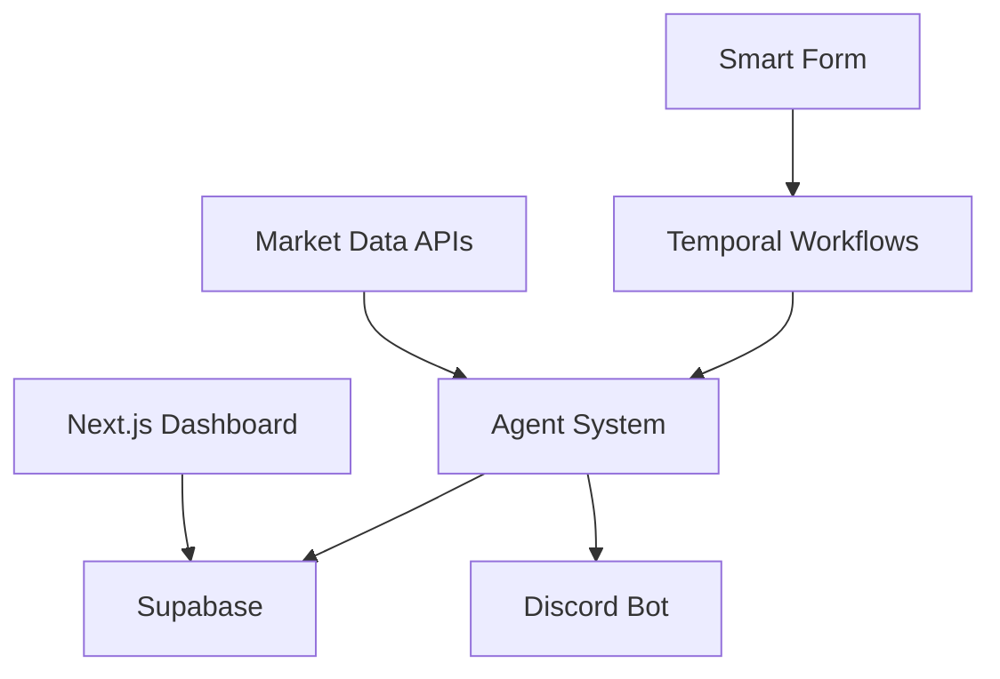

# 🎯 Unit Talk - Premium Sports Betting Intelligence Platform

## Overview

Unit Talk is a Fortune 100-grade sports betting intelligence platform that combines advanced analytics, machine learning, and real-time market analysis to provide premium betting insights. The platform features:

- 🤖 Smart prop submission forms with automated validation
- 📊 Advanced pick grading using multi-model ensemble scoring
- 📈 Real-time market resistance analysis
- 💬 Discord integration for community engagement
- 🔄 Agent-based automation system
- 📱 Modern Next.js dashboard
- 🎫 VIP+ smart analytics features

## Architecture

The system is built on a modern, scalable tech stack:


```mermaid
graph TD
    A[Smart Form] --> B[Temporal Workflows]
    B --> C[Agent System]
    C --> D[Supabase]
    C --> E[Discord Bot]
    F[Next.js Dashboard] --> D
    G[Market Data APIs] --> C
```

### Core Components

1. **Agent System**
   - BaseAgent with lifecycle management
   - Specialized agents (Grading, Recap, Alert, etc.)
   - Event-driven communication
   - Built-in observability

2. **Temporal Workflows**
   - Reliable task orchestration
   - Fault-tolerant processing
   - Activity-based modularization
   - Advanced retry policies

3. **Database (Supabase)**
   - Type-safe schema
   - Real-time subscriptions
   - Row-level security
   - Analytics-ready structure

4. **Discord Integration**
   - Thread-based discussions
   - Automated alerts
   - VIP+ features
   - Community engagement

## Getting Started

### Prerequisites

- Node.js 18+
- PostgreSQL 14+
- Redis
- Temporal

### Installation

1. Clone the repository:
```bash
git clone https://github.com/your-org/unit-talk-production.git
cd unit-talk-production
```

2. Install dependencies:
```bash
npm install
```

3. Set up environment variables:
```bash
cp config/env.example .env
# Edit .env with your configuration
```

4. Start development services:
```bash
# Start Temporal
temporal server start-dev

# Start development server
npm run dev
```

### Configuration

Key configuration files:

- `config/base.json` - Base configuration
- `config/agents/*.json` - Agent-specific configs
- `config/temporal/*.yaml` - Temporal workflow configs

## Development

### Project Structure

```
unit-talk-production/
├── src/
│   ├── agents/         # Business logic agents
│   ├── activities/     # Temporal activities
│   ├── workflows/      # Temporal workflows
│   ├── api/           # API endpoints
│   ├── db/            # Database operations
│   └── utils/         # Shared utilities
├── config/            # Configuration files
├── scripts/          # Maintenance scripts
└── docs/            # Documentation
```

### Key Features

1. **Smart Form**
   - Real-time validation
   - Market data integration
   - Multi-sport support
   - Advanced prop analysis

2. **Grading System**
   - Multi-model ensemble scoring
   - Market resistance analysis
   - Edge detection
   - Risk assessment

3. **Analytics**
   - Performance tracking
   - ROI analysis
   - Trend detection
   - VIP+ insights

### Testing

```bash
# Run unit tests
npm test

# Run E2E tests
npm run test:e2e

# Run specific test suite
npm test -- --grep "GradingAgent"
```

## Deployment

### Production Setup

1. Configure production environment:
```bash
cp config/production.example.json config/production.json
# Edit production.json with your settings
```

2. Build the application:
```bash
npm run build
```

3. Start production services:
```bash
npm run start:prod
```

### Monitoring

The system includes comprehensive monitoring:

- Prometheus metrics
- Grafana dashboards
- Error tracking
- Performance monitoring

## Contributing

1. Fork the repository
2. Create a feature branch
3. Make your changes
4. Submit a pull request

See [CONTRIBUTING.md](CONTRIBUTING.md) for detailed guidelines.

## Documentation

- [Architecture Overview](docs/ARCHITECTURE.md)
- [Agent Development SOP](docs/agent-development-sop.md)
- [Base Agent Spec](docs/BASE_AGENT_SPEC.md)
- [API Documentation](docs/api/README.md)

## License

Proprietary - All rights reserved

## Support

For support inquiries, please contact support@unittalk.com
