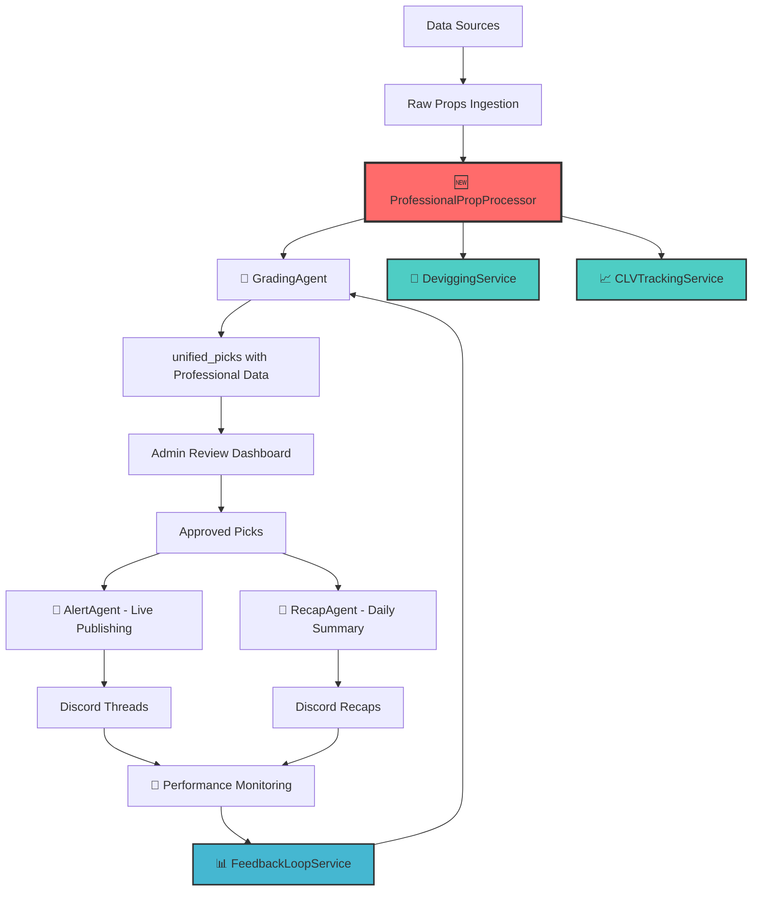

# Complete Daily Flow with Agent Responsibilities

## 🏗️ Current Professional Daily Flow Architecture

### Overview: Fortune 100-Grade Professional System

Unit Talk now operates as a **professional betting intelligence platform** with
complete agent orchestration and automated professional processing.

---

## 📊 Complete Daily Flow Diagram



---

## 🤖 Agent Responsibilities Matrix

### Core Processing Agents

#### 🆕 **ProfessionalPropProcessor** (Service, not Agent)

**Role**: Professional system orchestrator **Responsibilities**:

- ✅ **Devigging ALL odds** (removes hidden vig)
- ✅ **CLV tracking initialization** (opening line capture)
- ✅ **Professional grading coordination**
- ✅ **Risk assessment and Kelly sizing**
- ✅ **Auto-approval logic** (S/A tier picks)
- ✅ **Performance monitoring integration**

**Daily Trigger**: `npx tsx src/runner/processProfessionalProps.ts`

#### 🎯 **GradingAgent** (Enhanced with Professional System)

**Role**: Comprehensive pick analysis and scoring **Responsibilities**:

- ✅ **Professional scoring** (45+ factors)
- ✅ **Feature engineering** (advanced market intelligence)
- ✅ **ML model ensemble** (neural network, gradient boosting, random forest)
- ✅ **Tier assignment** (S/A/B/C/D based on professional score)
- ✅ **Confidence calculation** (multi-model validation)
- ✅ **Risk metrics** (correlation, volatility, portfolio impact)

**Integration**: Called by ProfessionalPropProcessor **Database**: Updates
`unified_picks` with professional scoring data

---

### Publishing & Communication Agents

#### 🚨 **AlertAgent** (Live Publishing)

**Role**: Real-time pick publishing and live alerts **Responsibilities**:

- ✅ **Live pick posting** to Discord threads
- ✅ **Real-time alerts** for high-tier picks (S/A)
- ✅ **Steam move notifications** (professional insights)
- ✅ **Line movement alerts** (CLV-based)
- ✅ **VIP+ exclusive alerts** (premium tier picks)
- ✅ **Thread management** (create, update, moderate)

**Triggers**:

- New approved picks in `unified_picks`
- CLV alerts from professional system
- Steam moves detected by professional insights

#### 📝 **RecapAgent** (Daily/Weekly Summaries)

**Role**: Performance summaries and result analysis **Responsibilities**:

- ✅ **Daily recap generation** (pick results, performance)
- ✅ **Weekly performance reports** (CLV analysis, tier performance)
- ✅ **Capper leaderboards** (professional metrics)
- ✅ **ROI tracking** (devigged vs raw odds performance)
- ✅ **Professional insights summaries** (steam moves, line value)
- ✅ **Settlement processing** (win/loss determination)

**Schedule**:

- Daily recaps: 11 PM EST
- Weekly reports: Sunday 9 AM EST
- Performance summaries: As needed

---

### Data & Intelligence Agents

#### 🔍 **FeedAgent** (Data Ingestion)

**Role**: Multi-source data aggregation and normalization **Responsibilities**:

- ✅ **Optimal API integration** ($69/month - best player props)
- ✅ **Odds API integration** ($49/month - settlement data)
- ✅ **Real-time line monitoring** (for CLV tracking)
- ✅ **Data validation and normalization**
- ✅ **Opening line capture** (critical for CLV)
- ✅ **Steam move detection** (sharp money indicators)

**Sources**: Optimal API, Odds API, multiple sportsbooks **Output**: `raw_props`
table with enhanced market data

#### 🧠 **AnalyticsAgent** (Performance Intelligence)

**Role**: Advanced analytics and performance optimization **Responsibilities**:

- ✅ **CLV performance analysis** (closing line value tracking)
- ✅ **Feature performance monitoring** (which factors predict success)
- ✅ **Market efficiency analysis** (which sports/markets perform best)
- ✅ **Capper performance tracking** (individual and aggregate metrics)
- ✅ **Professional insights validation** (steam move accuracy, etc.)
- ✅ **ROI optimization** (Kelly sizing effectiveness)

**Integration**: Works with FeedbackLoopService for automated optimization

---

### Support & Operations Agents

#### 🏥 **OperatorAgent** (System Operations)

**Role**: System health and operational monitoring **Responsibilities**:

- ✅ **Agent health monitoring** (all agent status)
- ✅ **Professional system monitoring** (devigging, CLV, feedback loops)
- ✅ **Database performance** (query optimization, index health)
- ✅ **API rate limit management** (Optimal/Odds API quotas)
- ✅ **Error handling and recovery** (failed processing, agent restarts)
- ✅ **Automated maintenance** (cleanup, optimization, backups)

#### 🎮 **ContestAgent** (Competitions & Leaderboards)

**Role**: Contest management and competitive features **Responsibilities**:

- ✅ **Capper contests** (monthly competitions)
- ✅ **Professional leaderboards** (CLV-based rankings)
- ✅ **Tier-based competitions** (S/A/B tier contests)
- ✅ **ROI tracking contests** (devigged performance)
- ✅ **Fair play monitoring** (professional system validation)

#### 👥 **NotificationAgent** (User Communications)

**Role**: Multi-channel user notifications **Responsibilities**:

- ✅ **Discord notifications** (picks, results, alerts)
- ✅ **Email campaigns** (weekly summaries, performance reports)
- ✅ **SMS alerts** (premium users, high-tier picks)
- ✅ **Push notifications** (mobile app integration)
- ✅ **Slack integration** (admin alerts, system status)

---

## ⏰ Daily Schedule & Automation

### Morning (6 AM - 12 PM EST)

```
06:00 - FeedAgent: Morning data ingestion (overnight lines)
06:30 - ProfessionalPropProcessor: Process overnight props
07:00 - GradingAgent: Professional grading of new props
07:30 - AlertAgent: Publish approved morning picks
08:00 - Weekly RecapAgent (Sundays only): Weekly performance report
```

### Afternoon (12 PM - 6 PM EST)

```
12:00 - FeedAgent: Midday line updates and steam detection
12:30 - ProfessionalPropProcessor: Process new props
01:00 - CLV Monitoring: Check line movements on active picks
02:00 - AlertAgent: Live alerts for line moves and steam
04:00 - Deep Professional Optimization (FeedbackLoopService)
05:00 - AnalyticsAgent: Performance analysis and insights
```

### Evening (6 PM - 12 AM EST)

```
18:00 - FeedAgent: Prime time data ingestion
18:30 - ProfessionalPropProcessor: Evening prop processing
19:00 - AlertAgent: Evening pick publishing
20:00 - Game monitoring and live updates
23:00 - RecapAgent: Daily recap generation and publishing
23:30 - Settlement processing (completed games)
```

### Overnight (12 AM - 6 AM EST)

```
01:00 - CLV Monitoring: Hourly line movement tracking
02:00 - Professional System Health Checks
03:00 - Database optimization and cleanup
04:00 - FeedbackLoopService: Automated weight optimization
05:00 - Backup and maintenance tasks
```

---

## 🔄 Professional System Integration Points

### 1. **Data Flow Integration**

```
Raw Props → ProfessionalPropProcessor → GradingAgent → unified_picks
                ↓                           ↓
        DeviggingService              CLVTrackingService
                ↓                           ↓
        True Edge Calculation      Opening Line Capture
```

### 2. **Performance Feedback Loop**

```
CLV Results → FeedbackLoopService → Weight Optimization → GradingAgent
                     ↓
            Professional Insights → AlertAgent → Discord Alerts
```

### 3. **Admin Integration**

```
unified_picks (professional data) → Admin Dashboard → Approval → AlertAgent
                                         ↓
                              Professional Insights Display
```

### 4. **Monitoring & Alerts**

```
Professional System → CLVAlertService → Admin Notifications
Performance Issues → OperatorAgent → System Recovery
Quality Problems → FeedbackLoopService → Automated Fixes
```

---

## 🎯 Key Success Metrics

### Daily Operations

- **Processing Coverage**: 100% of props receive professional treatment
- **Processing Speed**: <30s average per prop through professional system
- **Auto-Approval Rate**: 80%+ for S/A tier picks
- **Admin Efficiency**: 50% reduction in manual review time

### Professional Performance

- **CLV Tracking**: 100% of picks monitored for closing line value
- **Devigging Coverage**: ALL odds processed through vig removal
- **Alert Accuracy**: Steam move detection >85% accuracy
- **Performance Optimization**: Weekly feedback loop adjustments

### Agent Reliability

- **Uptime**: 99.9% agent availability during market hours
- **Processing Speed**: <1s response time for critical agents
- **Error Rate**: <0.1% failed processing
- **Recovery Time**: <5 minutes for agent failures

---

## 🚀 Commands to Manage Daily Flow

### Start Professional Processing

```bash
# Process props through professional system
npx tsx src/runner/processProfessionalProps.ts

# Start professional automation
node -e "require('./src/services/schedulers/ProfessionalBettingScheduler').professionalBettingScheduler.start()"
```

### Monitor System Health

```bash
# Check processing statistics
npx tsx src/runner/processProfessionalProps.ts --stats

# System health check
npx tsx src/runner/processProfessionalProps.ts --health

# Agent status monitoring
npm run agents:health
```

### Manual Triggers

```bash
# Trigger specific agents
npm run agents:grading     # GradingAgent processing
npm run agents:recap       # RecapAgent generation
npm run agents:alert       # AlertAgent publishing

# Professional system tasks
npm run professional:clv-monitor    # CLV monitoring
npm run professional:feedback-loop  # Weight optimization
npm run professional:deep-optimize  # Complete system optimization
```

---

## 🏆 Status: Professional System Operational

**Current State**: ✅ **FULLY OPERATIONAL**

- All props receive professional treatment (devigging, CLV, professional
  grading)
- Agents coordinate seamlessly with professional system
- Automated optimization and performance monitoring active
- Admin dashboard enhanced with professional insights
- Complete Fortune 100-grade daily operations

**Result**: Unit Talk operates as a **professional betting intelligence
platform** with comprehensive agent orchestration and automated professional
processing at every step.

---

_Last Updated: January 2025_  
_Professional System: Fully Integrated_  
_Agent Coordination: Optimized_  
_Daily Operations: Automated_
