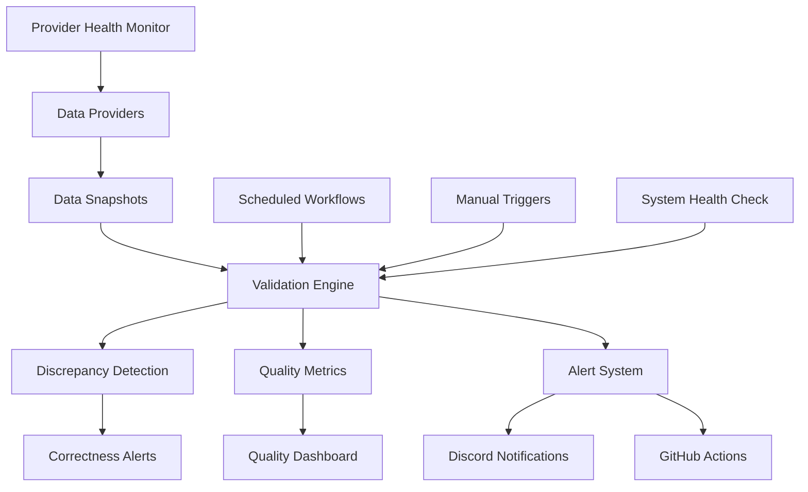

# Correctness Monitoring & Data Validation System

Comprehensive cross-provider data validation system for ensuring accuracy of odds, game times, and betting data across multiple sports providers.

## Overview

The Correctness Monitoring system provides:

- **Cross-Provider Validation**: Compare odds, game times, and data across multiple providers
- **Real-time Discrepancy Detection**: Automated detection of data inconsistencies
- **Quality Metrics**: Track accuracy, timeliness, completeness, and consistency
- **Alert Management**: Multi-channel alerting for data quality issues
- **Provider Health Monitoring**: Track provider reliability and performance
- **Automated Reporting**: Scheduled validation runs with comprehensive reporting

## Architecture



## Quick Start

### 1. Setup Correctness Monitoring

```bash
# Run database migration
npm run db:migrate

# Initialize correctness monitoring service
npm run correctness:setup

# Configure provider validation rules
npm run correctness:configure
```

### 2. Basic Usage

```typescript
import { CorrectnessMonitoringService } from './src/services/CorrectnessMonitoringService';

const correctnessService = new CorrectnessMonitoringService();

// Capture data snapshot
await correctnessService.captureDataSnapshot({
  providerId: 'optimal_api',
  gameId: 'game_123',
  sport: 'nfl',
  homeTeam: 'Chiefs',
  awayTeam: 'Bills',
  oddsData: {
    spread: { home_odds: -110, away_odds: -110, line: -3.5 },
    moneyline: { home_odds: -150, away_odds: +130 }
  }
});

// Validate data consistency
const resultId = await correctnessService.validateDataConsistency(
  'game_123', 
  'nfl', 
  'odds_variance', 
  5
);

// Get validation result
const result = await correctnessService.getValidationResult(resultId);
if (result?.discrepancyFound) {
  console.log(`Discrepancy detected: ${result.discrepancySeverity}`);
}
```

### 3. Configuration

Set up providers and validation rules:

```sql
-- Configure data provider
INSERT INTO data_providers (
  provider_name, provider_type, reliability_score,
  supported_sports, data_types, priority_order
) VALUES (
  'new_provider', 'validation', 0.90,
  ARRAY['nfl', 'nba'], ARRAY['odds', 'game_times'], 5
);

-- Set up validation rule
INSERT INTO validation_rules (
  rule_name, rule_type, data_type,
  threshold_config, severity
) VALUES (
  'New Provider Odds Check', 'odds_variance', 'odds',
  '{"max_odds_variance": 75, "min_sample_size": 2}', 'medium'
);
```

## Data Validation Types

### Supported Validation Types

| Type | Description | Data Compared | Typical Threshold |
|------|-------------|---------------|-------------------|
| `odds_variance` | Compare odds between providers | Spread, moneyline, totals | 50-100 points |
| `time_drift` | Compare game start times | Game timestamps | 15-30 minutes |
| `line_movement` | Compare line changes | Spread/total lines | 1.0-2.0 points |
| `availability` | Check data availability | Data presence | 5-10 minutes delay |

### Validation Process

1. **Data Collection**: Capture snapshots from multiple providers
2. **Provider Matching**: Match data for the same game across providers
3. **Threshold Checking**: Apply validation rules and thresholds
4. **Discrepancy Analysis**: Identify and classify discrepancies
5. **Alert Generation**: Create alerts for significant discrepancies
6. **Quality Metrics**: Update provider quality scores

## Provider Configuration

### Provider Types

**Primary Providers**: Main data sources for betting operations
- Highest priority in validation comparisons
- Used as baseline for discrepancy calculations
- Typically the most reliable and fastest providers

**Validation Providers**: Secondary sources for cross-validation
- Compared against primary providers
- Used to detect discrepancies and anomalies
- Multiple validation providers increase accuracy

**Reference Providers**: Additional context and verification
- Lower priority, used for additional confirmation
- Often free or low-cost data sources
- Useful for historical data and trends

### Adding New Providers

```typescript
// 1. Register provider in database
await supabase.from('data_providers').insert({
  provider_name: 'sportsbook_api',
  provider_type: 'validation',
  reliability_score: 0.88,
  supported_sports: ['nfl', 'nba', 'mlb'],
  data_types: ['odds', 'line_moves'],
  priority_order: 6,
  api_endpoint: 'https://api.sportsbook.com/v1',
  refresh_interval_minutes: 30
});

// 2. Create validation rules for the provider
await supabase.from('validation_rules').insert({
  rule_name: 'Sportsbook API Odds Variance',
  rule_type: 'odds_variance',
  data_type: 'odds',
  sport: null, // Applies to all sports
  threshold_config: {
    max_odds_variance: 60,
    min_sample_size: 2,
    time_window_minutes: 10
  },
  severity: 'medium'
});

// 3. Start capturing data
await correctnessService.captureDataSnapshot({
  providerId: 'sportsbook_api',
  gameId: 'game_456',
  sport: 'nba',
  // ... snapshot data
});
```

## Quality Metrics

### Metric Types

**Accuracy**: Percentage of validations without discrepancies
```sql
SELECT 
  provider_name,
  AVG(CASE WHEN metric_type = 'accuracy' THEN metric_value END) as accuracy_score
FROM data_quality_metrics dqm
JOIN data_providers dp ON dqm.provider_id = dp.id
WHERE metric_timestamp > NOW() - INTERVAL '24 hours'
GROUP BY provider_name;
```

**Timeliness**: Average delay in data availability
```sql
SELECT 
  provider_name,
  AVG(CASE WHEN metric_type = 'timeliness' THEN metric_value END) as avg_delay_minutes
FROM data_quality_metrics dqm
JOIN data_providers dp ON dqm.provider_id = dp.id
WHERE metric_timestamp > NOW() - INTERVAL '24 hours'
GROUP BY provider_name;
```

**Completeness**: Percentage of expected data received
```sql
SELECT 
  provider_name,
  AVG(CASE WHEN metric_type = 'completeness' THEN metric_value END) as completeness_score
FROM data_quality_metrics dqm
JOIN data_providers dp ON dqm.provider_id = dp.id
WHERE metric_timestamp > NOW() - INTERVAL '24 hours'
GROUP BY provider_name;
```

**Consistency**: Variance in data over time
```sql
SELECT 
  provider_name,
  AVG(CASE WHEN metric_type = 'consistency' THEN metric_value END) as consistency_score
FROM data_quality_metrics dqm
JOIN data_providers dp ON dqm.provider_id = dp.id
WHERE metric_timestamp > NOW() - INTERVAL '24 hours'
GROUP BY provider_name;
```

### Quality Scoring

Quality metrics are calculated on a 0-100 scale:

- **90-100**: Excellent quality, minimal issues
- **80-89**: Good quality, minor discrepancies
- **70-79**: Fair quality, moderate issues
- **60-69**: Poor quality, significant problems
- **Below 60**: Critical quality issues requiring attention

## Alert Management

### Alert Types

**Odds Discrepancy**: Significant variance in odds between providers
```typescript
const alert = {
  alertType: 'odds_discrepancy',
  severity: 'high',
  gameId: 'game_123',
  sport: 'nfl',
  alertTitle: 'Large odds variance detected',
  thresholdValue: 50.0,
  actualValue: 125.0
};
```

**Time Drift**: Game time differences between providers
```typescript
const alert = {
  alertType: 'time_drift',
  severity: 'medium',
  gameId: 'game_123',
  sport: 'nfl',
  alertTitle: 'Game time discrepancy',
  thresholdValue: 15.0, // minutes
  actualValue: 45.0     // minutes
};
```

**Data Missing**: Missing or unavailable data from providers
```typescript
const alert = {
  alertType: 'data_missing',
  severity: 'critical',
  providerId: 'optimal_api',
  sport: 'nba',
  alertTitle: 'Provider data unavailable',
  recommendedActions: [
    'Check provider API status',
    'Verify authentication',
    'Switch to backup provider'
  ]
};
```

**Quality Degradation**: Declining provider performance
```typescript
const alert = {
  alertType: 'quality_degradation',
  severity: 'high',
  providerId: 'odds_api',
  alertTitle: 'Provider quality score declining',
  thresholdValue: 85.0,
  actualValue: 72.0,
  impactAssessment: 'May affect betting accuracy and user trust'
};
```

### Alert Channels

**Discord Integration**
```typescript
// Configure Discord webhook
process.env.DISCORD_CORRECTNESS_WEBHOOK = 'https://discord.com/api/webhooks/...';

// Alerts automatically sent with color-coded embeds:
// Critical: Red (15158332)
// High: Yellow (16776960)
// Medium: Blue (3447003)
// Low: Green (5763719)
```

**GitHub Actions Integration**
```yaml
# Automatic GitHub annotations for critical issues
- Critical alerts: Error annotations
- High alerts: Warning annotations
- Medium/Low: Notice annotations
```

## Data Snapshots

### Snapshot Structure

Data snapshots capture point-in-time data from providers:

```typescript
interface DataSnapshot {
  id: string;
  snapshotTimestamp: Date;
  providerId: string;
  gameId: string;
  sport: string;
  gameTime?: Date;
  homeTeam: string;
  awayTeam: string;
  oddsData: {
    spread?: {
      home_odds: number;
      away_odds: number;
      line: number;
    };
    moneyline?: {
      home_odds: number;
      away_odds: number;
    };
    total?: {
      over_odds: number;
      under_odds: number;
      line: number;
    };
    props?: Array<{
      prop_type: string;
      line: number;
      over_odds: number;
      under_odds: number;
      player_name?: string;
    }>;
  };
  lineData?: {
    spread_line?: number;
    total_line?: number;
    movements?: Array<{
      timestamp: string;
      old_line: number;
      new_line: number;
      move_direction: 'up' | 'down';
    }>;
  };
  metadata?: Record<string, any>;
}
```

### Best Practices for Snapshots

1. **Consistent Timing**: Capture snapshots at regular intervals
2. **Complete Data**: Include all available odds and line data
3. **Metadata**: Store relevant context (request_id, response_time, etc.)
4. **Error Handling**: Handle partial or missing data gracefully
5. **Storage Optimization**: Archive old snapshots to manage storage

## GitHub Actions Automation

### Scheduled Monitoring

The system includes automated monitoring workflows:

**`.github/workflows/correctness-monitoring.yml`**
- **Every 30 minutes**: Quick validation during active betting hours (10 AM - 11 PM UTC)
- **Daily at 3 AM UTC**: Comprehensive validation with full analysis
- **Manual trigger**: On-demand validation with configurable parameters

### Workflow Components

1. **Validation Setup**: Configure validation parameters and provider matrix
2. **Data Source Health**: Check provider availability and data freshness
3. **Cross-Provider Validation**: Run validation across sport/validation type combinations
4. **Alert Management**: Process alerts and send notifications
5. **Quality Metrics Update**: Calculate and update provider quality scores
6. **System Health Check**: Comprehensive system status assessment

### Manual Triggers

```yaml
# Manual workflow dispatch with options
on:
  workflow_dispatch:
    inputs:
      validation_type:
        description: 'Type of validation to run'
        type: choice
        options: [comprehensive, odds_variance, time_drift, line_movement]
      sport:
        description: 'Sport to validate'
        type: choice
        options: [all, nfl, nba, mlb, nhl]
      severity_threshold:
        description: 'Alert severity threshold'
        type: choice
        options: [low, medium, high, critical]
```

## API Reference

### CorrectnessMonitoringService

```typescript
class CorrectnessMonitoringService extends EventEmitter {
  // Data capture
  async captureDataSnapshot(snapshot: Omit<DataSnapshot, 'id' | 'snapshotTimestamp'>): Promise<string>
  
  // Validation
  async validateDataConsistency(gameId: string, sport: string, validationType?: string, timeWindowMinutes?: number): Promise<string>
  async getValidationResult(resultId: string): Promise<ValidationResult | null>
  
  // Quality metrics
  async getQualityMetrics(providerName?: string, sport?: string, hours?: number): Promise<QualityMetrics[]>
  async updateQualityMetrics(providerName: string, sport?: string, hoursLookback?: number): Promise<void>
  
  // Alerts
  async getActiveAlerts(severity?: string, sport?: string, limit?: number): Promise<CorrectnessAlert[]>
  async acknowledgeAlert(alertId: string, acknowledgedBy: string): Promise<void>
  
  // Provider health
  async getProviderHealth(): Promise<any[]>
  async getGameValidationStatus(gameId?: string, sport?: string, hours?: number): Promise<GameValidationStatus[]>
  
  // Discrepancy management
  async resolveDiscrepancy(resultId: string, resolutionStatus: 'resolved' | 'false_positive', resolutionNotes: string, resolvedBy: string): Promise<void>
  
  // Validation workflows
  async validateProviderData(providerName: string, gameIds: string[], validationTypes?: string[]): Promise<{validated: number; discrepancies: number; results: string[]}>
  async runComprehensiveValidation(sport?: string): Promise<{totalGames: number; validationsRun: number; discrepanciesFound: number; criticalIssues: number}>
  
  // Events
  on('snapshotCaptured', handler: (event) => void): void
  on('discrepancyDetected', handler: (event) => void): void
  on('alertCreated', handler: (event) => void): void
  on('qualityMetricsUpdated', handler: (event) => void): void
  on('healthUpdate', handler: (event) => void): void
}
```

### Database Functions

```sql
-- Capture data snapshot
SELECT capture_data_snapshot(
  provider_name TEXT,
  game_id TEXT,
  sport TEXT,
  game_time TIMESTAMPTZ,
  home_team TEXT,
  away_team TEXT,
  odds_data JSONB,
  line_data JSONB DEFAULT '{}',
  metadata JSONB DEFAULT '{}'
) RETURNS UUID;

-- Validate data consistency
SELECT validate_data_consistency(
  game_id TEXT,
  sport TEXT,
  validation_type TEXT DEFAULT 'odds_variance',
  time_window_minutes INTEGER DEFAULT 5
) RETURNS UUID;

-- Calculate quality metrics
SELECT calculate_quality_metrics(
  provider_name TEXT,
  sport TEXT DEFAULT NULL,
  hours_lookback INTEGER DEFAULT 24
) RETURNS VOID;

-- Resolve discrepancy
SELECT resolve_validation_discrepancy(
  result_id UUID,
  resolution_status TEXT,
  resolution_notes TEXT,
  resolved_by TEXT
) RETURNS BOOLEAN;
```

## Database Views

### Provider Health Dashboard
```sql
SELECT * FROM data_provider_health 
WHERE is_active = true
ORDER BY quality_score DESC;
```

### Active Alerts
```sql
SELECT * FROM active_correctness_alerts 
WHERE severity IN ('critical', 'high')
ORDER BY created_at DESC;
```

### Validation Summary
```sql
SELECT * FROM validation_discrepancy_summary 
WHERE validation_timestamp > NOW() - INTERVAL '24 hours'
ORDER BY discrepancy_rate_percent DESC;
```

### Game Status
```sql
SELECT * FROM game_validation_status 
WHERE validation_status IN ('WARNING', 'CRITICAL')
ORDER BY minutes_since_last_update ASC;
```

### Quality Dashboard
```sql
SELECT * FROM data_quality_dashboard 
WHERE metric_timestamp > NOW() - INTERVAL '24 hours'
ORDER BY provider_name, sport, metric_type;
```

## Monitoring and Alerting

### System Health Indicators

**Provider Availability**: Percentage of providers actively providing data
```sql
SELECT 
  COUNT(*) FILTER (WHERE is_active = true) * 100.0 / COUNT(*) as availability_percent
FROM data_providers;
```

**Validation Coverage**: Percentage of games with multi-provider validation
```sql
SELECT 
  COUNT(*) FILTER (WHERE provider_count >= 2) * 100.0 / COUNT(*) as coverage_percent
FROM game_validation_status;
```

**Alert Response Time**: Average time to acknowledge critical alerts
```sql
SELECT 
  AVG(EXTRACT(EPOCH FROM (acknowledged_at - created_at)) / 60) as avg_response_minutes
FROM correctness_alerts 
WHERE severity = 'critical' AND acknowledged_at IS NOT NULL;
```

### Performance Metrics

**Validation Throughput**: Validations per hour
```sql
SELECT 
  DATE_TRUNC('hour', validation_timestamp) as hour,
  COUNT(*) as validations_per_hour
FROM validation_results
WHERE validation_timestamp > NOW() - INTERVAL '24 hours'
GROUP BY DATE_TRUNC('hour', validation_timestamp)
ORDER BY hour;
```

**Discrepancy Trends**: Discrepancy rate over time
```sql
SELECT 
  DATE_TRUNC('day', validation_timestamp) as day,
  COUNT(*) FILTER (WHERE discrepancy_found = true) * 100.0 / COUNT(*) as discrepancy_rate
FROM validation_results
WHERE validation_timestamp > NOW() - INTERVAL '7 days'
GROUP BY DATE_TRUNC('day', validation_timestamp)
ORDER BY day;
```

## Best Practices

### Implementation Guidelines

1. **Capture Complete Snapshots**: Include all available data in snapshots
2. **Use Appropriate Time Windows**: Match validation windows to data refresh rates
3. **Set Realistic Thresholds**: Balance sensitivity with false positive rates
4. **Monitor Provider Health**: Track provider reliability over time
5. **Respond to Alerts Promptly**: Acknowledge and investigate critical alerts quickly

### Data Quality Optimization

1. **Multiple Validation Providers**: Use 2-3 validation providers for reliability
2. **Sport-Specific Rules**: Configure rules based on sport characteristics
3. **Dynamic Thresholds**: Adjust thresholds based on market conditions
4. **Historical Baselines**: Use historical data to set appropriate thresholds
5. **Regular Rule Updates**: Review and update validation rules quarterly

### Alert Management

1. **Severity Classification**: Use appropriate severity levels to avoid alert fatigue
2. **Actionable Recommendations**: Include specific actions in alert descriptions
3. **Escalation Procedures**: Define clear escalation paths for critical issues
4. **Alert Grouping**: Group related alerts to reduce noise
5. **Resolution Tracking**: Document alert resolutions for continuous improvement

## Troubleshooting

### Common Issues

**No Validation Results**
```bash
# Check provider data availability
SELECT provider_name, COUNT(*) as snapshot_count
FROM data_snapshots ds
JOIN data_providers dp ON ds.provider_id = dp.id
WHERE ds.created_at > NOW() - INTERVAL '1 hour'
GROUP BY provider_name;

# Verify validation rules are active
SELECT * FROM validation_rules WHERE is_active = true;
```

**High False Positive Rate**
```bash
# Check threshold configurations
SELECT rule_name, threshold_config 
FROM validation_rules 
WHERE rule_type = 'odds_variance';

# Review recent discrepancies
SELECT * FROM validation_results 
WHERE discrepancy_found = true 
  AND validation_timestamp > NOW() - INTERVAL '24 hours'
ORDER BY variance_percentage DESC;
```

**Missing Alerts**
```bash
# Check alert generation
SELECT COUNT(*) FROM correctness_alerts 
WHERE created_at > NOW() - INTERVAL '1 hour';

# Verify Discord webhook configuration
echo $DISCORD_CORRECTNESS_WEBHOOK
```

**Poor Data Quality Scores**
```bash
# Check provider accuracy
SELECT provider_name, 
       AVG(CASE WHEN metric_type = 'accuracy' THEN metric_value END) as accuracy
FROM data_quality_metrics dqm
JOIN data_providers dp ON dqm.provider_id = dp.id
WHERE metric_timestamp > NOW() - INTERVAL '24 hours'
GROUP BY provider_name;
```

### Debug Commands

```bash
# Test correctness monitoring service
npm run test:integration -- tests/integration/correctness-monitors.test.ts

# Check database status
npm run db:status

# Validate correctness system
npm run correctness:validate

# Test alert dispatch
npm run correctness:test-alerts

# Run manual validation
npm run correctness:validate-manual -- --sport=nfl --type=odds_variance
```

### Performance Tuning

**Database Optimization**
```sql
-- Add performance indexes
CREATE INDEX idx_data_snapshots_provider_game ON data_snapshots(provider_id, game_id);
CREATE INDEX idx_validation_results_game_time ON validation_results(game_id, validation_timestamp);
CREATE INDEX idx_correctness_alerts_severity_status ON correctness_alerts(severity, status);

-- Analyze query performance
EXPLAIN ANALYZE SELECT * FROM game_validation_status 
WHERE sport = 'nfl' AND validation_status = 'WARNING';
```

**Service Performance**
```typescript
// Enable caching for frequently accessed data
const providerHealth = await correctnessService.getProviderHealth();
// Provider health is cached for 5 minutes

// Batch validation operations
const gameIds = ['game1', 'game2', 'game3'];
const results = await correctnessService.validateProviderData('optimal_api', gameIds);
```

## Configuration Examples

### Production Setup

```bash
# Environment variables
export SUPABASE_URL="https://your-project.supabase.co"
export SUPABASE_SERVICE_ROLE_KEY="your-service-role-key"
export DISCORD_CORRECTNESS_WEBHOOK="https://discord.com/api/webhooks/..."

# Provider configuration
npm run correctness:setup-providers -- \
  --primary optimal_api \
  --validation odds_api,espn_api \
  --reference sportsbook_direct
```

### Development Setup

```bash
# Use separate configuration for development
npm run correctness:setup-providers -- \
  --environment development \
  --primary test_provider \
  --validation mock_provider
```

### Testing Configuration

```typescript
// Mock correctness monitoring for tests
const mockCorrectnessService = {
  captureDataSnapshot: jest.fn().mockResolvedValue('snapshot-id'),
  validateDataConsistency: jest.fn().mockResolvedValue('validation-id'),
  getValidationResult: jest.fn().mockResolvedValue({
    discrepancyFound: false,
    discrepancySeverity: 'low'
  })
};
```

## Migration Guide

### Upgrading to v2.0.0

1. **Run Migration**: `npm run db:migrate`
2. **Configure Providers**: Set up data providers and validation rules
3. **Update Service Integration**: Replace old validation calls with new API
4. **Configure Alerts**: Set up Discord webhooks and notification preferences
5. **Test System**: Run comprehensive validation to verify setup
6. **Monitor Performance**: Establish baseline metrics and thresholds

### Breaking Changes

**v2.0.0**
- Database schema changes require migration
- CorrectnessMonitoringService API restructured
- New required environment variables for alerting
- GitHub Actions workflow structure updated

## Support

For issues or questions:

1. Check existing GitHub Issues for correctness monitoring
2. Review correctness monitoring workflow logs in GitHub Actions
3. Examine database correctness views and alert tables
4. Contact the data team with relevant metrics and error details

---

*Correctness Monitoring System - Ensuring data accuracy and reliability across all sports betting providers*