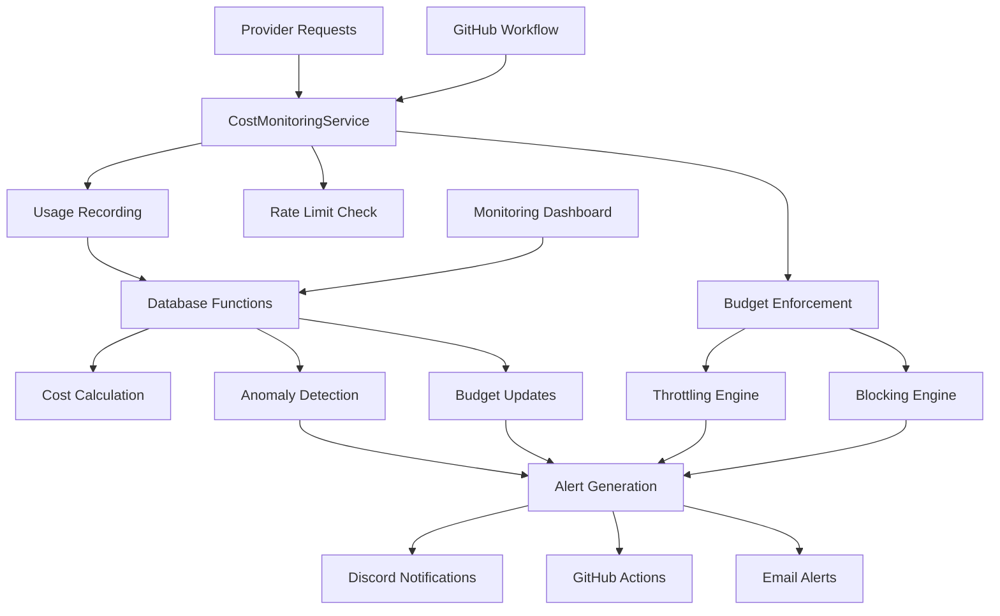

# Cost Monitoring & Budget Enforcement

Comprehensive cost monitoring system with usage tracking, budget enforcement, anomaly detection, and automated throttling for all external providers.

## Overview

The cost monitoring system provides:

- **Real-time Usage Tracking**: Monitor all external provider costs with automatic pricing calculations
- **Budget Enforcement**: Configurable budgets with throttling and blocking capabilities  
- **Rate Limiting**: Prevent API abuse and control request/token consumption
- **Anomaly Detection**: ML-powered detection of unusual usage patterns
- **Cost Alerts**: Multi-channel alerting for budget thresholds and anomalies
- **Historical Analytics**: Trend analysis and cost projections
- **Automated Actions**: Throttling, blocking, and budget enforcement

## Architecture



## Quick Start

### 1. Setup Cost Monitoring

```bash
# Run database migration
npm run db:migrate

# Initialize cost monitoring service
npm run cost:setup

# Configure provider budgets
npm run cost:configure
```

### 2. Basic Usage

```typescript
import { CostMonitoringService } from './src/services/CostMonitoringService';

const costService = new CostMonitoringService();

// Record usage
await costService.recordUsage({
  provider: 'openai',
  service: 'gpt-4',
  resourceType: 'tokens',
  value: 1000,
  unit: 'tokens',
  metadata: { request_id: 'req_123' }
});

// Check budget status
const budget = await costService.getBudgetStatus('openai');
console.log(`Budget health: ${budget.budgetHealth}`);

// Get cost metrics
const metrics = await costService.getCostMetrics();
console.log(`Total spend: $${metrics.totalSpend}`);
```

### 3. Configuration

Set up provider pricing and budgets:

```sql
-- Configure provider pricing
INSERT INTO provider_pricing (
  provider_name, provider_service, resource_type,
  pricing_unit, cost_per_unit_usd, environment
) VALUES (
  'openai', 'gpt-4', 'tokens',
  'per_token', 0.00003, 'production'
);

-- Set up cost budget
INSERT INTO cost_budgets (
  budget_name, budget_type, budget_scope,
  monthly_budget_usd, enforcement_mode,
  throttle_at_percent, block_at_percent
) VALUES (
  'OpenAI Production Budget', 'provider', 'openai',
  500.0, 'throttle', 80, 95
);
```

## Provider Integration

### Supported Providers

| Provider | Services | Resource Types | Rate Limits |
|----------|----------|----------------|-------------|
| OpenAI | GPT-4, GPT-3.5, Embeddings | tokens, requests | RPM, TPM |
| Anthropic | Claude-3, Claude-2 | tokens, requests | RPM, TPM |
| Temporal | Workflows, Activities | workflow_runs, activity_tasks | WPM |
| Supabase | Database, Auth, Storage | queries, storage_gb, bandwidth_gb | QPM |
| Discord | Bot API | messages, embeds | MPM |

### Adding New Providers

```typescript
// 1. Configure pricing
await supabase.from('provider_pricing').insert({
  provider_name: 'new_provider',
  provider_service: 'api_service',
  resource_type: 'requests',
  pricing_unit: 'per_request',
  cost_per_unit_usd: 0.01,
  environment: 'production'
});

// 2. Set rate limits
await supabase.from('provider_rate_limits').insert({
  provider_name: 'new_provider',
  provider_service: 'api_service',
  requests_per_minute: 100,
  tokens_per_minute: 10000,
  environment: 'production'
});

// 3. Create budget
await supabase.from('cost_budgets').insert({
  budget_name: 'New Provider Budget',
  budget_type: 'provider',
  budget_scope: 'new_provider',
  monthly_budget_usd: 100.0,
  enforcement_mode: 'throttle'
});
```

## Budget Management

### Budget Types

**Global Budget**: Overall spending limit across all providers
```sql
INSERT INTO cost_budgets (
  budget_type, budget_scope, monthly_budget_usd
) VALUES (
  'global', 'all', 2000.0
);
```

**Provider Budget**: Spending limit per provider
```sql
INSERT INTO cost_budgets (
  budget_type, budget_scope, monthly_budget_usd
) VALUES (
  'provider', 'openai', 800.0
);
```

**Service Budget**: Spending limit per service
```sql
INSERT INTO cost_budgets (
  budget_type, budget_scope, monthly_budget_usd
) VALUES (
  'service', 'gpt-4', 500.0
);
```

**Environment Budget**: Spending limit per environment
```sql
INSERT INTO cost_budgets (
  budget_type, budget_scope, monthly_budget_usd
) VALUES (
  'environment', 'production', 1500.0
);
```

### Enforcement Modes

**Monitor Only**: Track spending without enforcement
- Alerts generated but no blocking
- Useful for testing and baseline establishment

**Throttle Mode**: Reduce request rates when thresholds are exceeded
- Automatic rate limit reduction at throttle percentage
- Graceful degradation of service performance
- Alerts sent with throttling notifications

**Block Mode**: Stop all requests when budget is exceeded
- Complete blocking at block percentage
- Critical alerts with immediate notification
- Requires manual intervention to resume

### Budget Configuration

```typescript
// Update budget enforcement
await costService.updateBudget('openai', {
  monthlyBudgetUsd: 1000.0,
  throttleAtPercent: 75,    // Start throttling at 75%
  blockAtPercent: 90,       // Block at 90%
  enforcementMode: 'throttle'
});

// Check budget status
const budget = await costService.getBudgetStatus('openai');
console.log(`Current spend: ${budget.spendPercentage}%`);
console.log(`Budget health: ${budget.budgetHealth}`);
```

## Rate Limiting

### Configuration

Rate limits are defined per provider and service:

```sql
INSERT INTO provider_rate_limits (
  provider_name, provider_service,
  requests_per_minute, tokens_per_minute,
  requests_per_hour, requests_per_day
) VALUES (
  'openai', 'gpt-4',
  60, 60000,
  3600, 86400
);
```

### Usage in Code

```typescript
// Check before making request
const allowed = await costService.checkRateLimit('openai', 'gpt-4', 1, 1000);

if (!allowed) {
  throw new Error('Rate limit exceeded');
}

// Make request and record usage
const response = await openai.chat.completions.create(params);
await costService.recordUsage({
  provider: 'openai',
  service: 'gpt-4',
  resourceType: 'tokens',
  value: response.usage.total_tokens,
  unit: 'tokens'
});
```

### Dynamic Rate Limiting

Rate limits are automatically adjusted based on budget status:

- **Normal**: Full rate limits
- **Throttling**: 50% rate limit reduction
- **Critical**: 80% rate limit reduction
- **Blocked**: 0% (all requests blocked)

## Anomaly Detection

### Anomaly Types

**Usage Spikes**: Sudden increases in resource consumption
```sql
SELECT * FROM usage_anomalies 
WHERE anomaly_type = 'spike' 
  AND confidence_score > 0.8;
```

**Unusual Patterns**: Abnormal usage timing or frequency
```sql
SELECT * FROM usage_anomalies 
WHERE anomaly_type = 'unusual_pattern'
  AND deviation_percent > 200;
```

**Cost Spikes**: Unexpected increases in spending
```sql
SELECT * FROM usage_anomalies 
WHERE anomaly_type = 'cost_spike'
  AND estimated_cost_impact > 10.0;
```

**New Services**: Previously unused services showing activity
```sql
SELECT * FROM usage_anomalies 
WHERE anomaly_type = 'new_service';
```

### Detection Algorithm

1. **Baseline Calculation**: Rolling 30-day average and standard deviation
2. **Real-time Analysis**: Compare current usage against baseline
3. **Confidence Scoring**: ML confidence score (0.0-1.0)
4. **Threshold Detection**: Configurable deviation thresholds
5. **Alert Generation**: Automatic alerts for high-confidence anomalies

### Anomaly Response

```typescript
// Get recent anomalies
const anomalies = await costService.getAnomalies(false);
const criticalAnomalies = anomalies.filter(a => a.confidenceScore > 0.9);

for (const anomaly of criticalAnomalies) {
  console.log(`Anomaly: ${anomaly.provider}/${anomaly.service}`);
  console.log(`Type: ${anomaly.anomalyType}`);
  console.log(`Confidence: ${(anomaly.confidenceScore * 100).toFixed(1)}%`);
  console.log(`Deviation: ${anomaly.deviationPercent.toFixed(1)}%`);
  
  if (anomaly.estimatedCostImpact > 50) {
    // Take immediate action for high-cost anomalies
    await costService.updateBudget(anomaly.provider, {
      enforcementMode: 'throttle'
    });
  }
}
```

## Alerting System

### Alert Types

**Budget Alerts**
- `budget_exceeded`: Monthly budget exceeded
- `threshold_reached`: Warning threshold reached
- `projection`: Projected overspend based on trends

**Usage Alerts**
- `anomaly`: Unusual usage pattern detected
- `rate_limit`: Rate limit exceeded
- `spike`: Sudden usage increase

**System Alerts**
- `provider_error`: Provider API errors
- `data_quality`: Data validation issues
- `service_health`: Service availability problems

### Alert Channels

**Discord Integration**
```typescript
// Configure Discord webhook
process.env.DISCORD_COST_ALERTS_WEBHOOK = 'https://discord.com/api/webhooks/...';

// Alerts automatically sent to Discord
// Critical alerts: Red embed
// High alerts: Yellow embed
// Medium alerts: Blue embed
```

**Email Notifications**
```typescript
// Configure email settings in environment
process.env.SMTP_HOST = 'smtp.gmail.com';
process.env.ALERT_EMAIL_TO = 'admin@company.com';

// Alerts sent based on severity
// Critical: Immediate email
// High: Within 15 minutes
// Medium: Daily digest
```

**GitHub Issues**
```typescript
// Automatic GitHub issue creation for critical alerts
// Links to cost monitoring dashboard
// Includes relevant metrics and recommendations
// Auto-assigns to infrastructure team
```

### Alert Management

```typescript
// Get active alerts
const alerts = await costService.getAlerts('open', 20);

// Acknowledge alert
await costService.acknowledgeAlert(alertId, 'admin@company.com');

// Get alert history
const alertHistory = await costService.getAlerts('resolved', 50);
```

## Monitoring Dashboard

### Cost Metrics API

```typescript
// Get comprehensive cost metrics
const metrics = await costService.getCostMetrics();

interface CostMetrics {
  totalSpend: number;              // Current month total
  dailyBurnRate: number;           // Average daily spending
  projectedMonthlySpend: number;   // Projected month-end spend
  budgetHealth: 'HEALTHY' | 'CAUTION' | 'WARNING' | 'CRITICAL' | 'EXCEEDED';
  topCostDrivers: Array<{          // Top 5 cost drivers
    provider: string;
    service: string;
    cost: number;
    percentage: number;
  }>;
  activeAlerts: number;            // Count of open alerts
  anomaliesDetected: number;       // Count of unresolved anomalies
}
```

### Usage Analytics

```typescript
// Get usage history
const history = await costService.getUsageHistory('openai', 30);

// Get rate limit status
const rateLimits = await costService.getRateLimitStatus();

// Get budget status for all providers
const budgets = await costService.getSLABudgetStatus();
```

### Database Views

**Provider Usage Summary**
```sql
SELECT * FROM provider_usage_summary 
WHERE usage_date >= CURRENT_DATE - INTERVAL '30 days'
ORDER BY total_cost_usd DESC;
```

**Top Cost Drivers**
```sql
SELECT * FROM top_cost_drivers 
WHERE usage_date >= CURRENT_DATE - INTERVAL '7 days'
ORDER BY cost_percentage DESC;
```

**Budget Status**
```sql
SELECT * FROM cost_budget_status 
WHERE environment = 'production'
ORDER BY spend_percentage DESC;
```

**Rate Limit Status**
```sql
SELECT * FROM rate_limit_status 
WHERE is_throttled = true
ORDER BY throttled_until ASC;
```

## GitHub Actions Integration

### Automated Monitoring

The cost monitoring system includes automated GitHub Actions workflows:

**Hourly Monitoring** (`.github/workflows/cost-monitoring.yml`)
- Budget status checks
- Anomaly detection
- Rate limit monitoring
- Alert dispatch

**Daily Reporting**
- Cost trend analysis
- Budget projections
- Usage optimization recommendations
- Anomaly investigation reports

**Weekly Maintenance**
- Budget recalculation
- Historical data cleanup
- Provider rate limit optimization
- Cost optimization recommendations

### Workflow Triggers

**Schedule-based**
```yaml
on:
  schedule:
    - cron: '0 * * * *'  # Every hour
```

**Manual Trigger**
```yaml
on:
  workflow_dispatch:
    inputs:
      monitoring_type:
        type: choice
        options: [full, budget_check, anomaly_detection]
```

**Change-based**
```yaml
on:
  push:
    paths:
      - 'src/services/CostMonitoringService.ts'
      - 'sql/migrations/*cost*'
```

### Workflow Outputs

- **Budget Analysis**: Per-provider budget status and recommendations
- **Anomaly Reports**: High-confidence anomaly detection results
- **Alert Summary**: Consolidated alert status and dispatch confirmation
- **Maintenance Reports**: Budget optimization and cleanup results

## API Reference

### CostMonitoringService

```typescript
class CostMonitoringService extends EventEmitter {
  // Usage tracking
  async recordUsage(usage: ProviderUsage): Promise<string>
  async getUsageHistory(provider?: string, days?: number): Promise<any[]>
  
  // Rate limiting
  async checkRateLimit(provider: string, service: string, requestCount: number, tokenCount?: number): Promise<boolean>
  async getRateLimitStatus(): Promise<RateLimit[]>
  
  // Budget management
  async getBudgetStatus(scope: string): Promise<CostBudget | null>
  async updateBudget(budgetScope: string, updates: Partial<CostBudget>): Promise<void>
  
  // Cost analytics
  async getCostMetrics(): Promise<CostMetrics>
  
  // Alert management
  async getAlerts(status?: string, limit?: number): Promise<CostAlert[]>
  async acknowledgeAlert(alertId: string, acknowledgedBy: string): Promise<void>
  
  // Anomaly detection
  async getAnomalies(investigated?: boolean): Promise<UsageAnomaly[]>
  
  // Events
  on('rateLimitExceeded', handler: (event) => void): void
  on('budgetUpdate', handler: (event) => void): void
  on('anomalyDetected', handler: (event) => void): void
  on('alertCreated', handler: (event) => void): void
}
```

### Database Functions

```sql
-- Usage tracking
SELECT record_provider_usage(
  provider_name TEXT,
  provider_service TEXT,
  resource_type TEXT,
  usage_value DECIMAL,
  usage_unit TEXT,
  environment TEXT DEFAULT 'production',
  metadata JSONB DEFAULT '{}'
) RETURNS UUID;

-- Rate limiting
SELECT check_rate_limit(
  provider_name TEXT,
  provider_service TEXT,
  request_count INTEGER DEFAULT 1,
  token_count INTEGER DEFAULT NULL
) RETURNS BOOLEAN;

-- Anomaly detection
SELECT detect_usage_anomaly(
  provider_name TEXT,
  provider_service TEXT,
  current_value DECIMAL,
  resource_type TEXT
) RETURNS UUID;

-- Budget management
SELECT check_cost_thresholds(
  provider_name TEXT,
  additional_cost DECIMAL
) RETURNS JSONB;
```

## Best Practices

### Implementation Guidelines

1. **Always Check Rate Limits**: Check before making external requests
2. **Record All Usage**: Track every billable operation
3. **Handle Failures Gracefully**: Implement fallbacks for blocked requests
4. **Monitor Trends**: Watch for gradual cost increases
5. **Set Conservative Budgets**: Start with lower limits and adjust upward

### Cost Optimization

1. **Cache Responses**: Reduce redundant API calls
2. **Batch Operations**: Combine multiple requests when possible
3. **Use Appropriate Models**: Choose cost-effective service tiers
4. **Monitor Token Usage**: Optimize prompt length and response limits
5. **Implement Circuit Breakers**: Prevent cascade failures and costs

### Security Considerations

1. **Protect Rate Limit Keys**: Store securely and rotate regularly
2. **Validate Usage Data**: Prevent cost inflation attacks
3. **Audit Budget Changes**: Log all budget modifications
4. **Monitor Anomalies**: Investigate unusual patterns promptly
5. **Secure Webhooks**: Validate webhook signatures

## Troubleshooting

### Common Issues

**Rate Limits Not Working**
```bash
# Check rate limit configuration
SELECT * FROM provider_rate_limits WHERE provider_name = 'openai';

# Verify service is checking limits
grep -r "checkRateLimit" src/
```

**Budget Enforcement Not Triggering**
```bash
# Check budget configuration
SELECT * FROM cost_budget_status WHERE budget_scope = 'openai';

# Verify budget calculations
SELECT * FROM provider_usage_summary WHERE provider_name = 'openai';
```

**Anomalies Not Detected**
```bash
# Check baseline data
SELECT * FROM provider_usage 
WHERE provider_name = 'openai' 
  AND created_at > NOW() - INTERVAL '30 days'
ORDER BY created_at DESC LIMIT 100;

# Verify anomaly detection function
SELECT detect_usage_anomaly('openai', 'gpt-4', 10000, 'tokens');
```

**Alerts Not Sent**
```bash
# Check alert configuration
echo $DISCORD_COST_ALERTS_WEBHOOK
echo $ALERT_EMAIL_TO

# Check recent alerts
SELECT * FROM cost_alerts 
WHERE created_at > NOW() - INTERVAL '24 hours'
ORDER BY created_at DESC;
```

### Debug Commands

```bash
# Test cost monitoring service
npm run test:integration -- tests/integration/cost-guardrails.test.ts

# Check database connections
npm run db:status

# Validate cost calculations
npm run cost:validate

# Test alert dispatch
npm run cost:test-alerts

# Run anomaly detection manually
npm run cost:detect-anomalies
```

### Performance Tuning

**Database Optimization**
```sql
-- Add indexes for performance
CREATE INDEX idx_provider_usage_date_provider ON provider_usage(usage_date, provider_name);
CREATE INDEX idx_cost_alerts_status_severity ON cost_alerts(status, severity);

-- Analyze query performance
EXPLAIN ANALYZE SELECT * FROM provider_usage_summary 
WHERE usage_date >= CURRENT_DATE - INTERVAL '30 days';
```

**Service Performance**
```typescript
// Enable caching for budget status
const budget = await costService.getBudgetStatus('openai');
// Budget is cached for 1 minute

// Batch usage recording for high-frequency operations
const usageQueue = [];
// Process queue every 10 seconds
```

## Configuration Examples

### Production Setup

```bash
# Environment variables
export SUPABASE_URL="https://your-project.supabase.co"
export SUPABASE_SERVICE_ROLE_KEY="your-service-role-key"
export DISCORD_COST_ALERTS_WEBHOOK="https://discord.com/api/webhooks/..."
export SMTP_HOST="smtp.gmail.com"
export ALERT_EMAIL_TO="admin@company.com"

# Provider budgets
npm run cost:setup-budgets -- \
  --global-budget 2000 \
  --openai-budget 800 \
  --anthropic-budget 500 \
  --temporal-budget 300 \
  --supabase-budget 400
```

### Development Setup

```bash
# Use separate budgets for development
npm run cost:setup-budgets -- \
  --environment development \
  --global-budget 100 \
  --provider-budget 50
```

### Testing Configuration

```typescript
// Mock cost monitoring for tests
const mockCostService = {
  recordUsage: jest.fn().mockResolvedValue('usage-id'),
  checkRateLimit: jest.fn().mockResolvedValue(true),
  getBudgetStatus: jest.fn().mockResolvedValue({
    budgetHealth: 'HEALTHY',
    spendPercentage: 45.0
  })
};
```

## Support

For issues or questions:

1. Check existing GitHub Issues for cost monitoring
2. Review cost monitoring workflow logs in GitHub Actions
3. Examine database cost views and alert tables
4. Contact the infrastructure team with relevant metrics and error details

## Migration Guide

### Upgrading from Basic Monitoring

1. **Run Migration**: `npm run db:migrate`
2. **Configure Providers**: Set up pricing and rate limits
3. **Create Budgets**: Define spending limits
4. **Enable Alerts**: Configure notification channels
5. **Test Integration**: Run integration tests
6. **Monitor Baseline**: Establish normal usage patterns

### Breaking Changes

**v2.0.0**
- Database schema changes require migration
- CostMonitoringService API changes
- New required environment variables

**v1.5.0**
- Enhanced anomaly detection
- New alert types added
- GitHub Actions workflow updates