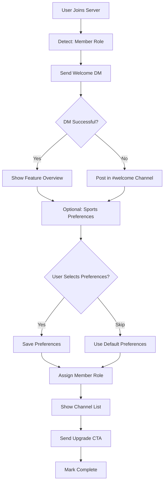
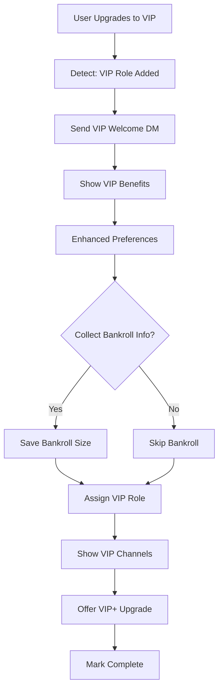
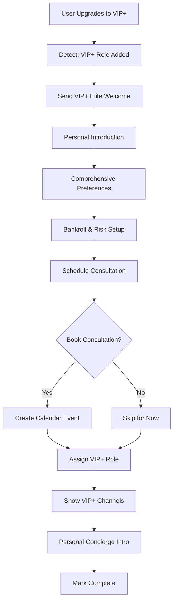
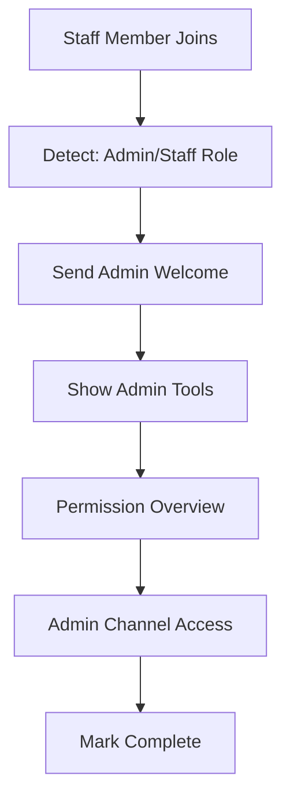
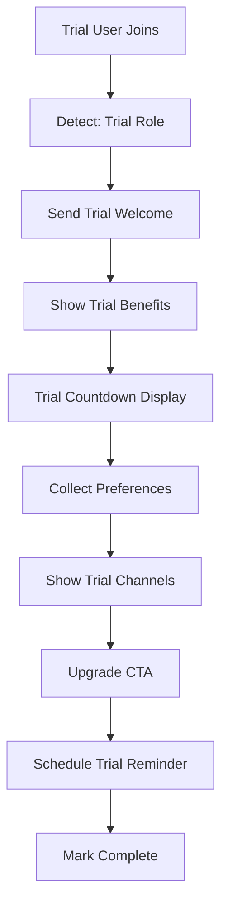

# User Onboarding Flow Specification v1.0

**Status**: Production-Ready
**Owner**: Product & Engineering
**Last Updated**: 2026-01-14
**Compliance**: Production Charter Required

---

## Executive Summary

This specification defines the complete user onboarding system for Unit Talk's Discord community. Onboarding is **automated, tier-based, and state-driven**, ensuring every user receives a personalized introduction based on their subscription level.

**Core Principles**:
- ✅ **Automated**: Zero manual intervention for standard flows
- ✅ **Gated by Tier**: Different experiences for Free, VIP, VIP+, Admin
- ✅ **State Machine Driven**: Clear progression with rollback capability
- ✅ **Audit Trail**: Complete onboarding history in database
- ✅ **Graceful Degradation**: Fallback for DM failures

---

## 1. Onboarding State Machine

### 1.1 State Diagram

```
[NEW USER JOINS]
        ↓
[Detect Tier] ← Role assignment detection
        ↓
[Select Flow] ← member | vip | vip_plus | admin
        ↓
[WELCOME] ← Send welcome message (DM preferred, channel fallback)
        ↓
[PREFERENCES] ← Collect user preferences (optional for members, enhanced for VIP+)
        ↓
[ROLE_ASSIGNMENT] ← Confirm role assignment
        ↓
[CHANNEL_TOUR] ← Show available channels
        ↓
[COMPLETION] ← Mark onboarding complete
        ↓
[ACTIVE_USER]
```

### 1.2 State Definitions

```typescript
enum OnboardingState {
  NOT_STARTED = 'not_started',
  WELCOME_SENT = 'welcome_sent',
  PREFERENCES_COLLECTED = 'preferences_collected',
  ROLE_ASSIGNED = 'role_assigned',
  CHANNEL_TOUR_SENT = 'channel_tour_sent',
  COMPLETED = 'completed',
  FAILED = 'failed',
  ABANDONED = 'abandoned',
}

interface OnboardingSession {
  id: string;
  user_id: string;
  discord_id: string;
  flow_type: 'member' | 'vip' | 'vip_plus' | 'admin';
  current_state: OnboardingState;
  started_at: Date;
  completed_at?: Date;
  abandoned_at?: Date;
  failed_at?: Date;
  last_interaction: Date;
  preferences?: UserPreferences;
  metadata: {
    dm_available: boolean;
    fallback_channel_used: boolean;
    skip_preferences: boolean;
    interaction_count: number;
  };
}
```

### 1.3 State Transitions

```typescript
// Valid state transitions
const STATE_TRANSITIONS = {
  NOT_STARTED: ['WELCOME_SENT', 'FAILED'],
  WELCOME_SENT: ['PREFERENCES_COLLECTED', 'ROLE_ASSIGNED', 'ABANDONED', 'FAILED'],
  PREFERENCES_COLLECTED: ['ROLE_ASSIGNED', 'FAILED'],
  ROLE_ASSIGNED: ['CHANNEL_TOUR_SENT', 'FAILED'],
  CHANNEL_TOUR_SENT: ['COMPLETED', 'FAILED'],
  COMPLETED: [], // Terminal state
  FAILED: ['NOT_STARTED'], // Allow retry
  ABANDONED: ['NOT_STARTED'], // Allow restart
};

// State timeout configuration
const STATE_TIMEOUTS = {
  WELCOME_SENT: 24 * 60 * 60 * 1000, // 24 hours
  PREFERENCES_COLLECTED: 12 * 60 * 60 * 1000, // 12 hours
  ROLE_ASSIGNED: 6 * 60 * 60 * 1000, // 6 hours
  CHANNEL_TOUR_SENT: 1 * 60 * 60 * 1000, // 1 hour
};
```

---

## 2. Tier-Based Onboarding Flows

### 2.1 Flow Selection Logic

```typescript
async function selectOnboardingFlow(member: GuildMember): Promise<OnboardingFlowType> {
  const tier = await getUserTier(member);

  switch (tier) {
    case 'owner':
    case 'admin':
    case 'staff':
      return 'admin'; // Minimal onboarding, focus on admin tools

    case 'vip_plus':
      return 'vip_plus'; // Premium experience with consultation booking

    case 'vip':
      return 'vip'; // Enhanced onboarding with VIP benefits

    case 'trial':
      return 'trial'; // Trial-specific flow with upgrade prompts

    case 'member':
    default:
      return 'member'; // Standard onboarding
  }
}
```

### 2.2 Member Flow (Free Tier)

**Target Audience**: Free community members
**Duration**: 3-5 minutes
**Interaction Mode**: DM preferred, channel fallback



**Step Details**:

**Step 1: Welcome Message**
```typescript
const welcomeEmbed = {
  title: '🎉 Welcome to Unit Talk!',
  description: `Hey ${member.displayName}! Welcome to the community.`,
  color: 0x00ae86,
  fields: [
    {
      name: '🎯 What You Get (Free)',
      value: '• Daily free picks\n• Community discussion\n• Educational content\n• Live game updates',
      inline: false,
    },
    {
      name: '🚀 Quick Setup (Optional)',
      value: 'Personalize your experience in 2 minutes',
      inline: false,
    },
  ],
  footer: { text: 'Unit Talk - Your Betting Edge' },
};

// Buttons
[
  { id: 'start', label: "Let's Go!", style: 'primary', action: 'continue' },
  { id: 'skip', label: 'Skip Setup', style: 'secondary', action: 'skip' },
]
```

**Step 2: Optional Preferences**
```typescript
const preferencesEmbed = {
  title: '📊 Personalize Your Experience',
  description: 'Help us tailor content to your interests (optional)',
  fields: [
    {
      name: 'Sports Interests',
      value: 'Select your favorite sports',
      inline: false,
    },
  ],
};

// Multi-select menu
const sportsMenu = {
  custom_id: 'select_sports',
  placeholder: 'Choose your sports...',
  min_values: 1,
  max_values: 5,
  options: [
    { label: 'NFL', value: 'nfl', emoji: '🏈' },
    { label: 'NBA', value: 'nba', emoji: '🏀' },
    { label: 'MLB', value: 'mlb', emoji: '⚾' },
    { label: 'NHL', value: 'nhl', emoji: '🏒' },
    { label: 'NCAA Football', value: 'ncaaf', emoji: '🎓' },
  ],
};
```

**Step 3: Channel Tour**
```typescript
const channelTourEmbed = {
  title: '📺 Your Channels',
  description: 'Here are the channels you have access to:',
  fields: [
    {
      name: '📢 Public Channels',
      value: '<#general> - Community chat\n<#free-picks> - Daily free picks\n<#education> - Learning resources',
      inline: false,
    },
    {
      name: '⭐ Want More?',
      value: 'Upgrade to VIP for premium picks and exclusive content!',
      inline: false,
    },
  ],
};

// Buttons
[
  { id: 'view_vip', label: '⭐ View VIP Benefits', style: 'primary', action: 'show_vip_info' },
  { id: 'finish', label: '✅ Finish Setup', style: 'secondary', action: 'complete' },
]
```

### 2.3 VIP Flow (Paid Tier)

**Target Audience**: VIP subscribers
**Duration**: 5-7 minutes
**Interaction Mode**: DM required, enhanced embeds



**Step Details**:

**Step 1: VIP Welcome**
```typescript
const vipWelcomeEmbed = {
  title: '🌟 Welcome to VIP, Champion!',
  description: 'Thank you for upgrading to VIP - you\'ve made an excellent investment!',
  color: 0xffd700, // Gold
  fields: [
    {
      name: '💎 Your VIP Benefits',
      value: '• Premium picks with analysis\n• VIP-only channels\n• Priority support\n• Advanced strategies\n• Early access to picks\n• Monthly performance reports',
      inline: false,
    },
    {
      name: '🎯 VIP Channels',
      value: '<#vip-picks> - Premium daily picks\n<#vip-general> - VIP discussions\n<#vip-analysis> - Game breakdowns\n<#vip-strategies> - Advanced techniques',
      inline: false,
    },
  ],
  thumbnail: { url: 'https://example.com/vip-badge.png' },
  footer: { text: 'Unit Talk VIP - Professional Betting Intelligence' },
};
```

**Step 2: Enhanced Preferences**
```typescript
const vipPreferencesEmbed = {
  title: '🎯 VIP Personalization',
  description: 'Let\'s optimize your VIP experience',
  fields: [
    {
      name: 'Bankroll Management',
      value: 'Set your betting unit size for proper bankroll tracking',
      inline: false,
    },
    {
      name: 'Risk Tolerance',
      value: 'Configure your preferred bet types and stake levels',
      inline: false,
    },
    {
      name: 'Notification Timing',
      value: 'When do you want to receive picks?',
      inline: false,
    },
  ],
};

// Enhanced preference collection
const preferenceModal = {
  custom_id: 'vip_preferences_modal',
  title: 'VIP Preferences',
  components: [
    {
      type: 'text_input',
      custom_id: 'bankroll_size',
      label: 'Bankroll Size (optional)',
      style: 'short',
      placeholder: 'e.g., 1000',
      required: false,
    },
    {
      type: 'select_menu',
      custom_id: 'risk_level',
      label: 'Risk Tolerance',
      options: [
        { label: 'Conservative', value: 'conservative' },
        { label: 'Moderate', value: 'moderate' },
        { label: 'Aggressive', value: 'aggressive' },
      ],
    },
  ],
};
```

### 2.4 VIP+ Flow (Premium Tier)

**Target Audience**: VIP+ Elite subscribers
**Duration**: 7-10 minutes
**Interaction Mode**: DM required, white-glove experience



**Step Details**:

**Step 1: Elite Welcome**
```typescript
const vipPlusWelcomeEmbed = {
  title: '💎 Welcome to VIP+ Elite!',
  description: 'You\'ve joined the highest tier of Unit Talk - welcome to the elite circle!',
  color: 0xe74c3c, // Red
  fields: [
    {
      name: '🏆 Your VIP+ Elite Benefits',
      value: '• Exclusive high-confidence picks\n• Personal consultation sessions\n• Custom analysis for your bets\n• Live chat during games\n• Advanced tracking tools\n• Monthly strategy calls\n• First access to everything',
      inline: false,
    },
    {
      name: '💎 VIP+ Exclusive Channels',
      value: '<#vip-plus-picks> - Our absolute best plays\n<#vip-plus-elite> - Elite discussions\n<#vip-plus-support> - Direct expert access\n<#vip-plus-analytics> - Advanced data',
      inline: false,
    },
    {
      name: '📞 Personal Consultation',
      value: 'Schedule a one-on-one strategy session with our head analyst',
      inline: false,
    },
  ],
  thumbnail: { url: 'https://example.com/vip-plus-badge.png' },
  image: { url: 'https://example.com/elite-banner.png' },
  footer: { text: 'Unit Talk VIP+ - Elite Professional Betting' },
};

// Buttons
[
  { id: 'elite_setup', label: '💎 Elite Setup', style: 'primary', action: 'continue' },
  { id: 'schedule_consultation', label: '📞 Schedule Call', style: 'success', action: 'schedule_call' },
]
```

**Step 2: Consultation Booking**
```typescript
const consultationEmbed = {
  title: '📞 Schedule Your Personal Consultation',
  description: 'Book a 30-minute strategy session with our head analyst',
  fields: [
    {
      name: 'What We\'ll Cover',
      value: '• Your betting history and goals\n• Bankroll optimization\n• Advanced strategies\n• Personalized recommendations\n• Q&A session',
      inline: false,
    },
    {
      name: 'Available Times',
      value: 'Select a time that works for you',
      inline: false,
    },
  ],
};

// Calendar integration
const calendarButton = {
  style: 'link',
  label: 'View Available Times',
  url: 'https://calendly.com/unit-talk/vip-plus-consultation',
};
```

### 2.5 Admin Flow (Staff/Admin/Owner)

**Target Audience**: Staff, moderators, admins
**Duration**: 2-3 minutes
**Interaction Mode**: DM, minimal interaction



**Step Details**:

```typescript
const adminWelcomeEmbed = {
  title: '🛡️ Welcome, Team Member!',
  description: `Welcome to the Unit Talk staff, ${member.displayName}!`,
  color: 0x9b59b6, // Purple
  fields: [
    {
      name: '👑 Your Access Level',
      value: tier === 'admin' ? 'Full Admin Access' : tier === 'staff' ? 'Staff Access' : 'Owner Access',
      inline: true,
    },
    {
      name: '🔧 Admin Tools',
      value: '• User management\n• Content moderation\n• System configuration\n• Analytics dashboard',
      inline: false,
    },
    {
      name: '📊 Admin Channels',
      value: '<#admin> - Admin discussions\n<#moderation> - Moderation queue\n<#system-alerts> - System notifications',
      inline: false,
    },
  ],
  footer: { text: 'Unit Talk Admin Panel' },
};
```

### 2.6 Trial Flow

**Target Audience**: Trial users (7-day free trial)
**Duration**: 3-4 minutes
**Interaction Mode**: DM preferred, upgrade prompts



**Step Details**:

```typescript
const trialWelcomeEmbed = {
  title: '🆓 Welcome to Your 7-Day Trial!',
  description: 'Experience VIP benefits free for 7 days!',
  color: 0x17a2b8, // Cyan
  fields: [
    {
      name: '🎁 Trial Benefits',
      value: '• Full VIP access for 7 days\n• Premium picks and analysis\n• VIP channels access\n• Advanced features',
      inline: false,
    },
    {
      name: '⏰ Trial Period',
      value: `Your trial ends on ${trialEndDate}`,
      inline: true,
    },
    {
      name: '⬆️ Upgrade Anytime',
      value: 'Keep your VIP access after trial ends',
      inline: true,
    },
  ],
  footer: { text: `Trial expires in 7 days - ${trialEndDate}` },
};

// Schedule trial reminders
const TRIAL_REMINDERS = [
  { day: 3, message: '4 days left in your trial!' },
  { day: 6, message: '1 day left - upgrade to keep VIP access!' },
  { day: 7, message: 'Your trial has ended - upgrade to continue!' },
];
```

---

## 3. Database Schema

### 3.1 Onboarding Sessions Table

```sql
CREATE TABLE onboarding_sessions (
  id UUID PRIMARY KEY DEFAULT gen_random_uuid(),
  user_id UUID NOT NULL REFERENCES users(id),
  discord_id TEXT NOT NULL,
  discord_username TEXT,
  flow_type TEXT NOT NULL CHECK (flow_type IN ('member', 'vip', 'vip_plus', 'trial', 'admin')),
  current_state TEXT NOT NULL CHECK (current_state IN (
    'not_started', 'welcome_sent', 'preferences_collected',
    'role_assigned', 'channel_tour_sent', 'completed', 'failed', 'abandoned'
  )),
  started_at TIMESTAMPTZ NOT NULL DEFAULT NOW(),
  completed_at TIMESTAMPTZ,
  abandoned_at TIMESTAMPTZ,
  failed_at TIMESTAMPTZ,
  last_interaction TIMESTAMPTZ NOT NULL DEFAULT NOW(),

  -- Preferences
  preferences JSONB,

  -- Metadata
  metadata JSONB NOT NULL DEFAULT '{}',

  -- Tracking
  dm_available BOOLEAN DEFAULT true,
  fallback_channel_used BOOLEAN DEFAULT false,
  skip_preferences BOOLEAN DEFAULT false,
  interaction_count INTEGER DEFAULT 0,

  -- Audit
  created_at TIMESTAMPTZ NOT NULL DEFAULT NOW(),
  updated_at TIMESTAMPTZ NOT NULL DEFAULT NOW()
);

-- Indexes
CREATE INDEX idx_onboarding_sessions_discord_id ON onboarding_sessions(discord_id);
CREATE INDEX idx_onboarding_sessions_user_id ON onboarding_sessions(user_id);
CREATE INDEX idx_onboarding_sessions_state ON onboarding_sessions(current_state) WHERE current_state != 'completed';
CREATE INDEX idx_onboarding_sessions_flow_type ON onboarding_sessions(flow_type);
CREATE INDEX idx_onboarding_sessions_last_interaction ON onboarding_sessions(last_interaction) WHERE current_state NOT IN ('completed', 'abandoned');
```

### 3.2 Onboarding Events Table

```sql
CREATE TABLE onboarding_events (
  id UUID PRIMARY KEY DEFAULT gen_random_uuid(),
  session_id UUID NOT NULL REFERENCES onboarding_sessions(id),
  event_type TEXT NOT NULL,
  previous_state TEXT,
  new_state TEXT,
  interaction_type TEXT, -- 'button_click', 'select_menu', 'modal_submit', 'timeout', 'error'
  interaction_data JSONB,
  error_message TEXT,
  created_at TIMESTAMPTZ NOT NULL DEFAULT NOW()
);

-- Indexes
CREATE INDEX idx_onboarding_events_session_id ON onboarding_events(session_id);
CREATE INDEX idx_onboarding_events_created_at ON onboarding_events(created_at DESC);
```

### 3.3 User Preferences Table

```sql
CREATE TABLE user_preferences (
  id UUID PRIMARY KEY DEFAULT gen_random_uuid(),
  user_id UUID NOT NULL REFERENCES users(id) UNIQUE,
  discord_id TEXT NOT NULL,

  -- Sports preferences
  favorite_sports TEXT[] DEFAULT '{}',
  notification_level TEXT DEFAULT 'all_picks', -- 'all_picks', 'high_confidence', 'vip_plus_only', 'minimal'

  -- Betting preferences
  experience_level TEXT, -- 'beginner', 'intermediate', 'advanced', 'professional'
  betting_style TEXT, -- 'conservative', 'moderate', 'aggressive', 'high_volume', 'selective'
  bankroll_size DECIMAL(10, 2),
  default_unit_size DECIMAL(10, 2),

  -- Notification preferences
  dm_enabled BOOLEAN DEFAULT true,
  channel_mentions_enabled BOOLEAN DEFAULT true,
  notification_timezone TEXT DEFAULT 'America/New_York',
  quiet_hours_start TIME,
  quiet_hours_end TIME,

  -- Metadata
  created_at TIMESTAMPTZ NOT NULL DEFAULT NOW(),
  updated_at TIMESTAMPTZ NOT NULL DEFAULT NOW()
);

-- Indexes
CREATE INDEX idx_user_preferences_user_id ON user_preferences(user_id);
CREATE INDEX idx_user_preferences_discord_id ON user_preferences(discord_id);
```

---

## 4. Failure Handling & Graceful Degradation

### 4.1 DM Failure Fallback

When DM delivery fails (user has DMs disabled):

```typescript
async function sendOnboardingMessage(
  member: GuildMember,
  embed: EmbedBuilder,
  components: ActionRowBuilder[]
): Promise<void> {
  try {
    // Attempt DM first
    await member.send({ embeds: [embed], components });

    logger.info('Onboarding message sent via DM', {
      userId: member.id,
      username: member.user.tag,
    });

    // Update session: DM successful
    await updateOnboardingSession(member.id, {
      metadata: { dm_available: true },
    });

  } catch (dmError) {
    // DM failed - fallback to welcome channel
    logger.warn('DM delivery failed, using channel fallback', {
      userId: member.id,
      error: dmError.message,
    });

    const welcomeChannel = await getWelcomeChannel(member.guild);
    if (welcomeChannel) {
      const fallbackEmbed = new EmbedBuilder(embed.data)
        .setDescription(
          `${member} - ${embed.data.description}\n\n*Note: I couldn't DM you! Please enable DMs from server members.*`
        );

      await welcomeChannel.send({
        content: `${member}`,
        embeds: [fallbackEmbed],
        components,
      });

      // Update session: channel fallback used
      await updateOnboardingSession(member.id, {
        metadata: { dm_available: false, fallback_channel_used: true },
      });
    } else {
      throw new Error('No fallback channel available');
    }
  }
}
```

### 4.2 Timeout & Abandonment Detection

```typescript
// Cron job: check for abandoned onboarding sessions
async function detectAbandonedSessions() {
  const abandonmentThresholds = {
    WELCOME_SENT: 24 * 60 * 60 * 1000, // 24 hours
    PREFERENCES_COLLECTED: 12 * 60 * 60 * 1000, // 12 hours
    ROLE_ASSIGNED: 6 * 60 * 60 * 1000, // 6 hours
    CHANNEL_TOUR_SENT: 1 * 60 * 60 * 1000, // 1 hour
  };

  for (const [state, timeout] of Object.entries(abandonmentThresholds)) {
    const abandonedSessions = await supabase
      .from('onboarding_sessions')
      .select('*')
      .eq('current_state', state)
      .lt('last_interaction', new Date(Date.now() - timeout).toISOString());

    for (const session of abandonedSessions.data || []) {
      // Mark as abandoned
      await supabase
        .from('onboarding_sessions')
        .update({
          current_state: 'abandoned',
          abandoned_at: new Date().toISOString(),
        })
        .eq('id', session.id);

      // Send re-engagement message
      await sendReEngagementMessage(session);

      logger.info('Onboarding session marked as abandoned', {
        sessionId: session.id,
        userId: session.user_id,
        state: session.current_state,
        lastInteraction: session.last_interaction,
      });
    }
  }
}
```

### 4.3 Error Recovery

```typescript
// Retry failed onboarding steps
async function retryFailedOnboarding(sessionId: string): Promise<void> {
  const session = await getOnboardingSession(sessionId);

  if (!session || session.current_state !== 'failed') {
    throw new Error('Session not eligible for retry');
  }

  // Reset to previous state
  const previousState = await getPreviousState(session.id);

  await supabase
    .from('onboarding_sessions')
    .update({
      current_state: previousState || 'not_started',
      failed_at: null,
    })
    .eq('id', sessionId);

  // Retry the flow
  await continueOnboardingFlow(session);
}
```

---

## 5. Analytics & Monitoring

### 5.1 Key Metrics

```typescript
// Onboarding completion rates by tier
SELECT
  flow_type,
  COUNT(*) FILTER (WHERE current_state = 'completed') AS completed,
  COUNT(*) FILTER (WHERE current_state = 'abandoned') AS abandoned,
  COUNT(*) FILTER (WHERE current_state = 'failed') AS failed,
  COUNT(*) AS total,
  ROUND(100.0 * COUNT(*) FILTER (WHERE current_state = 'completed') / COUNT(*), 2) AS completion_rate
FROM onboarding_sessions
WHERE started_at > NOW() - INTERVAL '30 days'
GROUP BY flow_type;

// Average time to completion
SELECT
  flow_type,
  AVG(EXTRACT(EPOCH FROM (completed_at - started_at)) / 60) AS avg_minutes_to_complete
FROM onboarding_sessions
WHERE current_state = 'completed'
  AND completed_at > NOW() - INTERVAL '30 days'
GROUP BY flow_type;

// Drop-off points
SELECT
  current_state,
  flow_type,
  COUNT(*) AS drop_off_count
FROM onboarding_sessions
WHERE current_state NOT IN ('completed', 'abandoned', 'failed')
  AND last_interaction < NOW() - INTERVAL '24 hours'
GROUP BY current_state, flow_type
ORDER BY drop_off_count DESC;

// DM availability rate
SELECT
  flow_type,
  COUNT(*) FILTER (WHERE (metadata->>'dm_available')::boolean = true) AS dm_successful,
  COUNT(*) FILTER (WHERE (metadata->>'fallback_channel_used')::boolean = true) AS channel_fallback,
  COUNT(*) AS total
FROM onboarding_sessions
WHERE started_at > NOW() - INTERVAL '30 days'
GROUP BY flow_type;
```

### 5.2 Prometheus Metrics

```typescript
// Onboarding starts
onboarding_started_total{flow_type}

// Onboarding completions
onboarding_completed_total{flow_type}

// Onboarding failures
onboarding_failed_total{flow_type, failure_reason}

// Onboarding abandonment
onboarding_abandoned_total{flow_type, last_state}

// Onboarding duration
onboarding_duration_seconds{flow_type, state}

// DM delivery rate
onboarding_dm_delivery_rate{flow_type}

// Preference collection rate
onboarding_preferences_collected_rate{flow_type}
```

---

## 6. Admin Tools

### 6.1 Manual Onboarding Restart

```typescript
// Admin command: /onboarding-restart @user
async function restartOnboarding(member: GuildMember, admin: GuildMember): Promise<void> {
  // Check admin permissions
  if (!hasAdminPermission(admin)) {
    throw new Error('Insufficient permissions');
  }

  // Get existing session
  const existingSession = await getActiveOnboardingSession(member.id);

  if (existingSession) {
    // Mark existing session as abandoned
    await supabase
      .from('onboarding_sessions')
      .update({
        current_state: 'abandoned',
        abandoned_at: new Date().toISOString(),
      })
      .eq('id', existingSession.id);
  }

  // Start new session
  await startOnboardingFlow(member);

  logger.info('Onboarding manually restarted by admin', {
    userId: member.id,
    adminId: admin.id,
    previousSession: existingSession?.id,
  });
}
```

### 6.2 Onboarding Dashboard

```typescript
// Admin dashboard endpoint
app.get('/api/admin/onboarding/dashboard', async (req, res) => {
  const stats = {
    // Active sessions
    activeSessions: await getActiveSessionsCount(),

    // Completion rates (30 days)
    completionRates: await getCompletionRatesByTier(),

    // Average time to complete
    avgCompletionTime: await getAverageCompletionTime(),

    // Current drop-offs
    dropOffPoints: await getDropOffAnalysis(),

    // DM delivery success rate
    dmDeliveryRate: await getDMDeliveryRate(),
  };

  res.json(stats);
});
```

---

## 7. Implementation Checklist

### 7.1 Required Components

- [x] `onboarding_sessions` table with state tracking
- [x] `onboarding_events` table for audit trail
- [x] `user_preferences` table for preference storage
- [x] `OnboardingModalHandler` for modal submissions
- [x] `onboardingConfig.ts` for flow definitions
- [x] `roleUtils.ts` for tier detection
- [ ] Automated onboarding trigger on member join
- [ ] DM fallback to welcome channel
- [ ] Timeout detection cron job
- [ ] Re-engagement message system
- [ ] Admin onboarding restart command
- [ ] Onboarding analytics dashboard

### 7.2 Testing Requirements

- [ ] Unit tests for state transitions
- [ ] Integration tests for full flows (member, VIP, VIP+)
- [ ] DM failure fallback testing
- [ ] Timeout and abandonment detection
- [ ] Load testing with 100+ simultaneous onboardings
- [ ] A/B testing for embed variants

---

## 8. Future Enhancements

### 8.1 Personalized Content

```typescript
// ML-based flow optimization
// Predict optimal onboarding flow based on user behavior
const predictedFlow = await mlModel.predict({
  previousBehavior: userHistory,
  referralSource: referralData,
  timeOfDay: new Date().getHours(),
});

// Adapt flow in real-time
if (predictedFlow.skipPreferences) {
  session.metadata.skip_preferences = true;
}
```

### 8.2 Video Tutorials

```typescript
// Embed video tutorials in onboarding
const tutorialEmbed = {
  title: '📹 Quick Start Video',
  description: 'Watch our 2-minute getting started guide',
  video: {
    url: 'https://youtube.com/watch?v=tutorial-video-id',
  },
};
```

### 8.3 Gamification

```typescript
// Award badge for completing onboarding
await awardBadge(member.id, 'onboarding_complete');

// XP for each onboarding step
await addXP(member.id, 50, 'onboarding_completion');
```

---

## Appendix A: File Locations

**Core Onboarding**:
- `apps/discord-bot/src/handlers/onboardingModalHandler.ts` - Modal handling
- `apps/discord-bot/src/config/onboardingConfig.ts` - Flow definitions
- `apps/discord-bot/src/services/onboardingService.ts` - Service layer
- `apps/discord-bot/src/handlers/onboardingButtonHandler.ts` - Button interactions
- `apps/discord-bot/src/utils/roleUtils.ts` - Tier detection
- `apps/discord-bot/src/services/welcomeService.ts` - Welcome messages

**Database Migrations**:
- `supabase/migrations/onboarding_tables.sql` - Onboarding schema

---

## Appendix B: Example Interactions

### B.1 Member Onboarding (Successful)

```
[User joins server]
→ Bot detects new member
→ Send welcome DM

User: [Clicks "Let's Go!" button]
→ Show sports preferences

User: [Selects NFL, NBA]
→ Save preferences
→ Show channel tour

User: [Clicks "Finish Setup"]
→ Mark onboarding complete
→ Send completion confirmation

Total time: 2 minutes 15 seconds
```

### B.2 VIP Onboarding (DM Failure)

```
[User upgrades to VIP]
→ Bot detects VIP role added
→ Attempt to send VIP welcome DM
→ DM fails (user has DMs disabled)

→ Fallback: Post in #welcome channel
→ "@user - Welcome to VIP! Please enable DMs to receive your full onboarding experience."

User: [Enables DMs, clicks "Continue"]
→ Send remaining onboarding via DM
→ Enhanced preferences collection
→ VIP channel tour
→ Mark complete

Total time: 5 minutes 30 seconds (with DM delay)
```

---

## Document History

| Version | Date | Author | Changes |
|---------|------|--------|---------|
| 1.0 | 2026-01-14 | Product & Engineering | Initial specification |

---

**End of Document**
