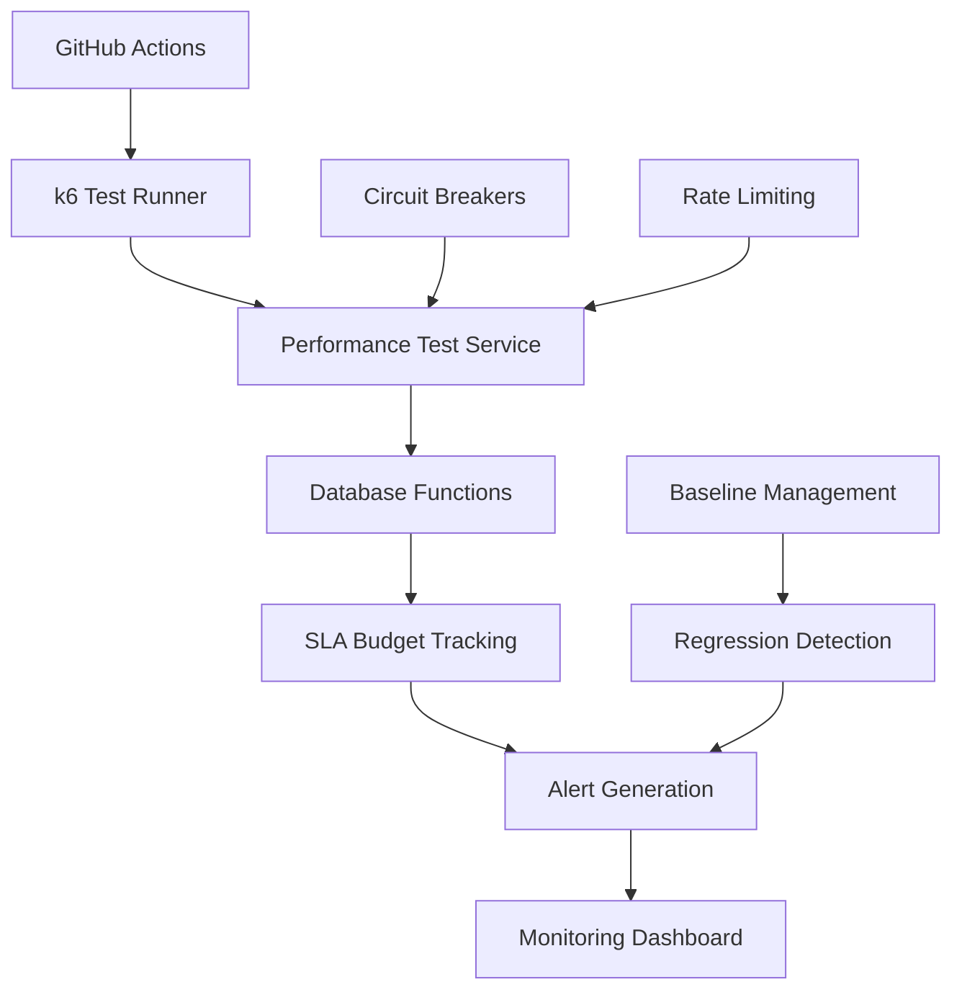

# Performance Testing & SLA Enforcement

Comprehensive performance testing infrastructure with k6/artillery integration, SLA monitoring, and automated budget enforcement.

## Overview

The performance testing system provides:

- **Automated Load Testing**: k6-based performance tests with multiple strategies
- **SLA Enforcement**: Configurable service level agreements with burn-rate monitoring
- **Error Budget Management**: Monthly error budgets with automatic consumption tracking
- **Performance Baselines**: Historical performance benchmarks with regression detection
- **Real-time Monitoring**: Live performance metrics and alerting
- **CI/CD Integration**: Automated testing in GitHub Actions workflows

## Architecture



## Quick Start

### 1. Run Performance Tests

```bash
# Run smoke test
npm run perf:smoke

# Run load test
npm run perf:load -- --users 50 --duration 5m

# Run complete test suite
npm run perf:suite -- --environment staging

# Run stress test
npm run perf:stress -- --users 100 --duration 3m
```

### 2. Manual k6 Execution

```bash
# Basic load test
k6 run \
  --env BASE_URL=http://localhost:3000 \
  --env TEST_TYPE=load \
  --env VIRTUAL_USERS=50 \
  --env DURATION=5m \
  scripts/performance/k6-test-runner.js

# With SLA thresholds
k6 run \
  --env SLA_RESPONSE_TIME=1000 \
  --env SLA_ERROR_RATE=2.0 \
  --env SLA_THROUGHPUT=10.0 \
  scripts/performance/k6-test-runner.js
```

### 3. Using Performance Test Service

```typescript
import { PerformanceTestService } from './src/services/PerformanceTestService';

const service = new PerformanceTestService();

// Execute single test
const result = await service.executeTest({
  testName: 'api_load_test',
  testType: 'load',
  testSuite: 'api',
  targetEndpoint: 'http://localhost:3000',
  virtualUsers: 50,
  duration: '5m',
  environment: 'staging',
  slaThresholds: {
    maxResponseTimeMs: 1000,
    maxErrorRatePercent: 2.0,
    minThroughputRps: 10.0
  }
});

console.log('SLA Compliance:', result.slaCompliance.overall);

// Execute test suite
const results = await service.executeTestSuite(
  'api_suite',
  'staging',
  'api',
  'http://localhost:3000'
);
```

## Test Types

### Smoke Tests
- **Purpose**: Basic functionality validation
- **Users**: 1
- **Duration**: 30s
- **Use Case**: CI/CD pipeline validation, basic health checks

### Load Tests
- **Purpose**: Normal expected traffic simulation
- **Users**: 10-100
- **Duration**: 5-10m
- **Use Case**: Regular capacity validation, SLA compliance

### Stress Tests
- **Purpose**: Above-normal capacity testing
- **Users**: 100-500
- **Duration**: 2-5m
- **Use Case**: Breaking point identification, resource limits

### Spike Tests
- **Purpose**: Sudden traffic surge simulation
- **Users**: 10x normal for short bursts
- **Duration**: 1-3m
- **Use Case**: Black Friday scenarios, viral content handling

### Endurance Tests
- **Purpose**: Extended load over time
- **Users**: Normal capacity
- **Duration**: 30m-4h
- **Use Case**: Memory leak detection, long-term stability

## SLA Configuration

### Service Level Agreements

SLA budgets are defined per service and environment:

```sql
INSERT INTO sla_budgets (
  service_name, endpoint_pattern, environment,
  availability_percent, max_response_time_p95_ms, max_response_time_p99_ms,
  max_error_rate_percent, min_throughput_rps, error_budget_percent
) VALUES (
  'api', '/api/**', 'production',
  99.9, 500, 2000, 0.5, 100.0, 0.1
);
```

### SLA Thresholds

| Service | Environment | P95 Response Time | Error Rate | Throughput | Availability |
|---------|-------------|-------------------|------------|------------|--------------|
| API | Production | 500ms | 0.5% | 100 RPS | 99.9% |
| API | Staging | 1000ms | 2.0% | 50 RPS | 99.0% |
| Dashboard | Production | 2000ms | 1.0% | 20 RPS | 99.5% |
| Discord Bot | Production | 3000ms | 2.0% | 10 RPS | 99.0% |

### Error Budget Management

Error budgets are calculated monthly and consumed based on SLA violations:

- **Fast Burn Rate**: Consume budget in 2 hours (14.4x normal)
- **Slow Burn Rate**: Consume budget over 30 days (1.0x normal)
- **Critical Alerts**: When budget consumed >90%
- **High Alerts**: When burn rate exceeds thresholds

## GitHub Actions Integration

### Automated Testing

Performance tests run automatically:

- **Daily**: Complete test suite on staging
- **PR**: Smoke tests for changed services
- **Manual**: Configurable test execution

### Workflow Configuration

```yaml
# .github/workflows/performance-testing.yml
name: Performance Testing & SLA Enforcement

on:
  schedule:
    - cron: '0 2 * * *'  # Daily at 2 AM UTC
  workflow_dispatch:
    inputs:
      test_type:
        type: choice
        options: [smoke, load, stress, spike, endurance, suite]
      environment:
        type: choice
        options: [staging, production]
```

### Environment Setup

Required secrets:
- `STAGING_API_URL`
- `PRODUCTION_API_URL`
- `STAGING_DASHBOARD_URL`
- `PRODUCTION_DASHBOARD_URL`
- `SUPABASE_URL`
- `SUPABASE_SERVICE_ROLE_KEY`

## Monitoring & Alerting

### Performance Dashboards

Access real-time performance data:

```sql
-- Current SLA status
SELECT * FROM sla_budget_status 
WHERE environment = 'production'
ORDER BY error_budget_remaining_percent ASC;

-- Recent test results
SELECT * FROM performance_test_summary
WHERE environment = 'production' 
  AND started_at > NOW() - INTERVAL '24 hours'
ORDER BY started_at DESC;

-- Active alerts
SELECT * FROM performance_alerts
WHERE status = 'open'
  AND environment = 'production'
ORDER BY severity, created_at DESC;
```

### Metrics Collection

Performance metrics are collected at multiple levels:

1. **HTTP Metrics**: Request duration, status codes, throughput
2. **Resource Metrics**: CPU, memory, disk I/O utilization
3. **Business Metrics**: User actions, conversion rates
4. **Error Metrics**: Error types, failure patterns

### Alerting Rules

Alerts are generated for:

- **SLA Violations**: Response time, error rate, throughput breaches
- **Budget Burn Rate**: Fast/slow burn rate thresholds exceeded
- **Performance Regression**: Significant degradation vs baseline
- **Anomaly Detection**: Unusual patterns in metrics

## Performance Baselines

### Baseline Management

Baselines are established from successful test runs:

```typescript
// Create baseline from recent successful tests
const baseline = await supabase
  .from('performance_baselines')
  .insert({
    service_name: 'api',
    endpoint_pattern: '/api/picks/**',
    test_type: 'load',
    environment: 'production',
    baseline_p95_ms: 450.0,
    baseline_throughput_rps: 85.0,
    sample_size: 50,
    created_from_tests_count: 10
  });
```

### Regression Detection

Automatic regression detection compares current performance against baselines:

- **Response Time**: >20% increase triggers alert
- **Throughput**: >15% decrease triggers alert
- **Error Rate**: >50% increase triggers alert

## API Reference

### Performance Test Service

```typescript
interface PerformanceTestConfig {
  testName: string;
  testType: 'load' | 'stress' | 'spike' | 'volume' | 'endurance' | 'smoke';
  testSuite: string;
  targetEndpoint: string;
  virtualUsers: number;
  duration: string;
  environment: string;
  slaThresholds?: {
    maxResponseTimeMs: number;
    maxErrorRatePercent: number;
    minThroughputRps: number;
  };
}

interface PerformanceTestResult {
  testId: string;
  success: boolean;
  slaCompliance: {
    responseTime: boolean;
    errorRate: boolean;
    throughput: boolean;
    overall: boolean;
  };
  metrics: {
    totalRequests: number;
    avgResponseTimeMs: number;
    p95ResponseTimeMs: number;
    requestsPerSecond: number;
    errorRatePercent: number;
  };
  violations: Array<{
    type: string;
    threshold: number;
    actual: number;
    metric: string;
  }>;
}

class PerformanceTestService {
  async executeTest(config: PerformanceTestConfig): Promise<PerformanceTestResult>
  async executeTestSuite(baseName: string, environment: string, testSuite: string, targetEndpoint: string): Promise<PerformanceTestResult[]>
  async getTestStatus(testId: string): Promise<any>
  async getSLABudgetStatus(serviceName?: string, environment?: string): Promise<any[]>
  async getTestHistory(limit: number, environment?: string, testSuite?: string): Promise<any[]>
  async cancelTest(testId: string): Promise<boolean>
}
```

### Database Functions

```sql
-- Start performance test
SELECT start_performance_test(
  'test_name',
  'load',
  'api',
  'http://localhost:3000/api/health',
  10,  -- virtual users
  60,  -- duration seconds
  'staging'
);

-- Record metric
SELECT record_performance_metric(
  test_id,
  'response_time_ms',
  'histogram',
  250.5,
  'ms',
  '{"endpoint": "/api/health"}'::jsonb
);

-- Complete test
SELECT complete_performance_test(
  test_id,
  1000,  -- total requests
  950,   -- successful
  50,    -- failed
  245.2, -- avg response time
  350.0, -- p95 response time
  450.0, -- p99 response time
  500.0, -- max response time
  16.7   -- requests per second
);

-- Update error budget
SELECT update_error_budget(
  'api',
  'production',
  2.5,   -- error minutes
  60.0   -- total minutes
);
```

## Best Practices

### Test Design

1. **Realistic Scenarios**: Model actual user behavior patterns
2. **Gradual Ramp-up**: Avoid sudden load spikes unless testing spike scenarios
3. **Think Time**: Include realistic delays between requests
4. **Data Variation**: Use dynamic test data to avoid caching effects
5. **Environment Parity**: Ensure test environments match production characteristics

### SLA Management

1. **Achievable Targets**: Set realistic SLA thresholds based on user needs
2. **Budget Allocation**: Size error budgets appropriately for service criticality
3. **Regular Review**: Adjust SLA thresholds based on system improvements
4. **Alert Tuning**: Minimize false positives while catching real issues
5. **Business Alignment**: Align technical SLAs with business requirements

### Monitoring Strategy

1. **Comprehensive Metrics**: Collect both technical and business metrics
2. **Real-time Alerting**: Immediate notification of SLA violations
3. **Trend Analysis**: Track performance trends over time
4. **Capacity Planning**: Use performance data for infrastructure decisions
5. **Incident Response**: Clear escalation paths for performance issues

## Troubleshooting

### Common Issues

**k6 Installation Problems**:
```bash
# Ubuntu/Debian
sudo apt-get update
sudo apt-get install k6

# macOS
brew install k6

# Verify installation
k6 version
```

**Database Connection Issues**:
```bash
# Check environment variables
echo $SUPABASE_URL
echo $SUPABASE_SERVICE_ROLE_KEY

# Test database connection
npm run db:status
```

**Test Execution Failures**:
```bash
# Check target endpoint health
curl -I http://localhost:3000/api/health

# Run with debug output
k6 run --verbose scripts/performance/k6-test-runner.js
```

### Performance Debugging

1. **Response Time Issues**:
   - Check database query performance
   - Analyze network latency
   - Review application resource usage
   - Examine third-party service dependencies

2. **Throughput Problems**:
   - Verify connection pool sizing
   - Check rate limiting configuration
   - Analyze resource bottlenecks
   - Review load balancer configuration

3. **Error Rate Spikes**:
   - Examine application logs for error patterns
   - Check database connection issues
   - Review timeout configurations
   - Analyze dependency failures

### Support

For issues or questions:

1. Check existing GitHub Issues
2. Review performance test logs in CI/CD artifacts
3. Examine database metrics and alerts
4. Contact the platform team with performance test IDs

## Configuration Examples

### Custom Test Configuration

```javascript
// scripts/performance/custom-test.js
export let options = {
  scenarios: {
    custom_load: {
      executor: 'ramping-vus',
      startVUs: 5,
      stages: [
        { duration: '2m', target: 25 },
        { duration: '5m', target: 25 },
        { duration: '2m', target: 50 },
        { duration: '3m', target: 50 },
        { duration: '2m', target: 0 }
      ]
    }
  },
  thresholds: {
    'http_req_duration': ['p(95)<2000'],
    'http_req_failed': ['rate<0.05']
  }
};
```

### Environment-Specific SLA Budgets

```sql
-- Production: Strict SLAs
INSERT INTO sla_budgets VALUES (
  'api', '/api/**', 'production',
  99.95, 300, 1000, 0.1, 200.0, 0.05
);

-- Staging: Relaxed SLAs
INSERT INTO sla_budgets VALUES (
  'api', '/api/**', 'staging', 
  99.0, 1000, 5000, 2.0, 50.0, 1.0
);
```