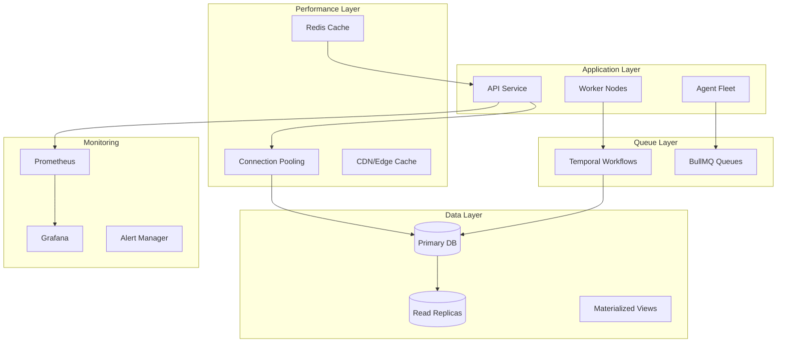

# Phase 5: Optimization & Scaling Plan

## Executive Summary

Phase 5 transforms Unit Talk from a stable platform to an elite SaaS-grade scalable system by implementing comprehensive performance optimization, caching, async workflows, and horizontal scaling capabilities.

## Goals

1. **Performance**: Achieve ≥20% latency improvement across all operations
2. **Scalability**: 2x ingestion throughput without database bottlenecks
3. **Reliability**: Auto-scaling triggers for seamless growth
4. **Observability**: Real-time metrics dashboard with anomaly detection
5. **Efficiency**: Optimize costs while maintaining SLO compliance

## Architecture Overview



## Implementation Phases

### 1. Performance Baseline (Week 1)

#### Metrics Collection Infrastructure
- Deploy Prometheus + Grafana stack
- Instrument all services with metrics
- Create baseline dashboard tracking:
  - p95/p99 latencies per endpoint
  - Database query performance
  - Queue depths and processing rates
  - Agent execution times
  - Resource utilization (CPU, memory, connections)

#### SLO Monitoring Enhancement
- Extend `verify-slo.ts` with real-time metrics
- Add custom Prometheus exporters
- Create alert rules for SLO violations
- Implement performance regression detection

### 2. Caching & Query Optimization (Week 2)

#### Redis Cache Layer
```typescript
// Cache strategy implementation
interface CacheStrategy {
  playerMetadata: { ttl: 3600, pattern: 'player:*' };
  teamMetadata: { ttl: 7200, pattern: 'team:*' };
  oddsLines: { ttl: 300, pattern: 'odds:*' };
  gameSchedules: { ttl: 1800, pattern: 'schedule:*' };
  userProfiles: { ttl: 600, pattern: 'user:*' };
}
```

#### Query Optimization
- Identify top 10 slowest queries via pg_stat_statements
- Create covering indexes for hot paths
- Implement query result caching
- Add database connection pooling with PgBouncer

#### Materialized View Strategy
```sql
-- High-performance MV for real-time dashboards
CREATE MATERIALIZED VIEW mv_perf_dashboard AS
WITH recent_picks AS (
  SELECT * FROM unified_picks 
  WHERE created_at > NOW() - INTERVAL '24 hours'
)
SELECT 
  sport,
  COUNT(*) as pick_count,
  AVG(CASE WHEN status = 'won' THEN 1 ELSE 0 END) as win_rate
FROM recent_picks
GROUP BY sport
WITH NO DATA;

-- Refresh strategy: Incremental updates every 5 minutes
CREATE INDEX idx_mv_perf_dashboard ON mv_perf_dashboard(sport);
```

### 3. Async Workflows & Queue Design (Week 3)

#### Temporal Workflow Implementation
```typescript
// High-volume ingestion workflow
export async function PropIngestionWorkflow(batch: PropBatch): Promise<void> {
  const activities = proxyActivities<typeof PropActivities>({
    startToCloseTimeout: '5 minutes',
    retry: { maximumAttempts: 3 }
  });

  // Parallel processing with rate limiting
  const chunks = chunkArray(batch.props, 100);
  await Promise.all(
    chunks.map(chunk => activities.processChunk(chunk))
  );

  // Trigger downstream workflows
  await activities.notifyDownstream(batch.id);
}
```

#### BullMQ Queue Architecture
- **Ingestion Queue**: Handle incoming prop data
- **Scoring Queue**: Process scoring calculations
- **Alert Queue**: Manage alert notifications
- **Analytics Queue**: Background analytics processing

### 4. Horizontal Scaling Plan (Week 4)

#### Container Auto-Scaling
```yaml
# kubernetes/deployment.yaml
apiVersion: autoscaling/v2
kind: HorizontalPodAutoscaler
metadata:
  name: api-hpa
spec:
  scaleTargetRef:
    apiVersion: apps/v1
    kind: Deployment
    name: unit-talk-api
  minReplicas: 3
  maxReplicas: 20
  metrics:
  - type: Resource
    resource:
      name: cpu
      target:
        type: Utilization
        averageUtilization: 70
  - type: Pods
    pods:
      metric:
        name: queue_depth
      target:
        type: AverageValue
        averageValue: "500"
```

#### Database Scaling Strategy
- Read replica deployment for query distribution
- Connection pooling optimization
- Partitioning strategy for time-series data
- Archive strategy for historical data

### 5. Cost & Resource Efficiency (Week 5)

#### Resource Monitoring
- CPU and memory profiling per service
- Database connection usage tracking
- Queue memory consumption analysis
- Network bandwidth utilization

#### Cost Optimization
- Implement resource quotas
- Schedule non-critical workloads
- Optimize container image sizes
- Database query cost analysis

### 6. Observability 2.0 (Week 6)

#### Enhanced Monitoring Stack
```yaml
# docker-compose.monitoring.yml
services:
  prometheus:
    image: prom/prometheus:latest
    volumes:
      - ./prometheus.yml:/etc/prometheus/prometheus.yml
    ports:
      - "9090:9090"
  
  grafana:
    image: grafana/grafana:latest
    environment:
      - GF_SECURITY_ADMIN_PASSWORD=admin
    ports:
      - "3001:3000"
  
  alertmanager:
    image: prom/alertmanager:latest
    ports:
      - "9093:9093"
```

#### Anomaly Detection
- Statistical anomaly detection on key metrics
- ML-based pattern recognition
- Automated alert correlation
- Predictive scaling triggers

### 7. Scoring Agent ML Prep (Week 7)

#### Feature Store Architecture
```typescript
interface FeatureStore {
  // Player features
  playerStats: {
    schema: PlayerStatsSchema;
    updateFrequency: 'daily';
    retention: '90 days';
  };
  
  // Market features
  marketTrends: {
    schema: MarketTrendsSchema;
    updateFrequency: 'hourly';
    retention: '30 days';
  };
  
  // Model features
  scoringFeatures: {
    schema: ScoringFeaturesSchema;
    updateFrequency: 'real-time';
    retention: '7 days';
  };
}
```

## Success Metrics

### Performance Targets
- API p95 latency: <100ms (from ~125ms)
- Database query p95: <50ms (from ~65ms)
- Ingestion throughput: 10K props/minute (from 5K)
- Agent processing: <30s per cycle (from ~45s)

### Scalability Targets
- Support 100K concurrent users
- Process 1M props/day
- Handle 50K picks/hour peak
- Maintain <1s page load times

### Reliability Targets
- 99.9% API uptime
- <5 minute recovery time
- Zero data loss guarantees
- Automated failover capability

## Timeline

| Week | Focus Area | Deliverables |
|------|-----------|--------------|
| 1 | Performance Baseline | Metrics dashboard, SLO tracking |
| 2 | Caching & Optimization | Redis layer, query optimization |
| 3 | Async Workflows | Temporal/BullMQ implementation |
| 4 | Horizontal Scaling | K8s configs, auto-scaling |
| 5 | Cost Efficiency | Resource monitoring, optimization |
| 6 | Observability 2.0 | Anomaly detection, alerting |
| 7 | ML Prep | Feature store design |
| 8 | Integration & Testing | End-to-end validation |

## Risk Mitigation

1. **Performance Regression**: Continuous benchmarking with automated rollback
2. **Cache Invalidation**: TTL-based strategy with manual purge capability
3. **Queue Overflow**: Dead letter queues with monitoring
4. **Cost Overrun**: Budget alerts and resource quotas
5. **Data Consistency**: Distributed transaction patterns

## Next Steps

1. Review and approve optimization plan
2. Set up monitoring infrastructure
3. Begin baseline metrics collection
4. Start Redis cache implementation
5. Create performance test suite

---

**Owner**: Engineering Team  
**Status**: Planning  
**Target Completion**: 8 weeks