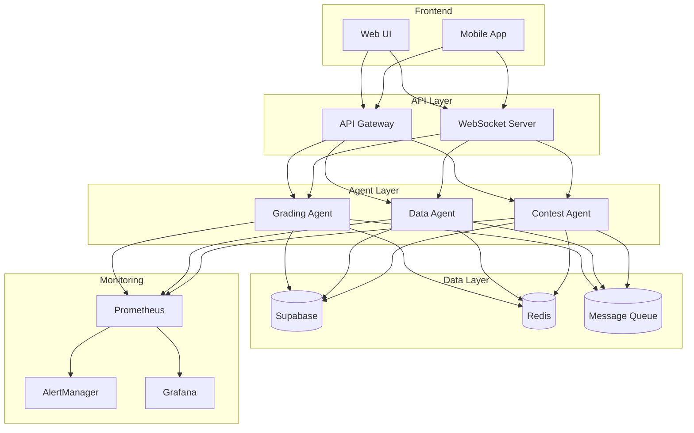
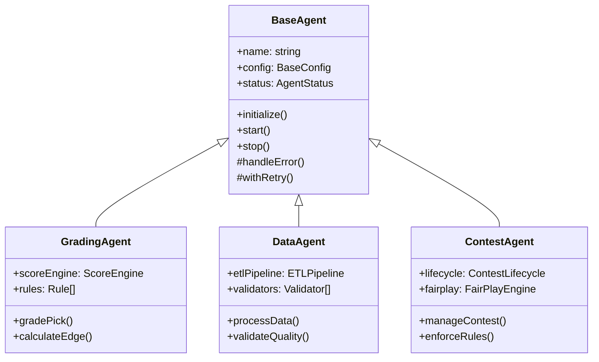
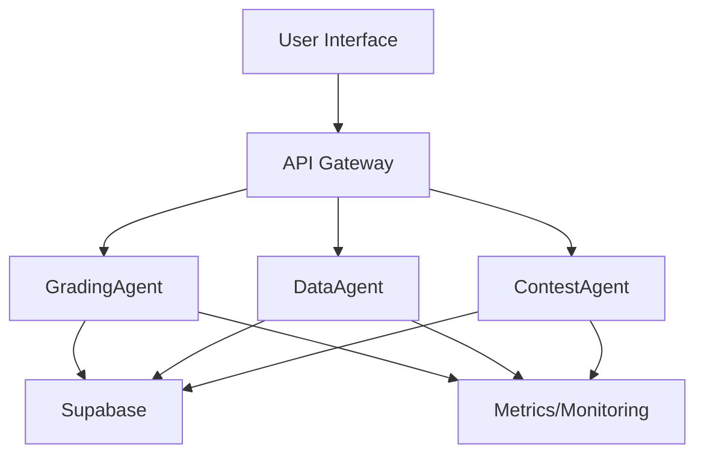

# Unit Talk Backend Documentation

[](https://github.com/unit-talk/backend/actions)
[](https://coveralls.io/github/unit-talk/backend?branch=main)
[](https://codeclimate.com/github/unit-talk/backend)
[](https://unit-talk.readthedocs.io/en/latest/?badge=latest)

## Overview
Unit Talk is a modular agent-driven sports betting and community insights platform. The system consists of several specialized agents that work together to provide betting analysis, grading, and community features.

## System Architecture

### High-Level Architecture


### Agent Architecture


## Quick Start

### Prerequisites
- Node.js 16+
- PostgreSQL 13+
- Redis 6+

### Installation
```bash
# Clone repository
git clone https://github.com/unit-talk/backend.git
cd backend

# Install dependencies
npm install

# Set up environment
cp .env.example .env
# Edit .env with your configuration

# Start development server
npm run dev
```

### Running Tests
```bash
# Run all tests
npm test

# Run specific test suite
npm run test:grading
npm run test:data
npm run test:contest

# Run with coverage
npm run test:coverage
```

## Architecture
The system follows a modular architecture with the following key components:

- **GradingAgent**: Handles pick evaluation and tier classification
- **DataAgent**: Manages ETL workflows and data quality
- **ContestAgent**: Handles contest lifecycle and fair play
- **BaseAgent**: Common functionality for all agents

### System Diagram


## Getting Started
1. [Installation Guide](./installation.md)
2. [Configuration Guide](./configuration.md)
3. [Development Setup](./development.md)
4. [Testing Guide](./testing.md)

## Agent Documentation
- [GradingAgent](./agents/grading/README.md)
- [DataAgent](./agents/data/README.md)
- [ContestAgent](./agents/contest/README.md)

## API Reference
- [REST API](./api/rest.md)
- [WebSocket API](./api/websocket.md)
- [Event System](./api/events.md)

## Monitoring & Operations
- [Metrics & Alerting](./ops/monitoring.md)
- [Logging](./ops/logging.md)
- [Deployment](./ops/deployment.md)
- [Scaling](./ops/scaling.md)
- [Troubleshooting](./ops/troubleshooting.md)

## Development
- [Contributing Guide](./contributing.md)
- [Code Style Guide](./code-style.md)
- [Testing Strategy](./testing.md)
- [CI/CD](./cicd.md)

## Architecture Decision Records
- [ADR-001: Agent Architecture](./adr/001-agent-architecture.md)
- [ADR-002: Data Storage](./adr/002-data-storage.md)
- [ADR-003: Monitoring Strategy](./adr/003-monitoring.md)

## Release Notes
- [Changelog](./CHANGELOG.md)
- [Migration Guide](./migration.md)
- [Known Issues](./known-issues.md)

## Support
- [FAQ](./faq.md)
- [Troubleshooting Guide](./troubleshooting.md)
- [Support Channels](./support.md)

## Folder Structure
```
src/
  agents/
    BaseAgent/
      index.ts
      types.ts
      errors.ts
    GradingAgent/
      index.ts
      types.ts
      scoring/
      monitoring/
    DataAgent/
      index.ts
      types.ts
      etl/
      validation/
    ContestAgent/
      index.ts
      types.ts
      lifecycle/
      fairplay/
  shared/
    types/
      index.ts
      validation.ts
    monitoring/
      metrics.ts
      alerts.ts
    utils/
      retry.ts
      logging.ts
  test/
    harness/
    fixtures/
    integration/
  docs/
    agents/
    api/
    ops/
    adr/ 