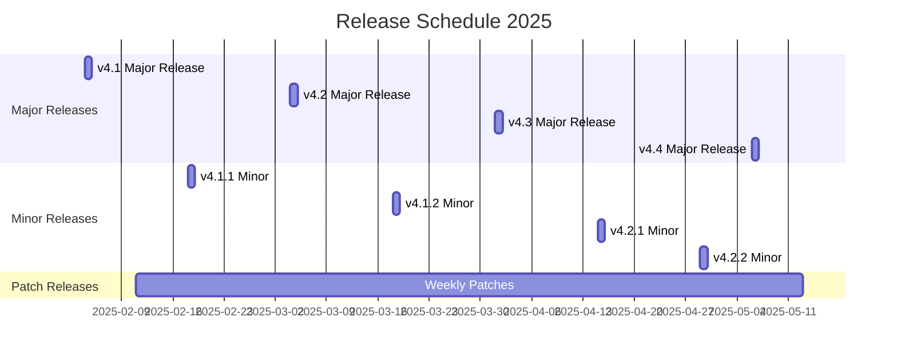

# Release Policy & Production Launch Gatekeeper v1

Production release management framework with progressive canary deployment, SLO guards, automated rollback, and the Production Launch Gatekeeper v1 system for the Unit Talk Platform.

## Overview

The Release Policy framework provides:

- **Production Launch Gatekeeper v1**: Progressive canary deployment with SLO guards and auto-rollback
- **Structured Release Cadence**: Predictable deployment schedules with quality gates
- **Error Budget Management**: SLA-based error budgets with automatic enforcement
- **Quality Gates**: Comprehensive validation before production deployment
- **Automated Rollback**: Intelligent rollback policies based on SLO guard violations
- **Kill Switch Controls**: Emergency system freeze with Command Center integration
- **Release Planning**: Sprint planning aligned with business objectives
- **Risk Assessment**: Automated risk scoring and mitigation strategies

## Production Launch Gatekeeper v1

The Production Launch Gatekeeper v1 system enforces progressive canary deployment with mandatory SLO guards, auto-rollback capabilities, and comprehensive safety controls.

### Progressive Canary Deployment Pipeline

All production releases follow a mandatory progressive canary rollout:

1. **Prerequisites Validation**
   - ✅ E2E tests must pass (100% success rate)
   - ✅ Go-Live rehearsal must be fresh (≤ 7 days old)
   - ✅ Build artifacts successfully generated
   - ✅ Security scans passed (no critical vulnerabilities)

2. **10% Canary Phase** (15 minutes minimum)
   - Routes 10% of traffic to new version
   - Continuous SLO guard monitoring every 10 seconds
   - Auto-rollback if any guard violations detected

3. **50% Canary Phase** (10 minutes minimum) 
   - Routes 50% of traffic to new version
   - Intensified guard monitoring
   - Higher sensitivity to performance degradation

4. **Full Rollout** (Immediate)
   - Routes 100% of traffic to new version
   - Final validation and automatic release tagging
   - Rollout completion notifications

### SLO Guards and Thresholds

Continuous monitoring during all canary phases:

| Guard | Threshold | Monitoring Frequency | Auto-Rollback |
|-------|-----------|---------------------|---------------|
| **Feed Freshness** | ≤ 300 seconds | Every 10 seconds | After 2 violations |
| **Temporal Backlog Age** | ≤ 300 seconds | Every 10 seconds | After 2 violations |
| **Failure Burn Rate** | Not "red" | Every 10 seconds | After 2 violations |
| **Canary Health** | ≤ 90 seconds | Every 10 seconds | After 2 violations |

### Auto-Rollback System

**Automatic Rollback Triggers**:
- Any SLO guard exceeds threshold for 2 consecutive checks (20 seconds)
- Multiple simultaneous guard violations
- Canary instance becomes unresponsive
- Critical system alerts during rollout
- Emergency Kill Switch activation

**Rollback Process** (< 2 minutes total):
1. **Traffic Shift** (< 30 seconds): Routes all traffic to blue environment
2. **System Stabilization** (< 60 seconds): Activates safe mode flags
3. **Incident Creation** (< 60 seconds): Creates high-severity incident record
4. **Notifications** (< 60 seconds): Alerts Slack, Discord, and Alertmanager

### Command Center Controls

**Kill Switch**:
- Emergency system freeze activation
- Sets `SYSTEM_FREEZE=true` blocking all deployments
- Requires reason and operator confirmation
- Full audit trail with attribution

**Deployment Monitoring**:
- Real-time rollout timeline with phase progression
- Live SLO guard status with color-coded indicators
- Manual deployment abort capabilities
- Historic deployment data and trends

**Rollout Timeline Widget**:
- Visual progress through 10% → 50% → 100% phases
- Guard violation detection and alerting
- Deployment metadata and performance metrics
- Auto-refresh every 10 seconds during active rollouts

## Release Cadence

### Production Release Schedule

**Major Releases** (Monthly - First Tuesday of Month)
- **Scope**: New features, architectural changes, major improvements
- **Planning Window**: 3 weeks planning, 1 week hardening
- **Quality Requirements**: 95%+ test coverage, security audit, performance validation
- **Error Budget**: 15-minute budget consumption allowed
- **Approval**: Engineering Manager + Product Owner sign-off required

**Minor Releases** (Bi-weekly - Every other Tuesday)
- **Scope**: Feature enhancements, non-breaking API changes, optimizations
- **Planning Window**: 1 week planning, 3 days hardening
- **Quality Requirements**: 90%+ test coverage, automated security scanning
- **Error Budget**: 10-minute budget consumption allowed
- **Approval**: Tech Lead sign-off required

**Patch Releases** (Weekly - Every Tuesday)
- **Scope**: Bug fixes, security patches, configuration updates
- **Planning Window**: 2 days planning, 1 day hardening
- **Quality Requirements**: 85%+ test coverage, focused testing
- **Error Budget**: 5-minute budget consumption allowed
- **Approval**: Senior Developer sign-off required

**Hotfixes** (On-demand - Within 4 hours)
- **Scope**: Critical production issues, security vulnerabilities
- **Planning Window**: Immediate planning, 30 minutes hardening
- **Quality Requirements**: Targeted testing, automated validation
- **Error Budget**: 2-minute budget consumption allowed
- **Approval**: On-call Engineer + Engineering Manager approval

### Release Calendar 2025



## Error Budget Framework

### Error Budget Definition

Error budgets quantify the acceptable level of service degradation, balancing reliability with development velocity.

**Service Level Objectives (SLOs)**

| Service Component | SLO Target | Error Budget (Monthly) | Measurement Window |
|-------------------|------------|------------------------|-------------------|
| **API Endpoints** | 99.95% availability | 21.6 minutes downtime | 30 days rolling |
| **Database Operations** | 99.99% success rate | 4.32 minutes errors | 30 days rolling |
| **Discord Bot** | 99.90% uptime | 43.2 minutes downtime | 30 days rolling |
| **Data Pipeline** | 99.95% processing success | 21.6 minutes errors | 30 days rolling |
| **Frontend Dashboard** | 99.90% availability | 43.2 minutes downtime | 30 days rolling |
| **Temporal Workflows** | 99.99% completion rate | 4.32 minutes failures | 30 days rolling |

### Error Budget Calculation

```typescript
interface ErrorBudget {
  serviceComponent: string;
  sloTarget: number;           // e.g., 0.9995 for 99.95%
  budgetPeriodMinutes: number; // e.g., 43200 for 30 days
  consumedMinutes: number;     // actual downtime/errors
  remainingMinutes: number;    // budget - consumed
  budgetHealth: 'HEALTHY' | 'CAUTION' | 'WARNING' | 'CRITICAL' | 'EXHAUSTED';
  burnRate: number;           // minutes per day consumption rate
  projectedExhaustion: Date;  // when budget will be exhausted
}

// Calculate error budget
function calculateErrorBudget(
  sloTarget: number, 
  budgetPeriodMinutes: number, 
  consumedMinutes: number
): ErrorBudget {
  const allowedErrorMinutes = budgetPeriodMinutes * (1 - sloTarget);
  const remainingMinutes = Math.max(0, allowedErrorMinutes - consumedMinutes);
  const consumptionPercent = consumedMinutes / allowedErrorMinutes;
  
  let budgetHealth: string;
  if (consumptionPercent >= 1.0) budgetHealth = 'EXHAUSTED';
  else if (consumptionPercent >= 0.9) budgetHealth = 'CRITICAL';
  else if (consumptionPercent >= 0.75) budgetHealth = 'WARNING';
  else if (consumptionPercent >= 0.5) budgetHealth = 'CAUTION';
  else budgetHealth = 'HEALTHY';
  
  return {
    serviceComponent: 'API',
    sloTarget,
    budgetPeriodMinutes,
    consumedMinutes,
    remainingMinutes,
    budgetHealth: budgetHealth as ErrorBudget['budgetHealth'],
    burnRate: consumedMinutes / 30, // daily average
    projectedExhaustion: new Date(Date.now() + (remainingMinutes / (consumedMinutes / 30)) * 24 * 60 * 60 * 1000)
  };
}
```

### Error Budget Enforcement Policies

**Budget Health Actions**

| Health Status | Consumption | Automated Actions | Manual Actions Required |
|---------------|-------------|-------------------|-------------------------|
| **HEALTHY** | 0-50% | Continue normal development | Monitor trends |
| **CAUTION** | 50-75% | Increase monitoring frequency | Review upcoming releases |
| **WARNING** | 75-90% | Block non-critical releases | Focus on reliability fixes |
| **CRITICAL** | 90-100% | Block all releases except hotfixes | Emergency reliability response |
| **EXHAUSTED** | >100% | Block all releases, enable safe mode | Immediate incident response |

**Release Blocking Logic**
```typescript
interface ReleasePolicy {
  canDeploy(releaseType: ReleaseType, errorBudgets: ErrorBudget[]): {
    allowed: boolean;
    blockingReasons: string[];
    overrideRequired: boolean;
  };
}

function evaluateReleasePolicy(
  releaseType: ReleaseType, 
  errorBudgets: ErrorBudget[]
): ReleaseEvaluation {
  const criticalServices = errorBudgets.filter(b => 
    b.budgetHealth === 'CRITICAL' || b.budgetHealth === 'EXHAUSTED'
  );
  
  const warningServices = errorBudgets.filter(b => 
    b.budgetHealth === 'WARNING'
  );
  
  // Block all releases if any service is exhausted
  if (criticalServices.some(s => s.budgetHealth === 'EXHAUSTED')) {
    return {
      allowed: false,
      blockingReasons: ['One or more services have exhausted error budgets'],
      overrideRequired: false // No override allowed for exhausted budgets
    };
  }
  
  // Apply release type specific policies
  switch (releaseType) {
    case 'HOTFIX':
      return { allowed: true, blockingReasons: [], overrideRequired: false };
      
    case 'PATCH':
      if (criticalServices.length > 0) {
        return {
          allowed: false,
          blockingReasons: [`${criticalServices.length} services in critical state`],
          overrideRequired: true
        };
      }
      return { allowed: true, blockingReasons: [], overrideRequired: false };
      
    case 'MINOR':
    case 'MAJOR':
      if (criticalServices.length > 0 || warningServices.length >= 2) {
        return {
          allowed: false,
          blockingReasons: [
            `${criticalServices.length} critical services`,
            `${warningServices.length} warning services`
          ],
          overrideRequired: true
        };
      }
      return { allowed: true, blockingReasons: [], overrideRequired: false };
  }
}
```

## Quality Gates

### Pre-Release Quality Gates

**Gate 1: Code Quality & Security**
```yaml
quality_gate_1:
  requirements:
    - test_coverage: ">= 85%"
    - security_scan: "no_critical_vulnerabilities"
    - lint_errors: "zero"
    - type_errors: "zero"
    - dependency_audit: "no_high_vulnerabilities"
  validation:
    - "npm run test:coverage"
    - "npm run security:scan"
    - "npm run lint"
    - "npm run type-check"
    - "npm audit --audit-level high"
  blocking: true
  override_level: "engineering_manager"
```

**Gate 2: Performance & Load Testing**
```yaml
quality_gate_2:
  requirements:
    - api_response_time: "< 100ms p95"
    - database_query_time: "< 50ms p95"
    - memory_usage: "< 512MB baseline"
    - cpu_usage: "< 70% under load"
    - concurrent_users: ">= 1000 users"
  validation:
    - "npm run test:performance"
    - "npm run test:load"
    - "k6 run performance/load-test.js"
  blocking: true
  override_level: "engineering_manager"
```

**Gate 3: Integration & E2E Testing**
```yaml
quality_gate_3:
  requirements:
    - integration_tests: "100% pass rate"
    - e2e_tests: "100% pass rate"
    - api_compatibility: "no_breaking_changes"
    - database_migrations: "reversible"
  validation:
    - "npm run test:integration"
    - "npm run test:e2e"
    - "npm run api:compatibility-check"
    - "npm run db:migration-test"
  blocking: true
  override_level: "tech_lead"
```

**Gate 4: Production Readiness**
```yaml
quality_gate_4:
  requirements:
    - staging_deployment: "successful"
    - smoke_tests: "100% pass rate"
    - monitoring_alerts: "zero_critical"
    - error_budget: "sufficient_remaining"
    - rollback_plan: "validated"
  validation:
    - "Deploy to staging environment"
    - "npm run test:smoke"
    - "Check monitoring systems"
    - "Validate error budget status"
    - "npm run rollback:test"
  blocking: true
  override_level: "engineering_manager"
```

### Quality Gate Automation

```typescript
interface QualityGate {
  name: string;
  requirements: Record<string, any>;
  validation: string[];
  blocking: boolean;
  overrideLevel: 'tech_lead' | 'engineering_manager' | 'cto';
}

async function executeQualityGate(gate: QualityGate): Promise<QualityGateResult> {
  const results: QualityGateResult = {
    gateName: gate.name,
    passed: true,
    failures: [],
    warnings: [],
    overrideRequired: false
  };
  
  for (const validation of gate.validation) {
    try {
      const result = await executeValidation(validation);
      if (!result.success) {
        results.failures.push({
          validation,
          error: result.error,
          severity: result.severity
        });
        
        if (gate.blocking && result.severity === 'critical') {
          results.passed = false;
          results.overrideRequired = true;
        }
      }
    } catch (error) {
      results.failures.push({
        validation,
        error: error.message,
        severity: 'critical'
      });
      results.passed = false;
    }
  }
  
  return results;
}
```

## Release Planning

### Sprint Planning Framework

**4-Week Sprint Cycles**
- **Week 1**: Planning & Design
  - Feature specification and technical design
  - Risk assessment and dependency identification  
  - Resource allocation and timeline estimation
  
- **Week 2-3**: Development & Testing
  - Feature implementation and unit testing
  - Integration testing and code review
  - Performance testing and optimization
  
- **Week 4**: Hardening & Release
  - Bug fixes and stability improvements
  - Final quality gate validation
  - Production deployment and monitoring

### Release Planning Template

```yaml
release_plan:
  version: "v4.2.0"
  type: "MINOR"
  planned_date: "2025-03-18"
  
  features:
    - name: "Enhanced Discord Bot Commands"
      risk: "LOW"
      owner: "frontend_team"
      testing_requirements: ["unit", "integration", "e2e"]
      
    - name: "Real-time Analytics Dashboard"
      risk: "MEDIUM"
      owner: "backend_team"
      testing_requirements: ["unit", "integration", "load", "e2e"]
      dependencies: ["database_optimization"]
  
  risk_assessment:
    overall_risk: "MEDIUM"
    risk_factors:
      - "Database schema changes"
      - "Real-time feature complexity"
      - "Discord API rate limiting"
    mitigation_strategies:
      - "Gradual rollout with feature flags"
      - "Additional load testing"
      - "Discord API monitoring"
  
  rollback_plan:
    strategy: "blue_green"
    automation: true
    max_rollback_time: "5_minutes"
    validation_steps:
      - "Health check endpoints"
      - "Database connectivity"
      - "Critical user journeys"
  
  error_budget:
    consumption_estimate: "8_minutes"
    remaining_budget: "13.6_minutes"
    budget_health: "HEALTHY"
    monitoring_period: "72_hours"
```

## Risk Assessment Framework

### Automated Risk Scoring

```typescript
interface ReleaseRisk {
  category: 'LOW' | 'MEDIUM' | 'HIGH' | 'CRITICAL';
  score: number; // 0-100
  factors: RiskFactor[];
  mitigationStrategies: string[];
  approvalRequired: string[];
}

interface RiskFactor {
  type: 'code_complexity' | 'dependency_changes' | 'database_changes' | 
        'api_changes' | 'infrastructure_changes' | 'team_availability';
  severity: number; // 0-10
  confidence: number; // 0-1
  description: string;
}

function calculateReleaseRisk(release: ReleaseCandidate): ReleaseRisk {
  let totalScore = 0;
  const factors: RiskFactor[] = [];
  
  // Code complexity risk
  if (release.linesChanged > 1000) {
    factors.push({
      type: 'code_complexity',
      severity: Math.min(10, release.linesChanged / 500),
      confidence: 0.8,
      description: `Large code changes: ${release.linesChanged} lines`
    });
  }
  
  // Database changes risk
  if (release.databaseChanges.length > 0) {
    const dbRisk = release.databaseChanges.some(c => c.type === 'schema_change') ? 8 : 4;
    factors.push({
      type: 'database_changes',
      severity: dbRisk,
      confidence: 0.9,
      description: `Database changes: ${release.databaseChanges.length} migrations`
    });
  }
  
  // API changes risk
  if (release.apiChanges.breaking > 0) {
    factors.push({
      type: 'api_changes',
      severity: 9,
      confidence: 1.0,
      description: `Breaking API changes: ${release.apiChanges.breaking}`
    });
  }
  
  // Calculate total score
  totalScore = factors.reduce((sum, factor) => 
    sum + (factor.severity * factor.confidence), 0
  ) / factors.length;
  
  // Determine category
  let category: ReleaseRisk['category'];
  if (totalScore >= 8) category = 'CRITICAL';
  else if (totalScore >= 6) category = 'HIGH';
  else if (totalScore >= 4) category = 'MEDIUM';
  else category = 'LOW';
  
  return {
    category,
    score: totalScore,
    factors,
    mitigationStrategies: generateMitigationStrategies(factors),
    approvalRequired: getRequiredApprovals(category)
  };
}
```

### Risk Mitigation Strategies

**Code Complexity Mitigation**
- Feature flags for gradual rollout
- Additional code review rounds
- Increased test coverage requirements
- Staged deployment with monitoring

**Database Changes Mitigation**
- Migration testing in staging environment
- Database backup verification
- Rollback script validation
- Performance impact assessment

**API Changes Mitigation**
- API versioning strategy
- Backward compatibility testing
- Client notification and migration plan
- Gradual deprecation timeline

**Infrastructure Changes Mitigation**
- Blue-green deployment strategy
- Infrastructure as code validation
- Monitoring and alerting updates
- Capacity planning and load testing

## Deployment Strategies

### Blue-Green Deployment

```yaml
blue_green_deployment:
  strategy: "zero_downtime"
  environments:
    blue: "production_current"
    green: "production_candidate"
  
  process:
    1_preparation:
      - "Deploy candidate to green environment"
      - "Run smoke tests on green"
      - "Validate database migrations"
    
    2_validation:
      - "Execute health checks"
      - "Run integration tests"
      - "Verify monitoring systems"
    
    3_traffic_switch:
      - "Gradual traffic routing (10%, 50%, 100%)"
      - "Monitor error rates and response times"
      - "Validate business metrics"
    
    4_monitoring:
      - "72-hour monitoring period"
      - "Error budget consumption tracking"
      - "User feedback collection"
  
  rollback_triggers:
    - "Error rate > 0.5%"
    - "Response time > 200ms p95"
    - "Error budget consumption > 50% in 1 hour"
    - "Critical user journey failure"
```

### Canary Deployment

```yaml
canary_deployment:
  strategy: "gradual_rollout"
  stages:
    stage_1:
      traffic_percentage: 5
      duration: "30_minutes"
      success_criteria:
        - "error_rate < 0.1%"
        - "response_time < 100ms p95"
    
    stage_2:
      traffic_percentage: 25
      duration: "1_hour"
      success_criteria:
        - "error_rate < 0.2%"
        - "response_time < 120ms p95"
    
    stage_3:
      traffic_percentage: 100
      duration: "ongoing"
      success_criteria:
        - "error_rate < 0.5%"
        - "response_time < 150ms p95"
  
  automatic_rollback:
    enabled: true
    triggers:
      - "error_rate > 1%"
      - "response_time > 300ms p95"
      - "health_check_failure"
```

## Monitoring and Alerting

### Release Monitoring Dashboard

```typescript
interface ReleaseMetrics {
  deploymentId: string;
  version: string;
  startTime: Date;
  status: 'IN_PROGRESS' | 'SUCCESS' | 'FAILED' | 'ROLLED_BACK';
  
  healthChecks: {
    endpoint: string;
    status: 'PASSING' | 'FAILING';
    responseTime: number;
    errorRate: number;
  }[];
  
  businessMetrics: {
    activeUsers: number;
    transactionVolume: number;
    conversionRate: number;
    userSatisfactionScore: number;
  };
  
  errorBudgetConsumption: {
    preDeployment: number;
    currentConsumption: number;
    projectedConsumption: number;
    remainingBudget: number;
  };
}
```

### Release Alerts

**Critical Alerts** (Immediate Response Required)
- Error budget exhaustion during release
- Critical health check failures
- Database connectivity issues
- Security vulnerability detection

**Warning Alerts** (Monitor Closely)  
- High error budget consumption rate
- Performance degradation
- Increased user error reports
- Third-party service issues

**Info Alerts** (Track Trends)
- Successful deployment milestones
- Performance improvements
- Feature adoption metrics
- User feedback summaries

## Rollback Policies

### Automatic Rollback Triggers

```typescript
interface RollbackTrigger {
  metric: string;
  threshold: number;
  duration: string;
  action: 'ALERT' | 'ROLLBACK';
  confidence: number;
}

const automaticRollbackTriggers: RollbackTrigger[] = [
  {
    metric: 'error_rate',
    threshold: 2.0, // 2% error rate
    duration: '5_minutes',
    action: 'ROLLBACK',
    confidence: 0.95
  },
  {
    metric: 'response_time_p95',
    threshold: 500, // 500ms
    duration: '10_minutes', 
    action: 'ROLLBACK',
    confidence: 0.90
  },
  {
    metric: 'database_connection_failures',
    threshold: 5, // 5 failures
    duration: '2_minutes',
    action: 'ROLLBACK',
    confidence: 1.0
  },
  {
    metric: 'critical_business_metric',
    threshold: 50, // 50% drop
    duration: '15_minutes',
    action: 'ROLLBACK',
    confidence: 0.85
  }
];
```

### Manual Rollback Procedures

**Emergency Rollback** (< 5 minutes)
1. Execute one-click rollback GitHub Action
2. Verify service health and connectivity
3. Notify stakeholders via automated alerts
4. Begin incident post-mortem process

**Standard Rollback** (< 15 minutes)
1. Assess rollback necessity and impact
2. Execute controlled rollback with monitoring
3. Validate business metric recovery
4. Update error budget calculations
5. Schedule post-mortem and improvement planning

## Compliance and Documentation

### Release Documentation Requirements

**Release Notes Template**
```markdown
# Release v4.2.0 - March 18, 2025

## Summary
Brief description of the release scope and business value.

## Features
- **Feature 1**: Description and business impact
- **Feature 2**: Description and technical improvements

## Bug Fixes
- **Fix 1**: Issue description and resolution
- **Fix 2**: Security fix and impact

## Technical Changes
- Database schema updates
- API changes and migration notes
- Configuration updates required

## Deployment Information
- **Deployment Strategy**: Blue-green with 10% canary
- **Expected Downtime**: Zero downtime deployment
- **Rollback Plan**: Automated rollback available
- **Monitoring Period**: 72 hours post-deployment

## Risk Assessment
- **Overall Risk**: MEDIUM
- **Key Risk Factors**: Database changes, new real-time features
- **Mitigation Strategies**: Feature flags, enhanced monitoring

## Testing
- **Test Coverage**: 94%
- **Performance Tests**: PASSED
- **Security Scan**: PASSED
- **E2E Tests**: PASSED

## Post-Deployment Actions
- [ ] Monitor error budgets for 72 hours
- [ ] Validate business metrics
- [ ] Collect user feedback
- [ ] Schedule retrospective meeting
```

### Audit Requirements

**Change Control Documentation**
- Release approval chain with timestamps
- Quality gate execution results
- Risk assessment and mitigation evidence
- Error budget impact calculations
- Rollback testing validation

**Compliance Reporting**
- Monthly release metrics summary
- Error budget consumption trends
- Quality gate effectiveness analysis
- Incident correlation with releases
- Process improvement recommendations

## Continuous Improvement

### Release Metrics and KPIs

**Deployment Metrics**
- **Deployment Frequency**: Target 1 release per week
- **Lead Time**: Target < 7 days from commit to production
- **Deployment Success Rate**: Target > 95%
- **Mean Time to Recovery (MTTR)**: Target < 1 hour

**Quality Metrics**  
- **Defect Escape Rate**: Target < 2% of releases
- **Post-Release Incident Rate**: Target < 1 incident per 10 releases
- **Error Budget Consumption**: Target < 50% monthly consumption
- **Customer Satisfaction**: Target > 4.5/5.0 rating

**Process Metrics**
- **Quality Gate Pass Rate**: Target > 90% first-time pass
- **Rollback Rate**: Target < 5% of deployments
- **Time to Rollback**: Target < 10 minutes
- **Documentation Completeness**: Target 100% compliance

### Monthly Release Review

```yaml
monthly_review_template:
  period: "March 2025"
  
  deployment_summary:
    total_releases: 8
    major_releases: 1
    minor_releases: 2
    patch_releases: 4
    hotfixes: 1
  
  quality_metrics:
    deployment_success_rate: "96.2%"
    error_budget_consumption: "45.3%"
    defect_escape_rate: "1.8%"
    average_rollback_time: "7.2_minutes"
  
  incidents:
    total_incidents: 2
    release_related: 1
    error_budget_impact: "8.5_minutes"
    lessons_learned:
      - "Enhanced load testing required for real-time features"
      - "Database migration testing needs improvement"
  
  process_improvements:
    implemented:
      - "Automated performance regression testing"
      - "Enhanced monitoring for real-time features"
    planned:
      - "Machine learning-based anomaly detection"
      - "Improved error budget forecasting"
  
  recommendations:
    - "Increase canary deployment duration for high-risk releases"
    - "Add business metric validation to quality gates"
    - "Implement predictive error budget analysis"
```

## Best Practices

### Release Management Guidelines

1. **Plan Early**: Begin release planning 3 sprints in advance
2. **Test Thoroughly**: Maintain high test coverage and comprehensive E2E testing
3. **Monitor Continuously**: Track error budgets and business metrics throughout releases
4. **Document Everything**: Maintain comprehensive release documentation and change logs
5. **Learn from Incidents**: Conduct blameless post-mortems and implement improvements

### Error Budget Best Practices

1. **Set Realistic SLOs**: Balance user expectations with engineering constraints
2. **Monitor Leading Indicators**: Track trends before budgets are exhausted  
3. **Automate Responses**: Implement automated policies for budget consumption
4. **Communicate Clearly**: Share error budget status across teams regularly
5. **Invest in Reliability**: Use budget data to prioritize reliability investments

### Quality Gate Optimization

1. **Right-size Requirements**: Adjust requirements based on release risk and type
2. **Automate Validation**: Minimize manual intervention in quality gates
3. **Fast Feedback**: Ensure quality gates complete within 30 minutes
4. **Clear Failures**: Provide actionable feedback for quality gate failures
5. **Continuous Improvement**: Regularly review and update quality gate criteria

---

*Release Policy Framework - Balancing velocity with reliability through disciplined release management*