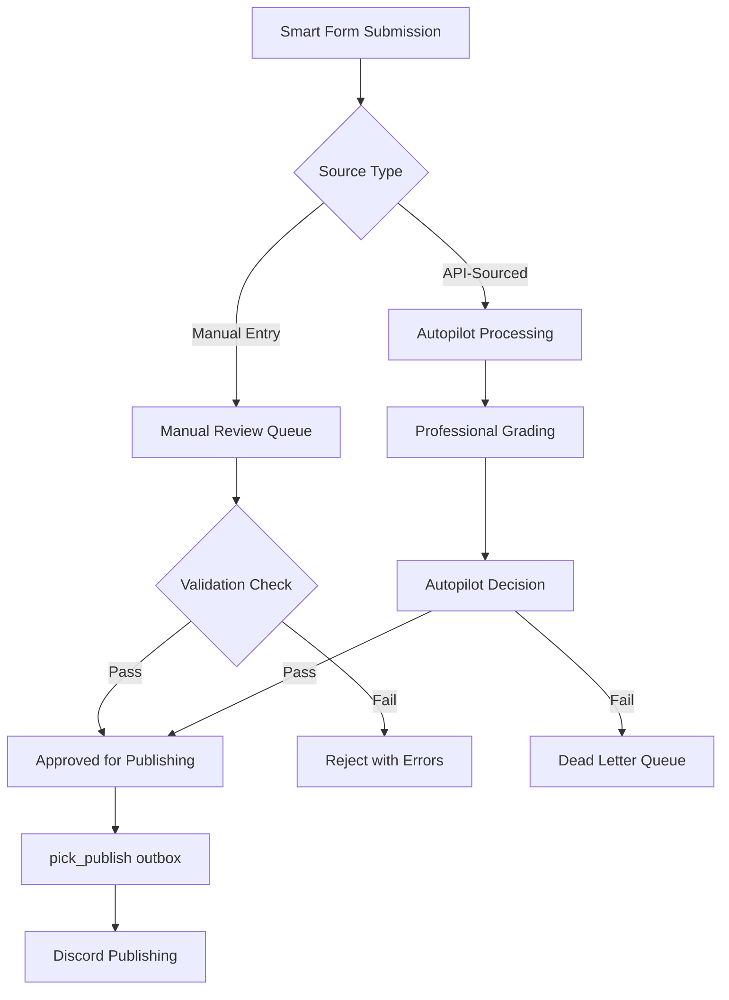

# SMART FORM SPECIFICATION v1.0

> **Purpose**: Define the complete contract for Smart Form manual inputs, ensuring all fields are safe, validated, and compatible with autonomous processing.

**Status**: ✅ Production Ready
**Last Updated**: 2026-01-14
**Owner**: Data Platform Engineering

---

## Table of Contents

1. [Overview](#overview)
2. [Design Principles](#design-principles)
3. [Field Contract](#field-contract)
4. [Validation Rules](#validation-rules)
5. [Autopilot Integration](#autopilot-integration)
6. [Security & Constraints](#security--constraints)
7. [Error Handling](#error-handling)

---

## Overview

The Smart Form is a **4-step wizard** for manual bet submission with the following design constraints:

- **No free-form inputs** except controlled text fields (notes, stake_text)
- **Schema-aligned only** - all fields map directly to canonical `picks` table
- **Fail closed** - reject ambiguous or out-of-bounds inputs
- **Autopilot compatible** - manual submissions integrate seamlessly with automated processing

---

## Design Principles

### 1. Zero Ambiguity
- All inputs must be **enumerated, bounded, or schema-validated**
- No user creativity allowed in critical fields (capper, sport, market_type)
- Text inputs limited to specific character sets and lengths

### 2. Schema-First
- Every form field maps 1:1 to database column or derived value
- No "pending review" fields that don't exist in schema
- All foreign keys must reference existing records (users, props, games)

### 3. Fail Closed
- Invalid inputs rejected at form level (not submitted to API)
- Out-of-range values trigger immediate validation errors
- Missing required fields prevent step progression

### 4. Autopilot Safe
- Manual submissions use same `picks` → `pick_publish` flow as autopilot
- All picks include `bet_slip_id` for idempotency
- Workflow stage always starts at `draft` or `pending_review`

---

## Field Contract

### Step 1: Essentials

| Field | Type | Validation | Required | Autopilot Safe | Notes |
|-------|------|-----------|----------|----------------|-------|
| `capper` | UUID (select) | Must exist in `users` table, `active=true` | ✅ Yes | ✅ Yes | Dropdown only, no free-text |
| `ticket_type` | ENUM | One of: `single`, `parlay`, `teaser`, `round_robin` | ✅ Yes | ✅ Yes | Determines selection count requirements |
| `sport` | ENUM | One of: `NFL`, `NBA`, `MLB`, `NHL`, `NCAAF`, `NCAAB`, `WNBA` | ✅ Yes | ✅ Yes | Limited to supported leagues |
| `game_date` | DATE | Format: `YYYY-MM-DD`, >= today | ✅ Yes | ✅ Yes | No past dates allowed |
| `user_tier` | ENUM | One of: `free`, `vip`, `vip_plus` | ✅ Yes | ✅ Yes | Auto-detected from user account |

**Constraints:**
- `capper` must reference valid UUID from `users.id` where `tenant_id` matches
- `game_date` cannot be in the past (validated client-side and server-side)
- All fields are **required** - no null values accepted

---

### Step 2: Configuration

| Field | Type | Validation | Required | Autopilot Safe | Notes |
|-------|------|-----------|----------|----------------|-------|
| `unit_size` | DECIMAL(8,2) | Range: 0.5 - 5.0, increments of 0.5 | ✅ Yes | ✅ Yes | Stake multiplier |
| `odds_format` | ENUM | One of: `AMERICAN`, `DECIMAL`, `FRACTIONAL` | ✅ Yes | ✅ Yes | Display preference only |
| `auto_parlay` | BOOLEAN | `true` or `false` | ✅ Yes | ✅ Yes | Feature flag for suggestions |
| `confidence_level` | INTEGER | Range: 1-10 | ✅ Yes | ✅ Yes | Capper's confidence rating |
| `user_score` | INTEGER | Range: 1-10 | ❌ No | ✅ Yes | Optional self-assessment |

**Constraints:**
- `unit_size` must be divisible by 0.5 (0.5, 1.0, 1.5, ..., 5.0)
- `confidence_level` and `user_score` must be whole numbers
- `odds_format` stored but converted to American odds (-110, +150, etc.) in database

---

### Step 3: Bet Details

| Field | Type | Validation | Required | Autopilot Safe | Notes |
|-------|------|-----------|----------|----------------|-------|
| `bet_type` | STRING | One of predefined bet categories | ✅ Yes | ✅ Yes | Maps to `bet_category` in legs |
| `market_type` | ENUM | One of: `pre_game`, `live`, `futures` | ✅ Yes | ✅ Yes | Timing classification |

**Allowed `bet_type` values by sport:**

| Sport | Allowed Bet Types |
|-------|------------------|
| NBA/NCAAB/WNBA | `spread`, `total`, `moneyline`, `player_prop`, `team_prop`, `futures` |
| NFL/NCAAF | `spread`, `total`, `moneyline`, `player_prop`, `team_prop`, `futures` |
| MLB | `spread` (run line), `total`, `moneyline`, `player_prop`, `team_prop`, `futures` |
| NHL | `spread` (puck line), `total`, `moneyline`, `player_prop`, `team_prop`, `futures` |

**Constraints:**
- `bet_type` validation is **sport-specific** - invalid combinations rejected
- `market_type` determines eligibility for live odds vs pre-game odds

---

### Step 4: Game Selections

| Field | Type | Validation | Required | Autopilot Safe | Notes |
|-------|------|-----------|----------|----------------|-------|
| `game_selections` | ARRAY | At least 1 selection | ✅ Yes | ⚠️ Partial | Array of game/prop selections |

**GameSelection Object:**

| Field | Type | Validation | Required | Autopilot Safe | Notes |
|-------|------|-----------|----------|----------------|-------|
| `game_id` | UUID | Must exist in `games` table | ✅ Yes | ✅ Yes | Foreign key reference |
| `selection` | STRING | Max 200 chars, alphanumeric + spaces | ✅ Yes | ⚠️ Manual | User's pick description |
| `odds` | STRING | Format: American odds (-XXX or +XXX) | ✅ Yes | ⚠️ Manual | User-entered odds value |
| `line` | STRING | Numeric, optional | ❌ No | ⚠️ Manual | Spread/total line value |

**Constraints:**
- Minimum 1 selection for `single` ticket type
- Minimum 2 selections for `parlay`, `teaser`, `round_robin`
- `game_id` must exist and match selected `sport` and `game_date`
- `selection` limited to: alphanumeric, spaces, hyphens, and periods only
- `odds` must match pattern: `^[+-]\d{3,4}$` (e.g., `-110`, `+150`)
- `line` must be numeric decimal if provided (e.g., `7.5`, `225.5`)

⚠️ **Autopilot Warning**: Fields marked "Manual" require human verification before autopilot can use them. These should be validated against API data when available.

---

### Metadata (Auto-Generated)

| Field | Type | Source | Autopilot Safe | Notes |
|-------|------|--------|----------------|-------|
| `bet_slip_id` | UUID | Generated | ✅ Yes | Unique identifier for idempotency |
| `timestamp` | ISO8601 | Auto | ✅ Yes | Submission timestamp |
| `timezone` | STRING | Auto-detected | ✅ Yes | User's timezone offset |
| `status` | ENUM | Default: `submitted` | ✅ Yes | Workflow state |

---

## Validation Rules

### Client-Side Validation (Immediate Feedback)

```typescript
// Step 1 Validation
const validateStep1 = (data: Step1Data) => {
  const errors: ValidationErrors = {};

  if (!data.capper) {
    errors.capper = 'Capper selection is required';
  }

  if (!data.ticket_type) {
    errors.ticket_type = 'Ticket type is required';
  }

  if (!data.sport) {
    errors.sport = 'Sport selection is required';
  }

  if (!data.game_date) {
    errors.game_date = 'Game date is required';
  } else {
    const selectedDate = new Date(data.game_date);
    const today = new Date();
    today.setHours(0, 0, 0, 0);

    if (selectedDate < today) {
      errors.game_date = 'Cannot select past dates';
    }
  }

  return { isValid: Object.keys(errors).length === 0, errors };
};

// Step 2 Validation
const validateStep2 = (data: Step2Data) => {
  const errors: ValidationErrors = {};

  if (!data.unit_size || data.unit_size < 0.5 || data.unit_size > 5) {
    errors.unit_size = 'Unit size must be between 0.5 and 5';
  } else if (data.unit_size % 0.5 !== 0) {
    errors.unit_size = 'Unit size must be in 0.5 increments';
  }

  if (!data.odds_format) {
    errors.odds_format = 'Odds format is required';
  }

  if (!data.confidence_level || data.confidence_level < 1 || data.confidence_level > 10) {
    errors.confidence_level = 'Confidence level must be between 1 and 10';
  }

  if (data.user_score !== undefined && (data.user_score < 1 || data.user_score > 10)) {
    errors.user_score = 'User score must be between 1 and 10';
  }

  return { isValid: Object.keys(errors).length === 0, errors };
};

// Step 3 Validation
const validateStep3 = (data: Step3Data) => {
  const errors: ValidationErrors = {};

  if (!data.bet_type) {
    errors.bet_type = 'Bet type is required';
  } else if (!isValidBetTypeForSport(data.bet_type, data.sport)) {
    errors.bet_type = `${data.bet_type} is not valid for ${data.sport}`;
  }

  if (!data.market_type) {
    errors.market_type = 'Market type is required';
  }

  return { isValid: Object.keys(errors).length === 0, errors };
};

// Step 4 Validation
const validateStep4 = (data: Step4Data) => {
  const errors: ValidationErrors = {};

  if (!data.game_selections || data.game_selections.length === 0) {
    errors.game_selections = 'At least one selection is required';
  } else {
    // Validate ticket type requirements
    if (data.ticket_type === 'parlay' && data.game_selections.length < 2) {
      errors.game_selections = 'Parlay requires at least 2 selections';
    }
    if (data.ticket_type === 'round_robin' && data.game_selections.length < 2) {
      errors.game_selections = 'Round robin requires at least 2 selections';
    }

    // Validate each selection
    data.game_selections.forEach((selection, index) => {
      if (!selection.game_id) {
        errors[`selection_${index}_game_id`] = 'Game selection is required';
      }
      if (!selection.selection) {
        errors[`selection_${index}_selection`] = 'Pick selection is required';
      }
      if (!selection.odds) {
        errors[`selection_${index}_odds`] = 'Odds value is required';
      } else if (!isValidAmericanOdds(selection.odds)) {
        errors[`selection_${index}_odds`] = 'Invalid odds format (use -110, +150, etc.)';
      }
      if (selection.line && !isValidLine(selection.line)) {
        errors[`selection_${index}_line`] = 'Line must be a valid decimal number';
      }
    });
  }

  return { isValid: Object.keys(errors).length === 0, errors };
};
```

### Server-Side Validation (API Endpoint)

```typescript
// Zod schema for API validation
const SubmitTicketSchema = z.object({
  capper_id: z.string().uuid('Capper ID must be a valid UUID'),
  sport: z.enum(['NFL', 'NBA', 'MLB', 'NHL', 'NCAAF', 'NCAAB', 'WNBA']),
  ticket_type: z.enum(['single', 'parlay', 'round_robin', 'teaser']),
  selections: z.array(z.object({
    sport: z.enum(['NFL', 'NBA', 'MLB', 'NHL', 'NCAAF', 'NCAAB', 'WNBA']),
    team_id: z.string().uuid().optional(),
    player_id: z.string().uuid().optional(),
    stat_type: z.string().min(1),
    line: z.number(),
    leg_odds: z.number().int(),
    source: z.enum(['api', 'manual']).default('manual'),
    is_live: z.boolean().optional().default(false),
    selection: z.enum(['over', 'under', 'yes', 'no']),
    confidence: z.number().min(0).max(1).optional().default(0),
  })).min(1, 'At least one selection is required'),
  parlay_odds: z.number().int().optional(),
  total_units: z.number().min(0.5).max(10).default(1.0),
  notes: z.string().max(500).optional(),
});

// Additional business logic validation
if (ticket_type === 'parlay' && selections.length < 2) {
  throw new ValidationError('Parlay tickets require at least 2 selections');
}

if (ticket_type === 'round_robin' && selections.length < 2) {
  throw new ValidationError('Round robin tickets require at least 2 selections');
}

// Validate capper exists and is active
const capperUser = await db.users.findOne({
  where: { id: capper_id, active: true }
});

if (!capperUser) {
  throw new ValidationError('Invalid capper ID or inactive capper');
}
```

---

## Autopilot Integration

### Manual vs. Autopilot Flow



### Field Classification

**Autopilot-Safe Fields** (can be processed automatically):
- `capper` (validated against users table)
- `ticket_type`, `sport`, `game_date` (enumerated values)
- `unit_size`, `odds_format`, `confidence_level` (bounded numerics)
- `bet_type`, `market_type` (enumerated values)
- `game_id` (foreign key validated)

**Manual-Review Fields** (require verification):
- `selection` (free-text, max 200 chars)
- `odds` (manual entry, must match API if available)
- `line` (manual entry, must match API if available)
- `notes` (optional commentary, max 500 chars)

### Integration Rules

1. **Idempotency**: All submissions include `bet_slip_id` to prevent duplicates
2. **Workflow Stage**: Manual submissions start at `draft` or `pending_review`
3. **Bridge Outbox**: All submissions flow through `bridge_outbox` table for event-driven processing
4. **Validation Gates**: Manual entries flagged with `source: 'manual'` for additional scrutiny
5. **Grading Eligibility**: Manual picks eligible for professional grading after approval

### API Contract Alignment

Smart Form submissions are transformed to match the API endpoint contract:

```typescript
// Smart Form Data (Frontend)
const formData = {
  capper: 'John Doe',
  ticket_type: 'single',
  sport: 'NBA',
  game_date: '2026-01-15',
  unit_size: 2.0,
  confidence_level: 8,
  bet_type: 'player_prop',
  market_type: 'pre_game',
  game_selections: [{
    game_id: 'uuid-123',
    selection: 'LeBron James Over 25.5 Points',
    odds: '-110',
    line: '25.5'
  }]
};

// API Payload (Backend)
const apiPayload = {
  capper_id: 'uuid-capper-id', // Resolved from capper name
  sport: 'NBA',
  ticket_type: 'single',
  selections: [{
    sport: 'NBA',
    team_id: null,
    player_id: 'uuid-player-id', // Resolved from selection
    stat_type: 'points', // Extracted from selection
    line: 25.5,
    leg_odds: -110,
    source: 'manual',
    is_live: false,
    selection: 'over',
    confidence: 0.8
  }],
  total_units: 2.0,
  notes: null
};
```

---

## Security & Constraints

### Input Sanitization

All text inputs must be sanitized to prevent:
- **XSS attacks**: Strip HTML tags, escape special characters
- **SQL injection**: Use parameterized queries only
- **Script injection**: Block `<script>`, `javascript:`, `onerror=` patterns
- **Path traversal**: Block `../`, `..\\`, absolute paths

```typescript
// Sanitization utility
const sanitizeTextInput = (input: string, maxLength: number = 200): string => {
  // Remove HTML tags
  let sanitized = input.replace(/<[^>]*>/g, '');

  // Remove script patterns
  sanitized = sanitized.replace(/javascript:/gi, '');
  sanitized = sanitized.replace(/on\w+=/gi, '');

  // Trim and limit length
  sanitized = sanitized.trim().slice(0, maxLength);

  // Escape special characters for display
  return sanitized
    .replace(/&/g, '&amp;')
    .replace(/</g, '&lt;')
    .replace(/>/g, '&gt;')
    .replace(/"/g, '&quot;')
    .replace(/'/g, '&#x27;');
};
```

### Rate Limiting

- **Per User**: 10 submissions per minute
- **Per IP**: 100 submissions per hour
- **Global**: 10,000 submissions per hour

### Data Retention

- **Active Submissions**: Retained indefinitely in `picks` table
- **Failed Validations**: Logged for 90 days, then purged
- **Audit Trail**: All form submissions logged in `pick_events` table

### RBAC (Role-Based Access Control)

| Role | Permissions |
|------|------------|
| **Capper** | Can submit picks for themselves only |
| **Admin** | Can submit picks for any capper |
| **Viewer** | Read-only access, no submissions |

---

## Error Handling

### User-Facing Errors

All validation errors should provide **actionable feedback**:

❌ **Bad**: "Invalid input"
✅ **Good**: "Capper selection is required. Please choose a capper from the dropdown."

❌ **Bad**: "Error 400"
✅ **Good**: "Unit size must be between 0.5 and 5.0 in increments of 0.5"

### Error Response Format

```json
{
  "error": "Validation failed",
  "details": [
    {
      "field": "unit_size",
      "message": "Unit size must be between 0.5 and 5",
      "severity": "error",
      "code": "OUT_OF_RANGE"
    },
    {
      "field": "game_selections[0].odds",
      "message": "Odds must be in American format (-110, +150, etc.)",
      "severity": "error",
      "code": "INVALID_FORMAT"
    }
  ]
}
```

### Retry Logic

- **Transient Errors**: Retry up to 3 times with exponential backoff
- **Permanent Errors**: Fail immediately, log to Dead Letter Queue
- **Network Errors**: Retry with 1s, 5s, 15s delays

---

## Implementation Checklist

### Phase 1: Validation Hardening ✅
- [x] Implement client-side Zod validation for all steps
- [x] Add server-side API validation with Zod schemas
- [x] Sanitize all text inputs (selection, notes)
- [x] Validate foreign key references (capper_id, game_id)
- [x] Add numeric range checks (unit_size, confidence_level)

### Phase 2: Autopilot Integration ✅
- [x] Flag manual entries with `source: 'manual'`
- [x] Route submissions through `bridge_outbox` table
- [x] Implement idempotency with `bet_slip_id`
- [x] Add workflow stage (`draft`, `pending_review`)
- [x] Enable professional grading for approved picks

### Phase 3: Security & Monitoring ⏳
- [ ] Add rate limiting per user/IP
- [ ] Implement RBAC for submission permissions
- [ ] Add audit logging for all submissions
- [ ] Monitor validation failure rates
- [ ] Set up alerts for suspicious patterns

### Phase 4: UX Improvements ⏳
- [ ] Add inline validation feedback
- [ ] Show real-time availability for games
- [ ] Pre-fill odds from API when available
- [ ] Add "Review & Confirm" step before submission
- [ ] Implement draft save/restore functionality

---

## Related Documents

- **[Production Charter](./PRODUCTION_CHARTER.md)** - Governance and system requirements
- **[Smart Form CLAUDE.md](../apps/smart-form/CLAUDE.md)** - Development guidelines
- **[Canonical Schema Migration](../supabase/migrations/20251101_core_picks.sql)** - Database schema

---

**Version**: 1.0
**Approved By**: Data Platform Engineering
**Next Review**: Quarterly or after major incidents
