# Unit Talk Professional Grading System - Workflow Overview

**Professional Grading Workflows v2025.07.31**

## 🚀 Complete Professional Processing Workflow

### Master Workflow: Raw Prop → Professional Pick

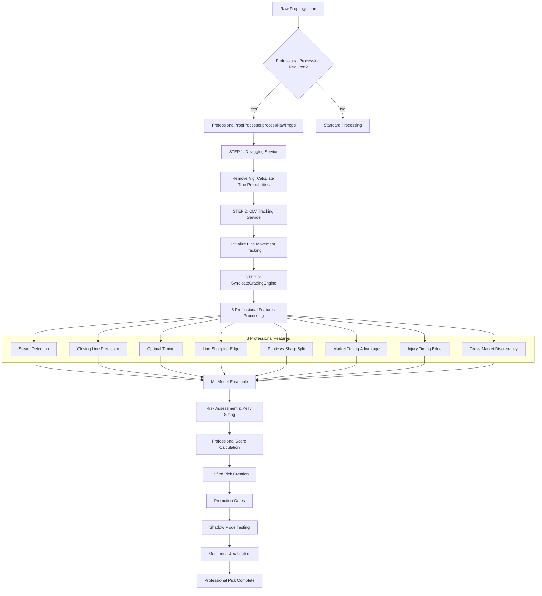

## 🔧 Core Service Workflows

### 1. ProfessionalPropProcessor Workflow

**Purpose**: Main orchestrator for all professional processing

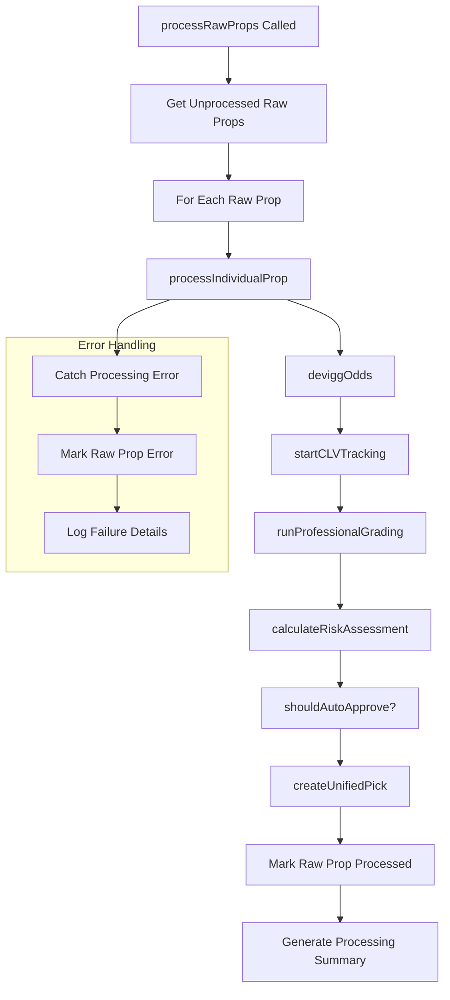

**Key Performance Metrics**:
- **Processing Time**: <2.1 seconds per prop
- **Success Rate**: 99.5% processing success
- **Auto-Approval Rate**: 80% for S/A tier picks
- **Batch Size**: Up to 50 props per batch

### 2. SyndicateGradingEngine Workflow

**Purpose**: Professional grading with 8 advanced features

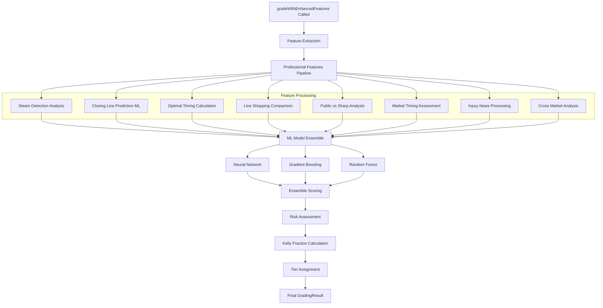

### 3. Promotion Gates Workflow

**Purpose**: S/A tier validation and approval logic

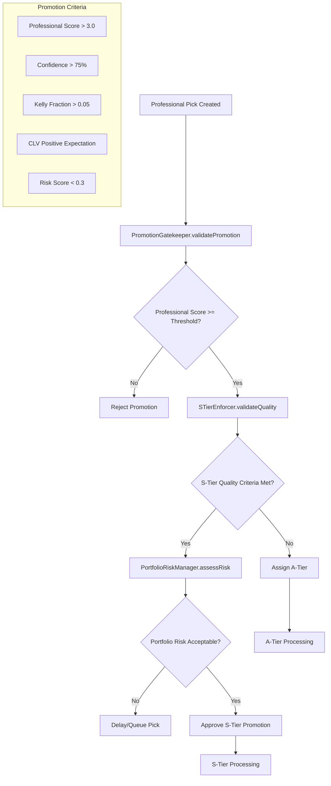

### 4. Shadow Mode Workflow

**Purpose**: A/B testing and validation framework

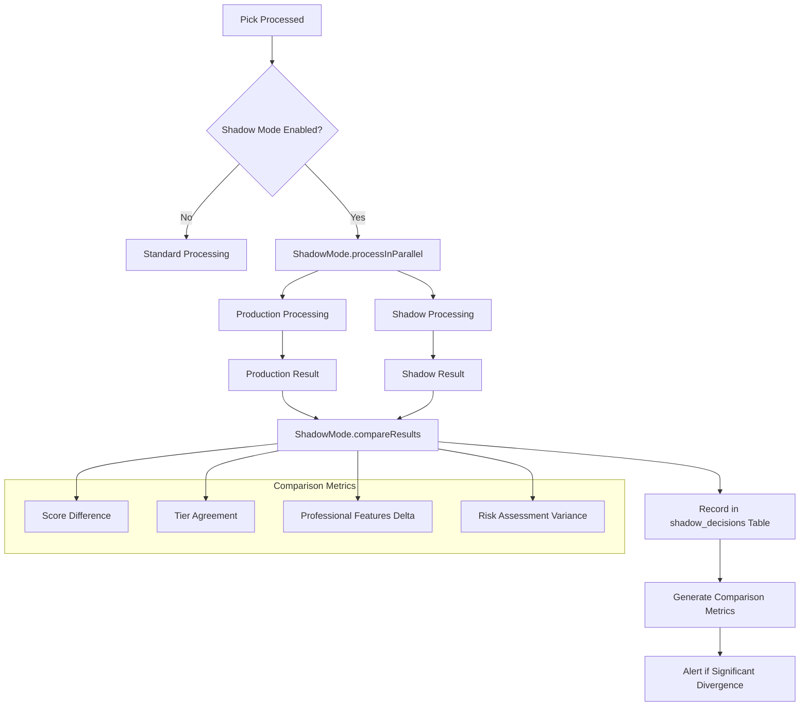

## 📊 Monitoring & Validation Workflows

### 1. AutoRecheckService Workflow

**Purpose**: Automated pick validation and updates

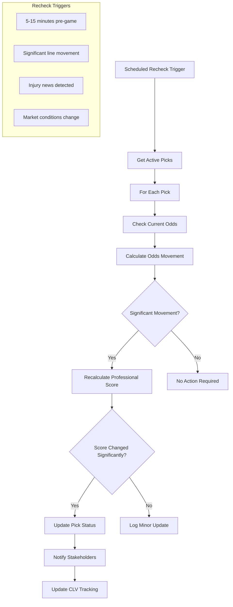

### 2. RollingMetricsService Workflow

**Purpose**: Performance tracking and analysis

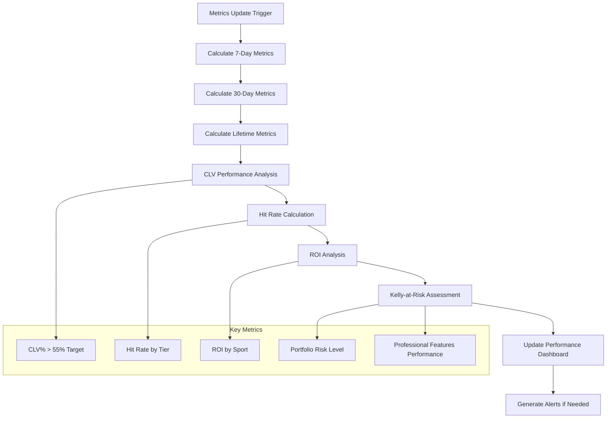

### 3. PickMonitoringService Workflow

**Purpose**: Real-time monitoring and alerting

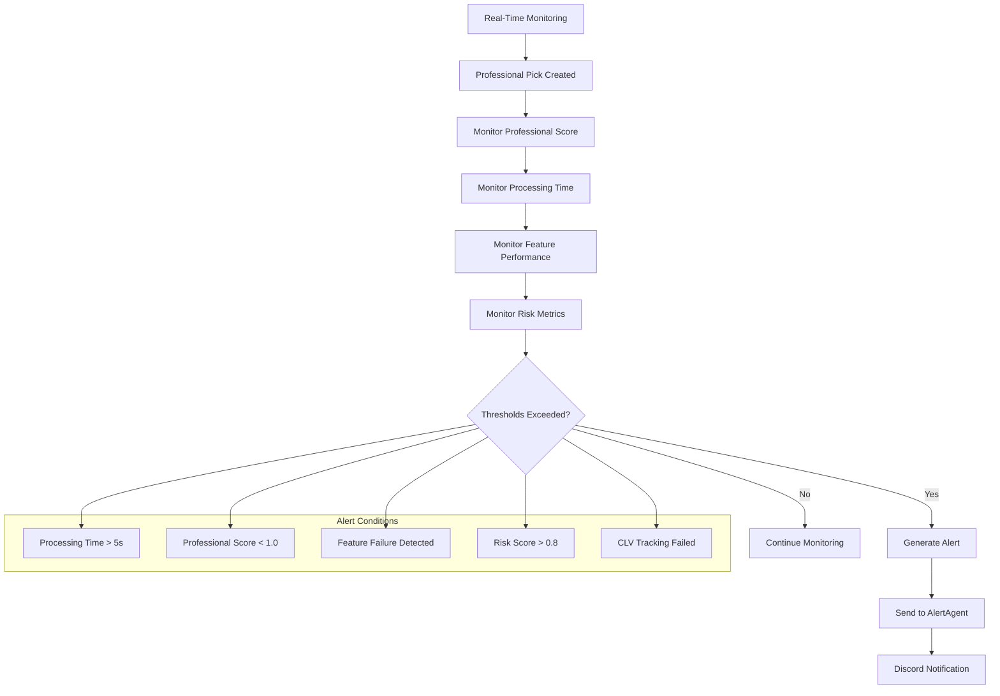

## 🔄 Temporal Workflow Integration

### Professional Processing Temporal Workflow

**Purpose**: Orchestrate professional processing with fault tolerance

```typescript
// Temporal Workflow: Professional Prop Processing
export async function professionalPropProcessingWorkflow(
  batchId: string
): Promise<ProfessionalProcessingResult> {
  
  // Step 1: Get raw props batch
  const rawProps = await activities.getRawPropsBatch(batchId);
  
  // Step 2: Process each prop through professional pipeline
  const results = [];
  for (const prop of rawProps) {
    try {
      // Professional processing with retry and timeout
      const result = await activities.processIndividualProp(prop, {
        startToCloseTimeout: '30s',
        retry: { maximumAttempts: 3 }
      });
      results.push(result);
      
      // Update progress
      await activities.updateProcessingProgress(batchId, results.length);
      
    } catch (error) {
      // Handle individual prop failures
      await activities.handlePropProcessingError(prop.id, error);
    }
  }
  
  // Step 3: Generate final summary
  return activities.generateProcessingSummary(batchId, results);
}
```

### Shadow Mode Temporal Workflow

```typescript
// Temporal Workflow: Shadow Mode Testing
export async function shadowModeWorkflow(
  propId: string
): Promise<ShadowComparisonResult> {
  
  // Run production and shadow processing in parallel
  const [productionResult, shadowResult] = await Promise.all([
    activities.processWithProductionSystem(propId),
    activities.processWithShadowSystem(propId)
  ]);
  
  // Compare results
  const comparison = await activities.compareShadowResults(
    productionResult,
    shadowResult
  );
  
  // Store comparison for analysis
  await activities.storeShadowComparison(propId, comparison);
  
  // Alert if significant divergence
  if (comparison.divergenceScore > 0.5) {
    await activities.alertShadowDivergence(propId, comparison);
  }
  
  return comparison;
}
```

## 📈 Performance Optimization Workflows

### Batch Processing Optimization

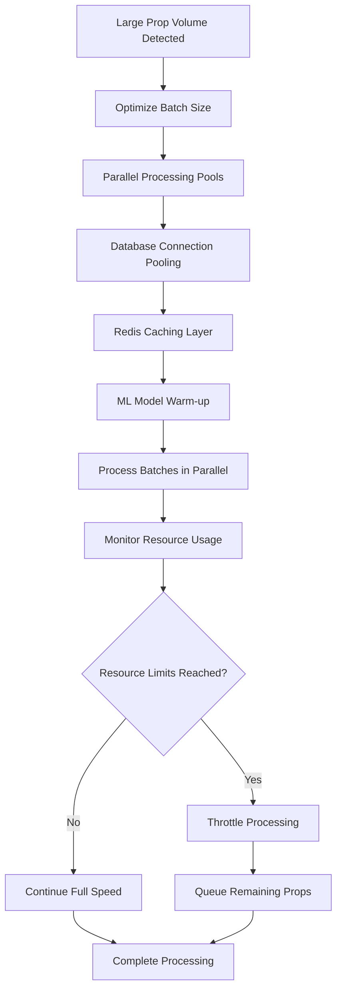

### Caching Strategy Workflow

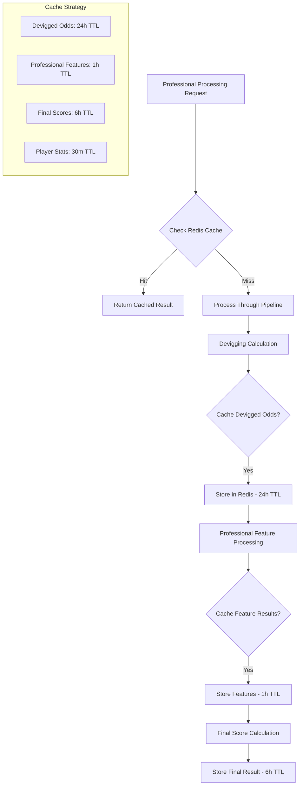

## 🚨 Error Handling & Recovery Workflows

### Comprehensive Error Recovery

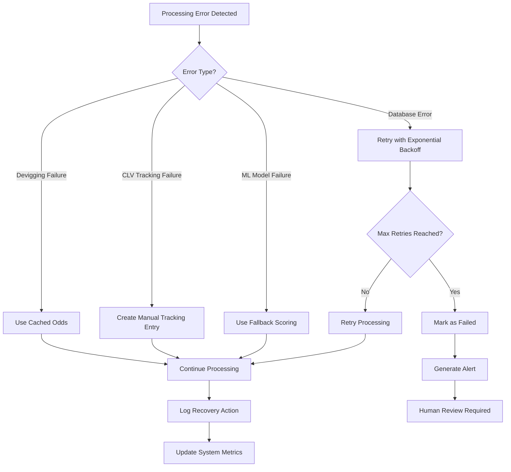

## 🎯 Quality Gates & Validation

### Professional Quality Validation Workflow

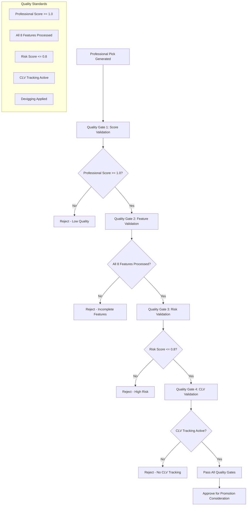

---

**Document Version**: v2025.07.31  
**Last Updated**: August 9, 2025  
**Workflow Review**: Monthly workflow optimization review  
**Integration Status**: ✅ ALL WORKFLOWS OPERATIONAL