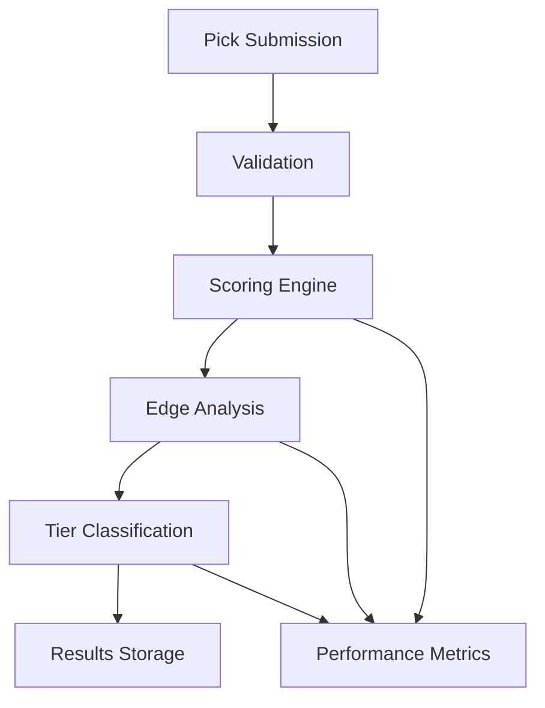

# GradingAgent Documentation

## Overview
The GradingAgent is responsible for evaluating and classifying betting picks based on various factors including historical performance, market conditions, and confidence metrics.

## Features
- Pick evaluation and scoring
- Tier classification (S, A, B, C, D)
- Performance tracking
- Error handling and retry logic
- Comprehensive metrics and monitoring

## Architecture

### Components


### Key Files
- `src/agents/GradingAgent/`
  - `index.ts` - Main agent implementation
  - `types.ts` - TypeScript types and interfaces
  - `scoring/` - Scoring logic implementation
    - `applyScoringLogic.ts` - Core scoring algorithm
    - `edgeScoreEngine.ts` - Edge calculation engine
    - `rules/` - Individual scoring rules
  - `monitoring/` - Metrics and health checks
  - `utils/` - Helper functions and utilities

## Configuration

### Environment Variables
```env
GRADING_AGENT_PORT=9002
GRADING_AGENT_METRICS_PATH=/metrics
GRADING_AGENT_LOG_LEVEL=info
```

### Agent Configuration
```typescript
interface GradingAgentConfig {
  thresholds: {
    S: number;  // Typically 85+
    A: number;  // Typically 75-84
    B: number;  // Typically 65-74
    C: number;  // Typically 55-64
    D: number;  // Below 55
  };
  confidenceMinimum: number;
  roleStabilityWeight: number;
  lineValueWeight: number;
  matchupWeight: number;
  trendWeight: number;
  expectedValueWeight: number;
}
```

## API Reference

### Input Events
```typescript
interface PickSubmissionEvent {
  type: 'pick_submitted';
  data: {
    pick: Pick;
    metadata: {
      source: string;
      timestamp: string;
    };
  };
}
```

### Output Events
```typescript
interface GradingCompletedEvent {
  type: 'grading_completed';
  data: {
    pick: Pick;
    result: GradeResult;
    metadata: {
      duration_ms: number;
      confidence: number;
    };
  };
}
```

## Metrics

### Prometheus Metrics
```
# Pick processing
grading_picks_processed_total{status="success|failure"}
grading_processing_duration_seconds{operation="scoring|classification"}

# Scoring
grading_score_distribution{tier="S|A|B|C|D"}
grading_confidence_score{pick_type="single|parlay"}

# Performance
grading_error_rate
grading_latency_seconds
grading_queue_size
```

### Health Checks
The agent exposes a health check endpoint at `/health` that returns:
```json
{
  "status": "healthy|degraded|unhealthy",
  "components": {
    "scoring": { "status": "healthy", "latency_ms": 123 },
    "database": { "status": "healthy", "latency_ms": 45 },
    "metrics": { "status": "healthy" }
  },
  "version": "2.0.0"
}
```

## Error Handling

### Retry Strategy
- Maximum 3 retry attempts
- Exponential backoff starting at 1 second
- Dead letter queue for unrecoverable errors

### Error Types
```typescript
interface GradingError extends Error {
  code: string;
  operation: string;
  pickId: string;
  details?: any;
}
```

Common error codes:
- `VALIDATION_ERROR`: Invalid pick data
- `SCORING_ERROR`: Error during scoring calculation
- `DATABASE_ERROR`: Database operation failed
- `CONFIG_ERROR`: Invalid configuration

## Testing

### Unit Tests
```bash
# Run unit tests
npm run test:unit

# Run specific test suite
npm run test:unit -- --grep "GradingAgent"
```

### Integration Tests
```bash
# Run integration tests
npm run test:integration

# Run with specific configuration
npm run test:integration -- --config test/config/grading.json
```

### Load Testing
```bash
# Run load tests
npm run test:load

# Configure load test parameters
LOAD_TEST_CONCURRENCY=10 LOAD_TEST_DURATION=300 npm run test:load
```

## Deployment

### Prerequisites
- Node.js 16+
- PostgreSQL 13+
- Redis 6+

### Installation
```bash
# Install dependencies
npm install

# Build the agent
npm run build

# Start the agent
npm run start:grading
```

### Docker
```bash
# Build Docker image
docker build -t unit-talk/grading-agent .

# Run container
docker run -p 9002:9002 unit-talk/grading-agent
```

## Monitoring & Alerts

### Alert Rules
```yaml
alerts:
  - name: high_error_rate
    condition: error_rate > 0.05
    severity: critical
    channels: [slack, pagerduty]

  - name: high_latency
    condition: p95_latency > 1000
    severity: warning
    channels: [slack]

  - name: queue_buildup
    condition: queue_size > 1000
    severity: warning
    channels: [slack]
```

### Dashboards
- Grafana dashboard available at `dashboards/grading-agent.json`
- Key metrics displayed:
  - Pick processing rate
  - Error rate
  - Latency percentiles
  - Queue size
  - Grade distribution

## Troubleshooting

### Common Issues
1. High latency
   - Check database connection pool
   - Verify scoring rule performance
   - Monitor system resources

2. Scoring inconsistencies
   - Validate configuration thresholds
   - Check for data quality issues
   - Review scoring rule changes

3. Queue buildup
   - Scale up processing capacity
   - Check for downstream bottlenecks
   - Monitor memory usage

### Logging
```typescript
// Log levels
logger.debug('Detailed debugging info');
logger.info('General operational info');
logger.warn('Warning conditions');
logger.error('Error conditions', error);
```

## Future Improvements
1. ML-powered scoring
   - Implement machine learning models for score prediction
   - Add feature engineering pipeline
   - Integrate model monitoring

2. Enhanced analytics
   - Add historical trend analysis
   - Implement advanced statistical metrics
   - Create prediction confidence scoring

3. Performance optimizations
   - Implement caching layer
   - Add batch processing
   - Optimize database queries 