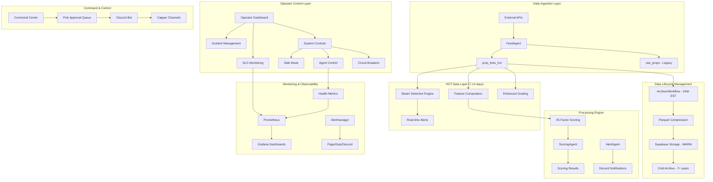

# Syndicate-Grade Unit Talk System Architecture

## 🏗️ Overview

The Unit Talk platform implements a Fortune 100-grade, syndicate-level betting intelligence system designed to handle 8K+ simultaneous props with enterprise-level performance, reliability, and operational excellence.

## 📊 System Architecture Diagram



## 🔄 Data Flow Architecture

### HOT Data Path (Real-time Processing)
1. **Ingestion**: FeedAgent receives market data from external APIs
2. **Storage**: Data written to `prop_ticks_hot` with automatic partitioning
3. **Processing**: Parallel processing for steam detection, feature computation, and grading
4. **Alerts**: Real-time notifications for significant market movements
5. **Retention**: 7-14 day retention with automatic cleanup

### WARM Data Path (Historical Analysis)
1. **Archival**: Daily 2AM EST workflow processes HOT data
2. **Compression**: Parquet format with 5-20x compression ratios
3. **Storage**: Supabase Storage with metadata tracking
4. **Retention**: 2-year queryable historical data
5. **Integrity**: Continuous validation and error recovery

### COLD Data Path (Long-term Archive)
1. **Lifecycle**: Automated transition from WARM to COLD
2. **Compliance**: Legal hold and retention policy enforcement
3. **Optimization**: Storage class transitions for cost efficiency
4. **Access**: On-demand retrieval for compliance and analysis

## 🧠 Processing Architecture

### 45-Factor Scoring System
The system implements a comprehensive 45-factor professional scoring system:

**Market Intelligence Factors (15)**
- Line movement velocity and acceleration
- Steam detection and sharp money indicators
- Market efficiency and closing line value
- Volume-weighted average price movements
- Cross-sport correlation analysis

**Player Performance Factors (15)**
- Historical performance in similar conditions
- Recent form and trend analysis
- Matchup-specific performance metrics
- Injury impact and recovery patterns
- Weather and venue considerations

**Risk Management Factors (15)**
- Portfolio correlation and concentration risk
- Kelly criterion optimal sizing
- Volatility and variance metrics
- Drawdown protection mechanisms
- Position sizing optimization

### Enhanced Grading Engine
- **Material Change Detection**: Automatic re-grading on significant data updates
- **Ensemble Methods**: Weighted, neural, and traditional scoring approaches
- **Real-time Processing**: Sub-second grading for 8K+ props
- **Quality Assurance**: Continuous validation and error detection

## 🛡️ Operational Excellence

### Service Level Objectives (SLOs)
- **API Response Time**: 95th percentile < 100ms
- **Database Query Time**: 95th percentile < 50ms
- **Steam Detection Latency**: 95th percentile < 5 seconds
- **Feature Computation Rate**: > 1000 features/second
- **System Availability**: 99.9% uptime
- **Data Quality**: > 95% accuracy validation

### Incident Management
- **Automated Detection**: SLO violations trigger automatic incident creation
- **Escalation Policies**: Time-based escalation with on-call rotation
- **Communication**: Real-time updates via Discord and dashboard
- **Post-Incident**: Automated root cause analysis and improvement tracking

### Circuit Breaker Pattern
- **External Services**: Automatic failover for third-party API failures
- **Database Protection**: Query complexity limits and connection pooling
- **Agent Health**: Automatic restart and degraded mode operation
- **Cascading Failure Prevention**: Service isolation and bulkhead patterns

## 🚨 Safety and Control Systems

### Safe Mode Operations
When enabled, safe mode implements:
- **Reduced Processing**: Lower throughput with higher validation
- **Enhanced Monitoring**: Increased health check frequency
- **Conservative Decisions**: Err on side of caution for edge cases
- **Operator Oversight**: Manual approval for significant actions

### Emergency Procedures
- **Emergency Stop**: Immediate halt of all processing with state preservation
- **Rollback Capabilities**: Automated and manual rollback procedures
- **Data Recovery**: Point-in-time recovery with consistency validation
- **Communication**: Automatic stakeholder notification and status updates

## 📈 Performance Characteristics

### Throughput Metrics
- **Props Processing**: 8,000+ simultaneous props
- **Steam Detection**: Real-time processing with < 5-second latency
- **Feature Computation**: 1,000+ features computed per second
- **Grading Throughput**: 500+ grades per minute
- **Alert Generation**: < 1-second notification delivery

### Resource Utilization
- **CPU**: Target 60-70% utilization with burst capacity
- **Memory**: Efficient caching with automatic garbage collection
- **Database**: Connection pooling with read replicas
- **Network**: Optimized payloads with compression
- **Storage**: Tiered storage with automatic lifecycle management

### Scalability Patterns
- **Horizontal Scaling**: Container orchestration with auto-scaling
- **Database Sharding**: Partitioned tables by date and sport
- **Caching Strategy**: Multi-layer caching with invalidation
- **Load Distribution**: Round-robin with health-aware routing

## 🔧 Technology Stack

### Core Services
- **Runtime**: Node.js with TypeScript
- **Framework**: Express.js with comprehensive middleware
- **Database**: PostgreSQL with read replicas
- **Cache**: Redis with clustering
- **Message Queue**: Temporal workflows
- **Storage**: Supabase Storage with Parquet files

### Monitoring & Observability
- **Metrics**: Prometheus with custom collectors
- **Visualization**: Grafana with custom dashboards
- **Alerting**: Alertmanager with PagerDuty integration
- **Logging**: Structured logging with correlation IDs
- **Tracing**: Distributed tracing for complex workflows

### Infrastructure
- **Containerization**: Docker with docker-compose
- **Orchestration**: Kubernetes-ready container design
- **Service Mesh**: Envoy proxy for advanced routing
- **Security**: OAuth2, RBAC, and audit logging
- **Backup**: Automated backups with point-in-time recovery

## 🔍 Data Architecture Deep Dive

### Partitioning Strategy
```sql
-- Daily partitions for HOT data
CREATE TABLE prop_ticks_hot_20250910 PARTITION OF prop_ticks_hot
FOR VALUES FROM ('2025-09-10') TO ('2025-09-11');

-- Automatic partition management
SELECT * FROM pg_partman.create_parent(
    p_parent_table => 'public.prop_ticks_hot',
    p_control => 'tick_timestamp',
    p_type => 'range',
    p_interval => 'daily'
);
```

### Index Optimization
```sql
-- Composite indexes for query performance
CREATE INDEX CONCURRENTLY idx_hot_sport_timestamp 
ON prop_ticks_hot (sport, tick_timestamp DESC);

CREATE INDEX CONCURRENTLY idx_hot_steam_detection 
ON prop_ticks_hot (steam_detected, tick_timestamp DESC) 
WHERE steam_detected = true;

-- Partial indexes for specific use cases
CREATE INDEX CONCURRENTLY idx_hot_high_quality_features
ON prop_ticks_hot (sport, tick_timestamp)
WHERE (computation_metadata->>'data_quality')::numeric > 0.9;
```

### Data Quality Framework
- **Validation Rules**: Comprehensive data validation on ingestion
- **Anomaly Detection**: Statistical outlier detection for market data
- **Consistency Checks**: Cross-validation between data sources
- **Completeness Monitoring**: Missing data detection and alerting
- **Accuracy Metrics**: Continuous comparison with authoritative sources

## 🛠️ Development & Deployment

### CI/CD Pipeline
1. **Code Quality**: TypeScript compilation, linting, and testing
2. **Security Scanning**: Vulnerability assessment and dependency analysis
3. **Performance Testing**: Load testing and benchmark validation
4. **Integration Testing**: End-to-end system validation
5. **Deployment**: Blue-green deployment with automatic rollback

### Feature Flags
- **Gradual Rollout**: Percentage-based feature activation
- **Circuit Breakers**: Automatic feature disabling on errors
- **A/B Testing**: Comparative analysis of system changes
- **Emergency Toggles**: Instant feature disabling capabilities

### Configuration Management
- **Environment-Specific**: Development, staging, and production configs
- **Secret Management**: Encrypted storage and rotation
- **Dynamic Configuration**: Runtime configuration updates
- **Validation**: Configuration schema validation and testing

---

**Architecture Version**: 2.0 (September 2025)  
**Last Updated**: September 10, 2025  
**Next Review**: Monthly architecture review  
**Owner**: Engineering Team