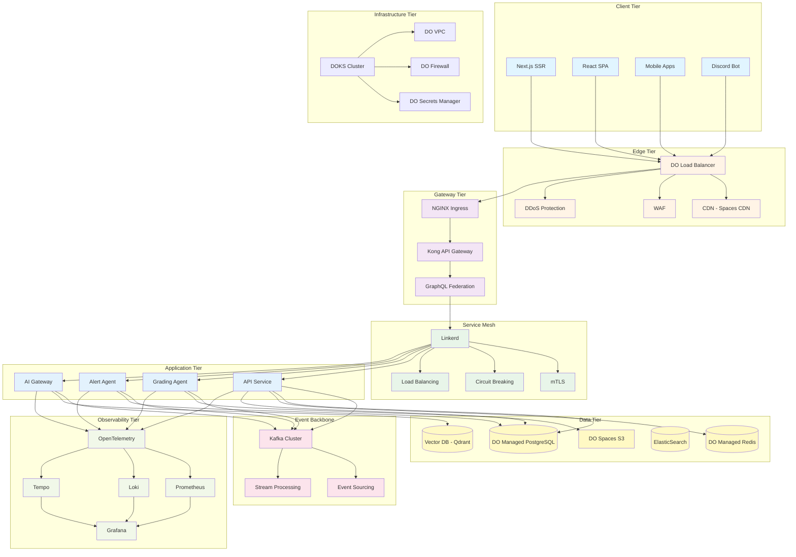

# Overall Architecture - Layered View

## Diagram Specification

This diagram shows the complete layered architecture of the Unit Talk platform.

## Mermaid Diagram



## Rendering Instructions

To render this diagram to PNG/SVG:

### Using Mermaid CLI
```bash
# Install mermaid-cli
npm install -g @mermaid-js/mermaid-cli

# Render to PNG (high resolution)
mmdc -i 01-overall-architecture.md -o 01-overall-architecture.png -w 3000 -H 2400 -b transparent

# Render to SVG (vector)
mmdc -i 01-overall-architecture.md -o 01-overall-architecture.svg -b transparent
```

### Using Online Tools
- [Mermaid Live Editor](https://mermaid.live/)
- [Draw.io with Mermaid plugin](https://app.diagrams.net/)

## Description

This layered architecture diagram illustrates the complete Unit Talk platform stack:

**Client Tier**: User-facing applications and interfaces
**Edge Tier**: Global distribution, security, and DDoS protection
**Gateway Tier**: Request routing, authentication, and API management
**Service Mesh**: Service-to-service communication, mTLS, and resilience
**Application Tier**: Core business logic microservices
**Event Backbone**: Asynchronous communication and event streaming
**Data Tier**: Persistent storage, caching, and search
**Observability Tier**: Monitoring, logging, and tracing
**Infrastructure Tier**: Kubernetes orchestration and DigitalOcean services
