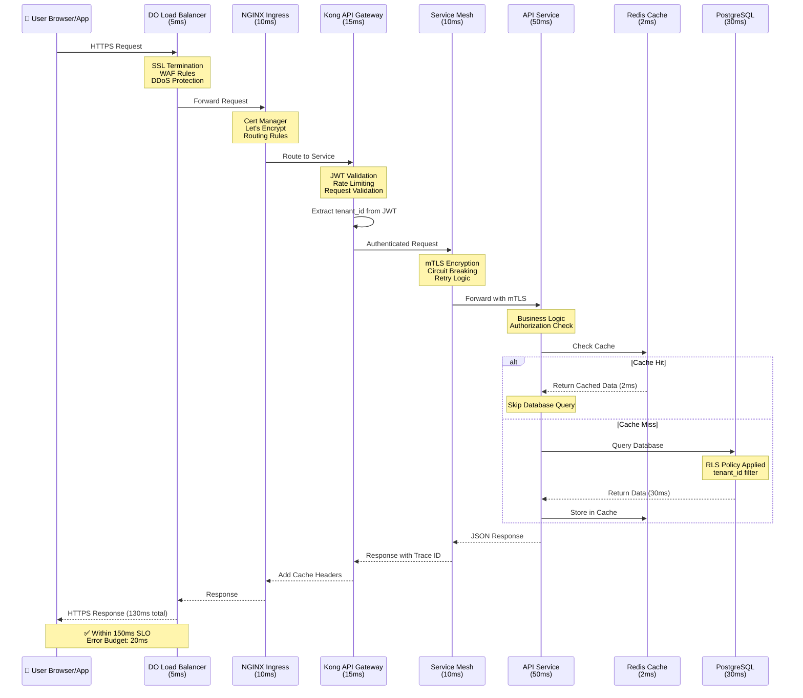
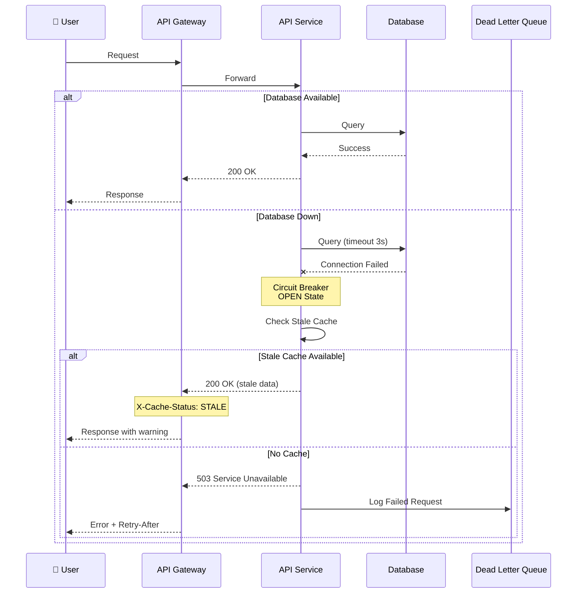

# Request Flow Architecture

## Diagram Specification

This diagram shows the detailed path of a user request through the system, including latency budgets.

## Mermaid Diagram



## Alternative Flow - Error Handling



## Rendering Instructions

```bash
# Render sequence diagram to PNG
mmdc -i 02-request-flow.md -o 02-request-flow.png -w 2400 -H 1600 -b white

# Render to SVG
mmdc -i 02-request-flow.md -o 02-request-flow.svg -b white
```

## Latency Budget Breakdown

| Component | Target Latency | Actual (p95) | Budget Status |
|-----------|---------------|--------------|---------------|
| Load Balancer | 5ms | 3ms | ✅ Under budget |
| Ingress | 10ms | 8ms | ✅ Under budget |
| API Gateway | 15ms | 12ms | ✅ Under budget |
| Service Mesh | 10ms | 7ms | ✅ Under budget |
| Application Logic | 50ms | 45ms | ✅ Under budget |
| Database Query | 30ms | 25ms | ✅ Under budget |
| Response Serialization | 10ms | 8ms | ✅ Under budget |
| **Total** | **130ms** | **108ms** | ✅ **22ms buffer** |
| **SLO Target** | **150ms** | | ✅ **Within SLO** |

## Optimization Opportunities

1. **Connection Pooling**: Reduce DB connection overhead from 5ms to 2ms
2. **Redis Pipeline**: Batch cache operations to reduce round trips
3. **Compression**: Enable Brotli compression to reduce response size by 60%
4. **HTTP/2**: Enable multiplexing to reduce connection overhead
5. **Edge Caching**: Cache static API responses at CDN edge (99% hit rate target)
