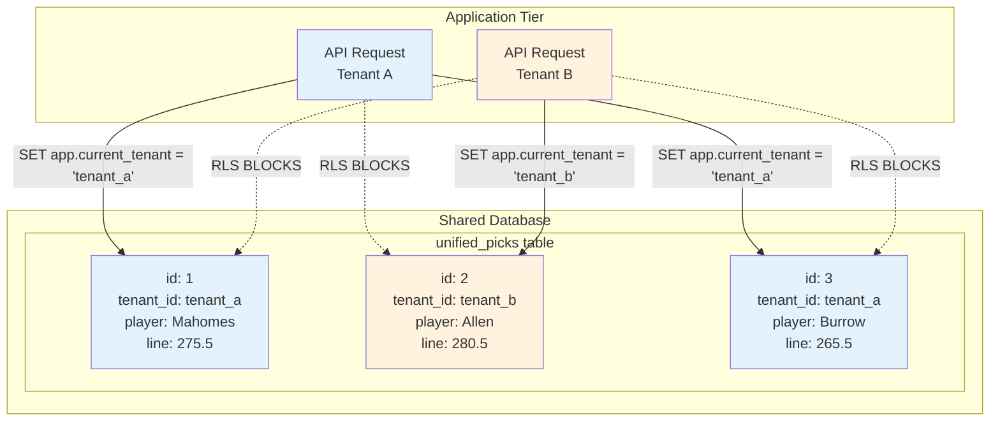
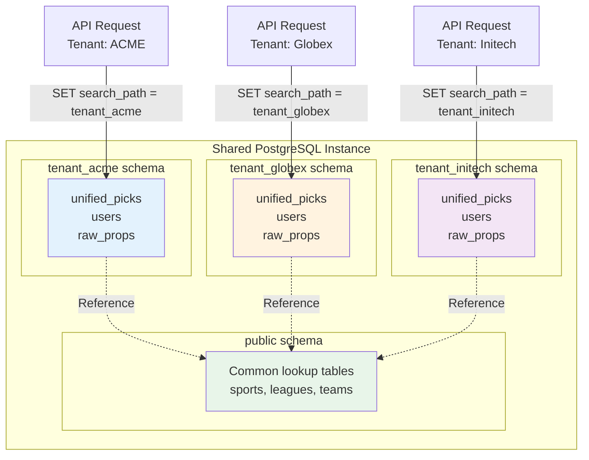
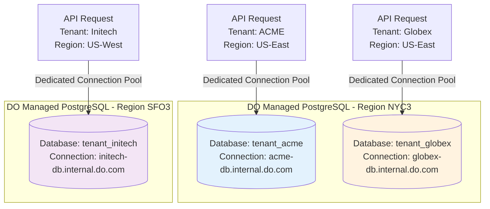
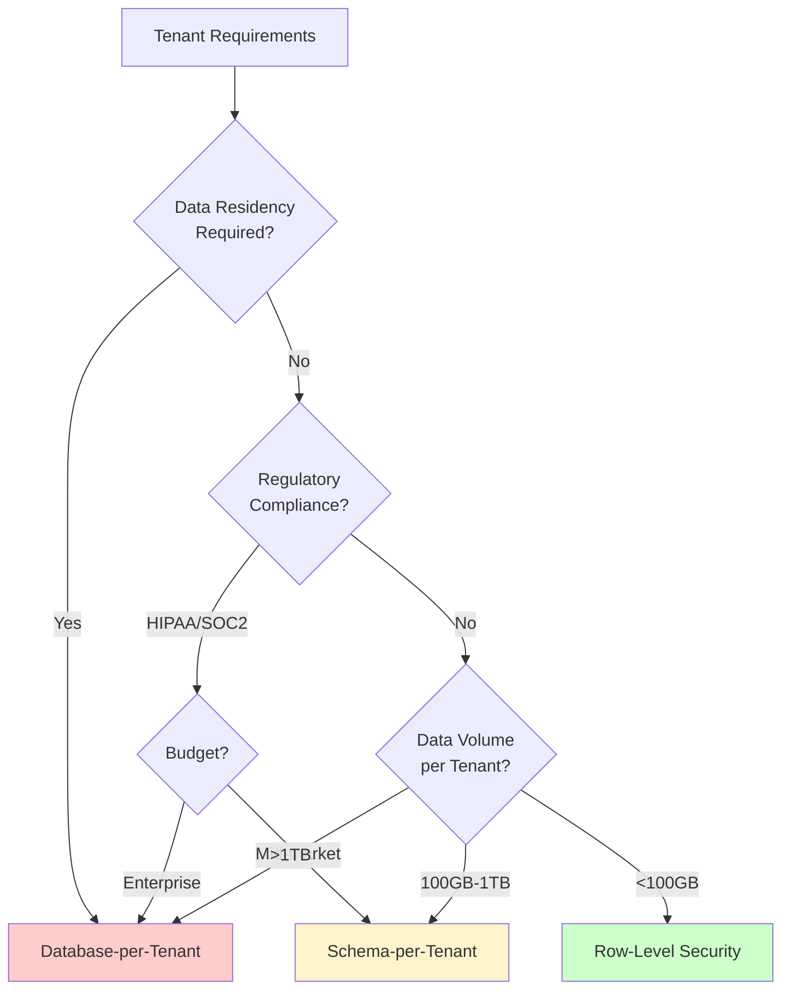

# Multi-Tenant Data Isolation Patterns

## Diagram Specification

Visual comparison of three tenant isolation models with security, cost, and performance trade-offs.

## Pattern 1: Row-Level Security (RLS)



**RLS Policy**:
```sql
CREATE POLICY tenant_isolation ON unified_picks
    FOR ALL
    USING (tenant_id = current_setting('app.current_tenant')::uuid);
```

**Pros**:
- ✅ Cost-effective (single database)
- ✅ Fast tenant onboarding (no schema creation)
- ✅ Simplified management

**Cons**:
- ❌ Requires careful query testing
- ❌ Performance impact on large tables
- ❌ Shared resource contention

**Best For**: Startups, high-volume low-touch, cost-sensitive deployments

---

## Pattern 2: Schema-per-Tenant



**Implementation**:
```sql
-- Create tenant schema
CREATE SCHEMA tenant_acme_corp;
GRANT USAGE ON SCHEMA tenant_acme_corp TO app_role;

-- Set search path per request
SET search_path TO tenant_acme_corp, public;
```

**Pros**:
- ✅ Strong logical isolation
- ✅ Custom schema modifications per tenant
- ✅ Better query performance (no RLS overhead)

**Cons**:
- ❌ Migration complexity (N schemas to update)
- ❌ Connection pool management overhead

**Best For**: Mid-market, SMB growth, regulated industries

---

## Pattern 3: Database-per-Tenant



**Connection Routing**:
```typescript
const getTenantDatabase = (tenantId: string) => {
  const config = tenantConfigs[tenantId];
  return new Pool({
    host: config.dbHost,
    database: config.dbName,
    user: process.env.DB_USER,
    password: process.env.DB_PASSWORD,
  });
};
```

**Pros**:
- ✅ Complete data isolation (strongest security)
- ✅ Independent scaling and backup strategies
- ✅ No "noisy neighbor" issues
- ✅ Data residency compliance (EU, US regions)

**Cons**:
- ❌ Highest operational cost
- ❌ Complex multi-tenant analytics
- ❌ Database provisioning latency

**Best For**: Enterprise, regulated industries, data residency requirements

---

## Selection Decision Tree



## Comparison Matrix

| Criteria | RLS | Schema-per-Tenant | DB-per-Tenant |
|----------|-----|-------------------|---------------|
| **Security** | ⭐⭐⭐ | ⭐⭐⭐⭐ | ⭐⭐⭐⭐⭐ |
| **Cost** | $ | $$$ | $$$$$ |
| **Performance** | ⭐⭐⭐ | ⭐⭐⭐⭐ | ⭐⭐⭐⭐⭐ |
| **Scalability** | ⭐⭐⭐⭐⭐ | ⭐⭐⭐⭐ | ⭐⭐⭐ |
| **Ops Complexity** | ⭐⭐⭐⭐⭐ | ⭐⭐⭐ | ⭐⭐ |
| **Onboarding Speed** | Fast | Medium | Slow |
| **Data Residency** | ❌ | ❌ | ✅ |
| **Custom Schema** | ❌ | ✅ | ✅ |

## Rendering Instructions

```bash
# Render all multi-tenant diagrams
mmdc -i 03-multi-tenant-patterns.md -o 03-multi-tenant-patterns.png -w 2400 -H 3000 -b white
mmdc -i 03-multi-tenant-patterns.md -o 03-multi-tenant-patterns.svg -b white
```

## Migration Path

```
Phase 1: Launch with RLS (0-1000 tenants)
    ↓
Phase 2: Offer Schema-per-Tenant for enterprise (10-100 tenants)
    ↓
Phase 3: Offer DB-per-Tenant for regulated industries (1-10 tenants)
```

Each tenant can be individually migrated to a higher isolation tier without affecting others.
