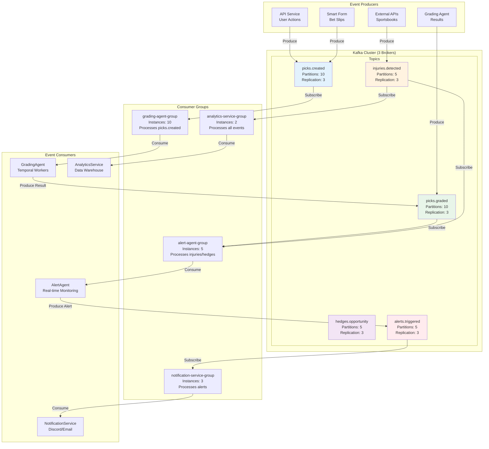
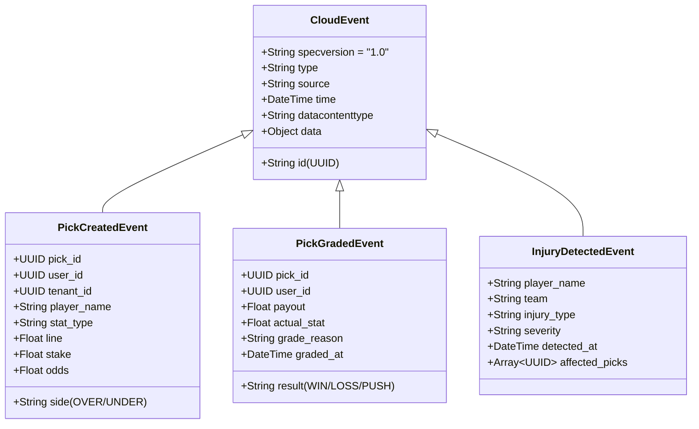
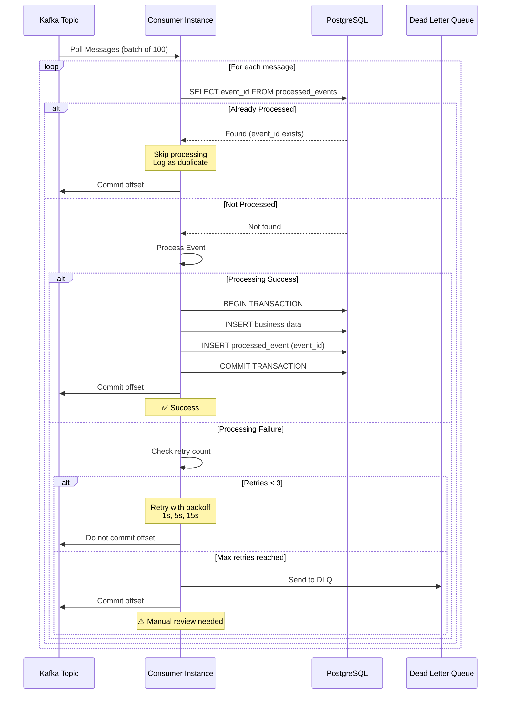
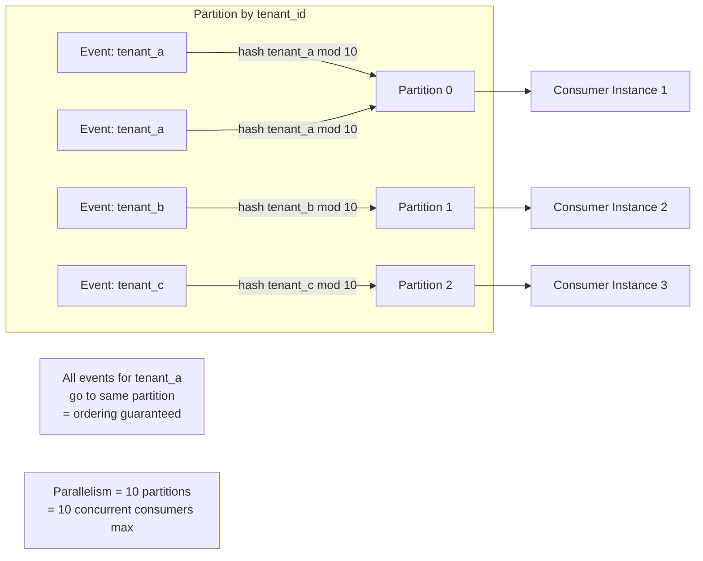
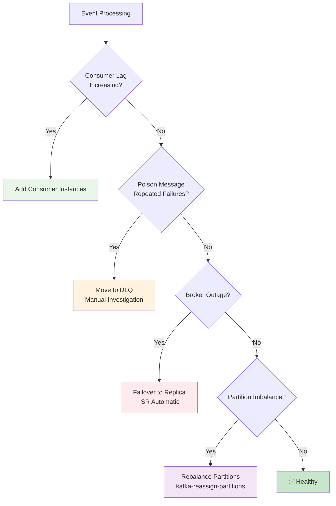

# Event-Driven Architecture - Kafka Backbone

## Diagram Specification

Shows the event streaming architecture with Kafka topics, consumer groups, and event flow patterns.

## Event Flow Architecture



## Event Schema (CloudEvents Standard)



## Event Processing Flow with Idempotency



## Partition Strategy



**Why partition by tenant_id?**
- ✅ Guarantees ordering within a tenant (critical for picks)
- ✅ Even load distribution (assuming balanced tenant activity)
- ✅ Consumer affinity (same consumer processes same tenant)

## Failure Modes and Mitigation



| Failure Mode | Detection Method | Mitigation Strategy | MTTR |
|--------------|------------------|---------------------|------|
| **Consumer Lag** | Kafka consumer lag metric >1000 | Add consumer instances (HPA) | 2 min |
| **Poison Message** | Same offset fails 3+ times | Move to DLQ, skip offset | 1 min |
| **Broker Outage** | Broker health check fails | Automatic ISR failover | 30 sec |
| **Partition Imbalance** | Throughput variance >50% | Manual rebalance | 10 min |
| **Schema Incompatibility** | Deserialization error | Schema registry version check | 5 min |

## Kafka Configuration Best Practices

```yaml
# Broker Configuration
num.partitions: 10  # Per topic
default.replication.factor: 3  # HA
min.insync.replicas: 2  # Write durability
log.retention.hours: 168  # 7 days
log.segment.bytes: 1073741824  # 1GB segments

# Producer Configuration
acks: all  # Wait for all replicas
compression.type: lz4  # Fast compression
max.in.flight.requests.per.connection: 5
enable.idempotence: true  # Prevent duplicates

# Consumer Configuration
enable.auto.commit: false  # Manual commit for safety
max.poll.records: 100  # Batch size
session.timeout.ms: 10000  # 10s heartbeat
max.poll.interval.ms: 300000  # 5min processing window
```

## Event Replay Capability

```typescript
// Replay events from specific timestamp
async function replayEvents(topic: string, fromTimestamp: Date) {
  const admin = kafka.admin();
  const consumer = kafka.consumer({ groupId: `replay-${Date.now()}` });

  await admin.connect();
  await consumer.connect();

  // Seek to timestamp
  await consumer.subscribe({ topic, fromBeginning: false });

  const partitions = await admin.fetchTopicOffsets(topic);

  for (const partition of partitions) {
    await consumer.seek({
      topic,
      partition: partition.partition,
      offset: partition.offset, // Or use timestamp: fromTimestamp
    });
  }

  // Process replayed events
  await consumer.run({
    eachMessage: async ({ message }) => {
      await processEvent(message);
    },
  });
}
```

## Monitoring Metrics

Key metrics to track for Kafka health:

```
# Broker Metrics
kafka_server_broker_topic_metrics_messages_in_total
kafka_server_broker_topic_metrics_bytes_in_total
kafka_server_replica_manager_under_replicated_partitions

# Consumer Metrics
kafka_consumer_group_lag
kafka_consumer_fetch_manager_records_consumed_total
kafka_consumer_coordinator_commit_latency_avg

# Producer Metrics
kafka_producer_record_send_total
kafka_producer_record_error_total
kafka_producer_compression_rate_avg
```

## Rendering Instructions

```bash
# Render event backbone diagrams
mmdc -i 04-event-backbone.md -o 04-event-backbone.png -w 2800 -H 2400 -b white
mmdc -i 04-event-backbone.md -o 04-event-backbone.svg -b white
```
