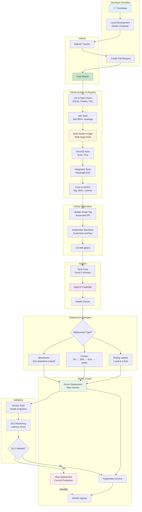
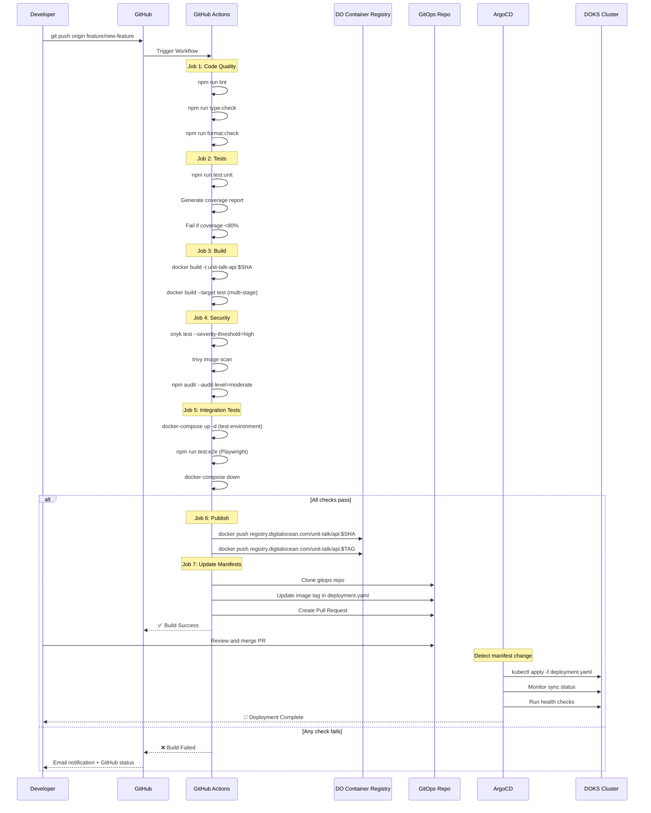
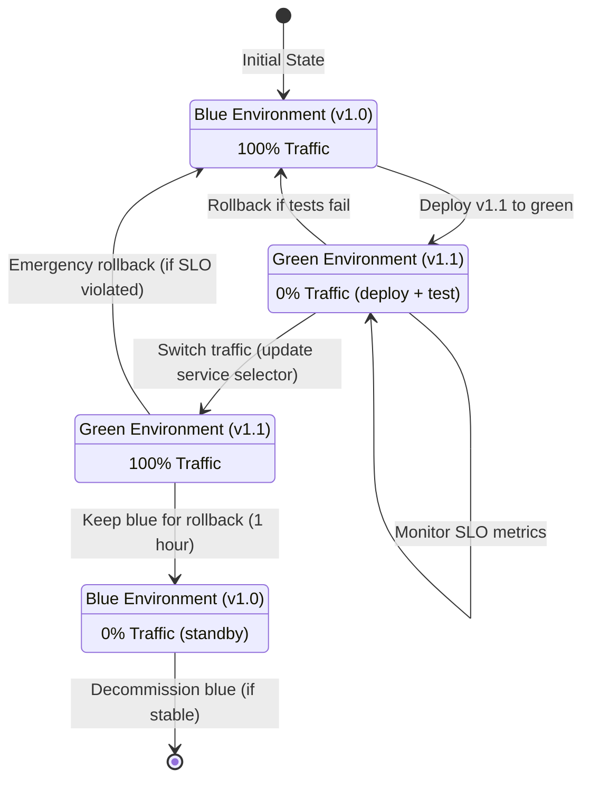
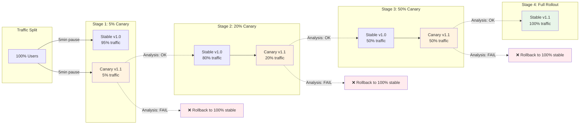
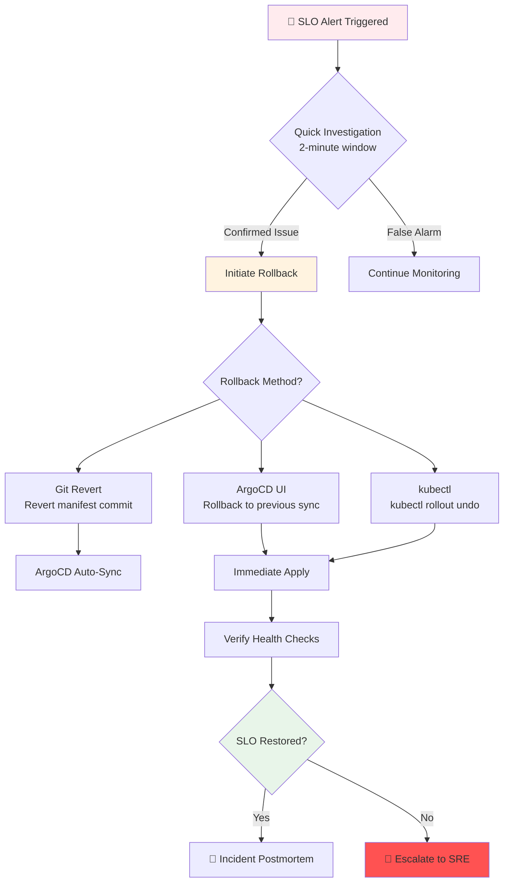

# GitOps CI/CD Flow

## Diagram Specification

Complete CI/CD pipeline from code commit to production deployment using GitHub Actions and ArgoCD.

## GitOps Workflow



## Detailed CI Pipeline (GitHub Actions)



## Blue/Green Deployment Strategy



**Implementation**:
```yaml
# Blue deployment (current production)
apiVersion: apps/v1
kind: Deployment
metadata:
  name: api-blue
spec:
  replicas: 10
  template:
    metadata:
      labels:
        app: api
        version: blue
    spec:
      containers:
      - name: api
        image: registry.digitalocean.com/unit-talk/api:v1.0.0

---
# Green deployment (new version)
apiVersion: apps/v1
kind: Deployment
metadata:
  name: api-green
spec:
  replicas: 10
  template:
    metadata:
      labels:
        app: api
        version: green
    spec:
      containers:
      - name: api
        image: registry.digitalocean.com/unit-talk/api:v1.1.0

---
# Service switches traffic
apiVersion: v1
kind: Service
metadata:
  name: api
spec:
  selector:
    app: api
    version: blue  # Change to "green" to cut over
  ports:
  - port: 80
    targetPort: 3000
```

## Canary Deployment with Argo Rollouts



**Argo Rollouts Configuration**:
```yaml
apiVersion: argoproj.io/v1alpha1
kind: Rollout
metadata:
  name: api
spec:
  replicas: 10
  strategy:
    canary:
      steps:
        - setWeight: 5   # 5% traffic to canary
        - pause: { duration: 5m }
        - analysis:
            templates:
              - templateName: error-rate-check
              - templateName: latency-check
        - setWeight: 20  # 20% traffic
        - pause: { duration: 5m }
        - analysis:
            templates:
              - templateName: error-rate-check
              - templateName: latency-check
        - setWeight: 50  # 50% traffic
        - pause: { duration: 5m }
        - analysis:
            templates:
              - templateName: error-rate-check
              - templateName: latency-check
        - setWeight: 100 # Full rollout

---
apiVersion: argoproj.io/v1alpha1
kind: AnalysisTemplate
metadata:
  name: error-rate-check
spec:
  metrics:
    - name: error-rate
      interval: 1m
      successCondition: result < 0.01  # <1% error rate
      failureLimit: 3
      provider:
        prometheus:
          address: http://prometheus:9090
          query: |
            rate(http_requests_total{status=~"5..",app="api",version="canary"}[5m])
            /
            rate(http_requests_total{app="api",version="canary"}[5m])
```

## Repository Structure

```
unit-talk-gitops/
├── apps/
│   ├── api/
│   │   ├── base/
│   │   │   ├── deployment.yaml
│   │   │   ├── service.yaml
│   │   │   ├── configmap.yaml
│   │   │   └── kustomization.yaml
│   │   ├── overlays/
│   │   │   ├── dev/
│   │   │   │   ├── kustomization.yaml
│   │   │   │   └── replicas.yaml (replicas: 1)
│   │   │   ├── staging/
│   │   │   │   ├── kustomization.yaml
│   │   │   │   └── replicas.yaml (replicas: 3)
│   │   │   └── production/
│   │   │       ├── kustomization.yaml
│   │   │       ├── replicas.yaml (replicas: 10)
│   │   │       └── hpa.yaml
├── infrastructure/
│   ├── argocd/
│   ├── prometheus/
│   ├── ingress-nginx/
│   └── cert-manager/
└── argocd-apps/
    ├── app-of-apps.yaml
    └── infrastructure.yaml
```

## ArgoCD App-of-Apps Pattern

```yaml
# argocd-apps/app-of-apps.yaml
apiVersion: argoproj.io/v1alpha1
kind: Application
metadata:
  name: unit-talk-apps
  namespace: argocd
spec:
  project: default
  source:
    repoURL: https://github.com/unit-talk/gitops
    targetRevision: main
    path: apps
  destination:
    server: https://kubernetes.default.svc
    namespace: unit-talk
  syncPolicy:
    automated:
      prune: true
      selfHeal: true
    syncOptions:
      - CreateNamespace=true
```

## Rollback Procedure



**Rollback Commands**:
```bash
# Method 1: Git revert (preferred)
git revert HEAD
git push origin main
# ArgoCD will auto-sync in 3 minutes

# Method 2: ArgoCD CLI
argocd app rollback unit-talk-api <revision-id>

# Method 3: kubectl
kubectl rollout undo deployment/api -n unit-talk

# Verify rollback
kubectl rollout status deployment/api -n unit-talk
```

## Deployment Metrics

Key metrics tracked during deployment:

```yaml
# Prometheus alerts for deployment validation
groups:
  - name: deployment
    rules:
      - alert: HighErrorRateDuringDeployment
        expr: |
          rate(http_requests_total{status=~"5.."}[5m]) /
          rate(http_requests_total[5m]) > 0.01
        for: 2m
        labels:
          severity: critical
        annotations:
          summary: "Error rate >1% during deployment"

      - alert: HighLatencyDuringDeployment
        expr: |
          histogram_quantile(0.95,
            rate(http_request_duration_seconds_bucket[5m])
          ) > 0.2
        for: 2m
        labels:
          severity: critical
        annotations:
          summary: "p95 latency >200ms during deployment"

      - alert: PodCrashLoopBackOff
        expr: |
          rate(kube_pod_container_status_restarts_total[10m]) > 0
        for: 5m
        labels:
          severity: critical
        annotations:
          summary: "Pod restarting frequently"
```

## Rendering Instructions

```bash
# Render GitOps flow diagrams
mmdc -i 05-gitops-flow.md -o 05-gitops-flow.png -w 3200 -H 2400 -b white
mmdc -i 05-gitops-flow.md -o 05-gitops-flow.svg -b white
```

## Deployment Checklist

Before every production deployment:

- [ ] All CI checks passing (lint, tests, security)
- [ ] Code reviewed and approved (2+ approvers)
- [ ] Staging environment tested (smoke + E2E)
- [ ] Database migrations tested (if applicable)
- [ ] Rollback plan documented
- [ ] On-call engineer notified
- [ ] Customer communication sent (if breaking changes)
- [ ] Monitoring dashboards ready
- [ ] SLO alerts configured
