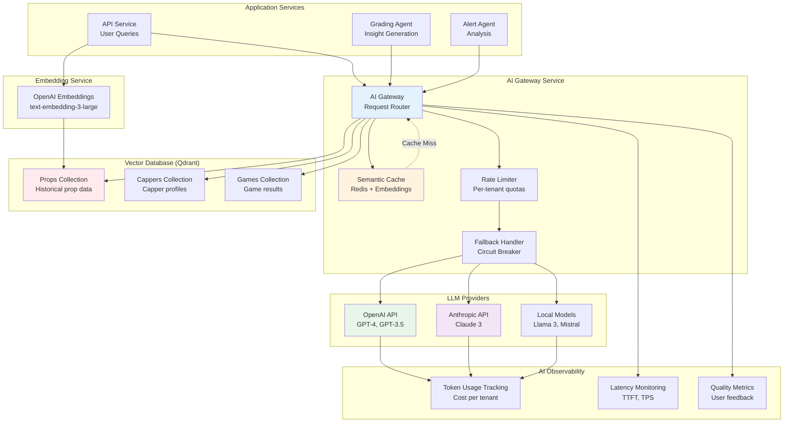
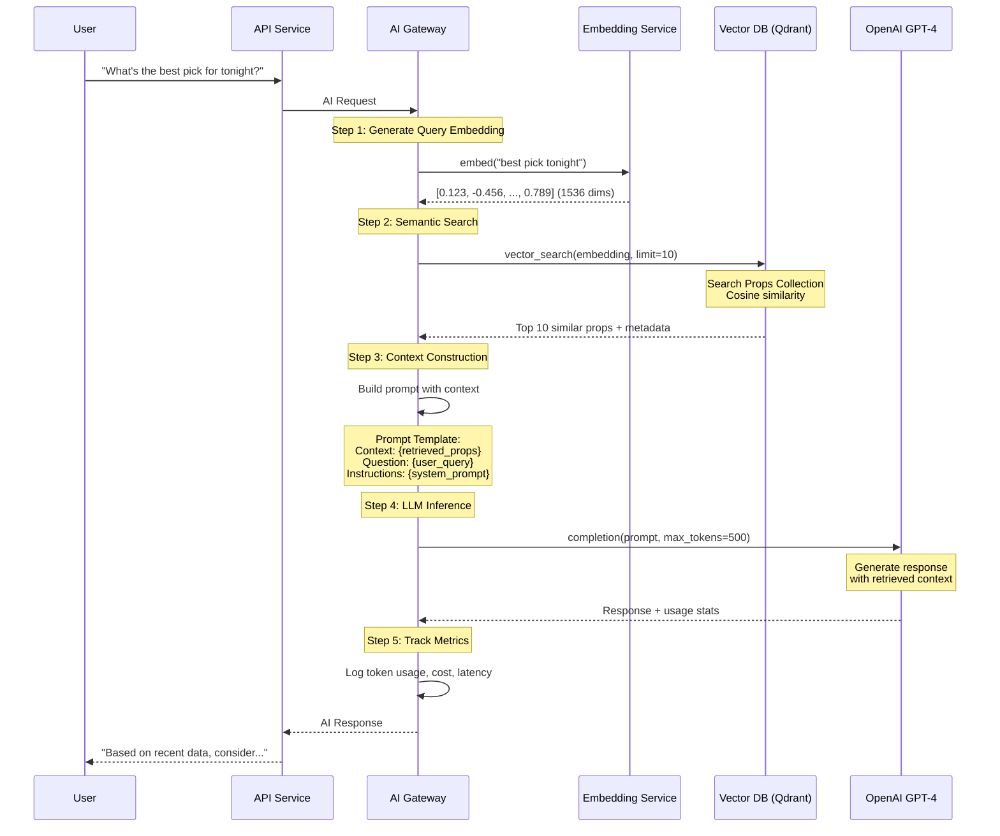
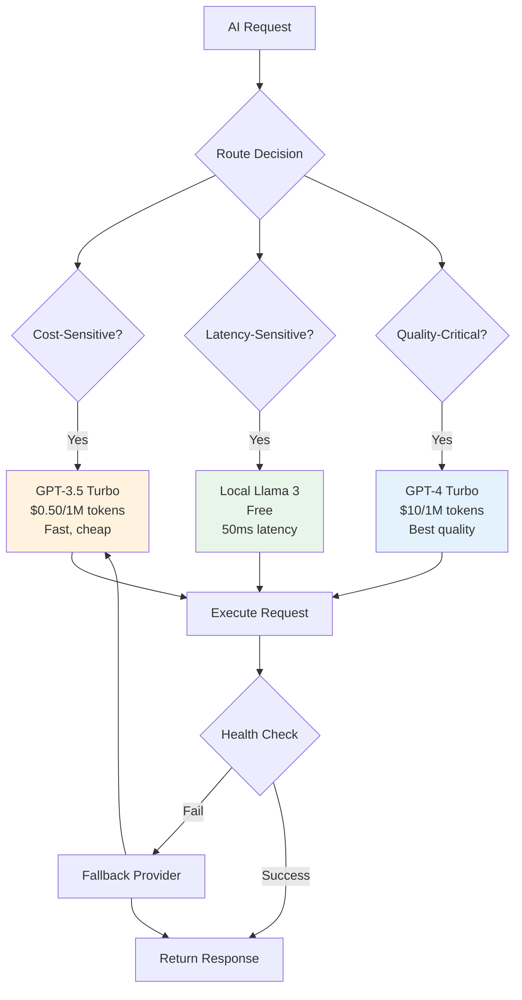
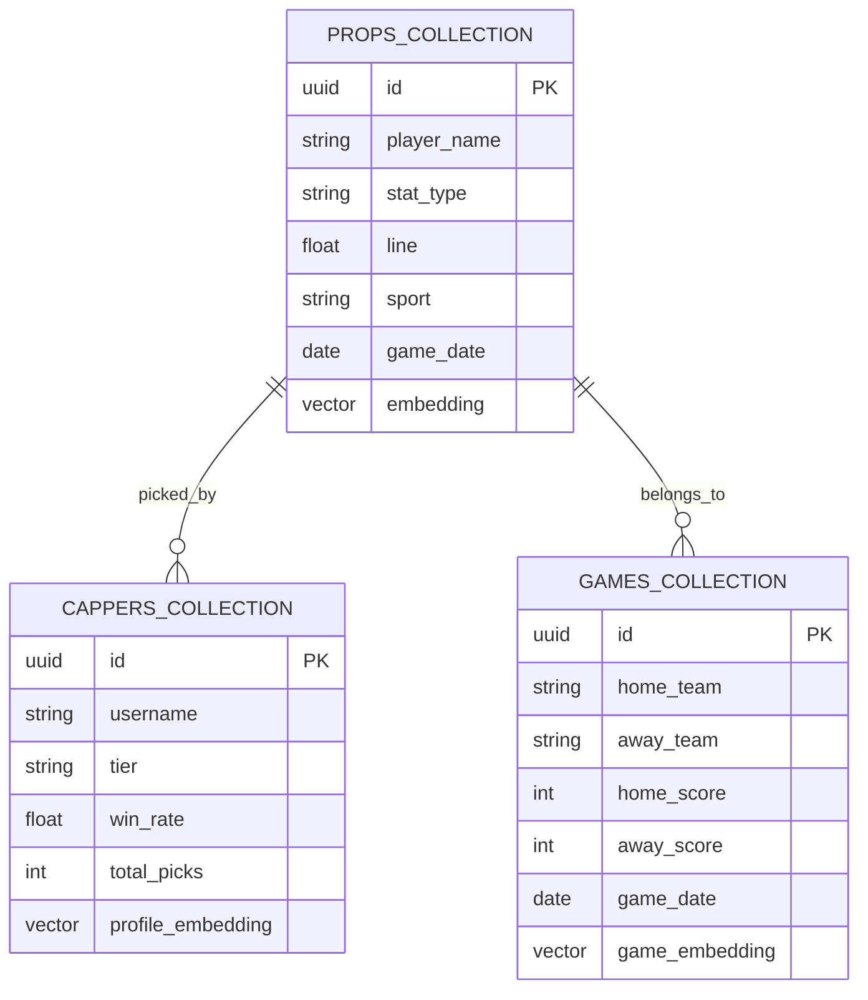
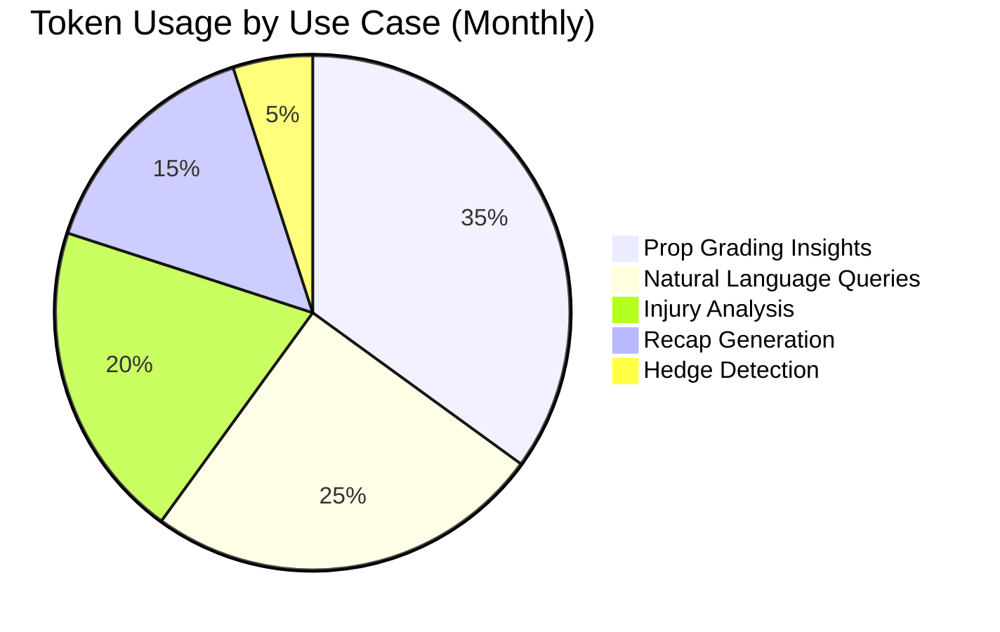
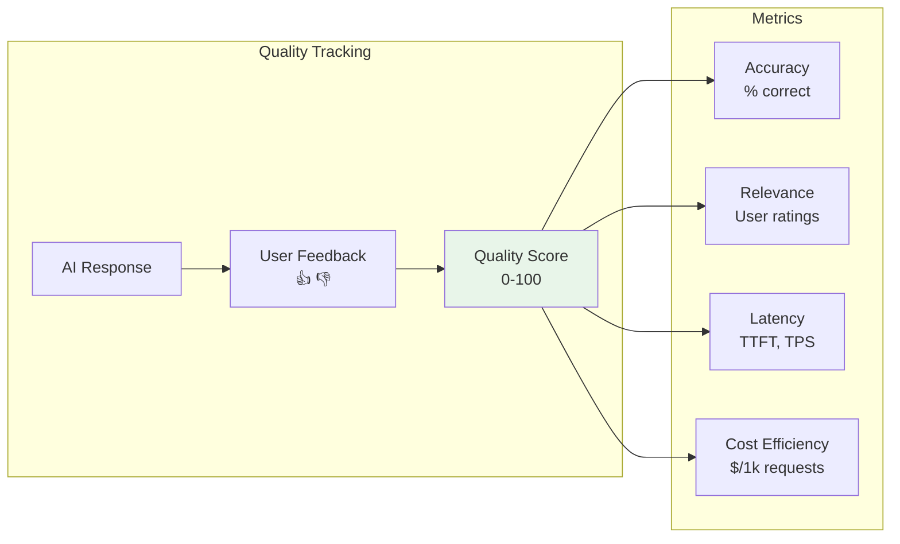
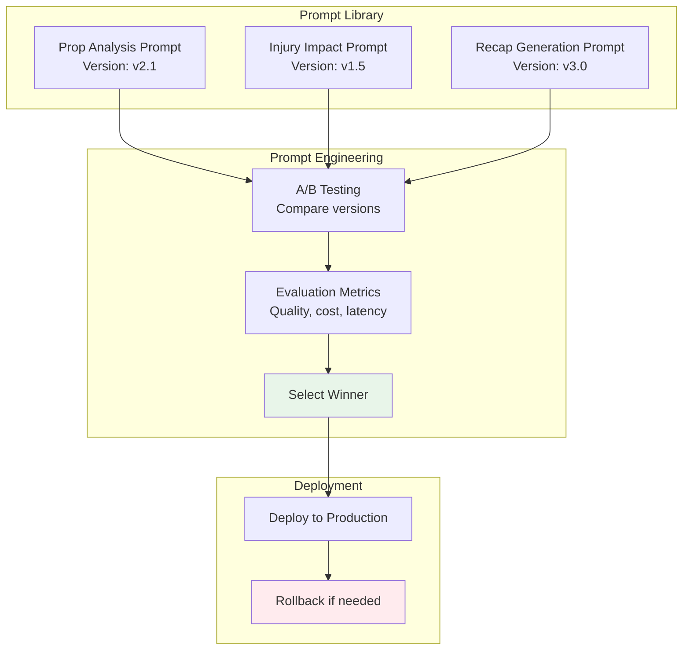
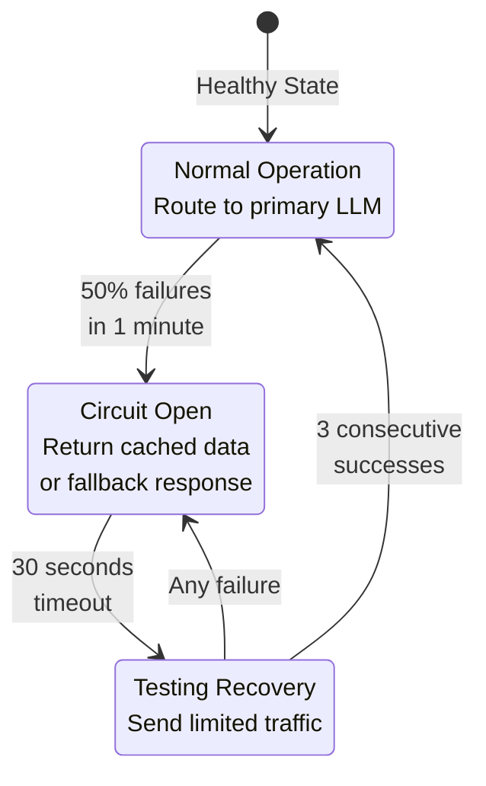

# AI Gateway and Vector Database Architecture

## Diagram Specification

Shows AI integration layer with LLM routing, vector database for RAG, and AI observability.

## AI Gateway Architecture



## RAG (Retrieval-Augmented Generation) Flow



## Semantic Caching

```mermaid
graph LR
    subgraph "Request Flow"
        Q1[Query: "Best NFL pick?"]
        Q2[Query: "Top NFL prop?"]
        Q3[Query: "What is 2+2?"]
    end

    subgraph "Embedding + Similarity Check"
        E1[Embed Query]
        Sim[Cosine Similarity<br/>>0.95 = Cache Hit]
    end

    subgraph "Cache (Redis + Qdrant)"
        Cache1[Cached: "Best NFL pick"<br/>Similarity: 0.97]
        Cache2[Cached: "2+2 answer"<br/>Similarity: 0.42]
    end

    subgraph "Decision"
        Hit[✅ Cache Hit<br/>Return cached response]
        Miss[❌ Cache Miss<br/>Call LLM]
    end

    Q1 --> E1
    Q2 --> E1
    Q3 --> E1

    E1 --> Sim
    Sim --> Cache1
    Sim --> Cache2

    Cache1 -.->|0.97 > 0.95| Hit
    Cache2 -.->|0.42 < 0.95| Miss

    style Hit fill:#e8f5e9
    style Miss fill:#ffebee
```

**Implementation**:
```typescript
async function semanticCache(query: string): Promise<string | null> {
  // 1. Generate embedding for query
  const embedding = await embedQuery(query);

  // 2. Search for similar cached queries
  const similar = await qdrant.search('cache', {
    vector: embedding,
    limit: 1,
    scoreThreshold: 0.95, // 95% similarity
  });

  if (similar.length > 0) {
    // Cache hit - return cached response
    logger.info('Semantic cache hit', { query, similarity: similar[0].score });
    return similar[0].payload.response;
  }

  // Cache miss
  return null;
}
```

## Multi-Provider Routing Strategy



**Routing Configuration**:
```typescript
const routingRules = {
  // Low-stakes queries → cheap model
  summaries: {
    provider: 'openai',
    model: 'gpt-3.5-turbo',
    maxTokens: 200,
    temperature: 0.7,
  },

  // Real-time analysis → low latency
  liveAlerts: {
    provider: 'local',
    model: 'llama-3-8b',
    maxTokens: 150,
    temperature: 0.5,
  },

  // Strategic insights → high quality
  recommendations: {
    provider: 'openai',
    model: 'gpt-4-turbo',
    maxTokens: 500,
    temperature: 0.3,
  },
};
```

## Vector Database Schema



**Qdrant Collection Configuration**:
```python
from qdrant_client import QdrantClient
from qdrant_client.models import Distance, VectorParams

client = QdrantClient(url="http://qdrant:6333")

# Create props collection
client.create_collection(
    collection_name="props",
    vectors_config=VectorParams(
        size=1536,  # OpenAI text-embedding-3-large dimension
        distance=Distance.COSINE,
    ),
    optimizers_config={
        "indexing_threshold": 10000,  # Start indexing after 10k vectors
        "memmap_threshold": 50000,    # Use memory mapping for >50k
    },
)

# Create index for fast filtering
client.create_payload_index(
    collection_name="props",
    field_name="sport",
    field_schema="keyword",
)
```

## AI Cost Management Dashboard



**Cost Tracking Schema**:
```sql
CREATE TABLE ai_usage (
  id UUID PRIMARY KEY,
  tenant_id UUID NOT NULL,
  user_id UUID,
  use_case VARCHAR(100) NOT NULL,
  model VARCHAR(100) NOT NULL,
  prompt_tokens INT NOT NULL,
  completion_tokens INT NOT NULL,
  total_tokens INT NOT NULL,
  cost_usd DECIMAL(10, 6) NOT NULL,
  latency_ms INT NOT NULL,
  cache_hit BOOLEAN DEFAULT FALSE,
  created_at TIMESTAMPTZ DEFAULT NOW()
);

CREATE INDEX idx_ai_usage_tenant_date ON ai_usage(tenant_id, created_at);
CREATE INDEX idx_ai_usage_model ON ai_usage(model);
```

**Cost Calculation**:
```typescript
const MODEL_PRICING = {
  'gpt-4-turbo': { input: 10.0, output: 30.0 },  // per 1M tokens
  'gpt-3.5-turbo': { input: 0.5, output: 1.5 },
  'claude-3-opus': { input: 15.0, output: 75.0 },
  'claude-3-sonnet': { input: 3.0, output: 15.0 },
  'llama-3-8b': { input: 0.0, output: 0.0 },  // Free (self-hosted)
};

function calculateCost(model: string, promptTokens: number, completionTokens: number): number {
  const pricing = MODEL_PRICING[model];
  const inputCost = (promptTokens / 1_000_000) * pricing.input;
  const outputCost = (completionTokens / 1_000_000) * pricing.output;
  return inputCost + outputCost;
}
```

## AI Quality Metrics



**Quality Monitoring**:
```typescript
// Track user feedback
async function trackAIQuality(
  requestId: string,
  feedback: 'positive' | 'negative',
  reason?: string
) {
  await db.query(
    `INSERT INTO ai_quality_feedback
     (request_id, feedback, reason, created_at)
     VALUES ($1, $2, $3, NOW())`,
    [requestId, feedback, reason]
  );

  // Calculate rolling quality score
  const qualityScore = await db.query(`
    SELECT
      COUNT(CASE WHEN feedback = 'positive' THEN 1 END)::float /
      COUNT(*)::float * 100 AS score
    FROM ai_quality_feedback
    WHERE created_at > NOW() - INTERVAL '7 days'
  `);

  // Alert if quality drops below threshold
  if (qualityScore.rows[0].score < 80) {
    await alerting.send({
      severity: 'warning',
      message: `AI quality score dropped to ${qualityScore.rows[0].score}%`,
    });
  }
}
```

## Prompt Management



**Prompt Versioning**:
```typescript
const PROMPTS = {
  propAnalysis: {
    v1: `Analyze this prop: {prop_details}`,
    v2: `As a sports analyst, evaluate this prop bet: {prop_details}. Consider historical data and recent performance.`,
    v2.1: `You are an expert sports betting analyst. Analyze this prop bet in detail:

Player: {player_name}
Stat: {stat_type}
Line: {line}
Odds: {odds}

Historical context: {historical_data}

Provide a concise analysis (100 words) covering:
1. Player's recent performance
2. Matchup factors
3. Value assessment`,
    current: 'v2.1',  // Active version
  },
};
```

## Circuit Breaker for AI Services



**Implementation**:
```typescript
import CircuitBreaker from 'opossum';

const options = {
  timeout: 30000,  // 30s timeout for LLM calls
  errorThresholdPercentage: 50,  // Open circuit at 50% errors
  resetTimeout: 30000,  // Try to close after 30s
};

const breaker = new CircuitBreaker(callLLM, options);

breaker.fallback(() => {
  // Return cached response or generic message
  return getCachedAIResponse() || {
    response: "AI service temporarily unavailable. Please try again.",
    cached: true,
  };
});

breaker.on('open', () => {
  logger.error('AI circuit breaker opened - falling back to cache');
  alerting.send({
    severity: 'critical',
    message: 'AI service circuit breaker OPEN',
  });
});
```

## Rendering Instructions

```bash
# Render AI gateway diagrams
mmdc -i 06-ai-gateway.md -o 06-ai-gateway.png -w 2800 -H 2400 -b white
mmdc -i 06-ai-gateway.md -o 06-ai-gateway.svg -b white
```

## AI Service SLOs

| Metric | Target | Measurement |
|--------|--------|-------------|
| **Availability** | 99.5% | Uptime |
| **Latency (p95)** | <2s | Time to first token |
| **Latency (p99)** | <5s | Full response |
| **Error Rate** | <1% | Failed requests |
| **Cache Hit Rate** | >60% | Semantic cache |
| **Quality Score** | >85% | User feedback |
| **Cost Efficiency** | <$0.10/request | Average cost |
