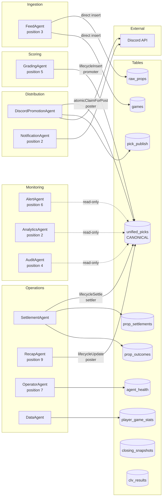

# Agent Ownership

Status: CANONICAL Authority: Tier 1 Owner: Platform Architecture Last Verified:
2026-03-07 Sprint: SPRINT-ARCHITECTURE-LOCK-041C

---

## Agent-to-Table Write Authority

### Write Authority Matrix

| Agent                 | Table                                                | Lifecycle Adapter                    | Writer Role |
| --------------------- | ---------------------------------------------------- | ------------------------------------ | ----------- |
| FeedAgent             | `raw_props`, `games`                                 | Direct insert (compatibility tables) | —           |
| GradingAgent          | `unified_picks`                                      | `lifecycleInsert`                    | `promoter`  |
| DiscordPromotionAgent | `unified_picks`, `pick_publish`                      | `atomicClaimForPost`                 | `poster`    |
| SettlementAgent       | `unified_picks`, `prop_settlements`, `prop_outcomes` | `lifecycleSettle`                    | `settler`   |
| RecapAgent            | `unified_picks`                                      | `lifecycleUpdate`                    | `poster`    |
| DataAgent             | `player_game_stats`                                  | Direct insert (active table)         | —           |
| OperatorAgent         | `agent_health`                                       | Direct insert (active table)         | —           |
| Smart Form            | `bridge_outbox`                                      | Direct insert (active table)         | —           |

### Read-Only Agents

AlertAgent, AnalyticsAgent, AuditAgent, PlayerEnrichmentAgent, ScoringAgent —
these agents read from tables but do not write to canonical or active tables.

---

## Related Documents

- [Agent Ownership Matrix](../../governance/AGENT_OWNERSHIP_MATRIX.md)
- [Table Classification Spec](../../governance/TABLE_CLASSIFICATION_SPEC.md)
