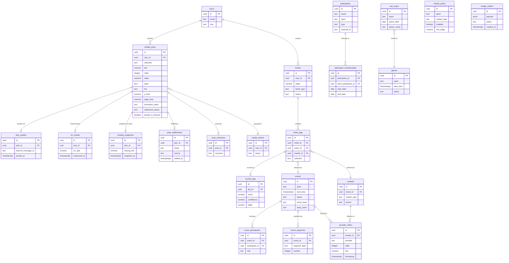

# Database Relationships

Status: CANONICAL Authority: Tier 1 Owner: Platform Architecture Last Verified:
2026-03-07 Sprint: SPRINT-ARCHITECTURE-LOCK-041C

---

## Entity-Relationship Diagram

### Table Classification Summary

| Tier              | Tables                                                                                                                                                         | Write Enforcement       |
| ----------------- | -------------------------------------------------------------------------------------------------------------------------------------------------------------- | ----------------------- |
| **Canonical**     | `unified_picks`, `participants`, `participant_memberships`                                                                                                     | Lifecycle adapters only |
| **Active**        | `bridge_outbox`, `agent_health`, `prop_settlements`, `pick_publish`, `closing_snapshots`, `clv_results`, `player_game_stats`, `prop_outcomes`, `market_policy` | Designated writer agent |
| **V3 Target**     | `events`, `event_participants`, `event_segments`, `markets`, `provider_offers`, `tickets`, `ticket_legs`, `feature_snapshots`, `scored_legs`                   | Migration in progress   |
| **Compatibility** | `raw_props`, `games`, `game_results`                                                                                                                           | Direct writes (legacy)  |
| **Deprecated**    | `daily_picks`, `players`, `teams`                                                                                                                              | No writes               |

---

## Related Documents

- [ERD Schema Reference](../ERD_SCHEMA.md)
- [Table Classification Spec](../../governance/TABLE_CLASSIFICATION_SPEC.md)
