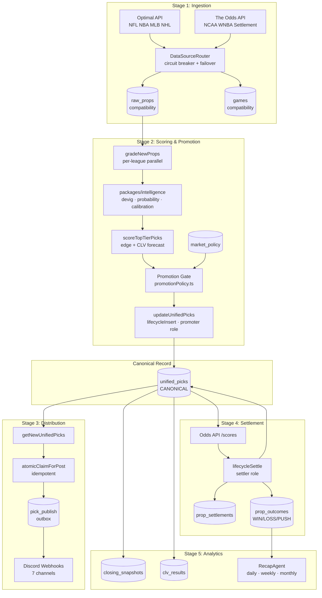
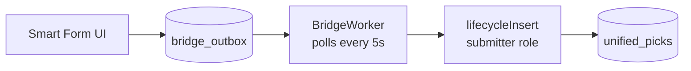

# Pick Machine Flow

Status: CANONICAL Authority: Tier 1 Owner: Platform Architecture Last Verified:
2026-03-07 Sprint: SPRINT-ARCHITECTURE-LOCK-041C

---

## Canonical Pick Lifecycle

### Alternate Entry: Smart Form

### Stage Summary

| Stage           | Agent                 | Activity                                                   | Output Table                        |
| --------------- | --------------------- | ---------------------------------------------------------- | ----------------------------------- |
| 1. Ingestion    | FeedAgent             | `ingestUnifiedData`                                        | `raw_props`, `games`                |
| 2. Scoring      | GradingAgent          | `gradeNewProps`, `scoreTopTierPicks`, `updateUnifiedPicks` | `unified_picks`                     |
| 3. Distribution | DiscordPromotionAgent | `atomicClaimForPost`                                       | `pick_publish` → Discord            |
| 4. Settlement   | SettlementAgent       | `lifecycleSettle`                                          | `prop_settlements`, `prop_outcomes` |
| 5. Analytics    | RecapAgent, CLV       | `triggerDailyRecap`                                        | `closing_snapshots`, `clv_results`  |

---

## Related Documents

- [Canonical Runtime Path](../../system/CANONICAL_RUNTIME_PATH.md)
- [Table Classification Spec](../../governance/TABLE_CLASSIFICATION_SPEC.md)
