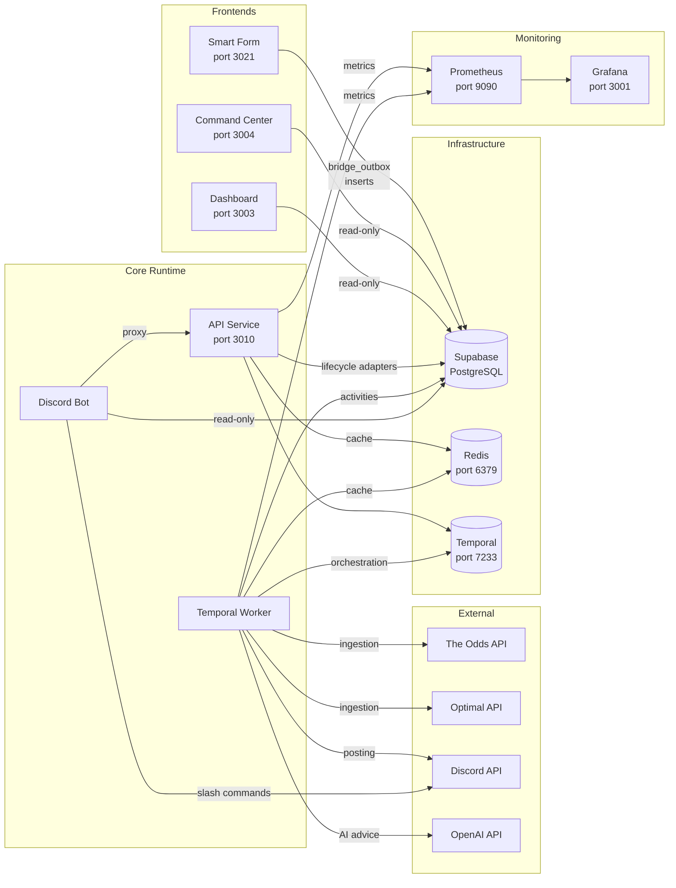

# System Architecture

Status: CANONICAL Authority: Tier 1 Owner: Platform Architecture Last Verified:
2026-03-07 Sprint: SPRINT-ARCHITECTURE-LOCK-041C

---

## Runtime Services & Infrastructure

### Service Inventory

| Service        | Location                        | Port        | Role                                  | Access                     |
| -------------- | ------------------------------- | ----------- | ------------------------------------- | -------------------------- |
| API            | `apps/api`                      | 3010 → 3000 | Canonical writer, agent orchestration | Read/Write                 |
| Workers        | `apps/api` (separate container) | —           | Temporal activity execution           | Read/Write                 |
| Smart Form     | `apps/smart-form`               | 3021        | Ticket submission UI                  | Write `bridge_outbox` only |
| Command Center | `apps/command-center`           | 3004 → 3015 | Operations dashboard                  | Read-only                  |
| Dashboard      | `apps/dashboard`                | 3003        | Analytics frontend                    | Read-only                  |
| Discord Bot    | `apps/discord-bot`              | —           | Slash commands, onboarding            | Read-only + Discord API    |
| Temporal       | Infrastructure                  | 7233 / 8088 | Workflow orchestration                | Internal                   |
| Redis          | Infrastructure                  | 6379        | Caching, autopilot state              | Internal                   |
| Supabase       | Cloud                           | —           | PostgreSQL database                   | Cloud-hosted               |
| Prometheus     | Infrastructure                  | 9090        | Metrics collection                    | Internal                   |
| Grafana        | Infrastructure                  | 3001        | Dashboards                            | Internal                   |

---

## Related Documents

- [Runtime Component Map](../../system/RUNTIME_COMPONENT_MAP.md)
- [System Overview](../../system/SYSTEM_OVERVIEW.md)
