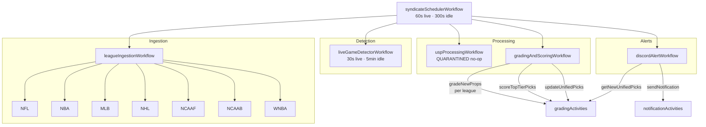
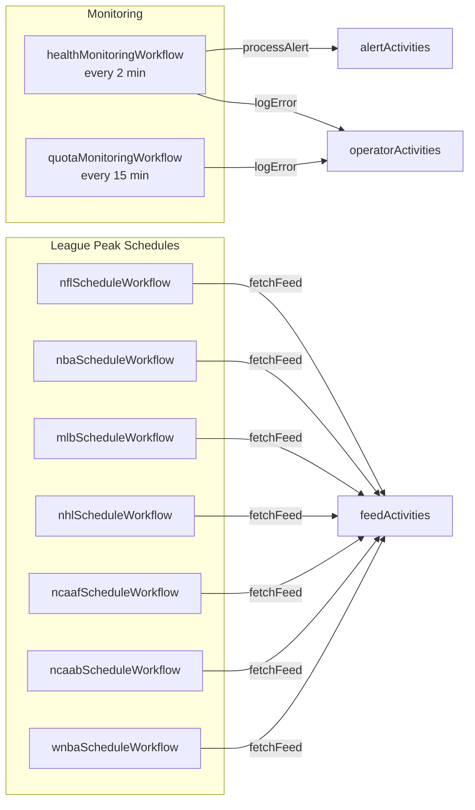
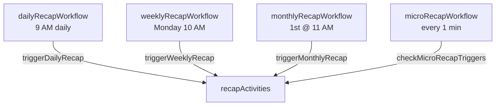

# Workflow Orchestration

Status: CANONICAL Authority: Tier 1 Owner: Platform Architecture Last Verified:
2026-03-07 Sprint: SPRINT-ARCHITECTURE-LOCK-041C

---

## Syndicate Scheduler (Main Orchestration Loop)

**Signals**: `pauseSignal`, `resumeSignal`, `emergencyStopSignal`

---

## Support Workflows (Always-On Background)

---

## Recap Workflows

---

## Temporal Schedule Registry

| Schedule ID                 | Workflow                        | Interval       | Overlap      |
| --------------------------- | ------------------------------- | -------------- | ------------ |
| `syndicate-main-scheduler`  | syndicateSchedulerWorkflow      | 2 min          | SKIP         |
| `live-game-detector`        | liveGameDetectorWorkflow        | 30 min         | CANCEL_OTHER |
| `api-quota-monitor`         | apiQuotaMonitoringWorkflow      | 5 min          | SKIP         |
| `system-health-monitor`     | systemHealthMonitorWorkflow     | 1 min          | SKIP         |
| `daily-cleanup`             | dailyCleanupWorkflow            | 3 AM daily     | CANCEL_OTHER |
| `weekly-performance-report` | weeklyPerformanceReportWorkflow | Sunday 6 AM    | CANCEL_OTHER |
| `{league}-peak-monitor`     | leaguePeakMonitorWorkflow       | 1 min (season) | SKIP         |
| `recap-daily`               | dailyRecapWorkflow              | 9 AM daily     | SKIP         |
| `recap-weekly`              | weeklyRecapWorkflow             | Monday 10 AM   | SKIP         |
| `recap-monthly`             | monthlyRecapWorkflow            | 1st @ 11 AM    | SKIP         |

---

## Legacy Workflows (Backward Compatibility)

| Workflow                   | Activity                                      | Location             |
| -------------------------- | --------------------------------------------- | -------------------- |
| `analyticsWorkflow`        | `analyticsActivities.runAnalysis`             | `workflows/index.ts` |
| `gradingWorkflow`          | `gradingActivities.gradeSubmission`           | `workflows/index.ts` |
| `alertWorkflow`            | `alertActivities.processAlert`                | `workflows/index.ts` |
| `notificationWorkflow`     | `notificationActivities.sendNotification`     | `workflows/index.ts` |
| `feedWorkflow`             | `feedActivities.fetchFeed`                    | `workflows/index.ts` |
| `operatorWorkflow`         | `operatorActivities.monitorSystem`            | `workflows/index.ts` |
| `auditWorkflow`            | `auditActivities.runAudit`                    | `workflows/index.ts` |
| `playerEnrichmentWorkflow` | `playerEnrichmentActivities.enrichAllPlayers` | `workflows/index.ts` |

---

## Related Documents

- [Workflow Activity Contract](../../governance/WORKFLOW_ACTIVITY_CONTRACT.md)
- [Runtime Component Map](../../system/RUNTIME_COMPONENT_MAP.md)
- [Canonical Runtime Path](../../system/CANONICAL_RUNTIME_PATH.md)
