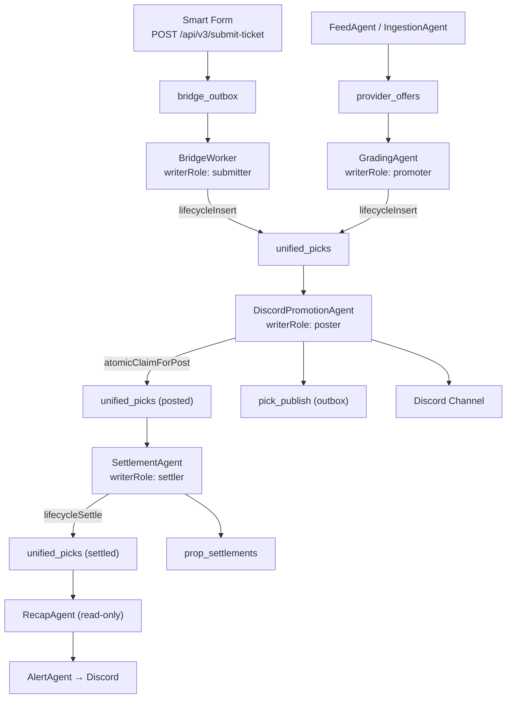

# Pick Lifecycle End-to-End Truth Audit

**Sprint**: SPRINT-PICK-LIFECYCLE-E2E-TRUTH-AUDIT **Date**: 2026-03-09
**Scope**: Canonical pick lifecycle production-readiness assessment
**Architecture**: `provider_offers` + `unified_picks` (post raw_props burndown)

---

## 1. Executive Summary

### Verdict: READY WITH CONDITIONS

The Unit Talk canonical pick lifecycle is **structurally sound** with strong
enforcement at the adapter layer but has **3 HIGH-severity gaps in the
settlement path** that must be addressed before full production confidence.

**Strengths:**

- 11 lifecycle stages, 18 allowed transitions, 5 writer roles — fully codified
  FSM
- All 4 lifecycle adapters enforce autopilot freeze (hard fail-closed)
- `lifecycleUpdate` has optimistic locking (TOCTOU protection)
- `lifecycleClaimForPosting` is atomic and idempotent (WHERE
  `posted_to_discord=false`)
- Single-writer gate enforced in CI via `lifecycle:single-writer --strict`
- 400+ lifecycle test cases covering transitions, authority, idempotency
- Submit idempotency via `bet_slip_id` uniqueness

**Conditions (must fix before production-critical settlement):**

1. `lifecycleSettle` lacks optimistic locking (GAP-04) — TOCTOU race possible
2. SettlementAgent does not use `atomicClaimForSettle` (GAP-01) — double-settle
   possible
3. Outbox receipt failure is swallowed as non-fatal (GAP-03) — observability gap

---

## 2. Lifecycle Architecture

### Two Independent Entry Points

`unified_picks` has two independent write paths that converge at the Discord
publishing stage:



**Path A (Capper Submission):** Smart Form → `bridge_outbox` → BridgeWorker →
`lifecycleInsert(submitter)` → `unified_picks`

**Path B (Pipeline Promotion):** FeedAgent → `provider_offers` → GradingAgent →
`lifecycleInsert(promoter)` → `unified_picks`

Both converge at `unified_picks` and share the downstream flow: Discord →
Settlement → Recap.

---

## 3. Stage-by-Stage Audit

### Stage 1: Submission

| Dimension        | Value                                                                                       |
| ---------------- | ------------------------------------------------------------------------------------------- |
| **Agent**        | Smart Form + BridgeWorker                                                                   |
| **Writer Role**  | `submitter`                                                                                 |
| **Input**        | `bridge_outbox` (event: `ticket_submitted`)                                                 |
| **Output**       | `unified_picks` (insert)                                                                    |
| **Adapter**      | `lifecycleInsert` (`write-adapter.ts:71-123`)                                               |
| **Idempotency**  | `checkSubmitIdempotency` via `bet_slip_id` (`idempotency.ts:36-69`)                         |
| **Freeze Guard** | Yes — `assertNotFrozen` at `write-adapter.ts:79`                                            |
| **Source Files** | `apps/smart-form/app/api/v3/submit-ticket/route.ts`, `apps/api/src/workers/BridgeWorker.ts` |
| **Failure Mode** | BridgeWorker retry loop (max 5 attempts)                                                    |
| **Status**       | COMPLETE                                                                                    |

### Stage 2: Scoring / Grading

| Dimension              | Value                                                                                                                       |
| ---------------------- | --------------------------------------------------------------------------------------------------------------------------- |
| **Agent**              | GradingAgent                                                                                                                |
| **Writer Role**        | `promoter`                                                                                                                  |
| **Input**              | `provider_offers` WHERE `graded_at IS NULL`                                                                                 |
| **Output**             | `unified_picks` (insert) + `provider_offers` (graded_at update)                                                             |
| **Adapter**            | `lifecycleInsert` (`write-adapter.ts:71-123`)                                                                               |
| **Idempotency**        | Implicit — `graded_at` flag prevents re-processing                                                                          |
| **Freeze Guard**       | Yes — `assertNotFrozen` at `write-adapter.ts:79`                                                                            |
| **Promotion Criteria** | `meetsPromotionCriteria` at `GradingAgent.ts:854-881` — edge >= 8% (800bp), confidence >= 85%, S-tier or exceptional A-tier |
| **Source Files**       | `apps/api/src/agents/GradingAgent/GradingAgent.ts`                                                                          |
| **Failure Mode**       | Skip on error, continue batch; re-run grading cycle picks up ungraded                                                       |
| **Status**             | COMPLETE                                                                                                                    |

### Stage 3: Discord Publishing

| Dimension            | Value                                                                                               |
| -------------------- | --------------------------------------------------------------------------------------------------- |
| **Agent**            | DiscordPromotionAgent                                                                               |
| **Writer Role**      | `poster`                                                                                            |
| **Input**            | `unified_picks` WHERE `posted_to_discord = false`                                                   |
| **Output**           | `unified_picks` (update: `posted_to_discord`, `discord_message_id`, meta) + `pick_publish` (outbox) |
| **Adapter**          | `atomicClaimForPost` in `idempotency.ts` + `lifecycleClaimForPosting` (`write-adapter.ts:270-330`)  |
| **Idempotency**      | Atomic WHERE guard: `posted_to_discord = false` → `true` (single-row CAS)                           |
| **Freeze Guard**     | Yes — `assertNotFrozen` at `write-adapter.ts:279`                                                   |
| **Validation Gates** | 4 pre-flight checks: `game_date`, `player_name`, `stat_type`, `line`                                |
| **Outbox**           | `enqueuePickToOutbox` → `pick_publish` table; `recordOutboxReceipt` after Discord post              |
| **Source Files**     | `apps/api/src/agents/DiscordPromotionAgent/index.ts`                                                |
| **Failure Mode**     | Shadow mode default; kill switch via `PROMOTION_KILL_SWITCH` env                                    |
| **Status**           | COMPLETE (with GAP-03 outbox reconciliation issue)                                                  |

### Stage 4: Settlement

| Dimension           | Value                                                                                                                                                                                                                                       |
| ------------------- | ------------------------------------------------------------------------------------------------------------------------------------------------------------------------------------------------------------------------------------------- |
| **Agent**           | SettlementAgent                                                                                                                                                                                                                             |
| **Writer Role**     | `settler`                                                                                                                                                                                                                                   |
| **Input**           | `unified_picks` WHERE `settlement_status IN (null, pending)` + game results (SGO primary, Odds API fallback)                                                                                                                                |
| **Output**          | `unified_picks` (settlement fields) + `prop_settlements` (insert)                                                                                                                                                                           |
| **Adapter**         | `lifecycleSettle` (`write-adapter.ts:336-437`)                                                                                                                                                                                              |
| **Idempotency**     | Query-level WHERE guard only (`settlement_status.is.null,settlement_status.eq.pending` at `SettlementAgent/index.ts:493`). `atomicClaimForSettle` exists in `idempotency.ts` but is **NOT used** by SettlementAgent.                        |
| **Freeze Guard**    | Yes — `assertNotFrozen` at `write-adapter.ts:351`                                                                                                                                                                                           |
| **Optimistic Lock** | **MISSING** — `lifecycleSettle` uses `.eq('id', pickId)` only (`write-adapter.ts:399-402`), no WHERE guard on `settlement_status`. Compare with `lifecycleUpdate` which adds `.eq('settlement_status', ...)` at `write-adapter.ts:198-203`. |
| **Source Files**    | `apps/api/src/agents/SettlementAgent/index.ts`                                                                                                                                                                                              |
| **Failure Mode**    | Skip + manual review flag; disputed settlements via operator_override                                                                                                                                                                       |
| **Status**          | FUNCTIONAL (with GAP-01 + GAP-04 settlement integrity gaps)                                                                                                                                                                                 |

### Stage 5: Recap

| Dimension        | Value                                                                                                                      |
| ---------------- | -------------------------------------------------------------------------------------------------------------------------- |
| **Agent**        | RecapAgent (read-only) → AlertAgent (Discord delivery)                                                                     |
| **Writer Role**  | None (read-only)                                                                                                           |
| **Input**        | `unified_picks` + `prop_settlements`                                                                                       |
| **Output**       | Discord embeds via AlertAgent delegation                                                                                   |
| **Adapter**      | None required (read-only path)                                                                                             |
| **Scheduling**   | Temporal workflows: daily 9AM, weekly Mon 10AM, monthly 1st 11AM (`recap-workflows.ts`)                                    |
| **Source Files** | `apps/api/src/agents/RecapAgent/index.ts`, `apps/api/src/workflows/recap-workflows.ts`                                     |
| **Delegation**   | `RecapAgentType` interface declares `monitorUnifiedPicks()` as "now delegates to AlertAgent" (`RecapAgent/index.ts:39-44`) |
| **Status**       | FUNCTIONAL (GAP-05: delegation chain unverified without live services)                                                     |

### Stage 6: Lifecycle Enforcement

| Dimension           | Value                                                                                                                  |
| ------------------- | ---------------------------------------------------------------------------------------------------------------------- |
| **Module**          | `apps/api/src/lib/lifecycle/`                                                                                          |
| **Stages**          | 11: DRAFT, SUBMITTED, QUEUED, POSTED, SETTLING, SETTLED, BLOCKED, FAILED, CANCELLED, DISPUTED, VOID (`types.ts:36-47`) |
| **Transitions**     | 18 allowed transitions (`transition-validator.ts:29-153`)                                                              |
| **Writer Roles**    | 5: submitter, promoter, poster, settler, operator_override (`types.ts:56-61`)                                          |
| **Field Authority** | 150+ fields mapped to authorized writers (`writer-authority.ts`)                                                       |
| **Freeze Guard**    | `assertNotFrozen` in all 4 adapters — hard fail-closed, no bypass                                                      |
| **CI Gate**         | `lifecycle:single-writer --strict` — scans for unauthorized `.from('unified_picks').insert/update` patterns            |
| **Test Coverage**   | 5 test files, 400+ test cases: lifecycle.test.ts, idempotency.test.ts, writer-authority.test.ts                        |
| **Status**          | STRONG                                                                                                                 |

---

## 4. Invariant Verification Matrix

### State Transition Invariants

All 18 transitions are enforced by `assertTransition()` in
`transition-validator.ts:235-255`. Any transition not in `ALLOWED_TRANSITIONS`
throws `InvalidTransitionError`.

| From      | To        | Allowed Writers             | Verified         |
| --------- | --------- | --------------------------- | ---------------- |
| DRAFT     | SUBMITTED | submitter                   | Yes (test suite) |
| SUBMITTED | QUEUED    | promoter                    | Yes              |
| SUBMITTED | BLOCKED   | promoter                    | Yes              |
| SUBMITTED | SETTLED   | settler                     | Yes              |
| QUEUED    | POSTED    | poster                      | Yes              |
| QUEUED    | BLOCKED   | promoter                    | Yes              |
| QUEUED    | FAILED    | poster                      | Yes              |
| POSTED    | SETTLING  | settler                     | Yes              |
| POSTED    | SETTLED   | settler                     | Yes              |
| SETTLING  | SETTLED   | settler                     | Yes              |
| BLOCKED   | QUEUED    | operator_override           | Yes              |
| BLOCKED   | CANCELLED | operator_override           | Yes              |
| FAILED    | QUEUED    | operator_override, promoter | Yes              |
| FAILED    | CANCELLED | operator_override           | Yes              |
| SETTLED   | DISPUTED  | operator_override           | Yes              |
| DISPUTED  | SETTLED   | settler, operator_override  | Yes              |
| SETTLED   | VOID      | settler, operator_override  | Yes              |
| POSTED    | VOID      | settler, operator_override  | Yes              |

### Timestamp Invariants

Enforced by `validateTimestampInvariants()` at
`transition-validator.ts:298-346`:

| Invariant                                                  | Enforced |
| ---------------------------------------------------------- | -------- |
| `promotion_queued_at >= created_at`                        | Yes      |
| `promotion_posted_at >= promotion_queued_at >= created_at` | Yes      |
| `settled_at >= created_at`                                 | Yes      |
| `settled_at >= promotion_posted_at` (if posted)            | Yes      |
| `freeze_enforced_at >= settled_at`                         | Yes      |

### State Consistency Invariants

Enforced by `validateStateInvariants()` at `transition-validator.ts:355-376`:

| Invariant                                       | Enforced |
| ----------------------------------------------- | -------- |
| POSTED implies `discord_message_id IS NOT NULL` | Yes      |
| SETTLED implies `settlement_result IS NOT NULL` | Yes      |
| SETTLED implies `settled_at IS NOT NULL`        | Yes      |

### Autopilot Freeze Invariant

| Adapter                    | Freeze Check      | Location               |
| -------------------------- | ----------------- | ---------------------- |
| `lifecycleInsert`          | `assertNotFrozen` | `write-adapter.ts:79`  |
| `lifecycleUpdate`          | `assertNotFrozen` | `write-adapter.ts:138` |
| `lifecycleClaimForPosting` | `assertNotFrozen` | `write-adapter.ts:279` |
| `lifecycleSettle`          | `assertNotFrozen` | `write-adapter.ts:351` |

---

## 5. Gap Analysis

### GAP-01: SettlementAgent does not use `atomicClaimForSettle` — HIGH

**Location:** `apps/api/src/agents/SettlementAgent/index.ts:572`

**Finding:** SettlementAgent calls `lifecycleSettle()` directly. The
`atomicClaimForSettle` function exists in `idempotency.ts` but is not used. The
query at line 493 filters
`settlement_status.is.null,settlement_status.eq.pending` but this is a
fetch-time guard, not a write-time atomic claim.

**Risk:** Between the fetch (line 489-493) and the settlement write (line 572),
another process could settle the same pick. The `lifecycleSettle` adapter
validates the transition is allowed but does NOT use a WHERE guard on
`settlement_status` during the actual UPDATE (see GAP-04).

**Recommendation:** Wrap settlement in `atomicClaimForSettle` before calling
`lifecycleSettle`, or add optimistic locking inside `lifecycleSettle` itself.

---

### GAP-02: Two independent unified_picks entry points — MEDIUM

**Location:** BridgeWorker (`submitter`) vs GradingAgent (`promoter`)

**Finding:** `unified_picks` receives rows from two independent paths:

- Path A: Smart Form → bridge_outbox → BridgeWorker → submitter
- Path B: provider_offers → GradingAgent → promoter

These paths produce rows with different `bet_slip_id` values (capper submissions
have user-provided IDs; pipeline picks get generated UUIDs). There is no
cross-reference between the two paths.

**Risk:** A capper could manually submit a pick that was also algorithmically
promoted, resulting in duplicate coverage. This is an architectural decision,
not a bug.

**Recommendation:** Document as intentional. Consider adding `provider_offer_id`
foreign key on `unified_picks` for pipeline pick traceability.

---

### GAP-03: Outbox reconciliation gap in DiscordPromotionAgent — HIGH

**Location:** `apps/api/src/agents/DiscordPromotionAgent/index.ts:135-146`

**Finding:** `recordOutboxReceipt()` is called after a successful Discord post
but failures are logged as "non-fatal" and swallowed (line 143). At this point,
`atomicClaimForPost` has already set `posted_to_discord=true` on
`unified_picks`, but `pick_publish` outbox status remains `pending`.

**Risk:** Picks appear posted in `unified_picks` but `pick_publish` shows stale
`pending` status. Any dashboards or reconciliation jobs using `pick_publish` as
source of truth will show incorrect data.

**Recommendation:** Either make outbox receipt update mandatory (fail the post
if receipt fails, with retry), or add a reconciliation job that syncs
`pick_publish.status` with `unified_picks.posted_to_discord`.

---

### GAP-04: `lifecycleSettle` lacks optimistic locking — HIGH

**Location:** `apps/api/src/lib/lifecycle/write-adapter.ts:399-402`

**Finding:** The `lifecycleSettle` function performs:

```typescript
const { error: updateError } = await supabase
  .from('unified_picks')
  .update(updates)
  .eq('id', pickId); // No WHERE guard on settlement_status
```

Compare with `lifecycleUpdate` (lines 188-203) which adds:

```typescript
if (currentPick.settlement_status !== undefined) {
  updateQuery.eq('settlement_status', currentPick.settlement_status);
}
```

**Risk:** If two SettlementAgent processes settle the same pick concurrently,
the second write overwrites the first without detection. The transition
validator at line 374 checks that the current state allows settlement, but
there's a TOCTOU window between the fetch (line 355) and the update (line 399).

**Recommendation:** Add
`.eq('settlement_status', currentPick.settlement_status)` to the update query in
`lifecycleSettle`, matching the pattern in `lifecycleUpdate`.

---

### GAP-05: RecapAgent → AlertAgent delegation unverified — MEDIUM

**Location:** `apps/api/src/agents/RecapAgent/index.ts:39-44`

**Finding:** The `RecapAgentType` interface declares that Discord posting has
moved to AlertAgent (`monitorUnifiedPicks()` "now delegates to AlertAgent",
`postLivePick()` marked `@deprecated`). The actual delegation implementation
cannot be verified without live service testing.

**Risk:** Recap Discord posts may not fire if the delegation to AlertAgent is
incomplete or if AlertAgent is not running.

**Recommendation:** Verify delegation with live service testing. Scope as
follow-on sprint if live testing is not available.

---

### GAP-06: Discord canary + browser smoke require live services — LOW

**Location:** `governance/claude-os/recipes/verification-recipes.json` (lines
77-83, 117-123)

**Finding:** Known toolchain gap. Both `discord_canary` and `browser_smoke`
verification recipes have `TODO` command placeholders requiring live services.

**Recommendation:** Accept as known limitation. Document in production runbook.

---

### GAP-07: GradingAgent bypasses `promotionPolicy.ts` — LOW

**Location:** `apps/api/src/agents/GradingAgent/GradingAgent.ts:854-881` vs
`apps/api/src/agents/GradingAgent/scoring/promotionPolicy.ts`

**Finding:** GradingAgent's `meetsPromotionCriteria()` uses hardcoded thresholds
(8% edge, 85% confidence, S-tier/exceptional A-tier). The `promotionPolicy.ts`
module provides a configurable policy layer (HARD/SOFT/NONE bands, canary
routing, probability gates) but is used only by DiscordPromotionAgent for
kill-switch checking, not by GradingAgent for promotion decisions.

**Risk:** Two separate promotion gatekeeping systems exist. The GradingAgent's
hardcoded criteria are the actual gate for insertion into `unified_picks`. The
promotion policy layer only gates Discord publishing.

**Recommendation:** Document as architectural debt. Align in follow-on sprint.

---

### GAP-08: No end-to-end integration test — MEDIUM

**Finding:** No single test exercises the full path from bridge_outbox
submission through settlement. The lifecycle tests cover the contract
(transitions, writer authority, idempotency) but not the agent integration.

**Recommendation:** Scope an E2E test sprint covering the full lifecycle path
with mocked Supabase.

---

## 6. Recommended Follow-On Sprints

| Priority | Sprint                                  | Addresses       | Effort                                                                        |
| -------- | --------------------------------------- | --------------- | ----------------------------------------------------------------------------- |
| P1       | SPRINT-SETTLEMENT-IDEMPOTENCY-HARDENING | GAP-01 + GAP-04 | Small — add optimistic lock to `lifecycleSettle`, wire `atomicClaimForSettle` |
| P2       | SPRINT-OUTBOX-RECONCILIATION            | GAP-03          | Medium — reconciliation job or mandatory receipt                              |
| P3       | SPRINT-PROMOTION-POLICY-ALIGNMENT       | GAP-07          | Medium — align GradingAgent with promotionPolicy.ts                           |
| P4       | SPRINT-E2E-LIFECYCLE-TEST               | GAP-08          | Large — integration test with mocked services                                 |
| P5       | SPRINT-RECAP-DELEGATION-VERIFICATION    | GAP-05          | Small — live service verification                                             |

---

## 7. Production-Readiness Assessment

### Summary Table

| Stage                 | Status                | Blocking Gaps                                   |
| --------------------- | --------------------- | ----------------------------------------------- |
| 1. Submission         | PRODUCTION READY      | None                                            |
| 2. Scoring            | PRODUCTION READY      | None                                            |
| 3. Discord Publishing | READY WITH CONDITIONS | GAP-03 (outbox reconciliation)                  |
| 4. Settlement         | NEEDS HARDENING       | GAP-01 + GAP-04 (idempotency + optimistic lock) |
| 5. Recap              | FUNCTIONAL            | GAP-05 (unverified delegation)                  |
| 6. Enforcement        | STRONG                | None                                            |

### Bottom Line

Unit Talk **can execute the canonical pick lifecycle end-to-end**. The
submission, scoring, and Discord publishing stages are production-ready with
proper idempotency and atomic claims. The settlement stage is **functional but
needs hardening** — the transition validator catches invalid state changes, but
the missing optimistic lock creates a TOCTOU window for concurrent settlement.
The lifecycle enforcement layer (FSM, writer authority, freeze guard, CI gate)
is robust and well-tested.

**Recommendation:** Ship P1 (settlement hardening) before scaling settlement
concurrency. Current single-process SettlementAgent mitigates the race condition
in practice, but the code should be defensively correct.

---

**Audit conducted by**: Claude (SPRINT-PICK-LIFECYCLE-E2E-TRUTH-AUDIT)
**Method**: Static source code analysis with exact line-number tracing
**Limitations**: No live service testing; Discord delivery and recap delegation
unverified at runtime
