# Unit Talk Professional Grading System - Architecture Documentation

**System Architecture v2025.07.31**

> **Enterprise-grade sports betting intelligence platform with Professional
> Grading System**  
> _Fortune 100 architecture standards • 8 Professional Features • Production
> Ready_

## 🏗️ Professional Grading System Architecture

### High-Level Call Chain Diagram

```mermaid
graph TD
    A[Raw Props] --> B[ProfessionalPropProcessor]
    B --> C[Devigging Service]
    B --> D[CLV Tracking Service]
    B --> E[SyndicateGradingEngine]

    C --> F[Remove Vig from Odds]
    F --> G[Calculate True Probabilities]

    D --> H[Initialize CLV Tracking]
    H --> I[Monitor Line Movement]

    E --> J[8 Professional Features]
    J --> K[Steam Detection]
    J --> L[Closing Line Prediction]
    J --> M[Optimal Timing]
    J --> N[Line Shopping Edge]
    J --> O[Public vs Sharp Split]
    J --> P[Market Timing Advantage]
    J --> Q[Injury Timing Edge]
    J --> R[Cross Market Discrepancy]

    E --> S[Enhanced Scoring Engine]
    S --> T[Ensemble ML Models]
    T --> U[Neural Network]
    T --> V[Gradient Boosting]
    T --> W[Random Forest]

    E --> X[Risk Manager]
    X --> Y[Kelly Criterion Sizing]
    X --> Z[Portfolio Risk Assessment]

    E --> AA[Unified Pick Creation]
    AA --> BB[Professional Score]
    AA --> CC[Feature Contributions]
    AA --> DD[Risk Assessment]

    subgraph "Promotion Gates"
        EE[PromotionGatekeeper]
        FF[STierEnforcer]
        GG[PortfolioRiskManager]
    end

    subgraph "Shadow Mode"
        HH[ShadowMode]
        II[A/B Testing]
        JJ[Shadow Decisions Table]
    end

    subgraph "Monitoring & Validation"
        KK[AutoRecheckService]
        LL[RollingMetricsService]
        MM[PickMonitoringService]
    end

    AA --> EE
    AA --> HH
    AA --> KK
```



### Module Structure

```
src/
├── services/              # Professional Services (NEW)
│   ├── ProfessionalPropProcessor.ts  # 🎯 Main processing pipeline
│   ├── PromotionGatekeeper.ts        # 🚪 S/A tier promotion logic
│   ├── STierEnforcer.ts              # ⭐ S-tier quality enforcement
│   ├── PortfolioRiskManager.ts       # 📊 Risk assessment & Kelly sizing
│   ├── AutoRecheckService.ts         # 🔄 Automated pick validation
│   ├── RollingMetricsService.ts      # 📈 Performance metrics tracking
│   └── PickMonitoringService.ts      # 👁️ Real-time monitoring & alerts
├── agents/                # Business logic orchestration
│   ├── BaseAgent/         # 🏗️ All agents inherit lifecycle, health, metrics
│   ├── GradingAgent/      # 🎯 Professional grading with 8 features
│   │   └── scoring/       # Professional scoring engines
│   │       ├── gradingEngine.ts        # SyndicateGradingEngine
│   │       └── enhancedScoringEngine.ts # Enhanced features
│   ├── AnalyticsAgent/    # 📊 Data analysis & insights generation
│   ├── AlertAgent/        # 🚨 Real-time alerting & notifications
│   ├── FeedAgent/         # 📰 Content feed generation
│   └── OperatorAgent/     # ⚙️ System operations & maintenance
├── shadow/                # Shadow Mode Infrastructure (NEW)
│   └── ShadowMode.ts      # A/B testing framework
├── temporal/              # Temporal Integration (NEW)
│   └── workflows/         # Professional processing workflows
├── ai/                    # AI Integration (NEW)
│   └── scoring/           # ML models for professional features
├── scoring/               # Professional Scoring (NEW)
│   └── algorithms/        # Advanced scoring algorithms
├── workflows/             # Temporal orchestration workflows
├── activities/            # Temporal activities (business logic units)
├── api/                   # REST API endpoints
├── shared/                # Cross-cutting concerns
│   ├── types/            # TypeScript type definitions
│   ├── logger/           # Structured logging
│   └── utils/            # Common utilities (scoringLogger added)
├── services/              # External service integrations
├── db/                    # Database operations & queries
├── cache/                 # Redis caching layer
├── monitoring/            # Health checks & metrics
└── security/              # Authentication & authorization
```

## 🔄 System Communication Matrix

| **Component**      | **Communicates With**                   | **Protocol**        | **Purpose**                  |
| ------------------ | --------------------------------------- | ------------------- | ---------------------------- |
| **Discord Bot**    | `NotificationAgent`                     | WebSocket           | Real-time user notifications |
| **AnalyticsAgent** | `DataAgent`, `GradingAgent`             | Temporal Workflows  | Data analysis & pick grading |
| **FeedAgent**      | `PlayerEnrichmentAgent`, `ContestAgent` | Temporal Activities | Content generation           |
| **AlertAgent**     | `OperatorAgent`, `NotificationAgent`    | Temporal Signals    | System monitoring & alerts   |
| **DataAgent**      | External APIs, `AuditAgent`             | HTTPS/REST          | Data ingestion & audit       |
| **BaseAgent**      | Prometheus, Redis                       | HTTP/TCP            | Health metrics & caching     |
| **OperatorAgent**  | All Agents                              | Temporal Queries    | System orchestration         |

## 🏗️ Architecture Principles

- **Event-Driven**: Agents communicate via Temporal workflows & activities
- **Microservices**: Each agent is independently deployable
- **Observability**: Built-in metrics, health checks, structured logging
- **Resilience**: Circuit breakers, retries, graceful degradation
- **Security**: Zero-trust, encrypted communication, audit trails

## 📊 Data Flow

```
External APIs → DataAgent → AnalyticsAgent → GradingAgent → NotificationAgent → Discord
                     ↓
              AuditAgent → Compliance Storage
```

## 🔗 Documentation Links

| **Document**                                                             | **Purpose**                           | **Audience**                   |
| ------------------------------------------------------------------------ | ------------------------------------- | ------------------------------ |
| [**CLAUDE.md**](CLAUDE.md)                                               | Complete development guide            | Engineers, AI assistants       |
| [**FORTUNE_100_COMPREHENSIVE_PRD.md**](FORTUNE_100_COMPREHENSIVE_PRD.md) | Product requirements & business logic | Product managers, stakeholders |
| **README.md**                                                            | Quick start & overview                | New team members               |

## 🚀 Quick Start

```bash
# Development
npm run start:dev          # Start with hot reload
npm run worker:dev         # Start Temporal worker

# Testing
npm run agents:test        # Test all agents
npm run qa:e2e            # Run E2E tests

# Production
npm run build             # Build for production
docker-compose up -d      # Start all services
```

---

**Architecture Owner**: Engineering Team  
**Last Updated**: $(date)  
**Next Review**: Monthly architecture review
