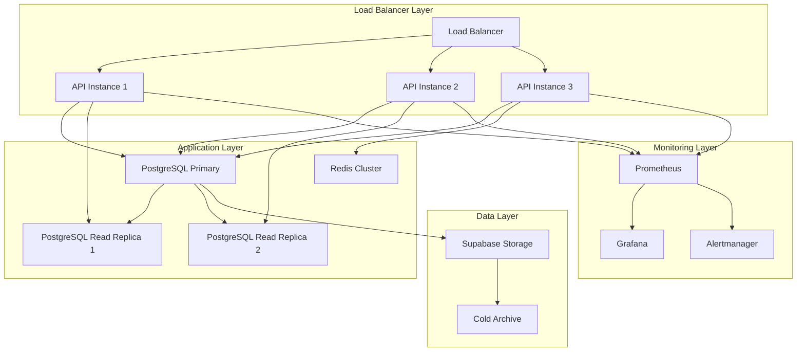

# Unit Talk Deployment Runbook

## 🚀 Overview

This runbook provides comprehensive procedures for deploying the Unit Talk syndicate-grade platform, including the HOT/WARM/COLD data architecture, operator dashboard, and all monitoring systems.

## 📋 Pre-Deployment Checklist

### Environment Validation
- [ ] Docker and docker-compose installed and functional
- [ ] Required environment variables configured in `.env`
- [ ] Database connection strings validated
- [ ] External API credentials verified
- [ ] SSL certificates current and valid
- [ ] Monitoring infrastructure operational

### System Prerequisites
- [ ] PostgreSQL 13+ with partitioning support
- [ ] Redis 6+ for caching and session management
- [ ] Temporal server for workflow orchestration
- [ ] Prometheus and Grafana for monitoring
- [ ] Sufficient disk space for data retention
- [ ] Network connectivity to external services

### Security Requirements
- [ ] Authentication tokens configured
- [ ] Role-based access control settings
- [ ] API rate limiting configured
- [ ] Audit logging enabled
- [ ] Security headers configured
- [ ] Data encryption at rest and in transit

## 🏗️ Deployment Architecture

### Production Deployment Topology


## 🔧 Step-by-Step Deployment

### Phase 1: Infrastructure Setup

#### 1.1 Database Deployment
```bash
# Start PostgreSQL with replication
docker-compose up -d postgres postgres-replica

# Wait for services to be ready
docker-compose exec postgres pg_isready -U postgres
docker-compose exec postgres-replica pg_isready -U postgres

# Verify replication status
docker-compose exec postgres psql -U postgres -c "SELECT * FROM pg_stat_replication;"
```

#### 1.2 Cache and Storage Setup
```bash
# Start Redis cluster
docker-compose up -d redis redis-sentinel

# Verify Redis connectivity
docker-compose exec redis redis-cli ping

# Start Temporal server
docker-compose up -d temporal

# Verify Temporal UI access
curl -f http://localhost:8088/health
```

#### 1.3 Monitoring Infrastructure
```bash
# Start monitoring stack
docker-compose up -d prometheus grafana alertmanager

# Verify Prometheus targets
curl -s http://localhost:9090/api/v1/targets | jq '.data.activeTargets[].health'

# Import Grafana dashboards
./scripts/import-grafana-dashboards.sh
```

### Phase 2: Database Schema Deployment

#### 2.1 Schema Migration
```bash
# Run database migrations
docker-compose exec api npm run db:migrate

# Verify migration status
docker-compose exec api npm run db:status

# Check table creation
docker-compose exec postgres psql -U postgres -c "
SELECT tablename FROM pg_tables 
WHERE tablename LIKE 'prop_ticks%' OR tablename LIKE 'data_lifecycle%';
"
```

#### 2.2 HOT/WARM/COLD Architecture Setup
```bash
# Create partitions for next 3 months
docker-compose exec postgres psql -U postgres -c "
SELECT partman.run_maintenance();
"

# Verify partition creation
docker-compose exec postgres psql -U postgres -c "
SELECT schemaname||'.'||tablename as partition 
FROM pg_tables WHERE tablename LIKE 'prop_ticks_hot_%'
ORDER BY tablename;
"

# Configure archival settings
docker-compose exec api node -e "
const config = require('./src/config/archival-config.js');
console.log('Archival config loaded:', config);
"
```

### Phase 3: Application Deployment

#### 3.1 API Service Deployment
```bash
# Build application images
docker-compose build api

# Start API services with health checks
docker-compose up -d api

# Wait for services to be healthy
timeout 300 bash -c 'until curl -f http://localhost:3000/health; do sleep 5; done'

# Verify API metrics endpoint
curl -s http://localhost:9464/metrics | head -20
```

#### 3.2 Agent System Deployment
```bash
# Start all agents
docker-compose up -d feedagent gradingagent alertagent

# Verify agent health
curl -s http://localhost:3000/api/agents/health | jq '.'

# Check agent metrics
curl -s http://localhost:9464/metrics | grep -E "agent_health|agent_processing"
```

#### 3.3 Temporal Workflow Deployment
```bash
# Start Temporal worker
docker-compose exec api npm run temporal:worker &

# Schedule archival workflow (daily at 2AM EST)
temporal workflow start \
  --type ArchiverWorkflow \
  --schedule "0 2 * * *" \
  --timezone "America/New_York" \
  --workflow-id "archiver-daily"

# Schedule feature builder workflow (hourly)
temporal workflow start \
  --type FeatureBuilderWorkflow \
  --schedule "0 * * * *" \
  --workflow-id "feature-builder-hourly"

# Schedule enhanced grading workflow (every 15 minutes)
temporal workflow start \
  --type EnhancedGradingWorkflow \
  --schedule "*/15 * * * *" \
  --workflow-id "enhanced-grading-15min"

# Verify workflow status
temporal workflow list
```

### Phase 4: Frontend Applications

#### 4.1 Command Center Deployment
```bash
# Build and start Command Center
docker-compose up -d command-center

# Verify health endpoint
curl -f http://localhost:3004/api/health

# Test operator dashboard access
curl -f http://localhost:3004/api/operator-dashboard/health
```

#### 4.2 Additional Applications
```bash
# Start remaining applications
docker-compose up -d dashboard smart-form discord-bot

# Verify all services are running
docker-compose ps

# Check service health endpoints
curl -f http://localhost:3002/api/health  # Smart Form
curl -f http://localhost:3003/api/health  # Dashboard
```

## 🔍 Post-Deployment Validation

### System Health Verification

#### 4.1 Core Services Validation
```bash
# Comprehensive health check
./scripts/health-check.sh

# Verify all containers are running
docker-compose ps --format "table {{.Name}}\t{{.Status}}\t{{.Ports}}"

# Check resource utilization
docker stats --no-stream

# Validate network connectivity
docker-compose exec api ping -c 3 postgres
docker-compose exec api ping -c 3 redis
```

#### 4.2 Data Pipeline Validation
```bash
# Check data ingestion
docker-compose exec postgres psql -U postgres -c "
SELECT sport, COUNT(*), MAX(tick_timestamp) 
FROM prop_ticks_hot 
GROUP BY sport;
"

# Verify steam detection
docker-compose exec postgres psql -U postgres -c "
SELECT COUNT(*) as steam_moves_detected
FROM prop_ticks_hot 
WHERE steam_detected = true 
  AND tick_timestamp >= NOW() - INTERVAL '1 hour';
"

# Check feature computation
docker-compose exec postgres psql -U postgres -c "
SELECT 
  AVG((computation_metadata->>'data_quality')::numeric) as avg_quality,
  COUNT(*) as props_with_features
FROM prop_ticks_hot 
WHERE computation_metadata IS NOT NULL;
"
```

#### 4.3 Monitoring Validation
```bash
# Check Prometheus scraping
curl -s http://localhost:9090/api/v1/targets | jq '.data.activeTargets[] | select(.health != "up")'

# Verify Grafana dashboard access
curl -f http://localhost:3005/api/health

# Test alert rules
curl -s http://localhost:9090/api/v1/rules | jq '.data.groups[].rules[] | select(.type == "alerting")'

# Check Alertmanager status
curl -f http://localhost:9093/-/healthy
```

### Performance Baseline Establishment

#### 4.4 Performance Testing
```bash
# Run load tests against API
docker-compose exec api npm run test:load

# Measure API response times
for i in {1..10}; do
  curl -w "@curl-format.txt" -o /dev/null -s http://localhost:3000/api/health
done

# Check database performance
docker-compose exec postgres psql -U postgres -c "
SELECT 
  query,
  mean_time,
  calls,
  stddev_time
FROM pg_stat_statements 
WHERE calls > 10
ORDER BY mean_time DESC 
LIMIT 10;
"
```

#### 4.5 Steam Detection Performance
```bash
# Test steam detection latency
docker-compose exec api node -e "
const SteamDetector = require('./src/services/SteamDetector');
const detector = new SteamDetector();
const start = Date.now();
detector.detectSteamMove(testData).then(() => {
  console.log('Steam detection latency:', Date.now() - start, 'ms');
});
"
```

## 🚨 Rollback Procedures

### Emergency Rollback

#### Immediate Rollback (< 5 minutes)
```bash
# Stop current deployment
docker-compose down

# Restore previous version
git checkout <previous-commit>
docker-compose build
docker-compose up -d

# Verify rollback success
./scripts/health-check.sh
```

#### Database Rollback
```bash
# Stop applications
docker-compose stop api feedagent gradingagent alertagent

# Execute rollback migration
docker-compose exec postgres psql -U postgres -f /app/database/rollback/latest_rollback.sql

# Verify database state
docker-compose exec api npm run db:status

# Restart applications
docker-compose start api feedagent gradingagent alertagent
```

### Graceful Rollback

#### Data-Safe Rollback (15-30 minutes)
```bash
# Enable safe mode
curl -X POST \
  -H "Authorization: Bearer $ADMIN_TOKEN" \
  -H "Content-Type: application/json" \
  -d '{"enabled": true, "reason": "Preparing for rollback"}' \
  http://localhost:3000/api/operator-dashboard/controls/safe-mode

# Drain processing queues
docker-compose exec api npm run drain-queues

# Stop Temporal workflows
temporal workflow terminate --workflow-id "archiver-daily"
temporal workflow terminate --workflow-id "feature-builder-hourly"
temporal workflow terminate --workflow-id "enhanced-grading-15min"

# Execute rollback
git checkout <previous-commit>
docker-compose build
docker-compose up -d

# Restart workflows
# (Re-run workflow scheduling commands from Phase 3.3)

# Disable safe mode
curl -X POST \
  -H "Authorization: Bearer $ADMIN_TOKEN" \
  -H "Content-Type: application/json" \
  -d '{"enabled": false, "reason": "Rollback completed successfully"}' \
  http://localhost:3000/api/operator-dashboard/controls/safe-mode
```

## 🔧 Troubleshooting Guide

### Common Deployment Issues

#### Issue: Container Startup Failures
**Symptoms**: Containers exit with non-zero codes
**Investigation**:
```bash
# Check container logs
docker-compose logs <service-name>

# Check resource usage
docker stats --no-stream

# Verify environment variables
docker-compose exec <service> env | grep -E "DB_|REDIS_|API_"
```

**Solutions**:
- Verify environment configuration
- Check resource availability
- Validate external service connectivity
- Review application logs for specific errors

#### Issue: Database Migration Failures
**Symptoms**: Migration script errors, schema inconsistencies
**Investigation**:
```bash
# Check migration status
docker-compose exec api npm run db:status

# Review migration logs
docker-compose logs api | grep -i migration

# Check database connectivity
docker-compose exec postgres pg_isready -U postgres
```

**Solutions**:
- Fix migration script syntax errors
- Resolve database permission issues
- Handle data consistency conflicts
- Restore from backup if necessary

#### Issue: Agent Health Check Failures
**Symptoms**: Agents showing unhealthy status
**Investigation**:
```bash
# Check agent logs
docker-compose logs feedagent gradingagent alertagent

# Verify agent metrics
curl -s http://localhost:9464/metrics | grep agent_health

# Check resource utilization
docker stats feedagent gradingagent alertagent
```

**Solutions**:
- Restart unhealthy agents
- Check configuration settings
- Validate external API connectivity
- Increase resource allocation if needed

#### Issue: Monitoring Stack Problems
**Symptoms**: Metrics not collecting, dashboards not loading
**Investigation**:
```bash
# Check Prometheus targets
curl -s http://localhost:9090/api/v1/targets

# Verify metrics endpoints
curl -s http://localhost:9464/metrics

# Check Grafana logs
docker-compose logs grafana
```

**Solutions**:
- Fix Prometheus configuration
- Restart monitoring services
- Import missing dashboards
- Verify network connectivity

### Performance Issues

#### Issue: High API Response Times
**Symptoms**: API P95 response time > 100ms
**Investigation**:
```bash
# Check database query performance
docker-compose exec postgres psql -U postgres -c "
SELECT query, mean_time, calls 
FROM pg_stat_statements 
ORDER BY mean_time DESC 
LIMIT 10;
"

# Review API metrics
curl -s http://localhost:9464/metrics | grep -E "api_request_duration|database_query_duration"

# Check connection pool usage
docker-compose exec postgres psql -U postgres -c "
SELECT state, count(*) 
FROM pg_stat_activity 
GROUP BY state;
"
```

**Solutions**:
- Optimize slow database queries
- Increase connection pool size
- Scale read replicas
- Implement query caching
- Enable circuit breakers

#### Issue: Steam Detection Latency
**Symptoms**: Steam detection P95 > 5 seconds
**Investigation**:
```bash
# Check steam detection metrics
curl -s http://localhost:9464/metrics | grep steam_detection

# Review processing queue depth
docker-compose exec redis redis-cli llen steam_detection_queue

# Check feature computation performance
curl -s http://localhost:9464/metrics | grep feature_computation
```

**Solutions**:
- Optimize feature computation algorithms
- Increase parallel processing
- Improve data quality filters
- Scale processing resources

## 📊 Performance Monitoring

### Key Metrics to Monitor

#### System Health Metrics
- **Overall Health Score**: Target > 0.95
- **Service Availability**: Target > 99.9%
- **Error Rates**: Target < 1%
- **Resource Utilization**: Target < 80%

#### Performance Metrics
- **API Response Time P95**: Target < 100ms
- **Database Query Time P95**: Target < 50ms
- **Steam Detection Latency P95**: Target < 5 seconds
- **Feature Computation Rate**: Target > 1000/second

#### Business Metrics
- **Props Processed**: Track throughput
- **Steam Moves Detected**: Track accuracy
- **Grading Throughput**: Track processing rate
- **Alert Volume**: Track operational load

### Monitoring Queries

#### Prometheus Queries
```promql
# API response time trend
rate(api_request_duration_seconds_sum[5m]) / rate(api_request_duration_seconds_count[5m])

# Database query performance
histogram_quantile(0.95, rate(database_query_duration_seconds_bucket[5m]))

# Steam detection rate
rate(steam_moves_detected_total[5m])

# Agent health score
avg(agent_health_score) by (agent_name)

# Error rate by service
rate(errors_total[5m]) / rate(requests_total[5m])
```

#### Database Performance Queries
```sql
-- Top slow queries
SELECT 
  substring(query, 1, 50) as short_query,
  mean_time,
  calls,
  total_time,
  rows
FROM pg_stat_statements 
ORDER BY mean_time DESC 
LIMIT 10;

-- Connection pool status
SELECT 
  state,
  count(*) as connections,
  max(state_change) as last_change
FROM pg_stat_activity 
GROUP BY state;

-- Table sizes and growth
SELECT 
  schemaname||'.'||tablename as table,
  pg_size_pretty(pg_total_relation_size(schemaname||'.'||tablename)) as size,
  pg_size_pretty(pg_total_relation_size(schemaname||'.'||tablename) - pg_relation_size(schemaname||'.'||tablename)) as index_size
FROM pg_tables 
WHERE schemaname = 'public'
ORDER BY pg_total_relation_size(schemaname||'.'||tablename) DESC;
```

## 📋 Deployment Checklists

### Pre-Deployment Checklist
- [ ] Code review completed and approved
- [ ] All tests passing (unit, integration, e2e)
- [ ] Performance benchmarks validated
- [ ] Security scan completed
- [ ] Database migration scripts tested
- [ ] Backup procedures verified
- [ ] Rollback plan documented
- [ ] Monitoring alerts configured
- [ ] Stakeholder communication sent

### Post-Deployment Checklist
- [ ] All services healthy
- [ ] Database migrations successful
- [ ] Data pipeline operational
- [ ] Monitoring systems functional
- [ ] Performance metrics within targets
- [ ] Steam detection operational
- [ ] Agent orchestration healthy
- [ ] Error rates within acceptable limits
- [ ] External integrations functional
- [ ] Stakeholder notification sent

### Weekly Maintenance Checklist
- [ ] Performance trend analysis
- [ ] Capacity planning review
- [ ] Security patch assessment
- [ ] Backup verification
- [ ] Log rotation and cleanup
- [ ] Monitoring alert tuning
- [ ] Documentation updates
- [ ] Team knowledge sharing

---

**Runbook Version**: 2.0  
**Last Updated**: September 10, 2025  
**Next Review**: Monthly deployment review  
**Owner**: DevOps Team