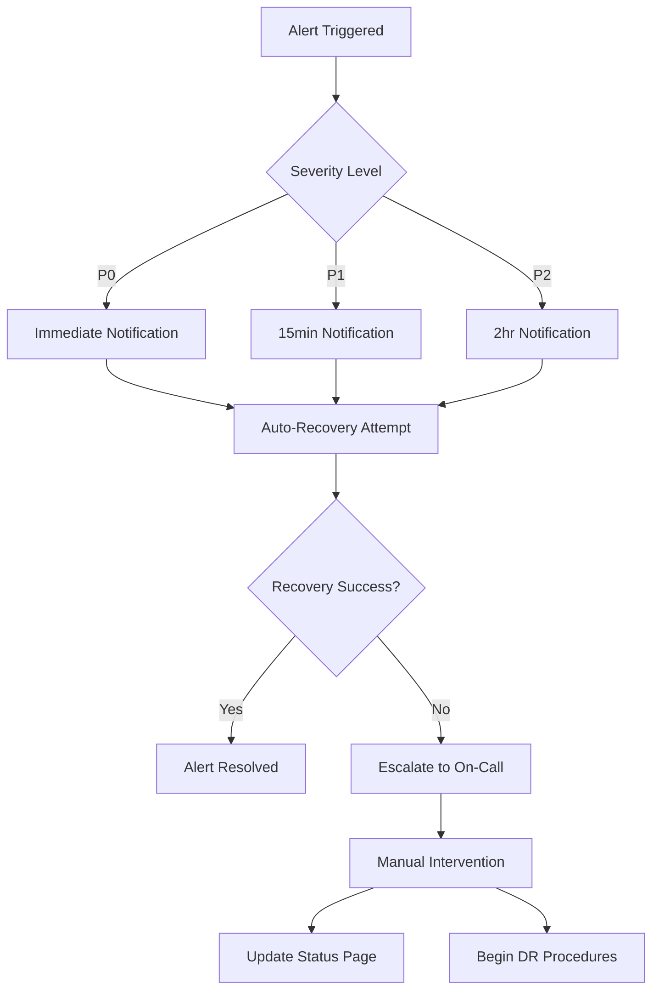

# Disaster Recovery Runbook

## Overview

This runbook provides step-by-step procedures for disaster recovery scenarios in the Unit Talk Platform. It covers automated recovery procedures, manual interventions, and system restoration processes.

## 🎯 Recovery Objectives

### Service Level Objectives (SLOs)
- **Recovery Time Objective (RTO)**: < 30 minutes for critical services
- **Recovery Point Objective (RPO)**: < 24 hours of data loss
- **Service Availability**: 99.9% uptime (8.76 hours downtime/year)
- **Data Integrity**: 100% for critical business data

### Service Priority Classification
- **Critical (P0)**: Core betting platform, user authentication, data ingestion
- **High (P1)**: Discord bot, notifications, real-time alerts
- **Medium (P2)**: Analytics, reporting, non-essential integrations
- **Low (P3)**: Development tools, documentation sites

## 🚨 Incident Classification & Response

### Severity Levels

#### P0 - Critical Outage
**Definition**: Complete service unavailability affecting all users
**Response Time**: < 15 minutes
**Escalation**: Immediate on-call notification + management alert

**Examples**:
- Database completely unavailable
- All API endpoints returning errors
- Data corruption affecting core functionality
- Security breach with active threat

#### P1 - Major Degradation  
**Definition**: Significant feature unavailability affecting most users
**Response Time**: < 30 minutes  
**Escalation**: On-call notification

**Examples**:
- Discord bot offline
- Pick ingestion system down
- Authentication system degraded
- Major performance degradation (>5s response times)

#### P2 - Minor Degradation
**Definition**: Limited feature unavailability affecting some users
**Response Time**: < 2 hours
**Escalation**: Standard support ticket

**Examples**:
- Analytics dashboard offline
- Non-critical integrations failing
- Performance issues affecting <25% of operations

## 🔄 Automated Recovery Procedures

### 1. Service Health Monitoring
```bash
# Health check endpoints monitored every 30 seconds
GET /health               # API health
GET /ops/safemode/status  # System state
GET /metrics             # Prometheus metrics
```

### 2. Auto-Recovery Triggers
- **Service restart**: Automatic restart on health check failure (3 consecutive failures)
- **Safe mode activation**: Automatic on critical alert detection
- **Circuit breakers**: Open on high error rates (>5% for 2 minutes)
- **Database failover**: Automatic switch to read replica if primary fails

### 3. Alert Escalation


## 💾 Database Recovery Procedures

### Scenario 1: Database Connectivity Issues

#### Diagnosis
```bash
# Check database status
docker-compose exec api npm run db:status

# Test connectivity
psql -h $DB_HOST -U $DB_USER -d $DB_NAME -c "SELECT 1"

# Check connection pool
curl -s http://localhost:3000/health | jq '.dependencies.database'
```

#### Recovery Steps
1. **Verify network connectivity**
   ```bash
   ping $DB_HOST
   nslookup $DB_HOST
   telnet $DB_HOST 5432
   ```

2. **Check database server status**
   ```bash
   # If using managed service (Supabase/RDS)
   # Check provider status page
   curl -s https://status.supabase.com/api/v2/status.json
   ```

3. **Restart application connections**
   ```bash
   docker-compose restart api
   # Wait for health check to pass
   curl -f http://localhost:3000/health
   ```

4. **Scale horizontally if needed**
   ```bash
   # Add read replica connections
   export DATABASE_READ_URL=$READ_REPLICA_URL
   docker-compose up -d --scale api=2
   ```

### Scenario 2: Database Corruption or Data Loss

#### Immediate Response
1. **Stop all write operations immediately**
   ```bash
   # Enable system freeze
   curl -X POST http://localhost:3010/ops/safemode/freeze \
     -H "Authorization: Bearer $SAFEMODE_TOKEN" \
     -d '{"enabled": true, "reason": "Data corruption detected"}'
   ```

2. **Assess corruption scope**
   ```sql
   -- Check recent transactions
   SELECT * FROM audit_log 
   WHERE timestamp > NOW() - INTERVAL '1 hour' 
   ORDER BY timestamp DESC;
   
   -- Validate key tables
   SELECT COUNT(*) FROM raw_props WHERE created_at > NOW() - INTERVAL '1 hour';
   SELECT COUNT(*) FROM final_picks WHERE promoted_at > NOW() - INTERVAL '1 hour';
   ```

3. **Point-in-time recovery**
   ```bash
   # Determine recovery point
   RECOVERY_TIME="2025-08-12 14:30:00 UTC"
   
   # For managed databases, use provider tools
   # For self-hosted, use pg_restore with --recovery-target-time
   ```

### Scenario 3: Complete Database Loss

#### Emergency Restore Procedure
1. **Activate disaster recovery site**
   ```bash
   # Switch DNS to DR environment
   # Update environment variables
   export DATABASE_URL=$DR_DATABASE_URL
   export REDIS_URL=$DR_REDIS_URL
   ```

2. **Restore from latest backup**
   ```bash
   # Automated restore script
   ./scripts/dr/restore-from-backup.sh --environment=production --latest
   ```

3. **Validate data integrity**
   ```bash
   # Run validation script
   ./scripts/dr/validate-restored-data.sh
   ```

## 🏗️ Infrastructure Recovery

### Container/Orchestration Failures

#### Docker Compose Recovery
```bash
# Check service status
docker-compose ps

# Restart failed services
docker-compose restart $SERVICE_NAME

# Full stack restart (last resort)
docker-compose down && docker-compose up -d

# Check logs for root cause
docker-compose logs --tail=100 $SERVICE_NAME
```

#### Kubernetes Recovery (if applicable)
```bash
# Check pod status
kubectl get pods -n unit-talk

# Restart deployment
kubectl rollout restart deployment/$SERVICE_NAME -n unit-talk

# Scale up replicas
kubectl scale deployment/$SERVICE_NAME --replicas=3 -n unit-talk
```

### Server/VM Recovery
```bash
# Check system resources
df -h              # Disk space
free -h            # Memory usage
top                # CPU usage
iostat -x 1 5      # Disk I/O

# Restart system services
sudo systemctl restart docker
sudo systemctl restart nginx

# Mount additional storage if needed
sudo mount /dev/xvdf1 /opt/unit-talk/data
```

## 🔐 Security Incident Response

### Suspected Breach
1. **Immediate containment**
   ```bash
   # Enable system freeze
   curl -X POST http://localhost:3010/ops/safemode/freeze \
     -d '{"enabled": true, "reason": "Security incident"}'
   
   # Block suspicious IPs at firewall level
   sudo iptables -A INPUT -s $SUSPICIOUS_IP -j DROP
   ```

2. **Evidence collection**
   ```bash
   # Capture current state
   docker-compose logs > incident-logs-$(date +%Y%m%d-%H%M%S).txt
   
   # Database access logs
   SELECT * FROM audit_log WHERE timestamp > NOW() - INTERVAL '24 hours';
   
   # System access logs
   sudo journalctl --since "24 hours ago" > system-logs.txt
   ```

3. **Credential rotation**
   ```bash
   # Rotate all API keys and database passwords
   ./scripts/security/rotate-credentials.sh --emergency
   ```

### Data Integrity Compromise
1. **Assess impact scope**
   ```sql
   -- Check for unusual data patterns
   SELECT COUNT(*), created_at::date 
   FROM raw_props 
   WHERE created_at > NOW() - INTERVAL '7 days'
   GROUP BY created_at::date;
   ```

2. **Restore clean data**
   ```bash
   # Restore from last known good backup
   ./scripts/dr/restore-from-backup.sh --recovery-point="$LAST_GOOD_TIMESTAMP"
   ```

## 📊 Communication Procedures

### Internal Communication
1. **Incident Channel**: #incident-response (Slack/Discord)
2. **Status Updates**: Every 15 minutes for P0, every 30 minutes for P1
3. **Stakeholder Notifications**: Management alert for P0/P1 incidents

### External Communication
1. **Status Page Updates**: https://status.unit-talk.com
2. **User Notifications**: Discord announcements for service disruptions
3. **Customer Communication**: Email updates for extended outages

### Communication Templates

#### Initial Alert (P0)
```
🚨 INCIDENT ALERT - P0
Service: Unit Talk Platform
Impact: [Complete outage|Major degradation]
Started: [timestamp]
Team: [responder names]
Initial Assessment: [brief description]
ETA: [estimated resolution time]
Updates: Every 15 minutes
```

#### Status Update
```
📊 INCIDENT UPDATE - P0
Service: Unit Talk Platform  
Duration: [time since start]
Actions Taken: [steps completed]
Current Status: [current state]
Next Steps: [planned actions]
ETA: [updated estimate]
```

#### Resolution Notice
```
✅ INCIDENT RESOLVED - P0
Service: Unit Talk Platform
Duration: [total outage time]
Root Cause: [technical cause]
Resolution: [what fixed it]
Prevention: [future improvements]
Post-Mortem: [when/where]
```

## 🛠️ Recovery Scripts and Tools

### Essential Scripts
```bash
# Location: scripts/dr/
restore-from-backup.sh       # Database restore
validate-system-health.sh    # Post-recovery validation  
rotate-credentials.sh        # Emergency credential rotation
failover-to-dr.sh           # Switch to DR environment
```

### Monitoring Commands
```bash
# System health check
curl -f http://localhost:3000/health

# Database connectivity
psql $DATABASE_URL -c "SELECT 1"

# Service status
docker-compose ps | grep -E "(Up|healthy)"

# Recent errors
docker-compose logs --tail=50 | grep -i error
```

### Quick Diagnostics
```bash
#!/bin/bash
# Quick system diagnostic script

echo "=== System Health Check ==="
echo "Time: $(date)"
echo "Uptime: $(uptime)"
echo

echo "=== Service Status ==="
docker-compose ps

echo "=== Database Connectivity ==="
timeout 10 psql $DATABASE_URL -c "SELECT NOW()" || echo "DB Connection Failed"

echo "=== API Health ==="
curl -s -f http://localhost:3000/health || echo "API Health Check Failed"

echo "=== Disk Space ==="
df -h | grep -E "(/$|/opt|/var)"

echo "=== Memory Usage ==="
free -h

echo "=== Recent Errors ==="
docker-compose logs --since=10m --tail=20 | grep -i error
```

## 📋 Post-Incident Procedures

### Immediate Post-Recovery (< 1 hour)
1. **Verify full service restoration**
2. **Update status page and communications**  
3. **Document incident timeline and actions taken**
4. **Ensure monitoring is fully operational**

### Short-term Follow-up (< 24 hours)
1. **Conduct initial lessons learned session**
2. **Identify immediate improvements needed**
3. **Update runbook based on experience**
4. **Validate backup and monitoring systems**

### Long-term Review (< 1 week)
1. **Complete post-mortem analysis**
2. **Implement preventive measures**
3. **Update disaster recovery procedures**
4. **Conduct DR drill to validate improvements**

## 📞 Emergency Contacts

### On-Call Rotation
- **Primary On-Call**: security-oncall@unit-talk.com
- **Backup On-Call**: devops-oncall@unit-talk.com  
- **Escalation Manager**: engineering-manager@unit-talk.com

### External Vendors
- **Database Provider**: [Support contact and escalation procedures]
- **Cloud Provider**: [Support contact and priority levels]
- **DNS Provider**: [Emergency contact information]

### Communication Channels
- **Internal Emergency**: #incident-response
- **External Status**: https://status.unit-talk.com
- **Management Escalation**: exec-alerts@unit-talk.com

## 🧪 Testing & Validation

### Monthly DR Tests
- Automated database restore verification
- Service failover testing
- Communication procedure drills
- Recovery time measurement

### Quarterly Reviews
- Update contact information
- Review and test recovery procedures
- Validate backup integrity
- Update documentation

### Annual Assessments
- Complete disaster recovery simulation
- Third-party security assessment
- Business continuity planning review
- Infrastructure resilience testing

---

**Document Owner**: DevOps Team  
**Last Updated**: 2025-08-12  
**Next Review**: 2025-11-12  
**Emergency Contact**: security-oncall@unit-talk.com