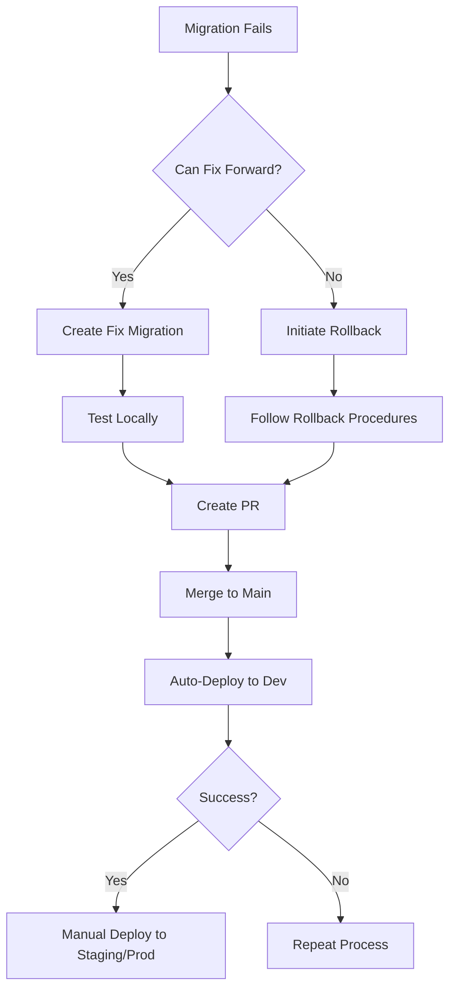

# Migration CI/CD Guide - Implementation Summary

**Last Updated:** 2026-01-14
**Status:** ✅ PRODUCTION READY
**Fail-Closed:** ✅ ENFORCED

---

## Overview

This guide documents the fail-closed CI/CD migration system implemented for Unit Talk. The system ensures that **migrations must succeed before deployments can proceed**, eliminating the risk of schema drift and deployment failures.

## System Components

### 1. CI/CD Workflows

#### Enhanced Migration Workflow
**File:** `.github/workflows/supabase-migrate-enhanced.yml`

**Features:**
- ✅ **Pre-flight checks:** Validates naming, detects conflicts, checks dependencies
- ✅ **Fail-closed enforcement:** Blocks deployment on any failure
- ✅ **Schema version tracking:** Records every migration in `schema_versions` table
- ✅ **Automatic rollback generation:** Creates rollback scripts for every migration
- ✅ **Comprehensive verification:** Schema checks + smoke tests
- ✅ **Audit trail:** Full GitHub Actions logs + database records

**Usage:**
```bash
# Dev environment (auto on merge to main)
git merge feature/add-migration

# Staging/Prod (manual dispatch)
# 1. Go to Actions → "Supabase Migrations CI/CD (Enhanced)"
# 2. Click "Run workflow"
# 3. Select environment
# 4. Approve (for staging/prod)
```

#### Original Migration Workflow
**File:** `.github/workflows/supabase-migrate.yml`

Still active and functional. Enhanced workflow builds on top of this foundation.

### 2. Doctor Script Integration

**File:** `scripts/doctor.ps1`

**New Check (Check #7):** Migration Status and Schema Version

**Features:**
- Counts local migration files
- Shows latest migration
- Validates naming convention
- Checks `schema_versions` table existence
- Displays current schema version
- Verifies migration sync between local and remote
- Shows version history

**Usage:**
```powershell
# Run health check with migration status
.\scripts\doctor.ps1 -Environment dev

# Verbose output for debugging
.\scripts\doctor.ps1 -Environment dev -Verbose

# JSON output for logging
.\scripts\doctor.ps1 -Environment dev -OutputFormat json
```

### 3. Migration Verification Script

**File:** `scripts/ops/verify-migration-status.ps1`

**Features:**
- Quick status check for operators
- Local migration file validation
- Remote schema version verification
- Migration sync status
- Schema integrity check
- Rollback availability check

**Usage:**
```powershell
# Quick verification
.\scripts\ops\verify-migration-status.ps1 -Environment dev

# Detailed output
.\scripts\ops\verify-migration-status.ps1 -Environment dev -Verbose

# Production verification
.\scripts\ops\verify-migration-status.ps1 -Environment prod
```

### 4. Migration Runbook

**File:** `docs/ops/MIGRATION_RUNBOOK.md`

**Comprehensive documentation:**
- Standard migration workflow
- Rollback procedures (3 options)
- Emergency procedures
- Troubleshooting guide
- Audit trail queries
- Best practices

**When to consult:**
- Creating new migrations
- Rolling back migrations
- Emergency situations
- Troubleshooting issues

### 5. Schema Version Tracking

**Database Table:** `schema_versions`

**Schema:**
```sql
CREATE TABLE schema_versions (
  id SERIAL PRIMARY KEY,
  version VARCHAR(50) NOT NULL,      -- Git commit SHA (first 8 chars)
  applied_at TIMESTAMPTZ DEFAULT NOW(),
  applied_by VARCHAR(255),           -- GitHub actor
  migrations TEXT,                   -- Comma-separated migration list
  git_commit VARCHAR(50),            -- Full commit SHA
  environment VARCHAR(20)            -- dev/staging/prod
);
```

**Created by:** Enhanced CI workflow on first run

**Query examples:**
```sql
-- Current version
SELECT version, applied_at, applied_by
FROM schema_versions
WHERE environment = 'prod'
ORDER BY applied_at DESC
LIMIT 1;

-- Version history
SELECT version, applied_at, applied_by
FROM schema_versions
WHERE environment = 'prod'
ORDER BY applied_at DESC
LIMIT 10;
```

---

## Fail-Closed Enforcement

### How It Works

The system enforces fail-closed at **4 levels**:

#### Level 1: CI/CD (GitHub Actions)
```yaml
# Migration MUST succeed
if [ "$migration_success" != true ]; then
  echo "❌ CRITICAL: Migration FAILED - Deployment BLOCKED"
  exit 1  # Fail-closed: Block workflow
fi
```

#### Level 2: Schema Verification
```bash
# Schema verification MUST pass
if ! npx tsx scripts/ops/verify-schema-post-migration.ts --env dev; then
  echo "❌ CRITICAL: Schema verification FAILED"
  exit 1  # Fail-closed: Block deployment
fi
```

#### Level 3: Smoke Tests
```bash
# Smoke tests MUST pass
if ! npx tsx scripts/ops/smoke-test-db.ts --env dev; then
  echo "❌ CRITICAL: Smoke tests FAILED"
  exit 1  # Fail-closed: Block deployment
fi
```

#### Level 4: Doctor Script
```powershell
# Doctor script MUST pass
if ($script:FailedChecks -gt 0) {
  exit 1  # Fail-closed: Block operations
}
```

### What Gets Blocked

When migrations fail:
- ❌ **Workflow fails** - CI/CD stops immediately
- ❌ **No artifacts uploaded** - Prevents partial deploys
- ❌ **Doctor script fails** - Blocks manual operations
- ❌ **Dependent jobs skip** - Downstream jobs don't run

### Recovery Path



---

## Quick Start

### For Developers

**Creating a new migration:**

```bash
# 1. Create migration file
cd supabase/migrations
touch $(date +%Y%m%d)_add_feature.sql

# 2. Write idempotent SQL
cat > $(date +%Y%m%d)_add_feature.sql <<'SQL'
BEGIN;

DO $$
BEGIN
  IF NOT EXISTS (
    SELECT 1 FROM information_schema.columns
    WHERE table_name = 'picks' AND column_name = 'feature_column'
  ) THEN
    ALTER TABLE picks ADD COLUMN feature_column TEXT;
  END IF;
END $$;

SELECT pg_notify('pgrst', 'reload schema');

COMMIT;
SQL

# 3. Create rollback migration
touch rollback_$(date +%Y%m%d)_add_feature.sql

# 4. Test locally
supabase db push --dry-run

# 5. Create PR
git checkout -b feat/add-feature
git add supabase/migrations/*.sql
git commit -m "feat(db): add feature column"
git push origin feat/add-feature

# 6. Merge PR (auto-deploys to dev)
# 7. Verify
.\scripts\ops\verify-migration-status.ps1 -Environment dev
```

### For Operators

**Verifying migration status:**

```powershell
# Quick health check
.\scripts\doctor.ps1 -Environment prod

# Detailed migration check
.\scripts\ops\verify-migration-status.ps1 -Environment prod -Verbose

# Check schema version
npx tsx scripts/ops/supabase-query.ts --env prod \
  "SELECT version, applied_at FROM schema_versions WHERE environment = 'prod' ORDER BY applied_at DESC LIMIT 1"
```

**Deploying to staging/prod:**

```bash
# 1. Go to GitHub Actions
# 2. Select "Supabase Migrations CI/CD (Enhanced)"
# 3. Click "Run workflow"
# 4. Select environment (staging/prod)
# 5. Optional: Check "dry run" to preview
# 6. Click "Run workflow"
# 7. Approve (for staging/prod)
# 8. Monitor progress
# 9. Verify success
.\scripts\ops\verify-migration-status.ps1 -Environment staging
```

**Emergency rollback:**

```bash
# 1. Check MIGRATION_RUNBOOK.md for procedures
cat docs/ops/MIGRATION_RUNBOOK.md

# 2. Download rollback script from CI artifacts
gh run download <run-id> --name migration-prod-<version>

# 3. Execute rollback following runbook procedures
# See "Rollback Procedures" section in runbook
```

### For Platform Engineering

**Monitoring migration health:**

```powershell
# Daily health check (automate this)
.\scripts\doctor.ps1 -Environment prod -OutputFormat json | Out-File -Append doctor-logs.json

# Check for drift
.\scripts\ops\verify-migration-status.ps1 -Environment prod

# Audit recent migrations
npx tsx scripts/ops/supabase-query.ts --env prod \
  "SELECT * FROM schema_versions WHERE environment = 'prod' ORDER BY applied_at DESC LIMIT 20"

# Check for failed CI runs
gh run list --workflow=supabase-migrate-enhanced.yml --status=failure --limit 10
```

**Setting up new environment:**

```bash
# 1. Add GitHub secrets
# Go to Settings → Secrets → Actions
# Add: SUPABASE_PROJECT_REF_<ENV>
#      SUPABASE_URL_<ENV>
#      SUPABASE_SERVICE_ROLE_KEY_<ENV>

# 2. Configure environment protection
# Go to Settings → Environments
# Add: dev (no protection)
#      staging (1 reviewer)
#      production (2 reviewers)

# 3. Test migration
# Run workflow with dry_run = true

# 4. Apply migrations
# Run workflow with dry_run = false
```

---

## Testing

### Local Testing

```bash
# Test migration locally
cd unit-talk-production
export SUPABASE_ACCESS_TOKEN=sbp_your_token
supabase link --project-ref your-dev-ref
supabase db push --dry-run

# Test schema verification
npx tsx scripts/ops/verify-schema-post-migration.ts --env dev

# Test smoke tests
npx tsx scripts/ops/smoke-test-db.ts --env dev

# Test doctor script
.\scripts\doctor.ps1 -Environment dev
```

### CI/CD Testing

```bash
# Test dry run
# GitHub Actions → Run workflow → dry_run = true

# Test dev deployment
# Merge to main → auto-deploys

# Test staging deployment
# GitHub Actions → Run workflow → environment = staging

# Monitor logs
gh run view <run-id> --log

# Download artifacts
gh run download <run-id>
```

---

## Troubleshooting

### Issue: Migration fails in CI

**Symptoms:**
```
❌ CRITICAL: Migration FAILED - Deployment BLOCKED
```

**Steps:**
1. Check GitHub Actions logs
2. Identify SQL syntax error or constraint violation
3. Fix migration locally
4. Test with `supabase db push --dry-run`
5. Create new PR with fix
6. Merge to re-trigger

### Issue: Schema verification fails

**Symptoms:**
```
❌ CRITICAL: Schema verification FAILED
```

**Steps:**
1. Run locally: `npx tsx scripts/ops/verify-schema-post-migration.ts --env dev`
2. Check which tables are missing
3. Verify migration actually ran: `SELECT * FROM schema_versions ORDER BY applied_at DESC LIMIT 1`
4. If migration didn't apply, check for transaction rollback
5. Re-run migration or fix-forward

### Issue: Doctor script shows migration out of sync

**Symptoms:**
```
⚠️  Local and remote migrations may be out of sync
```

**Steps:**
1. Pull latest from main: `git pull origin main`
2. Check local files: `ls supabase/migrations/*.sql`
3. Check remote: `SELECT migrations FROM schema_versions WHERE environment = 'dev' ORDER BY applied_at DESC LIMIT 1`
4. If legitimately out of sync, run migration manually or via CI

### Issue: Rollback needed

**See:** `docs/ops/MIGRATION_RUNBOOK.md` → "Rollback Procedures"

---

## Maintenance

### Daily Tasks

```powershell
# Run doctor check
.\scripts\doctor.ps1 -Environment prod

# Verify migration status
.\scripts\ops\verify-migration-status.ps1 -Environment prod

# Check for failed CI runs
gh run list --workflow=supabase-migrate-enhanced.yml --status=failure --limit 5
```

### Weekly Tasks

```bash
# Review migration history
npx tsx scripts/ops/supabase-query.ts --env prod \
  "SELECT COUNT(*), environment FROM schema_versions WHERE applied_at > NOW() - INTERVAL '7 days' GROUP BY environment"

# Check for stale migrations
git log --since="1 week ago" -- supabase/migrations/

# Audit rollback availability
ls supabase/migrations/rollback_*.sql
```

### Monthly Tasks

```bash
# Review all migrations
npx tsx scripts/ops/supabase-query.ts --env prod \
  "SELECT version, applied_at, applied_by FROM schema_versions ORDER BY applied_at"

# Test rollback procedures in staging
# (Follow rollback runbook)

# Review doctor script logs
cat doctor-logs-$(date +%Y%m).json | jq '.summary'

# Archive old migration artifacts
# GitHub Actions → Artifacts → Review retention
```

---

## Architecture Diagram

```
┌─────────────────────────────────────────────────────────────┐
│                       Developer                              │
│  1. Creates migration in supabase/migrations/              │
│  2. Creates rollback migration                              │
│  3. Tests locally with supabase CLI                         │
│  4. Creates PR                                              │
└───────────────────────┬─────────────────────────────────────┘
                        │
                        ▼
┌─────────────────────────────────────────────────────────────┐
│                    GitHub PR Merge                          │
│                    (to main branch)                         │
└───────────────────────┬─────────────────────────────────────┘
                        │
                        ▼
┌─────────────────────────────────────────────────────────────┐
│           GitHub Actions (supabase-migrate-enhanced.yml)    │
│                                                              │
│  ┌─────────────────────────────────────────────────────┐   │
│  │  1. Pre-flight Checks                               │   │
│  │     - Naming convention validation                  │   │
│  │     - Duplicate timestamp detection                 │   │
│  │     - Breaking change scan                          │   │
│  └───────────────────┬─────────────────────────────────┘   │
│                      │                                      │
│                      ▼                                      │
│  ┌─────────────────────────────────────────────────────┐   │
│  │  2. Dependency Check                                │   │
│  │     - SQL syntax validation                         │   │
│  │     - Breaking change warnings                      │   │
│  └───────────────────┬─────────────────────────────────┘   │
│                      │                                      │
│                      ▼                                      │
│  ┌─────────────────────────────────────────────────────┐   │
│  │  3. Apply Migrations (FAIL-CLOSED)                  │   │
│  │     - Retry logic (3 attempts)                      │   │
│  │     - Exit 1 on failure → BLOCKS deployment         │   │
│  └───────────────────┬─────────────────────────────────┘   │
│                      │                                      │
│                      ▼                                      │
│  ┌─────────────────────────────────────────────────────┐   │
│  │  4. Schema Verification (FAIL-CLOSED)               │   │
│  │     - Verify all tables exist                       │   │
│  │     - Check foreign keys                            │   │
│  │     - Exit 1 on failure → BLOCKS deployment         │   │
│  └───────────────────┬─────────────────────────────────┘   │
│                      │                                      │
│                      ▼                                      │
│  ┌─────────────────────────────────────────────────────┐   │
│  │  5. Record Schema Version                           │   │
│  │     - Insert into schema_versions table             │   │
│  │     - Git commit SHA as version                     │   │
│  └───────────────────┬─────────────────────────────────┘   │
│                      │                                      │
│                      ▼                                      │
│  ┌─────────────────────────────────────────────────────┐   │
│  │  6. Smoke Tests (FAIL-CLOSED)                       │   │
│  │     - Basic CRUD operations                         │   │
│  │     - Foreign key integrity                         │   │
│  │     - Exit 1 on failure → BLOCKS deployment         │   │
│  └───────────────────┬─────────────────────────────────┘   │
│                      │                                      │
│                      ▼                                      │
│  ┌─────────────────────────────────────────────────────┐   │
│  │  7. Generate Rollback Script                        │   │
│  │     - Create rollback-<version>.sh                  │   │
│  │     - Upload as artifact                            │   │
│  └───────────────────┬─────────────────────────────────┘   │
│                      │                                      │
│                      ▼                                      │
│  ┌─────────────────────────────────────────────────────┐   │
│  │  8. Success Summary                                 │   │
│  │     - All checks passed                             │   │
│  │     - Deployment can proceed                        │   │
│  └─────────────────────────────────────────────────────┘   │
└─────────────────────────────────────────────────────────────┘
                        │
                        ▼
┌─────────────────────────────────────────────────────────────┐
│                 Supabase Database                           │
│                                                              │
│  ┌─────────────────────────────────────────────────────┐   │
│  │  schema_versions table                              │   │
│  │  - version (git SHA)                                │   │
│  │  - applied_at (timestamp)                           │   │
│  │  - applied_by (GitHub actor)                        │   │
│  │  - migrations (list)                                │   │
│  │  - environment (dev/staging/prod)                   │   │
│  └─────────────────────────────────────────────────────┘   │
└─────────────────────────────────────────────────────────────┘
                        │
                        ▼
┌─────────────────────────────────────────────────────────────┐
│                  Verification Tools                         │
│                                                              │
│  ┌──────────────────┐  ┌─────────────────────────────┐     │
│  │  doctor.ps1      │  │  verify-migration-status.ps1│     │
│  │  (Health Check)  │  │  (Quick Status Check)       │     │
│  └──────────────────┘  └─────────────────────────────┘     │
└─────────────────────────────────────────────────────────────┘
```

---

## References

### Documentation

- **Migration Runbook:** `docs/ops/MIGRATION_RUNBOOK.md`
- **Production Charter:** `docs/PRODUCTION_CHARTER.md`
- **Supabase Governance:** `docs/SUPABASE_GOVERNANCE.md`

### Scripts

- **Doctor Script:** `scripts/doctor.ps1`
- **Migration Verification:** `scripts/ops/verify-migration-status.ps1`
- **Schema Verification:** `scripts/ops/verify-schema-post-migration.ts`
- **Smoke Tests:** `scripts/ops/smoke-test-db.ts`

### CI/CD

- **Enhanced Workflow:** `.github/workflows/supabase-migrate-enhanced.yml`
- **Original Workflow:** `.github/workflows/supabase-migrate.yml`
- **Ops Runner:** `.github/workflows/ops-run.yml`

---

## Support

### Getting Help

1. **Check documentation:** Start with `MIGRATION_RUNBOOK.md`
2. **Run diagnostics:** `.\scripts\doctor.ps1 -Environment prod -Verbose`
3. **Check CI logs:** `gh run list --workflow=supabase-migrate-enhanced.yml`
4. **Ask in Slack:** #platform-eng channel
5. **Escalate:** Follow incident response playbook

### Common Questions

**Q: Can I bypass fail-closed enforcement?**
A: No. Fail-closed is mandatory for production stability.

**Q: How do I test migrations without affecting production?**
A: Use dev environment (auto-deploys on merge) or dry-run mode.

**Q: What if I need to rollback immediately?**
A: See `MIGRATION_RUNBOOK.md` → "Emergency Procedures"

**Q: How long are rollback scripts retained?**
A: 90 days in GitHub Actions artifacts.

**Q: Can I run migrations manually?**
A: Not recommended. Use CI/CD for consistency and audit trail.

---

## Changelog

| Date | Version | Changes | Author |
|------|---------|---------|--------|
| 2026-01-14 | 1.0.0 | Initial implementation guide | Platform Engineering |

---

**Remember:** Migrations are the foundation of schema stability. When in doubt, consult the runbook.
