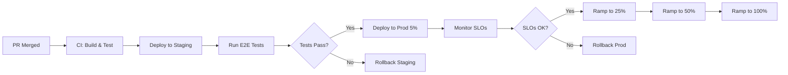

# Deployment Runbook: Staging/Production Parity & Safety

**Owner**: DevOps Team
**Last Updated**: 2025-12-01
**Phase**: Phase 3 - Staging/Prod Parity

---

## Overview

This runbook documents the deployment process, environment configuration, and staging/production parity strategy for the Unit Talk platform.

---

## Environments

### Environment Matrix

| Environment | Purpose | URL | Database | Temporal | Feature Flags |
|-------------|---------|-----|----------|----------|---------------|
| **dev** | Local development | localhost:3010 | Local PostgreSQL | Local instance | All enabled |
| **staging** | Pre-production testing | staging.unittalk.ai | Staging Supabase | Staging cluster | Configurable |
| **prod** | Production | api.unittalk.ai | Prod Supabase | Prod cluster | Conservative |

### Environment Variables

**Required for all environments**:
```bash
# Supabase
SUPABASE_URL=https://[project].supabase.co
SUPABASE_SERVICE_ROLE_KEY=[key]
DATABASE_DIRECT_URL=postgresql://[conn-string]

# Core
DEFAULT_TENANT_ID=[uuid]
PICK_DRIVER=canonical|unified
PUBLISH_MODE=live|shadow|dry_run
SHADOW_MODE=true|false
LOG_MODE=development|production

# Discord
DISCORD_TOKEN=[token]
DISCORD_CLIENT_ID=[id]
DISCORD_TEST_CHANNEL_ID=[id]

# Temporal
TEMPORAL_SERVER_URL=localhost:7233|staging-temporal.unittalk.ai|prod-temporal.unittalk.ai
TEMPORAL_TASK_QUEUE=picks-processing

# APIs
ODDS_API_KEY=[key]
OPTIMAL_API_KEY=[key]

# Observability (optional)
OTEL_EXPORTER_OTLP_ENDPOINT=http://localhost:4318
```

**Environment-specific configuration**:

```bash
# dev (.env.local)
PICK_DRIVER=canonical
PUBLISH_MODE=dry_run
SHADOW_MODE=true
LOG_MODE=development

# staging (.env.staging)
PICK_DRIVER=canonical
PUBLISH_MODE=shadow  # Test Discord without live posting
SHADOW_MODE=true
LOG_MODE=production

# prod (.env.production)
PICK_DRIVER=canonical
PUBLISH_MODE=live
SHADOW_MODE=false
LOG_MODE=production
```

---

## Staging/Production Parity

### Parity Checklist

**Infrastructure**:
- ✅ Same Docker images for staging and prod (different env vars)
- ✅ Same Supabase schema (migrations applied in order)
- ✅ Same Temporal workflows and activities
- ✅ Same service dependencies (Redis, PostgreSQL versions)

**Configuration**:
- ✅ Feature flags configurable per environment
- ✅ Secrets managed via GitHub Actions Secrets
- ✅ Database schema identical (staging mirrors prod)

**Data**:
- ⚠️ Staging uses anonymized/synthetic data
- ⚠️ Staging database seeded with realistic test data
- ⚠️ Production data never copied to staging (GDPR/privacy)

**Monitoring**:
- ✅ Same Prometheus metrics in staging and prod
- ✅ Same Grafana dashboards (different data sources)
- ✅ Alerts enabled in prod, notifications-only in staging

### Reducing Drift

**Weekly Parity Check**:
```bash
# Compare schema versions
npm run db:compare --source=staging --target=prod

# Compare Docker image tags
docker image inspect unittalk/api:staging
docker image inspect unittalk/api:prod

# Compare feature flag states
npm run config:diff --env=staging --env=prod
```

**Automated Drift Detection**:
- CI checks that staging and prod Dockerfiles are identical
- Weekly cron job compares database schemas
- Alert if staging is >7 days behind prod in migrations

---

## Deployment Process

### Deployment Flow



### Canary Deployment Strategy

**Ramp Schedule**:
1. **5% for 15 minutes**: Monitor error rates, latency
2. **25% for 30 minutes**: Validate business metrics
3. **50% for 1 hour**: Extended validation
4. **100%**: Full rollout

**Rollback Triggers** (automatic):
- Error rate >1% for 5 minutes
- p95 latency >300ms for 5 minutes
- Discord publish failure rate >5%
- Any P0 alert triggered

---

## Feature Flags

### Current Feature Flags

```typescript
// config/featureFlags.ts
export const featureFlags = {
  // Phase 2 flags
  useNewProfessionalPipeline: {
    dev: true,
    staging: true,
    prod: true, // ✅ Graduated
  },

  enableCLVAutomation: {
    dev: true,
    staging: true,
    prod: true, // ✅ Graduated
  },

  enableDailyRecaps: {
    dev: true,
    staging: true,
    prod: true, // ✅ Graduated
  },

  // Phase 3 flags
  enableTicketLifecycleWorkflow: {
    dev: true,
    staging: true, // 🚧 Testing
    prod: false,   // 🚫 Not yet deployed
  },

  enableRegradingWorkflow: {
    dev: true,
    staging: false,
    prod: false,
  },

  // Experimental flags
  enableMLPredictions: {
    dev: true,
    staging: false,
    prod: false,
  },
};
```

### Feature Flag Management

**Toggling Flags**:
```bash
# Via environment variable
ENABLE_TICKET_LIFECYCLE_WORKFLOW=true npm run start

# Via config file (preferred)
# Edit config/featureFlags.ts and redeploy
```

**Flag Graduation**:
- Feature tested in staging for ≥7 days
- No critical bugs reported
- SLOs maintained
- Feature flag can be removed and code becomes default

---

## Pre-Deployment Checklist

### Before Deploying to Staging

- [ ] All tests pass locally (`npm test`)
- [ ] TypeScript compiles without errors (`npm run type-check`)
- [ ] Linting passes (`npm run lint`)
- [ ] Database migrations applied to dev (`npm run db:migrate`)
- [ ] Code reviewed and PR approved
- [ ] Migration dry-run successful
- [ ] Feature flag configured (if new feature)

### Before Deploying to Production

- [ ] Deployed to staging for ≥24 hours
- [ ] E2E tests pass in staging
- [ ] No P1/P0 incidents in staging
- [ ] SLOs maintained in staging
- [ ] Database migrations applied to staging
- [ ] Rollback plan documented
- [ ] On-call engineer notified
- [ ] Deployment window scheduled (off-peak hours)

---

## Deployment Commands

### Manual Deployment (Emergency Only)

```bash
# Staging
npm run deploy:staging

# Production (5% canary)
npm run deploy:prod --canary=5

# Production (ramp to 25%)
npm run deploy:prod --ramp=25

# Production (full rollout)
npm run deploy:prod --ramp=100

# Rollback (immediate)
npm run rollback:prod
```

### Automated Deployment (CI/CD)

**GitHub Actions Workflow**:
```yaml
# .github/workflows/deploy.yml
name: Deploy to Production

on:
  push:
    branches: [main]

jobs:
  deploy:
    runs-on: ubuntu-latest
    steps:
      - uses: actions/checkout@v2

      - name: Build Docker image
        run: docker build -t unittalk/api:${{ github.sha }} .

      - name: Deploy to Staging
        run: ./scripts/deploy-staging.sh ${{ github.sha }}

      - name: Run E2E Tests
        run: npm run test:e2e:staging

      - name: Deploy to Prod (5% canary)
        if: success()
        run: ./scripts/deploy-prod.sh ${{ github.sha }} --canary=5

      - name: Monitor SLOs
        run: ./scripts/monitor-slos.sh --duration=15m

      - name: Ramp to 25%
        if: success()
        run: ./scripts/deploy-prod.sh ${{ github.sha }} --ramp=25

      # ... continue ramping
```

---

## Rollback Procedures

### Automatic Rollback

**Triggers** (via SLO alerts):
- Error rate breaches threshold
- Latency exceeds limits
- Publishing failures spike

**Process**:
1. Alert fires → Webhook to deployment system
2. Deployment system reverts to previous version
3. Incident created automatically
4. On-call engineer paged

### Manual Rollback

```bash
# Rollback to previous version
npm run rollback:prod

# Rollback to specific version
npm run rollback:prod --version=v1.2.3

# Rollback database migration (careful!)
npm run db:rollback --env=prod
```

**Post-Rollback**:
1. Verify system health via `/api/health`
2. Check SLO dashboard for recovery
3. Review logs to identify root cause
4. Create postmortem document
5. Fix issue in development
6. Redeploy with fix

---

## Database Migration Strategy

### Migration Workflow

```bash
# Create migration
npm run migration:create --name=add_professional_score

# Apply to dev
npm run db:migrate

# Dry-run in staging
npm run db:migrate:dry-run --env=staging

# Apply to staging
npm run db:migrate --env=staging

# Verify staging health
npm run health:check --env=staging

# Apply to prod (during low-traffic window)
npm run db:migrate --env=prod

# Verify prod health
npm run health:check --env=prod
```

### Migration Best Practices

**Always**:
- Make migrations idempotent (`CREATE TABLE IF NOT EXISTS`)
- Include rollback script
- Test on staging first
- Apply during low-traffic windows
- Include `SELECT pg_notify('pgrst','reload schema');` at end

**Never**:
- Delete columns without deprecation period
- Change column types without backward compatibility
- Drop tables with data
- Run migrations without backup

---

## Monitoring Deployment Health

### Post-Deployment Checks

**Immediate** (within 5 minutes):
- [ ] `/api/health` returns 200 OK
- [ ] No P0/P1 alerts triggered
- [ ] Error rate <0.5%
- [ ] Latency within SLO

**Short-term** (within 1 hour):
- [ ] Discord publishing working
- [ ] Picks being graded successfully
- [ ] CLV tracking initiated
- [ ] No increase in DLQ depth

**Extended** (within 24 hours):
- [ ] All SLOs maintained
- [ ] No user-reported issues
- [ ] Business metrics normal
- [ ] Performance stable

### Deployment Dashboard

**Grafana Dashboard**: `Unit Talk - Deployment Status`

**Panels**:
1. Deployment timeline (annotations)
2. Error rate (before/after comparison)
3. Latency (p50, p95, p99)
4. Request rate (traffic validation)
5. Active version by pod
6. Rollback button (emergency)

---

## Incident Response

### Deployment-Related Incidents

**Severity Tiers**:
- **P0**: Production outage caused by deployment
- **P1**: Major degradation post-deployment
- **P2**: Minor issues discovered in staging

**Response Playbook**:
1. **Detect**: Alert fires or user report
2. **Assess**: Check deployment timeline, recent changes
3. **Mitigate**: Rollback if deployment-related
4. **Resolve**: Fix root cause
5. **Document**: Postmortem with action items
6. **Prevent**: Add guards to CI/CD

### Deployment Freeze

**Trigger Conditions**:
- P0 incident in production
- Error budget exhausted
- Critical bug discovered
- Major holiday/event

**Freeze Protocol**:
1. Announce freeze in #engineering
2. Only critical bug fixes allowed
3. Require VP Engineering approval for exceptions
4. Resume after stability confirmed

---

## CI/CD Pipeline

### GitHub Actions Workflows

**1. Pull Request Checks** (`.github/workflows/pr-checks.yml`):
- TypeScript compilation
- Unit tests
- Integration tests
- Linting
- Migration dry-run
- Security scanning

**2. Staging Deployment** (`.github/workflows/deploy-staging.yml`):
- Build Docker image
- Push to staging registry
- Apply migrations (if any)
- Deploy to staging cluster
- Run E2E tests
- Notify #deployments channel

**3. Production Deployment** (`.github/workflows/deploy-prod.yml`):
- Require manual approval
- Build production Docker image
- Apply migrations (if any)
- Deploy with canary strategy
- Monitor SLOs at each ramp
- Auto-rollback on SLO breach
- Notify #deployments channel

---

## Related Documentation

- [SLO/SLI Overview](../ops/slo_sli_overview.md)
- [Production Charter](../PRODUCTION_CHARTER.md)
- [Phase 3 Orchestration](../modernization/phase3_temporal_orchestration.md)

---

**Version**: 1.0
**Next Review**: Monthly or after incidents
