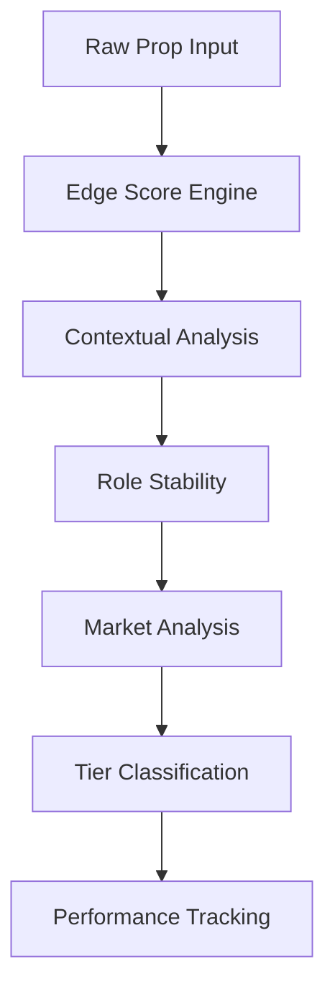

# Sports Analytics Scoring System: Technical Documentation

## System Architecture

### Overview
The scoring system is a mission-critical component that determines pick quality and tier classification. It processes raw props through multiple scoring modules, applying sophisticated business logic to ensure accurate grading and edge preservation.

### Core Components


## Module Details

### 1. Edge Score Engine
```typescript
interface EdgeScoreInput {
  odds: number;
  league: League;
  stat_type: string;
  position: string;
  market_data: MarketData;
}

/**
 * Core edge scoring logic
 * 
 * Business Rules:
 * - Odds must fall within sport-specific ranges
 * - Market movement cannot exceed thresholds
 * - Sharp money % must meet minimum requirements
 * - Liquidity must be sufficient
 * 
 * @param input Edge score calculation inputs
 * @returns Edge score and detailed breakdown
 */
export function calculateEdgeScore(input: EdgeScoreInput): EdgeScoreResult {
  const { odds, league, market_data } = input;
  const thresholds = getLeagueThresholds(league);
  
  // Core edge calculations
  const oddsScore = calculateOddsScore(odds, thresholds);
  const marketScore = analyzeMarketMovement(market_data, thresholds);
  const sharpScore = analyzeSharpAction(market_data);
  
  // Weighted combination
  const score = weightedAverage([
    { value: oddsScore, weight: 0.4 },
    { value: marketScore, weight: 0.4 },
    { value: sharpScore, weight: 0.2 }
  ]);

  return {
    score,
    breakdown: {
      odds_score: oddsScore,
      market_score: marketScore,
      sharp_score: sharpScore,
      thresholds_used: thresholds
    }
  };
}
```

### 2. Contextual Analysis
```typescript
interface ContextInput {
  dvp_score: number;
  matchup_history: MatchupResult[];
  venue: VenueInfo;
  rest_days: number;
  injuries: InjuryReport[];
  weather?: WeatherConditions;
}

/**
 * Enhanced contextual scoring
 * 
 * Business Rules:
 * - DVP scoring weighted by recency and opponent strength
 * - Venue impact varies by sport (e.g., altitude, weather)
 * - Rest advantage quantified by sport-specific metrics
 * - Injury impact considers both team and opponent
 * 
 * @param input Contextual factors for analysis
 * @returns Context score and breakdown
 */
export function calculateContextScore(
  input: ContextInput,
  league: League
): ContextScore {
  const weights = getSportWeights(league);
  
  const dvpScore = calculateDvpScore(input.dvp_score);
  const matchupScore = analyzeMatchupHistory(input.matchup_history);
  const venueScore = calculateVenueImpact(input.venue, league);
  const restScore = calculateRestAdvantage(input.rest_days, league);
  const injuryScore = analyzeInjuryImpact(input.injuries);
  
  // Sport-specific adjustments
  const adjustedScores = applySportAdjustments({
    dvpScore,
    matchupScore,
    venueScore,
    restScore,
    injuryScore
  }, league);

  return {
    score: weightedAverage(adjustedScores, weights),
    breakdown: {
      dvp: dvpScore,
      matchup: matchupScore,
      venue: venueScore,
      rest: restScore,
      injury: injuryScore,
      weights,
      adjustments: adjustedScores
    }
  };
}
```

### 3. Role Stability
```typescript
interface RoleInput {
  minutes_history: number[];
  usage_rates: number[];
  lineup_data: LineupData;
  injury_report: InjuryReport;
  role_changes: RoleChange[];
}

/**
 * Role stability assessment
 * 
 * Business Rules:
 * - Minutes trend weighted by game importance
 * - Usage patterns analyzed for consistency
 * - Lineup changes impact role certainty
 * - Injury context affects stability score
 * 
 * @param input Role stability factors
 * @returns Stability score and analysis
 */
export function calculateRoleStability(input: RoleInput): RoleScore {
  const minutesScore = analyzeMinutesTrend(input.minutes_history);
  const usageScore = analyzeUsagePattern(input.usage_rates);
  const lineupScore = assessLineupStability(input.lineup_data);
  const injuryRisk = calculateInjuryRisk(input.injury_report);
  const roleChanges = analyzeRoleChanges(input.role_changes);

  const stabilityScore = weightedAverage([
    { value: minutesScore, weight: 0.35 },
    { value: usageScore, weight: 0.25 },
    { value: lineupScore, weight: 0.20 },
    { value: (1 - injuryRisk), weight: 0.15 },
    { value: roleChanges, weight: 0.05 }
  ]);

  return {
    score: stabilityScore,
    breakdown: {
      minutes: minutesScore,
      usage: usageScore,
      lineup: lineupScore,
      injury_risk: injuryRisk,
      role_changes: roleChanges
    }
  };
}
```

## Configuration Management

### Dynamic Config Loading
```typescript
/**
 * Hot-reloadable configuration manager
 * Pulls thresholds and weights from Supabase
 */
export class ConfigManager {
  private static instance: ConfigManager;
  private config: SystemConfig;
  private lastUpdate: Date;
  private updateInterval: number;
  
  private constructor(supabase: SupabaseClient) {
    this.updateInterval = 5 * 60 * 1000; // 5 minutes
    this.setupConfigSync(supabase);
  }

  private async setupConfigSync(supabase: SupabaseClient) {
    // Initial load
    await this.refreshConfig(supabase);
    
    // Subscribe to changes
    supabase
      .from('scoring_config')
      .on('UPDATE', () => this.refreshConfig(supabase))
      .subscribe();
    
    // Periodic refresh
    setInterval(() => this.refreshConfig(supabase), this.updateInterval);
  }

  private async refreshConfig(supabase: SupabaseClient) {
    const { data, error } = await supabase
      .from('scoring_config')
      .select('*')
      .single();
      
    if (error) throw error;
    
    this.config = data;
    this.lastUpdate = new Date();
  }

  public static getInstance(supabase: SupabaseClient): ConfigManager {
    if (!ConfigManager.instance) {
      ConfigManager.instance = new ConfigManager(supabase);
    }
    return ConfigManager.instance;
  }

  public getConfig(): SystemConfig {
    return this.config;
  }
}
```

## Example Usage

### Single Pick Scoring
```typescript
async function scorePick(
  pick: RawPick,
  context: ContextData
): Promise<ScoringResult> {
  // Get current config
  const config = ConfigManager.getInstance().getConfig();
  
  // Calculate component scores
  const edgeScore = calculateEdgeScore(pick, config.edge);
  const contextScore = calculateContextScore(context, pick.league);
  const roleScore = calculateRoleStability(context.role);
  const marketScore = analyzeMarket(pick.market_data);
  
  // Calculate composite score
  const composite = calculateCompositeScore({
    edge: edgeScore,
    context: contextScore,
    role: roleScore,
    market: marketScore
  }, config.weights);
  
  // Determine tier
  const tier = determineTier(composite, config.tiers);
  
  // Track result
  await PerformanceTracker.trackScore({
    pick,
    scores: {
      edge: edgeScore,
      context: contextScore,
      role: roleScore,
      market: marketScore,
      composite
    },
    tier,
    config: config.version
  });

  return {
    tier,
    scores: {
      edge: edgeScore,
      context: contextScore,
      role: roleScore,
      market: marketScore,
      composite
    },
    breakdown: {
      edge: edgeScore.breakdown,
      context: contextScore.breakdown,
      role: roleScore.breakdown,
      market: marketScore.breakdown,
      tier_criteria: config.tiers[tier]
    }
  };
}
```

### Batch Processing
```typescript
async function processBatch(
  picks: RawPick[],
  contexts: Map<string, ContextData>
): Promise<BatchResult> {
  const results = await Promise.all(
    picks.map(async pick => {
      const context = contexts.get(pick.id);
      if (!context) throw new Error(`No context for pick ${pick.id}`);
      
      return scorePick(pick, context);
    })
  );
  
  // Aggregate results
  const summary = summarizeBatch(results);
  
  // Track batch metrics
  await PerformanceTracker.trackBatch({
    total: picks.length,
    by_tier: summary.tier_distribution,
    average_scores: summary.averages,
    timestamp: new Date()
  });

  return {
    picks: results,
    summary
  };
}
```

## Testing

### Unit Tests
```typescript
describe('Edge Score Engine', () => {
  it('should correctly score within-range odds', () => {
    const input: EdgeScoreInput = {
      odds: -110,
      league: 'NBA',
      stat_type: 'points',
      position: 'PG',
      market_data: mockMarketData
    };
    
    const result = calculateEdgeScore(input);
    expect(result.score).toBeGreaterThan(0.8);
  });

  it('should penalize odds outside threshold', () => {
    const input: EdgeScoreInput = {
      odds: -150,
      league: 'NBA',
      stat_type: 'points',
      position: 'PG',
      market_data: mockMarketData
    };
    
    const result = calculateEdgeScore(input);
    expect(result.score).toBeLessThan(0.5);
  });
});

describe('Context Scoring', () => {
  it('should weight DVP heavily for consistent matchups', () => {
    const input: ContextInput = {
      dvp_score: 0.9,
      matchup_history: consistentMatchups,
      venue: homeVenue,
      rest_days: 2,
      injuries: []
    };
    
    const result = calculateContextScore(input, 'NBA');
    expect(result.breakdown.dvp).toBeGreaterThan(0.8);
  });
});
```

### Integration Tests
```typescript
describe('End-to-End Scoring', () => {
  it('should correctly identify S-tier picks', async () => {
    const pick = mockHighQualityPick;
    const context = mockStrongContext;
    
    const result = await scorePick(pick, context);
    
    expect(result.tier).toBe('S');
    expect(result.scores.composite).toBeGreaterThan(8.5);
  });

  it('should maintain scoring consistency across batches', async () => {
    const batch1 = await processBatch(mockPicks.slice(0, 50), mockContexts);
    const batch2 = await processBatch(mockPicks.slice(50), mockContexts);
    
    const avgDiff = compareAverages(batch1.summary, batch2.summary);
    expect(avgDiff).toBeLessThan(0.1);
  });
});
```

## Performance Tracking

### Dashboard Integration
```typescript
interface DashboardMetrics {
  tier_performance: Record<Tier, TierMetrics>;
  feature_importance: FeatureImportance[];
  trend_analysis: TrendData;
  alerts: Alert[];
}

class DashboardIntegration {
  private readonly db: Database;
  private readonly notifier: AlertNotifier;

  async updateDashboard(): Promise<void> {
    const metrics = await this.calculateMetrics();
    const alerts = await this.checkAlerts(metrics);
    
    await Promise.all([
      this.updateMetricsDisplay(metrics),
      this.updateCharts(metrics),
      this.processAlerts(alerts)
    ]);
  }

  private async calculateMetrics(): Promise<DashboardMetrics> {
    const performance = await PerformanceTracker.getPerformance();
    const features = await FeatureAnalyzer.getImportance();
    const trends = await TrendAnalyzer.analyze();
    
    return {
      tier_performance: performance,
      feature_importance: features,
      trend_analysis: trends,
      alerts: this.generateAlerts(performance, trends)
    };
  }
}
```

## Change Log

### Version 2.0.0
- Implemented multi-factor tier classification
- Added sport-specific contextual analysis
- Enhanced edge protection with market sentiment
- Improved role stability assessment
- Added performance tracking and analytics
- Implemented hot-reloadable configuration
- Added comprehensive test suite

### Version 1.0.0 (Previous)
- Basic scoring system
- Simple tier thresholds
- Limited contextual analysis
- No market sentiment analysis
- Basic role assessment
- Static configuration

## Extension Guidelines

### Adding New Features
1. Define interface in `types.ts`
2. Implement scoring module
3. Add configuration section
4. Update tests
5. Document business rules
6. Update performance tracking

### Modifying Thresholds
1. Update Supabase config table
2. Monitor performance impact
3. Document changes
4. Update dashboard alerts

### Adding New Sports
1. Define sport-specific types
2. Implement scoring adjustments
3. Add configuration
4. Create test cases
5. Document special rules

## Onboarding

### Developer Setup
1. Clone repository
2. Install dependencies
3. Configure Supabase connection
4. Run test suite
5. Review documentation

### Business Rules
1. Study scoring modules
2. Understand thresholds
3. Review performance metrics
4. Learn configuration system
5. Practice with test cases 