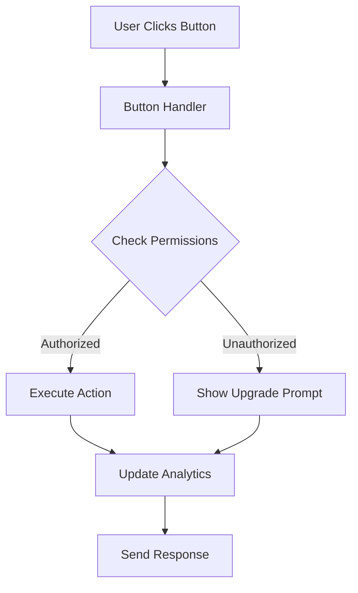

# Discord Onboarding System

This comprehensive onboarding system provides tiered access control, dynamic welcome flows, and interactive user engagement for the Unit Talk Discord bot.

## Features

### 🎯 Tiered Access System
- **Free Tier**: Basic access with limited features
- **VIP Tier**: Enhanced access with premium picks and features  
- **VIP+ Tier**: Full access including heat signals and advanced analytics
- **Trial Tier**: 72-hour trial access to VIP features

### 🚀 Interactive Commands

#### `/help`
- Comprehensive help system with tier-specific information
- Interactive buttons for quick access to features
- Context-aware help based on user's current tier

#### `/vip-info`
- Detailed VIP tier information and benefits
- Upgrade options with pricing
- Trial activation for eligible users

#### `/trial-status`
- Real-time trial status and remaining time
- Trial extension options
- Upgrade prompts for trial users

#### `/upgrade`
- Quick access to VIP upgrade options
- Tier-specific upgrade paths
- Secure payment integration

#### `/heat-signal` (VIP+ Only)
- Live market alerts and signals
- Real-time data updates
- Advanced analytics dashboard

### 🎮 Interactive Button System

The system includes comprehensive button interactions for:

- **VIP Perks**: View detailed VIP benefits
- **Trial Management**: Start, check status, extend trials
- **Upgrades**: Quick upgrade to VIP/VIP+ tiers
- **Navigation**: Access VIP lounges, picks dashboard
- **Help System**: Context-sensitive help and tutorials

### 🔄 Automated Workflows

#### Welcome Flows
- Tier-specific welcome messages
- Progressive onboarding sequences
- Automated follow-ups and engagement

#### Trial Management
- Automatic trial activation
- Expiration notifications
- Upgrade prompts and incentives

#### Analytics Integration
- User engagement tracking
- Conversion funnel analysis
- Behavioral insights and optimization

## Architecture

### Core Services

#### `ComprehensiveOnboardingService`
- Handles all tier-based welcome flows
- Manages trial lifecycles
- Tracks user engagement and conversions

#### `OnboardingButtonHandler`
- Processes all interactive button clicks
- Routes actions based on user permissions
- Provides contextual responses

### Command Structure

Each command follows a consistent pattern:
```typescript
export const commandName = {
  data: new SlashCommandBuilder()
    .setName('command-name')
    .setDescription('Command description'),
  
  async execute(context: CommandContext) {
    // Permission checks
    // Tier validation
    // Response generation
    // Analytics tracking
  }
};
```

### Button Interaction Flow



## Configuration

### Environment Variables
```env
DISCORD_TOKEN=your_discord_bot_token
DISCORD_CLIENT_ID=your_discord_client_id
DISCORD_GUILD_ID=your_discord_guild_id
SUPABASE_URL=your_supabase_url
SUPABASE_ANON_KEY=your_supabase_anon_key
```

### Bot Permissions Required
- Send Messages
- Use Slash Commands
- Embed Links
- Add Reactions
- Manage Roles
- Read Message History

## Usage

### Starting the Bot
```bash
# Register commands and start bot
npm run start

# Or run separately
npm run register-commands
npm run dev
```

### Command Registration
Commands are automatically registered on startup. To manually register:
```bash
npm run register-commands
```

## User Journey Examples

### New User Flow
1. User joins Discord server
2. Receives tier-appropriate welcome message
3. Guided through available features
4. Prompted to upgrade or start trial

### Trial User Flow
1. User starts $1 trial via `/vip-info`
2. Gains access to VIP features for 72 hours
3. Receives periodic engagement messages
4. Gets upgrade prompts before trial expires

### VIP User Flow
1. User upgrades to VIP tier
2. Unlocks premium picks and features
3. Access to VIP-only channels
4. Personalized experience based on preferences

## Analytics & Insights

The system tracks:
- User engagement rates
- Command usage patterns
- Conversion funnels
- Trial-to-paid conversion rates
- Feature adoption metrics

## Customization

### Adding New Tiers
1. Update `UserTier` enum in `types/index.ts`
2. Add tier logic to permission checks
3. Create tier-specific welcome flows
4. Update command access controls

### Creating New Commands
1. Create command file in `commands/` directory
2. Add to command registration in `utils/registerCommands.ts`
3. Add handler in `handlers/commandHandler.ts`
4. Update help system with new command info

### Custom Button Actions
1. Add button ID to interaction handler
2. Create handler method in `OnboardingButtonHandler`
3. Update permission checks as needed
4. Add analytics tracking

## Monitoring & Maintenance

### Health Checks
- Bot connectivity status
- Database connection health
- Command response times
- Error rates and patterns

### Logging
- Structured JSON logging
- User action tracking
- Error monitoring
- Performance metrics

### Alerts
- Trial expiration notifications
- System health alerts
- High-value user engagement
- Conversion opportunities

## Security

### Permission System
- Role-based access control
- Tier validation on all actions
- Secure payment processing
- Data privacy compliance

### Rate Limiting
- Command usage limits
- Button interaction throttling
- API request rate limiting
- Abuse prevention

## Support

For issues or questions:
1. Check the logs for error details
2. Verify environment configuration
3. Test with `/help` command
4. Review user permissions and roles

## Contributing

When adding new features:
1. Follow existing code patterns
2. Add comprehensive error handling
3. Include analytics tracking
4. Update documentation
5. Test across all user tiers